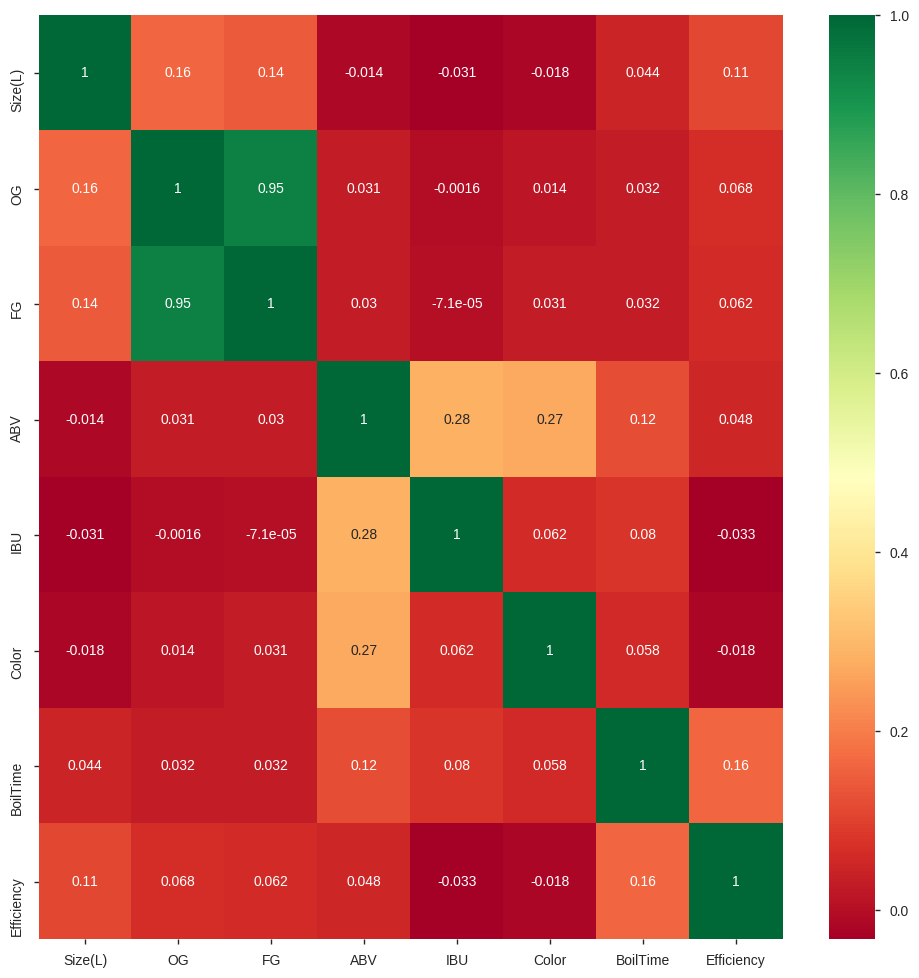
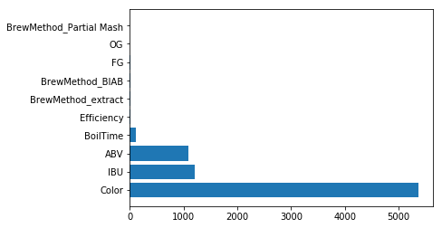
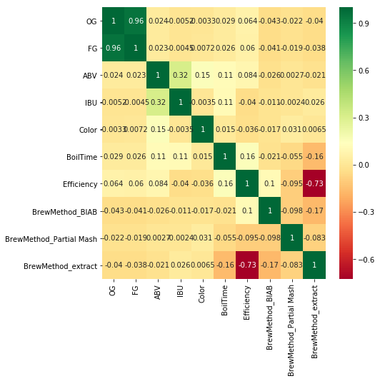

# Imports


```python
import pandas as pd
import pandas_profiling
import numpy as np
from google.colab import drive
drive.mount('/content/drive')
import matplotlib.pyplot as plt
%matplotlib inline
```

    Drive already mounted at /content/drive; to attempt to forcibly remount, call drive.mount("/content/drive", force_remount=True).
    

# Carregar dados


```python
#Carrega o DataFrame
df = pd.read_csv('/content/drive/My Drive/Colab Notebooks/Datasets/BeerrecipeData.csv',encoding='latin-1')
```


```python
#Amostra das primeiras Linhas
df.head(2)
```


<div>
<style scoped>
    .dataframe tbody tr th:only-of-type {
        vertical-align: middle;
    }

    .dataframe tbody tr th {
        vertical-align: top;
    }

    .dataframe thead th {
        text-align: right;
    }
</style>
<table border="1" class="dataframe">
  <thead>
    <tr style="text-align: right;">
      <th></th>
      <th>BeerID</th>
      <th>Name</th>
      <th>URL</th>
      <th>Style</th>
      <th>StyleID</th>
      <th>Size(L)</th>
      <th>OG</th>
      <th>FG</th>
      <th>ABV</th>
      <th>IBU</th>
      <th>Color</th>
      <th>BoilSize</th>
      <th>BoilTime</th>
      <th>BoilGravity</th>
      <th>Efficiency</th>
      <th>MashThickness</th>
      <th>SugarScale</th>
      <th>BrewMethod</th>
      <th>PitchRate</th>
      <th>PrimaryTemp</th>
      <th>PrimingMethod</th>
      <th>PrimingAmount</th>
      <th>UserId</th>
    </tr>
  </thead>
  <tbody>
    <tr>
      <th>0</th>
      <td>1</td>
      <td>Vanilla Cream Ale</td>
      <td>/homebrew/recipe/view/1633/vanilla-cream-ale</td>
      <td>Cream Ale</td>
      <td>45</td>
      <td>21.77</td>
      <td>1.055</td>
      <td>1.013</td>
      <td>5.48</td>
      <td>17.65</td>
      <td>4.83</td>
      <td>28.39</td>
      <td>75</td>
      <td>1.038</td>
      <td>70.0</td>
      <td>NaN</td>
      <td>Specific Gravity</td>
      <td>All Grain</td>
      <td>NaN</td>
      <td>17.78</td>
      <td>corn sugar</td>
      <td>4.5 oz</td>
      <td>116.0</td>
    </tr>
    <tr>
      <th>1</th>
      <td>2</td>
      <td>Southern Tier Pumking clone</td>
      <td>/homebrew/recipe/view/16367/southern-tier-pumk...</td>
      <td>Holiday/Winter Special Spiced Beer</td>
      <td>85</td>
      <td>20.82</td>
      <td>1.083</td>
      <td>1.021</td>
      <td>8.16</td>
      <td>60.65</td>
      <td>15.64</td>
      <td>24.61</td>
      <td>60</td>
      <td>1.070</td>
      <td>70.0</td>
      <td>NaN</td>
      <td>Specific Gravity</td>
      <td>All Grain</td>
      <td>NaN</td>
      <td>NaN</td>
      <td>NaN</td>
      <td>NaN</td>
      <td>955.0</td>
    </tr>
  </tbody>
</table>
</div>


# Tratamentos

## Trabalhando com valores faltantes


```python
#Ver quais tem dados faltantes
df.isnull().sum()
```


    BeerID               0
    Name                 1
    URL                  0
    Style              596
    StyleID              0
    Size(L)              0
    OG                   0
    FG                   0
    ABV                  0
    IBU                  0
    Color                0
    BoilSize             0
    BoilTime             0
    BoilGravity       2990
    Efficiency           0
    MashThickness    29864
    SugarScale           0
    BrewMethod           0
    PitchRate        39252
    PrimaryTemp      22662
    PrimingMethod    67095
    PrimingAmount    69087
    UserId           50490
    dtype: int64


```python
#df.City.mode() =ordem de valores que aparece mais vezes

```

## Remover Colunas Desnecessárias


```python
df.drop(columns=['UserId','StyleID','URL','BeerID','PrimingAmount','PrimingMethod','PitchRate','PrimaryTemp','MashThickness','SugarScale','Name'],inplace=True,errors='ignore')
#Visto que duas colunas tem alta correlação, entao pode remover
#df['OG'].corr(df['BoilGravity'])
df.drop(columns=['BoilGravity','BoilSize'],inplace=True,errors='ignore')
```

## Transformando tipos de dados


```python
#Transformar dados categoricos para seu tipo e tipo de numericos para formatos mais simples

df['Style'] = df['Style'].astype('category')
df['BrewMethod'] = df['BrewMethod'].astype('category')
df['Size(L)'] = df['Size(L)'].astype('float32')
df['OG'] = df['OG'].astype('float32')
df['FG'] = df['FG'].astype('float32')
df['ABV'] = df['ABV'].astype('float32')
df['IBU'] = df['IBU'].astype('float32')
df['BoilTime'] = df['BoilTime'].astype('int32')
df['Efficiency'] = df['Efficiency'].astype('float32')
#df['Date'] = pd.to_datetime(df.Date)

#Remover duplicadios
df.drop_duplicates(inplace=True)
#Remover nulos (pra esse caso de dataset)
df.dropna(inplace=True)
```

# Estatisticas
Mostra dados sobre o DataSet Carregado

## Report Completo


```python
#Report completo com Profiling
pandas_profiling.ProfileReport(df)
```


<meta charset="UTF-8">

<style>

        .variablerow {
            border: 1px solid #e1e1e8;
            border-top: hidden;
            padding-top: 2em;
            padding-bottom: 2em;
            padding-left: 1em;
            padding-right: 1em;
        }

        .headerrow {
            border: 1px solid #e1e1e8;
            background-color: #f5f5f5;
            padding: 2em;
        }
        .namecol {
            margin-top: -1em;
            overflow-x: auto;
        }

        .dl-horizontal dt {
            text-align: left;
            padding-right: 1em;
            white-space: normal;
        }

        .dl-horizontal dd {
            margin-left: 0;
        }

        .ignore {
            opacity: 0.4;
        }

        .container.pandas-profiling {
            max-width:975px;
        }

        .col-md-12 {
            padding-left: 2em;
        }

        .indent {
            margin-left: 1em;
        }

        .center-img {
            margin-left: auto !important;
            margin-right: auto !important;
            display: block;
        }

        /* Table example_values */
            table.example_values {
                border: 0;
            }

            .example_values th {
                border: 0;
                padding: 0 ;
                color: #555;
                font-weight: 600;
            }

            .example_values tr, .example_values td{
                border: 0;
                padding: 0;
                color: #555;
            }

        /* STATS */
            table.stats {
                border: 0;
            }

            .stats th {
                border: 0;
                padding: 0 2em 0 0;
                color: #555;
                font-weight: 600;
            }

            .stats tr {
                border: 0;
            }

            .stats td{
                color: #555;
                padding: 1px;
                border: 0;
            }


        /* Sample table */
            table.sample {
                border: 0;
                margin-bottom: 2em;
                margin-left:1em;
            }
            .sample tr {
                border:0;
            }
            .sample td, .sample th{
                padding: 0.5em;
                white-space: nowrap;
                border: none;

            }

            .sample thead {
                border-top: 0;
                border-bottom: 2px solid #ddd;
            }

            .sample td {
                width:100%;
            }


        /* There is no good solution available to make the divs equal height and then center ... */
            .histogram {
                margin-top: 3em;
            }
        /* Freq table */

            table.freq {
                margin-bottom: 2em;
                border: 0;
            }
            table.freq th, table.freq tr, table.freq td {
                border: 0;
                padding: 0;
            }

            .freq thead {
                font-weight: 600;
                white-space: nowrap;
                overflow: hidden;
                text-overflow: ellipsis;

            }

            td.fillremaining{
                width:auto;
                max-width: none;
            }

            td.number, th.number {
                text-align:right ;
            }

        /* Freq mini */
            .freq.mini td{
                width: 50%;
                padding: 1px;
                font-size: 12px;

            }
            table.freq.mini {
                 width:100%;
            }
            .freq.mini th {
                overflow: hidden;
                text-overflow: ellipsis;
                white-space: nowrap;
                max-width: 5em;
                font-weight: 400;
                text-align:right;
                padding-right: 0.5em;
            }

            .missing {
                color: #a94442;
            }
            .alert, .alert > th, .alert > td {
                color: #a94442;
            }


        /* Bars in tables */
            .freq .bar{
                float: left;
                width: 0;
                height: 100%;
                line-height: 20px;
                color: #fff;
                text-align: center;
                background-color: #337ab7;
                border-radius: 3px;
                margin-right: 4px;
            }
            .other .bar {
                background-color: #999;
            }
            .missing .bar{
                background-color: #a94442;
            }
            .tooltip-inner {
                width: 100%;
                white-space: nowrap;
                text-align:left;
            }

            .extrapadding{
                padding: 2em;
            }

            .pp-anchor{

            }

</style>

<div class="container pandas-profiling">
    <div class="row headerrow highlight">
        <h1>Overview</h1>
    </div>
    <div class="row variablerow">
    <div class="col-md-6 namecol">
        <p class="h4">Dataset info</p>
        <table class="stats" style="margin-left: 1em;">
            <tbody>
            <tr>
                <th>Number of variables</th>
                <td>11 </td>
            </tr>
            <tr>
                <th>Number of observations</th>
                <td>73004 </td>
            </tr>
            <tr>
                <th>Total Missing (%)</th>
                <td>0.0% </td>
            </tr>
            <tr>
                <th>Total size in memory</th>
                <td>3.3 MiB </td>
            </tr>
            <tr>
                <th>Average record size in memory</th>
                <td>47.1 B </td>
            </tr>
            </tbody>
        </table>
    </div>
    <div class="col-md-6 namecol">
        <p class="h4">Variables types</p>
        <table class="stats" style="margin-left: 1em;">
            <tbody>
            <tr>
                <th>Numeric</th>
                <td>8 </td>
            </tr>
            <tr>
                <th>Categorical</th>
                <td>2 </td>
            </tr>
            <tr>
                <th>Boolean</th>
                <td>0 </td>
            </tr>
            <tr>
                <th>Date</th>
                <td>0 </td>
            </tr>
            <tr>
                <th>Text (Unique)</th>
                <td>0 </td>
            </tr>
            <tr>
                <th>Rejected</th>
                <td>1 </td>
            </tr>
            <tr>
                <th>Unsupported</th>
                <td>0 </td>
            </tr>
            </tbody>
        </table>
    </div>
    <div class="col-md-12" style="padding-left: 1em;">

        <p class="h4">Warnings</p>
        <ul class="list-unstyled"><li><a href="#pp_var_FG"><code>FG</code></a> is highly correlated with <a href="#pp_var_OG"><code>OG</code></a> (ρ = 0.94729) <span class="label label-primary">Rejected</span></li><li><a href="#pp_var_IBU"><code>IBU</code></a> has 3857 / 5.3% zeros <span class="label label-info">Zeros</span></li><li><a href="#pp_var_Style"><code>Style</code></a> has a high cardinality: 175 distinct values  <span class="label label-warning">Warning</span></li> </ul>
    </div>
</div>
    <div class="row headerrow highlight">
        <h1>Variables</h1>
    </div>
    <div class="row variablerow">
    <div class="col-md-3 namecol">
        <p class="h4 pp-anchor" id="pp_var_ABV">ABV<br/>
            <small>Numeric</small>
        </p>
    </div><div class="col-md-6">
    <div class="row">
        <div class="col-sm-6">
            <table class="stats ">
                <tr>
                    <th>Distinct count</th>
                    <td>1489</td>
                </tr>
                <tr>
                    <th>Unique (%)</th>
                    <td>2.0%</td>
                </tr>
                <tr class="ignore">
                    <th>Missing (%)</th>
                    <td>0.0%</td>
                </tr>
                <tr class="ignore">
                    <th>Missing (n)</th>
                    <td>0</td>
                </tr>
                <tr class="ignore">
                    <th>Infinite (%)</th>
                    <td>0.0%</td>
                </tr>
                <tr class="ignore">
                    <th>Infinite (n)</th>
                    <td>0</td>
                </tr>
            </table>

        </div>
        <div class="col-sm-6">
            <table class="stats ">

                <tr>
                    <th>Mean</th>
                    <td>6.1393</td>
                </tr>
                <tr>
                    <th>Minimum</th>
                    <td>0.0</td>
                </tr>
                <tr>
                    <th>Maximum</th>
                    <td>54.72</td>
                </tr>
                <tr class="ignore">
                    <th>Zeros (%)</th>
                    <td>0.0%</td>
                </tr>
            </table>
        </div>
    </div>
</div>
<div class="col-md-3 collapse in" id="minihistogram5531645771453359096">
    

</div>
<div class="col-md-12 text-right">
    <a role="button" data-toggle="collapse" data-target="#descriptives5531645771453359096,#minihistogram5531645771453359096"
       aria-expanded="false" aria-controls="collapseExample">
        Toggle details
    </a>
</div>
<div class="row collapse col-md-12" id="descriptives5531645771453359096">
    <ul class="nav nav-tabs" role="tablist">
        <li role="presentation" class="active"><a href="#quantiles5531645771453359096"
                                                  aria-controls="quantiles5531645771453359096" role="tab"
                                                  data-toggle="tab">Statistics</a></li>
        <li role="presentation"><a href="#histogram5531645771453359096" aria-controls="histogram5531645771453359096"
                                   role="tab" data-toggle="tab">Histogram</a></li>
        <li role="presentation"><a href="#common5531645771453359096" aria-controls="common5531645771453359096"
                                   role="tab" data-toggle="tab">Common Values</a></li>
        <li role="presentation"><a href="#extreme5531645771453359096" aria-controls="extreme5531645771453359096"
                                   role="tab" data-toggle="tab">Extreme Values</a></li>

    </ul>

    <div class="tab-content">
        <div role="tabpanel" class="tab-pane active row" id="quantiles5531645771453359096">
            <div class="col-md-4 col-md-offset-1">
                <p class="h4">Quantile statistics</p>
                <table class="stats indent">
                    <tr>
                        <th>Minimum</th>
                        <td>0.0</td>
                    </tr>
                    <tr>
                        <th>5-th percentile</th>
                        <td>4.13</td>
                    </tr>
                    <tr>
                        <th>Q1</th>
                        <td>5.08</td>
                    </tr>
                    <tr>
                        <th>Median</th>
                        <td>5.79</td>
                    </tr>
                    <tr>
                        <th>Q3</th>
                        <td>6.83</td>
                    </tr>
                    <tr>
                        <th>95-th percentile</th>
                        <td>9.29</td>
                    </tr>
                    <tr>
                        <th>Maximum</th>
                        <td>54.72</td>
                    </tr>
                    <tr>
                        <th>Range</th>
                        <td>54.72</td>
                    </tr>
                    <tr>
                        <th>Interquartile range</th>
                        <td>1.75</td>
                    </tr>
                </table>
            </div>
            <div class="col-md-4 col-md-offset-2">
                <p class="h4">Descriptive statistics</p>
                <table class="stats indent">
                    <tr>
                        <th>Standard deviation</th>
                        <td>1.8739</td>
                    </tr>
                    <tr>
                        <th>Coef of variation</th>
                        <td>0.30523</td>
                    </tr>
                    <tr>
                        <th>Kurtosis</th>
                        <td>86.331665</td>
                    </tr>
                    <tr>
                        <th>Mean</th>
                        <td>6.1393</td>
                    </tr>
                    <tr>
                        <th>MAD</th>
                        <td>1.2389</td>
                    </tr>
                    <tr class="">
                        <th>Skewness</th>
                        <td>4.9280825</td>
                    </tr>
                    <tr>
                        <th>Sum</th>
                        <td>448192.56</td>
                    </tr>
                    <tr>
                        <th>Variance</th>
                        <td>3.5116</td>
                    </tr>
                    <tr>
                        <th>Memory size</th>
                        <td>285.2 KiB</td>
                    </tr>
                </table>
            </div>
        </div>
        <div role="tabpanel" class="tab-pane col-md-8 col-md-offset-2" id="histogram5531645771453359096">
            <img src="data:image/png;base64,iVBORw0KGgoAAAANSUhEUgAAAlgAAAGQCAYAAAByNR6YAAAABHNCSVQICAgIfAhkiAAAAAlwSFlzAAAPYQAAD2EBqD%2BnaQAAADl0RVh0U29mdHdhcmUAbWF0cGxvdGxpYiB2ZXJzaW9uIDMuMC4zLCBodHRwOi8vbWF0cGxvdGxpYi5vcmcvnQurowAAIABJREFUeJzs3XtYVXXe//8XsBMS2BxUrC854XggOcikKQ46Ipo6ZVoaHujuwJ2VB0aCdPKUaWVZqVGpl8rM6J3VXXtEy8NoOo6HsWS6rw7aZquVqGPDhUG6twjiAdi/P/q5Z3Zqonvh3uDzcV1cjp/PWp/1WW%2BWzWuv9WHh53Q6nQIAAIBh/L09AQAAgKaGgAUAAGAwAhYAAIDBCFgAAAAGI2ABAAAYjIAFAABgMAIWAACAwQhYAAAABiNgAQAAGIyABQAAYDACFgAAgMEIWAAAAAYjYAEAABiMgAUAAGAwAhYAAIDBCFgAAAAGI2ABAAAYjIAFAABgMAIWAACAwQhYAAAABiNgAQAAGIyABQAAYDACFgAAgMEIWAAAAAYjYAEAABiMgAUAAGAwAhYAAIDBCFgAAAAGI2ABAAAYjIAFAABgMAIWAACAwQhYAAAABiNgAQAAGIyABQAAYLBGEbBeeuklxcbGSpI%2B/fRTxcbGKjEx0e1r48aNru1XrFihgQMHqkuXLsrIyFBRUZGr78yZM3r22WfVu3dvJScnKzs7W3a73dVfUlKiJ554QsnJyUpLS9PcuXNVV1d37U4WAAA0ej4fsPbt26c1a9a4tUVHR8tqtbp93XXXXZKkrVu3asGCBXr11Ve1a9cupaWlaezYsTp16pQkKS8vTzabTRaLRZs2bZLT6dTUqVNdY0%2BYMEGtW7fWli1btHz5cm3ZskVvvfXWtTthAADQ6Pl0wKqrq9PMmTOVmZlZ730sFouGDRumpKQkBQUF6bHHHpMkbdu2TTU1NSooKND48eN18803Kzw8XDk5Odq%2Bfbu%2B//57Wa1W7d%2B/X5MmTVJoaKhiYmKUmZkpi8XSQGcIAACaIp8OWO%2B//74CAwM1ePBgt/aqqiplZWUpOTlZv/nNb7R8%2BXI5nU5Jks1mU1xcnGtbf39/derUSVarVUeOHNHJkycVHx/v6m/Xrp2CgoJks9lks9kUHR2tsLAwV398fLwOHTqkysrKBj5bAADQVJi8PYFL%2BeGHH7RgwQK9/fbbbu0hISHq2LGjHnnkEeXl5en//u//9OSTTyo0NFTp6elyOBxuAUmSwsLCZLfb5XA4JElms9mt32w2u/p/2nd%2BLLvdrpCQkHrNvaysTOXl5W5trVq1UlRUVL32BwAAjZvPBqw5c%2BZo2LBhat%2B%2Bvf71r3%2B52uPj491CV69evTRq1CitXr1a6enpkuS6m3UpP9d/uX3rw2KxaOHChW5tWVlZys7O9nhsAADg%2B3wyYBUWFurLL7/U%2BvXr67V9dHS0Nm3aJEmKiIhw3ak6z%2BFwqEOHDoqMjHT9PTg42NV/4sQJtWjRQrW1tRfd18/Pz7VvfYwcOVJ9%2B/Z1azOZmstur6r3GPUREOAvs/lGVVRUq7aWn3S8UtTv6lE7z1A/z1A/z1xv9YuICL78Rg3AJwPW2rVrdezYMaWlpUn6912l5ORkTZ06VadOndIDDzzg2v7gwYNq06aNJCkhIUE2m01Dhw6VJNXW1mrv3r1KT09XmzZtFBYW5lprJUnffPONzp49q4SEBJWVlam0tFTHjx93BSqr1ar27du7BbLLiYqKuuBxYHn5SdXUNMyFXFtb12BjXw%2Bo39Wjdp6hfp6hfp6hfg3LJxe5T5kyRZs2bdKaNWu0Zs0a5efnS5LWrFmjkJAQvfLKK/r444917tw5ffLJJ1q1apUyMjIkSRkZGfrwww%2B1e/duVVdXa/HixWrWrJn69OmjgIAAjRgxQkuWLFFpaansdrtee%2B019e/fXy1btlRcXJwSExM1f/58VVZWqri4WMuXL3eNDQAAUB8%2BeQcrLCzMbaF6TU2NJOmmm27STTfdpGnTpumFF15QaWmpWrZsqWnTpmnAgAGSpN69e%2Bupp55STk6Ojh07psTEROXn5ysoKEiSlJ2draqqKt17772qqalRWlqaZs2a5TrWm2%2B%2BqRkzZqhnz54KCQnRqFGj3O6WAQAAXI6f04hV3bis8vKTho9pMvkrIiJYdnsVt3mvAvW7etTOM9TPM9TPM9db/Vq1CvXKcX3yESEAAEBjRsACAAAwGAELAADAYAQsAAAAgxGwAAAADEbAAgAAMBgBCwAAwGAELAAAAIMRsAAAAAzmk78qB03TXa9/4u0pXJGNOT29PQUAQCPFHSwAAACDEbAAAAAMRsACAAAwGAELAADAYAQsAAAAgxGwAAAADEbAAgAAMBgBCwAAwGAELAAAAIMRsAAAAAxGwAIAADAYAQsAAMBgBCwAAACDEbAAAAAMRsACAAAwWKMIWC%2B99JJiY2Ndfy8sLFR6erq6dOmiQYMGae3atW7br1ixQgMHDlSXLl2UkZGhoqIiV9%2BZM2f07LPPqnfv3kpOTlZ2drbsdrurv6SkRE888YSSk5OVlpamuXPnqq6uruFPEgAANBk%2BH7D27dunNWvWuP5eVlam8ePHa9SoUSosLNT06dM1Y8YMWa1WSdLWrVu1YMECvfrqq9q1a5fS0tI0duxYnTp1SpKUl5cnm80mi8WiTZs2yel0aurUqa7xJ0yYoNatW2vLli1avny5tmzZorfeeuvanjQAAGjUfDpg1dXVaebMmcrMzHS1rVu3TjExMUpPT1dgYKBSUlLUt29frVy5UpJksVg0bNgwJSUlKSgoSI899pgkadu2baqpqVFBQYHGjx%2Bvm2%2B%2BWeHh4crJydH27dv1/fffy2q1av/%2B/Zo0aZJCQ0MVExOjzMxMWSwWb5w%2BAABopHw6YL3//vsKDAzU4MGDXW02m01xcXFu28XFxbkeA/6039/fX506dZLVatWRI0d08uRJxcfHu/rbtWunoKAg2Ww22Ww2RUdHKywszNUfHx%2BvQ4cOqbKysqFOEwAANDEmb0/gUn744QctWLBAb7/9tlu7w%2BFQ69at3drCw8Nd66gcDodbQJKksLAw2e12ORwOSZLZbHbrN5vNrv6f9p0fy263KyQkpF5zLysrU3l5uVubydRcUVFR9dq/vgIC/N3%2BhLFMJup6KVx7nqF%2BnqF%2BnqF%2B14bPBqw5c%2BZo2LBhat%2B%2Bvf71r39d0b5Op/Oq%2By%2B3b31YLBYtXLjQrS0rK0vZ2dkej30xZvONDTLu9S4iItjbU/B5XHueoX6eoX6eoX4NyycDVmFhob788kutX7/%2Bgr6IiAjXnajz7Ha7IiMjL9nvcDjUoUMH1zYOh0PBwf/%2BP88TJ06oRYsWqq2tvei%2Bfn5%2Brn3rY%2BTIkerbt69bm8nUXHZ7Vb3HqI%2BAAH%2BZzTeqoqJatbX8pKPRjP5%2BNSVce56hfp6hfp653urnrQ/LPhmw1q5dq2PHjiktLU3Sv%2B8qJScn69FHH70geBUVFSkpKUmSlJCQIJvNpqFDh0qSamtrtXfvXqWnp6tNmzYKCwtzrbWSpG%2B%2B%2BUZnz55VQkKCysrKVFpaquPHj7sCldVqVfv27d0C2eVERUVd8DiwvPykamoa5kKura1rsLGvZ9T08rj2PEP9PEP9PEP9GpZPPoCdMmWKNm3apDVr1mjNmjXKz8%2BXJK1Zs0aDBw9WSUmJVq5cqTNnzmjHjh3asWOHRowYIUnKyMjQhx9%2BqN27d6u6ulqLFy9Ws2bN1KdPHwUEBGjEiBFasmSJSktLZbfb9dprr6l///5q2bKl4uLilJiYqPnz56uyslLFxcVavny5MjIyvFkOAADQyPjkHaywsDC3heo1NTWSpJtuukmStHTpUs2ePVvPPfecoqOjNXfuXN12222SpN69e%2Bupp55STk6Ojh07psTEROXn5ysoKEiSlJ2draqqKt17772qqalRWlqaZs2a5TrWm2%2B%2BqRkzZqhnz54KCQnRqFGj9MADD1yjMwcAAE2Bn9OIVd24rPLyk4aPaTL5KyIiWHZ7VaO4zXvX6594ewpXZGNOT29PwWc1tmvP11A/z1A/z1xv9WvVKtQrx/XJR4QAAACNGQELAADAYAQsAAAAgxGwAAAADEbAAgAAMBgBCwAAwGAELAAAAIMRsAAAAAxGwAIAADAYAQsAAMBgBCwAAACDEbAAAAAMRsACAAAwGAELAADAYAQsAAAAgxGwAAAADEbAAgAAMBgBCwAAwGAELAAAAIMRsAAAAAxGwAIAADAYAQsAAMBgBCwAAACDEbAAAAAMRsACAAAwmM8GrP379%2BuRRx5R165dlZKSopycHJWXl%2BvTTz9VbGysEhMT3b42btzo2nfFihUaOHCgunTpooyMDBUVFbn6zpw5o2effVa9e/dWcnKysrOzZbfbXf0lJSV64oknlJycrLS0NM2dO1d1dXXX9NwBAEDj5pMB6%2BzZs3r00UfVvXt3FRYWav369Tp27JhmzZolSYqOjpbVanX7uuuuuyRJW7du1YIFC/Tqq69q165dSktL09ixY3Xq1ClJUl5enmw2mywWizZt2iSn06mpU6e6jj1hwgS1bt1aW7Zs0fLly7Vlyxa99dZb17wGAACg8fLJgFVdXa3c3FyNGTNGzZo1U2RkpPr3769vv/32svtaLBYNGzZMSUlJCgoK0mOPPSZJ2rZtm2pqalRQUKDx48fr5ptvVnh4uHJycrR9%2B3Z9//33slqt2r9/vyZNmqTQ0FDFxMQoMzNTFouloU8ZAAA0ISZvT%2BBiwsLCNHz4cNffDx48qA8%2B%2BMB1l6qqqkpZWVn67LPP1KxZMz366KPKzMyUn5%2BfbDab7r77bte%2B/v7%2B6tSpk6xWqzp16qSTJ08qPj7e1d%2BuXTsFBQXJZrOprKxM0dHRCgsLc/XHx8fr0KFDqqysVEhISL3mX1ZWpvLycrc2k6m5oqKirqoelxIQ4O/2J4xlMlHXS%2BHa8wz18wz18wz1uzZ8MmCdV1JSooEDB6qmpkYjRoxQdna29u/fr44dO%2BqRRx5RXl6e/u///k9PPvmkQkNDlZ6eLofD4RaQpB8Dm91ul8PhkCSZzWa3frPZ7Or/ad/5sex2e70DlsVi0cKFC93asrKylJ2dfUXnX19m840NMu71LiIi2NtT8Hlce56hfp6hfp6hfg3LpwPW%2BbVW//znP/Xss8/q6aef1vz58/X222%2B7tunVq5dGjRql1atXKz09XZLkdDp/dtyf67/cvvUxcuRI9e3b163NZGouu73K47H/U0CAv8zmG1VRUa3aWhbiG83o71dTwrXnGernGernmeutft76sOzTAUuS/Pz8FBMTo9zcXI0aNUrTp09XZGSk2zbR0dHatGmTJCkiIsJ1p%2Bo8h8OhDh06uPZzOBwKDv53wU%2BcOKEWLVqotrb2ovv6%2BfldcMyfExUVdcHjwPLyk6qpaZgLuba2rsHGvp5R08vj2vMM9fMM9fMM9WtYPvkAtrCwUAMHDnR7PYK//49T3bFjh/73f//XbfuDBw%2BqTZs2kqSEhATZbDZXX21trfbu3aukpCS1adNGYWFhbv3ffPONzp49q4SEBCUkJKi0tFTHjx939VutVrVv394tkAEAAPwcnwxYCQkJqqys1Ny5c1VdXa3jx49rwYIFuuOOOxQaGqpXXnlFH3/8sc6dO6dPPvlEq1atUkZGhiQpIyNDH374oXbv3q3q6motXrxYzZo1U58%2BfRQQEKARI0ZoyZIlKi0tld1u12uvvab%2B/furZcuWiouLU2JioubPn6/KykoVFxdr%2BfLlrrEBAADqwycfEYaGhmrZsmWaPXu2evTooebNm6tHjx568cUX1bp1a02bNk0vvPCCSktL1bJlS02bNk0DBgyQJPXu3VtPPfWUcnJydOzYMSUmJio/P19BQUGSpOzsbFVVVenee%2B9VTU2N0tLSXO/XkqQ333xTM2bMUM%2BePRUSEqJRo0bpgQce8EYZAABAI%2BXnNGJVNy6rvPyk4WOaTP6KiAiW3V7VKJ6j3/X6J96ewhXZmNPT21PwWY3t2vM11M8z1M8z11v9WrUK9cpxffIRIQAAQGNGwAIAADAYAQsAAMBgBCwAAACDEbAAAAAMRsACAAAwGAELAADAYAQsAAAAgxGwAAAADEbAAgAAMBgBCwAAwGAELAAAAIMRsAAAAAxGwAIAADAYAQsAAMBgBCwAAACDEbAAAAAMRsACAAAwGAELAADAYAQsAAAAgxGwAAAADEbAAgAAMBgBCwAAwGAELAAAAIP5bMDav3%2B/HnnkEXXt2lUpKSnKyclReXm5JKmwsFDp6enq0qWLBg0apLVr17rtu2LFCg0cOFBdunRRRkaGioqKXH1nzpzRs88%2Bq969eys5OVnZ2dmy2%2B2u/pKSEj3xxBNKTk5WWlqa5s6dq7q6umtz0gAAoEnwyYB19uxZPfroo%2BrevbsKCwu1fv16HTt2TLNmzVJZWZnGjx%2BvUaNGqbCwUNOnT9eMGTNktVolSVu3btWCBQv06quvateuXUpLS9PYsWN16tQpSVJeXp5sNpssFos2bdokp9OpqVOnuo49YcIEtW7dWlu2bNHy5cu1ZcsWvfXWW16pAwAAaJx8MmBVV1crNzdXY8aMUbNmzRQZGan%2B/fvr22%2B/1bp16xQTE6P09HQFBgYqJSVFffv21cqVKyVJFotFw4YNU1JSkoKCgvTYY49JkrZt26aamhoVFBRo/PjxuvnmmxUeHq6cnBxt375d33//vaxWq/bv369JkyYpNDRUMTExyszMlMVi8WY5AABAI%2BOTASssLEzDhw%2BXyWSSJB08eFAffPCB7rrrLtlsNsXFxbltHxcX53oM%2BNN%2Bf39/derUSVarVUeOHNHJkycVHx/v6m/Xrp2CgoJks9lks9kUHR2tsLAwV398fLwOHTqkysrKhjxlAADQhJi8PYGfU1JSooEDB6qmpkYjRoxQdna2Hn/8cbVu3dptu/DwcNc6KofD4RaQpB8Dm91ul8PhkCSZzWa3frPZ7Or/ad/5sex2u0JCQuo177KyMtd6sfNMpuaKioqq1/71FRDg7/YnjGUyUddL4drzDPXzDPXzDPW7Nnw6YEVHR8tqteqf//ynnn32WT399NP12s/pdF51/%2BX2rQ%2BLxaKFCxe6tWVlZSk7O9vjsS/GbL6xQca93kVEBHt7Cj6Pa88z1M8z1M8z1K9h%2BXTAkiQ/Pz/FxMQoNzdXo0aNUmpqqutO1Hl2u12RkZGSpIiIiAv6HQ6HOnTo4NrG4XAoOPjf/%2Bd54sQJtWjRQrW1tRfd18/Pz7VvfYwcOVJ9%2B/Z1azOZmstur6r3GPUREOAvs/lGVVRUq7aWn3Q0mtHfr6aEa88z1M8z1M8z11v9vPVh2ScDVmFhoWbNmqWNGzfK3//HW5jn/%2BzcubM2bdrktn1RUZGSkpIkSQkJCbLZbBo6dKgkqba2Vnv37lV6erratGmjsLAw11orSfrmm2909uxZJSQkqKysTKWlpTp%2B/LgrUFmtVrVv394tkF1OVFTUBY8Dy8tPqqamYS7k2tq6Bhv7ekZNL49rzzPUzzPUzzPUr2H55APYhIQEVVZWau7cuaqurtbx48e1YMEC3XHHHcrIyFBJSYlWrlypM2fOaMeOHdqxY4dGjBghScrIyNCHH36o3bt3q7q6WosXL1azZs3Up08fBQQEaMSIEVqyZIlKS0tlt9v12muvqX///mrZsqXi4uKUmJio%2BfPnq7KyUsXFxVq%2BfLkyMjK8XBEAANCY%2BGTACg0N1bJly1RUVKQePXpo0KBBCg0N1WuvvaYWLVpo6dKleuedd9S1a1e99NJLmjt3rm677TZJUu/evfXUU08pJydH3bt3165du5Sfn6%2BgoCBJUnZ2tpKSknTvvfeqX79%2BCg4O1osvvug69ptvvqmysjL17NlTDz/8sO677z498MADXqkDAABonPycRqzqxmWVl580fEyTyV8REcGy26saxW3eu17/xNtTuCIbc3p6ewo%2Bq7Fde76G%2BnmG%2Bnnmeqtfq1ahXjmuT97BAgAAaMx8cpE76u%2BO6R95ewoAAOAnuIMFAABgMAIWAACAwQhYAAAABiNgAQAAGIyABQAAYDACFgAAgMEIWAAAAAYjYAEAABiMgAUAAGAwAhYAAIDBCFgAAAAGI2ABAAAYzPCA1bdvXy1cuFClpaVGDw0AANAoGB6w7r//fm3YsEF33nmnHnvsMW3evFk1NTVGHwYAAMBnGR6wsrKytGHDBv35z39Whw4d9NJLLyk1NVVz587VoUOHjD4cAACAz2mwNVjx8fGaPHmytm3bpmnTpunPf/6z7r77bo0ePVpfffVVQx0WAADA6xosYJ07d04bNmzQ448/rsmTJ6t169aaOnWqOnXqpMzMTK1bt66hDg0AAOBVJqMHLC4uVkFBgT788ENVVVVp4MCBeuutt9S1a1fXNt26ddOsWbM0ePBgow8PAADgdYYHrEGDBqlt27YaM2aM7rvvPoWHh1%2BwTWpqqo4fP270oQEAAHyC4QFrxYoV6t69%2B2W327Nnj9GHBgAA8AmGr8GKjY3V2LFjtWXLFlfb//zP/%2Bjxxx%2BXw%2BEw%2BnAAAAA%2Bx/CANWfOHJ08eVLt27d3tfXp00d1dXV6%2BeWXjT4cAACAzzH8EeHHH3%2BsdevWKSIiwtUWExOjefPm6Z577jH6cAAAAD7H8DtYp0%2BfVmBg4IUH8vdXdXV1vccpKSlRVlaWkpOTlZKSoilTpqiiokL/%2Bte/FBsbq8TERLevP/3pT659N2zYoMGDB%2Bv222/XsGHD9PHHH7v66urqlJeXp379%2Bqlbt24aPXq0vvvuO1e/w%2BFQTk6OUlJS1KtXL02fPl2nT5%2B%2BymoAAIDrkeEBq1u3bnr55Zd14sQJV9v333%2Bv5557zu1VDZczduxYmc1mbd26VatXr9a3336rV155xdVvtVrdvkaPHi1J2rdvnyZPnqxJkybpH//4hzIzM/W73/1OR48elSS9%2B%2B67WrdunfLz87Vt2zbFxMQoKytLTqdTkjRjxgxVV1dr/fr1WrVqlYqLizVv3jwjSgMAAK4ThgesadOmqbCwUL/%2B9a/VvXt33XHHHerTp4%2BKioo0e/bseo1RUVGhhIQETZw4UcHBwbrppps0dOhQffbZZ5fdd%2BXKlUpNTVVqaqoCAwM1ZMgQdezYUWvXrpUkWSwWZWZmql27dgoJCVFubq6Ki4u1Z88e/fDDD9qyZYtyc3MVGRmp1q1ba/z48Vq1apXOnTvnUV0AAMD1w/A1WG3atNFf/vIX/f3vf9eRI0fk7%2B%2Bvtm3bqlevXgoICKjXGGazWXPmzHFrKy0tVVRUlOvvTz/9tHbt2qWamhoNHz5c2dnZuuGGG2Sz2ZSamuq2b1xcnKxWq06fPq0DBw4oLi7O1RcSEqJbb71VVqtVJ0%2BeVEBAgGJjY1398fHxOnXqlA4ePOjW/nPKyspUXl7u1mYyNXebvxECAhrsRfyQZDJR30s5f%2B1xDV4d6ucZ6ucZ6ndtGB6wJKlZs2a68847DRvParXqnXfe0eLFi9WsWTPdfvvt6t%2B/v1588UXt27dPEyZMkMlk0pNPPimHw6GwsDC3/cPCwnTgwAGdOHFCTqfzov12u13h4eEKCQmRn5%2BfW58k2e32es/XYrFo4cKFbm1ZWVnKzs6%2B0lOHF0VEBHt7Cj7PbL7R21No1KifZ6ifZ6hfwzI8YH333XeaP3%2B%2Bvv3224suDv/b3/52ReN9/vnnGjdunCZOnKiUlBRJ0vvvv%2B/q79y5s8aMGaOlS5fqySeflCTXeqpL%2Bbn%2By%2B1bHyNHjlTfvn3d2kym5rLbqzwe%2Bz/x6aNhGf39akoCAvxlNt%2Boiopq1dbWeXs6jQ718wz188z1Vj9vfVg2PGBNmzZNZWVl6tWrl5o3b%2B7RWFu3btXvf/97zZgxQ/fdd98lt4uOjtYPP/wgp9OpiIiIC15o6nA4FBkZqfDwcPn7%2B1%2B0v0WLFoqMjFRlZaVqa2tdjzPPb9uiRYt6zzsqKuqCx4Hl5SdVU9P0L%2BSmhO/X5dXW1lEnD1A/z1A/z1C/hmV4wCoqKtLf/vY3RUZGejTOF198ocmTJ%2BuNN95Qr169XO2FhYXavXu3xo0b52o7ePCgoqOj5efnp4SEBBUVFbmNZbVaNWjQIAUGBqpDhw6y2WyuX%2BdTUVGhI0eOqHPnzoqOjpbT6dT%2B/fsVHx/v2tdsNqtt27YenQ8AALh%2BGP6MqUWLFh7fuaqpqdEzzzyjSZMmuYUrSQoNDdWiRYu0Zs0anTt3TlarVX/605%2BUkZEhSRoxYoR27dql7du368yZMyooKNDhw4c1ZMgQSVJGRoZWrFih4uJiVVZWat68eerUqZMSExMVGRmpgQMH6vXXX9fx48d19OhRLVq0SOnp6TKZGmS5GgAAaIL8nEYsOvoPK1eu1D//%2BU9NnDjRbbH4lfjss8/0X//1X2rWrNkFfR999JH27t2rhQsX6vDhwwoNDdVDDz2kxx9/XP7%2BP%2BbFzZs3a/78%2BSopKVH79u01ffp0devWTdKPa6wWLFig999/X1VVVUpOTtbzzz%2Bvm266SZJ08uRJzZw5U9u2bdMNN9yge%2B65R1OmTLnoXK5EeflJj/a/GJPJX/3n7TR8XPxoY05Pb0/BZ5lM/oqICJbdXsUjhqtA/TxD/TxzvdWvVatQrxzX8IA1YcIEffHFF3I6nbrllltcoee8/1ygfj0hYDU%2BBKxLu97%2BA2006ucZ6ueZ661%2B3gpYhj/3CgkJUe/evY0eFgAAoNEwPGD99AWhAAAA15sGeZHSwYMHtWDBAk2dOtXV9uWXXzbEoQAAAHyO4QGrsLBQQ4YM0ebNm7V%2B/XpJP7589OGHH77il4wCAAA0RoYHrLy8PP3%2B97/XunXrXD9F2KZNG7388statGiR0YcDAADwOYYHrG%2B%2B%2Bcb1Tqr/fE3Db3/7WxUXFxt9OAAAAJ9jeMAKDQ296O8gLCsr8/hdUgAAAI2B4QGrS5cueumll1RZWelqO3TokCZPnqxf//rXRh8OAADA5xj%2BmoapU6fqkUceUXJysmpra9WlSxdVV1erQ4cOevnll40%2BHAAAgM8xPGDddNNNWr9%2BvXbs2KFDhw4pKChIbdu2Vc%2BePa/6V%2BfjtEp2AAAgAElEQVQAAAA0Jg3yG4xvuOEG3XnnnQ0xNAAAgM8zPGD17dv3Z%2B9U8S4sAADQ1BkesO6%2B%2B263gFVbW6tDhw7JarXqkUceMfpwAAAAPsfwgDVp0qSLtm/atEmffvqp0YcDAADwOQ3yuwgv5s4779Rf/vKXa3U4AAAAr7lmAWvv3r1yOp3X6nAAAABeY/gjwlGjRl3QVl1dreLiYg0YMMDowwEAAPgcwwNWTEzMBT9FGBgYqPT0dA0fPtzowwEAAPgcwwMWb2sHAADXO8MD1ocffljvbe%2B77z6jDw8AAOB1hges6dOnq66u7oIF7X5%2Bfm5tfn5%2BBCwAANAkGR6w/vjHP2rZsmUaO3asYmNj5XQ69fXXX%2BsPf/iDHnzwQSUnJxt9SAAAAJ/SIGuw8vPz1bp1a1fbHXfcoTZt2mj06NFav3690YcEAADwKYa/B%2Bvw4cMKCwu7oN1sNqukpMTowwEAAPgcwwNWdHS0Xn75ZdntdldbRUWF5s%2Bfr1/84hf1HqekpERZWVlKTk5WSkqKpkyZooqKCknSvn379OCDD6pr164aMGCAli1b5rbvhg0bNHjwYN1%2B%2B%2B0aNmyYPv74Y1dfXV2d8vLy1K9fP3Xr1k2jR4/Wd9995%2Bp3OBzKyclRSkqKevXqpenTp%2Bv06dNXWw4AAHAdMjxgTZs2TRs3blRKSoruuOMOde/eXT169NDq1as1ZcqUeo8zduxYmc1mbd26VatXr9a3336rV155RadPn9aYMWPUo0cP7dy5U3l5eVq6dKk2b94s6cfwNXnyZE2aNEn/%2BMc/lJmZqd/97nc6evSoJOndd9/VunXrlJ%2Bfr23btikmJkZZWVmuBfgzZsxQdXW11q9fr1WrVqm4uFjz5s0zukwAAKAJM3wNVq9evbR9%2B3bt2LFDR48eldPpVOvWrfWb3/xGoaGh9RqjoqJCCQkJmjhxooKDgxUcHKyhQ4fq7bff1vbt23Xu3DmNGzdOAQEBio%2BP1/Dhw2WxWDRgwACtXLlSqampSk1NlSQNGTJE77zzjtauXasnnnhCFotFmZmZateunSQpNzdXycnJ2rNnj2655RZt2bJFH3zwgSIjIyVJ48eP15NPPqnJkyfrhhtuMLpcAACgCTI8YEnSjTfeqH79%2Buno0aNq06bNFe9vNps1Z84ct7bS0lJFRUXJZrMpNjZWAQEBrr64uDitXLlSkmSz2Vzh6j/7rVarTp8%2BrQMHDiguLs7VFxISoltvvVVWq1UnT55UQECAYmNjXf3x8fE6deqUDh486NYOAABwKYYHrNOnT2vmzJn6y1/%2BIkkqKipSRUWFnnrqKb322msym81XPKbVatU777yjxYsXa%2BPGjReMER4eLofDobq6OjkcjgsW2YeFhenAgQM6ceKEnE7nRfvtdrvCw8MVEhLi9qt%2Bzm/7n2vKLqesrEzl5eVubSZTc0VFRdV7jPoICLhmv6v7umQyUd9LOX/tcQ1eHernGernGep3bRgesObOnat9%2B/Zp3rx5evrpp13ttbW1mjdvnp5//vkrGu/zzz/XuHHjNHHiRKWkpGjjxo0X3e4/Q9FPX3L6Uz/Xf7l968NisWjhwoVubVlZWcrOzvZ4bFw7ERHB3p6CzzObb/T2FBo16ucZ6ucZ6tewDA9YmzZt0jvvvKOYmBhNnjxZ0r8f%2Bd13331XFLC2bt2q3//%2B95oxY4brre%2BRkZE6fPiw23YOh0Ph4eHy9/dXRESEHA7HBf2RkZGubS7W36JFC0VGRqqyslK1tbWuR5Dnt23RokW95z1y5Ej17dvXrc1kai67vareY9QHnz4altHfr6YkIMBfZvONqqioVm1tnben0%2BhQP89QP89cb/Xz1odlwwNWVVWVYmJiLmiPjIzUqVOn6j3OF198ocmTJ%2BuNN95Qr169XO0JCQl67733VFNTI5Ppx%2BlbrVYlJSW5%2BouKitzGslqtGjRokAIDA9WhQwfZbDZ1795d0o8L6o8cOaLOnTsrOjpaTqdT%2B/fvV3x8vGtfs9mstm3b1nvuUVFRFzwOLC8/qZqapn8hNyV8vy6vtraOOnmA%2BnmG%2BnmG%2BjUsw2%2BB/OIXv9Cnn34qyf1x20cffaT/9//%2BX73GqKmp0TPPPKNJkya5hStJSk1NVUhIiBYvXqzq6mrt2bNHBQUFysjIkCSNGDFCu3bt0vbt23XmzBkVFBTo8OHDGjJkiCQpIyNDK1asUHFxsSorKzVv3jx16tRJiYmJioyM1MCBA/X666/r%2BPHjOnr0qBYtWqT09HRXmAMAALgcw1PDAw88oAkTJuj%2B%2B%2B9XXV2dli9frqKiIm3atEnTp0%2Bv1xi7d%2B9WcXGxZs%2BerdmzZ7v1ffTRR1qyZIlmzpyp/Px8tWzZUrm5uerTp48kqWPHjpo3b57mzJmjkpIStW/fXkuXLlWrVq0kSaNGjVJ5ebkeeughVVVVKTk52W291PPPP6%2BZM2eqX79%2BuuGGG3TPPfcoNzfXmOIAAIDrgp/TiFXdP7Fq1Sq98847OnjwoIKCgtS2bVtlZmbqt7/9rdGHajTKy08aPqbJ5K/%2B83YaPi5%2BtDGnp7en4LNMJn9FRATLbq/iEcNVoH6eoX6eud7q16pV/d7BaTTD72AdP35c999/v%2B6//36jhwYAAGgUDF%2BD1a9fP0NedQAAANBYGR6wkpOTL/muKgAAgOuB4Y8Ib775Zr344ovKz8/XL37xiwt%2Bf9/8%2BfONPiQAAIBPMTxgHThwQL/85S8lXdmvlwEAAGgqDAtYubm5ysvL09tvv%2B1qW7RokbKysow6BAAAQKNg2BqsrVu3XtCWn59v1PAAAACNhmEB62I/OchPEwIAgOuRYQHLz8%2BvXm0AAABNneGvaQAAALjeEbAAAAAMZthPEZ47d04TJ068bBvvwQIAAE2dYQGra9euKisru2wbAABAU2dYwPrP918BAABcz1iDBQAAYDACFgAAgMEIWAAAAAYjYAEAABiMgAUAAGAwAhYAAIDBCFgAAAAGI2ABAAAYjIAFAABgMAIWAACAwQhYAAAABvPpgLVz506lpKQoNzfXrX316tW67bbblJiY6Pb11VdfSZLq6uqUl5enfv36qVu3bho9erS%2B%2B%2B471/4Oh0M5OTlKSUlRr169NH36dJ0%2BfdrVv2/fPj344IPq2rWrBgwYoGXLll2bEwYAAE2CzwasP/zhD5o9e7ZuvfXWi/Z369ZNVqvV7atz586SpHfffVfr1q1Tfn6%2Btm3bppiYGGVlZcnpdEqSZsyYoerqaq1fv16rVq1ScXGx5s2bJ0k6ffq0xowZox49emjnzp3Ky8vT0qVLtXnz5mtz4gAAoNHz2YAVGBiogoKCSwasn2OxWJSZmal27dopJCREubm5Ki4u1p49e/TDDz9oy5Ytys3NVWRkpFq3bq3x48dr1apVOnfunLZv365z585p3Lhxat68ueLj4zV8%2BHBZLJYGOEsAANAUmbw9gUt5%2BOGHf7a/tLRU//3f/62ioiKZzWZlZ2fr3nvv1enTp3XgwAHFxcW5tg0JCdGtt94qq9WqkydPKiAgQLGxsa7%2B%2BPh4nTp1SgcPHpTNZlNsbKwCAgJc/XFxcVq5cmW9515WVqby8nK3NpOpuaKiouo9Rn0EBPhsPm4STCbqeynnrz2uwatD/TxD/TxD/a4Nnw1YPycyMlIxMTF66qmn1L59e/31r3/V008/raioKP3yl7%2BU0%2BlUWFiY2z5hYWGy2%2B0KDw9XSEiI/Pz83PokyW63y%2BFwyGw2u%2B0bHh4uh8Ohuro6%2Bftf/oK0WCxauHChW1tWVpays7Ov9pThBRERwd6egs8zm2/09hQaNernGernGerXsBplwOrTp4/69Onj%2BvugQYP017/%2BVatXr9akSZMkybXe6mJ%2Bru9S/jOQXc7IkSPVt29ftzaTqbns9qorPu7P4dNHwzL6%2B9WUBAT4y2y%2BURUV1aqtrfP2dBod6ucZ6ueZ661%2B3vqw3CgD1sVER0erqKhI4eHh8vf3l8PhcOt3OBxq0aKFIiMjVVlZqdraWtdjwPPbnu8/fPjwBfueH7c%2BoqKiLngcWF5%2BUjU1Tf9Cbkr4fl1ebW0ddfIA9fMM9fMM9WtYjfIWyHvvvacNGza4tRUXF6tNmzYKDAxUhw4dZLPZXH0VFRU6cuSIOnfurE6dOsnpdGr//v2ufqvVKrPZrLZt2yohIUFff/21ampq3PqTkpIa/sQAAECT0CgD1tmzZ/XCCy/IarXq3LlzWr9%2Bvf7%2B979r1KhRkqSMjAytWLFCxcXFqqys1Lx589SpUyclJiYqMjJSAwcO1Ouvv67jx4/r6NGjWrRokdLT02UymZSamqqQkBAtXrxY1dXV2rNnjwoKCpSRkeHlswYAAI2Fzz4iTExMlCTXnaQtW7ZI%2BvFu0sMPP6yqqio9%2BeSTKi8v1y233KJFixYpISFBkjRq1CiVl5froYceUlVVlZKTk90WnT///POaOXOm%2BvXrpxtuuEH33HOP62WmzZo105IlSzRz5kzl5%2BerZcuWys3NdVvzBQAA8HP8nFez4htXrLz8pOFjmkz%2B6j9vp%2BHj4kcbc3p6ewo%2By2TyV0REsOz2KtZwXAXq5xnq55nrrX6tWoV65biN8hEhAACALyNgAQAAGIyABQAAYDACFgAAgMEIWAAAAAYjYAEAABiMgAUAAGAwAhYAAIDBCFgAAAAGI2ABAAAYjIAFAABgMAIWAACAwQhYAAAABiNgAQAAGIyABQAAYDACFgAAgMEIWAAAAAYjYAEAABiMgAUAAGAwAhYAAIDBCFgAAAAGI2ABAAAYjIAFAABgMAIWAACAwXw6YO3cuVMpKSnKzc29oG/Dhg0aPHiwbr/9dg0bNkwff/yxq6%2Burk55eXnq16%2BfunXrptGjR%2Bu7775z9TscDuXk5CglJUW9evXS9OnTdfr0aVf/vn379OCDD6pr164aMGCAli1b1rAnCgAAmhSfDVh/%2BMMfNHv2bN16660X9O3bt0%2BTJ0/WpEmT9I9//EOZmZn63e9%2Bp6NHj0qS3n33Xa1bt075%2Bfnatm2bYmJilJWVJafTKUmaMWOGqqurtX79eq1atUrFxcWaN2%2BeJOn06dMaM2aMevTooZ07dyovL09Lly7V5s2br93JAwCARs1nA1ZgYKAKCgouGrBWrlyp1NRUpaamKjAwUEOGDFHHjh21du1aSZLFYlFmZqbatWunkJAQ5ebmqri4WHv27NEPP/ygLVu2KDc3V5GRkWrdurXGjx%2BvVatW6dy5c9q%2BfbvOnTuncePGqXnz5oqPj9fw4cNlsViudQkAAEAj5bMB6%2BGHH1ZoaOhF%2B2w2m%2BLi4tza4uLiZLVadfr0aR04cMCtPyQkRLfeequsVqv27dungIAAxcbGuvrj4%2BN16tQpHTx4UDabTbGxsQoICHAbu6ioyOAzBAAATZXJ2xO4Gg6HQ2FhYW5tYWFhOnDggE6cOCGn03nRfrvdrvDwcIWEhMjPz8%2BtT5LsdrscDofMZrPbvuHh4XI4HKqrq5O//%2BUzaVlZmcrLy93aTKbmioqKuqLzvJyAAJ/Nx02CyUR9L%2BX8tcc1eHWon2eon2eo37XRKAOWJNd6qqvpv9y%2BF/OfgexyLBaLFi5c6NaWlZWl7OzsKz4uvCciItjbU/B5ZvON3p5Co0b9PEP9PEP9GlajDFgRERFyOBxubQ6HQ5GRkQoPD5e/v/9F%2B1u0aKHIyEhVVlaqtrbW9Rjw/Lbn%2Bw8fPnzBvufHrY%2BRI0eqb9%2B%2Bbm0mU3PZ7VVXcpqXxaePhmX096spCQjwl9l8oyoqqlVbW%2Bft6TQ61M8z1M8z11v9vPVhuVEGrISEhAvWRFmtVg0aNEiBgYHq0KGDbDabunfvLkmqqKjQkSNH1LlzZ0VHR8vpdGr//v2Kj4937Ws2m9W2bVslJCTovffeU01NjUwmk6s/KSmp3vOLioq64HFgeflJ1dQ0/Qu5KeH7dXm1tXXUyQPUzzPUzzPUr2E1ylsgI0aM0K5du7R9%2B3adOXNGBQUFOnz4sIYMGSJJysjI0IoVK1RcXKzKykrNmzdPnTp1UmJioiIjIzVw4EC9/vrrOn78uI4ePapFixYpPT1dJpNJqampCgkJ0eLFi1VdXa09e/aooKBAGRkZXj5rAADQWPjsHazExERJUk1NjSRpy5Ytkn68m9SxY0fNmzdPc%2BbMUUlJidq3b6%2BlS5eqVatWkqRRo0apvLxcDz30kKqqqpScnOy2Jur555/XzJkz1a9fP91www265557XC8zbdasmZYsWaKZM2cqPz9fLVu2VG5urvr06XMNzx4AADRmfs6rWfGNK1ZeftLwMU0mf/Wft9PwcfGjjTk9vT0Fn2Uy%2BSsiIlh2exWPGK4C9fMM9fPM9Va/Vq0u/sqnhtYoHxECAAD4MgIWAACAwQhYAAAABiNgAQAAGIyABQAAYDACFgAAgMEIWAAAAAYjYAEAABiMgAUAAGAwAhYAAIDBCFgAAAAGI2ABAAAYjIAFAABgMAIWAACAwQhYAAAABiNgAQAAGIyABQAAYDACFgAAgMEIWAAAAAYjYAEAABiMgAUAAGAwAhYAAIDBCFgAAAAGI2ABAAAYjIAFAABgsEYbsGJjY5WQkKDExETX1wsvvCBJKiwsVHp6urp06aJBgwZp7dq1bvuuWLFCAwcOVJcuXZSRkaGioiJX35kzZ/Tss8%2Bqd%2B/eSk5OVnZ2tux2%2BzU9NwAA0LiZvD0BT3z00Ue65ZZb3NrKyso0fvx4TZ8%2BXYMHD9bnn3%2BucePGqW3btkpMTNTWrVu1YMEC/fGPf1RsbKxWrFihsWPHavPmzWrevLny8vJks9lksVh04403asaMGZo6daqWLFnipbMEAACNTaO9g3Up69atU0xMjNLT0xUYGKiUlBT17dtXK1eulCRZLBYNGzZMSUlJCgoK0mOPPSZJ2rZtm2pqalRQUKDx48fr5ptvVnh4uHJycrR9%2B3Z9//333jwtAADQiDTqO1jz58/Xl19%2BqcrKSt11112aMmWKbDab4uLi3LaLi4vTxo0bJUk2m0133323q8/f31%2BdOnWS1WpVp06ddPLkScXHx7v627Vrp6CgINlsNrVu3bpe8yorK1N5eblbm8nUXFFRUVd7qhcVENDk8rFPMZmo76Wcv/a4Bq8O9fMM9fMM9bs2Gm3A%2BtWvfqWUlBS98sor%2Bu6775STk6PnnntODofjgiAUHh7uWkflcDgUFhbm1h8WFia73S6HwyFJMpvNbv1ms/mK1mFZLBYtXLjQrS0rK0vZ2dn1HgPeFxER7O0p%2BDyz%2BUZvT6FRo36eoX6eoX4Nq9EGLIvF4vrf7dq106RJkzRu3Dh17dr1svs6nU6P%2Bi9n5MiR6tu3r1ubydRcdnuVR%2BP%2BFJ8%2BGpbR36%2BmJCDAX2bzjaqoqFZtbZ23p9PoUD/PUD/PXG/189aH5UYbsH7qlltuUW1trfz9/V13os6z2%2B2KjIyUJEVERFzQ73A41KFDB9c2DodDwcH//oacOHFCLVq0qPdcoqKiLngcWF5%2BUjU1Tf9Cbkr4fl1ebW0ddfIA9fMM9fMM9WtYjfIWyN69e/Xyyy%2B7tRUXF6tZs2ZKTU11e%2B2CJBUVFSkpKUmSlJCQIJvN5uqrra3V3r17lZSUpDZt2igsLMyt/5tvvtHZs2eVkJDQgGcEAACakkYZsFq0aCGLxaL8/HydPXtWhw4d0htvvKGRI0fq3nvvVUlJiVauXKkzZ85ox44d2rFjh0aMGCFJysjI0Icffqjdu3erurpaixcvVrNmzdSnTx8FBARoxIgRWrJkiUpLS2W32/Xaa6%2Bpf//%2BatmypZfPGgAANBaN8hFh69atlZ%2Bfr/nz57sC0tChQ5Wbm6vAwEAtXbpUs2fP1nPPPafo6GjNnTtXt912mySpd%2B/eeuqpp5STk6Njx44pMTFR%2Bfn5CgoKkiRlZ2erqqpK9957r2pqapSWlqZZs2Z58WwBAEBj4%2Bf0dEU36qW8/KThY5pM/uo/b6fh4%2BJHG3N6ensKPstk8ldERLDs9irWcFwF6ucZ6ueZ661%2BrVqFeuW4jfIRIQAAgC8jYAEAABiMgAUAAGAwAhYAAIDBCFgAAAAGI2ABAAAYjIAFAABgMAIWAACAwQhYAAAABiNgAQAAGIyABQAAYDACFgAAgMEIWAAAAAYjYAEAABiMgAUAAGAwAhYAAIDBCFgAAAAGI2ABAAAYjIAFAABgMAIWAACAwQhYAAAABjN5ewKAr7rr9U%2B8PYUrsjGnp7enAAD4/3EHCwAAwGAELAAAAIMRsAAAAAxGwAIAADAYAQsAAMBgBCwAAACD8ZqGBlBWVqby8nK3NpOpuaKiogw9TkAA%2BRj/1pheK/HXSb/x9hS86vy/Xf4NXx3q5xnqd20QsBqAxWLRwoUL3dp%2B97vfacKECYYep6ysTI/c9K1GjhxpeHi7HpSVlclisVC/q0DtPFNWVqa33voj9btK1M8z1O/aIL42gJEjR2r16tVuXyNHjjT8OOXl5Vq4cOEFd8tQP9Tv6lE7z1A/z1A/z1C/a4M7WA0gKiqKTwUAAFzHuIMFAABgMAIWAACAwQJmzZo1y9uTwNULDg5W9%2B7dFRwc7O2pNErU7%2BpRO89QP89QP89Qv4bn53Q6nd6eBAAAQFPCI0IAAACDEbAAAAAMRsACAAAwGAELAADAYAQsAAAAgxGwAAAADEbAAvCzSkpKlJWVpeTkZKWkpGjKlCmqqKiQJO3bt08PPvigunbtqgEDBmjZsmVeni0A%2BAYCFoCfNXbsWJnNZm3dulWrV6/Wt99%2Bq1deeUWnT5/WmDFj1KNHD%2B3cuVN5eXlaunSpNm/e7O0pA4DXEbAAXFJFRYUSEhI0ceJEBQcH66abbtLQoUP12Wefafv27Tp37pzGjRun5s2bKz4%2BXsOHD5fFYvH2tAHA6whYjVBJSYmeeOIJJScnKy0tTXPnzlVdXZ23p%2BXTdu7cqZSUFOXm5l7Qt2HDBg0ePFi33367hg0bpo8//tgLM/RNZrNZc%2BbMUcuWLV1tpaWlioqKks1mU2xsrAICAlx9cXFxKioq8sZUfdb%2B/fv1yCOPqGvXrkpJSVFOTo7Ky8slSYWFhUpPT1eXLl00aNAgrV271suzbTxeeuklxcbGuv5OLS8UGxurhIQEJSYmur5eeOEFSdTrmnCi0Rk6dKjzmWeecVZUVDgPHTrkHDBggHPZsmXenpbPys/Pdw4YMMA5atQoZ05Ojlvf3r17nQkJCc7t27c7T58%2B7VyzZo0zKSnJWVpa6qXZ%2BravvvrK2blzZ%2Bcnn3zifOaZZ5wTJkxw6//kk0%2BcHTt2dNbW1npphr7lzJkzzl//%2BtfOhQsXOs%2BcOeM8duyY88EHH3SOHz/e%2Bf333zt/9atfOVeuXOk8ffq085NPPnF27tzZ%2BdVXX3l72j5v7969zu7duzs7duzodDqd1PISOnbs6Pzuu%2B8uaKde1wZ3sBoZq9Wq/fv3a9KkSQoNDVVMTIwyMzN5LPMzAgMDVVBQoFtvvfWCvpUrVyo1NVWpqakKDAzUkCFD1LFjRz7NXcTnn3%2Bu0aNHa%2BLEiUpJSbnkdn5%2BftdwVr6turpaubm5GjNmjJo1a6bIyEj1799f3377rdatW6eYmBilp6crMDBQKSkp6tu3r1auXOntafu0uro6zZw5U5mZma42anllqNe1QcBqZGw2m6KjoxUWFuZqi4%2BP16FDh1RZWenFmfmuhx9%2BWKGhoRfts9lsiouLc2uLi4uT1Wq9FlNrNLZu3aonnnhC06ZN08MPPyxJioyMlN1ud9vO4XAoPDxc/v78p0WSwsLCNHz4cJlMJknSwYMH9cEHH%2Biuu%2B665LXHI9af9/777yswMFCDBw92tVHLS5s/f7769OmjO%2B64QzNmzFBVVRX1ukb4r2Aj43A4ZDab3drOh62f/p8dLs/hcLiFVenHelLLf/viiy80efJkvfHGG7rvvvtc7QkJCfr6669VU1PjarNarUpKSvLGNH1aSUmJEhISdPfddysxMVHZ2dkX/bccHh7OtfczfvjhBy1YsEAzZ850a6eWF/erX/1KKSkp2rx5sywWi3bv3q3nnnuOel0jBKxGyOl0ensKTQr1vLSamho988wzmjRpknr16uXWl5qaqpCQEC1evFjV1dXas2ePCgoKlJGR4aXZ%2Bq7o6GhZrVZ99NFHOnz4sJ5%2B%2BmlvT6lRmjNnjoYNG6b27dt7eyqNgsVi0fDhw9WsWTO1a9dOkyZN0vr163Xu3DlvT%2B26QMBqZCIjI%2BVwONzaHA6H/Pz8FBkZ6aVZNV4REREXrSe1/NHu3btVXFys2bNnu/0kUmJiosrLy7VkyRLt2rVL3bt3V05OjnJzc9WnTx9vT9sn%2Bfn5KSYmRrm5uVq/fr1MJtMF157dbufau4TCwkJ9%2BeWXysrKuqDvYv%2BOqeWFbrnlFtXW1srf3596XQMmb08AVyYhIUGlpaU6fvy46x%2BD1WpV%2B/btFRwc7OXZNT4JCQkXrDuwWq0aNGiQl2bkW%2B644w59/fXXP7vNe%2B%2B9d41m0/gUFhZq1qxZ2rhxo2td2vk/O3furE2bNrltX1RUxCPWS1i7dq2OHTumtLQ0Sf%2B%2B85ycnKxHH31U69evd9v%2Beq/l3r17tXbtWk2ZMsXVVvz/tW%2B/ropEYRzGv1sUxGYwWE2iTcFmEGwqFn/8DxaxCGKzyQSxWcyiIBM1OcXgNJth0KBgMgkylrvpXthdtixnr%2Bvd55MnvLzp4cw5nqdAIKBcLqfFYvHD9//7vv4GTrBeTCKRUCqVkmVZut1u8jxPk8mE3zJ/qFqtarPZaL1ey/d9zedzHY9HlUqlZ4%2BGLyCZTOp2u2kwGOh%2Bv%2Bt6vWo0GimdTqvRaOh8Pms2m8n3fTmOI8dxVK1Wnz32P6nT6Wi5XMq2bdm2rfF4LEmybVvFYpFd/iQSiWg6nWo8HuvxeOhwOGg4HKpWq6lcLrOvT/DtjQsoL%2BdyuajX62m73SocDmaTl5IAAADVSURBVKter6vZbPI8/jdSqZQkfVzGfn/R9f5ScLVaybIsnc9nxeNxdbtdZTKZ5wyLL2e/36vf72u32ykUCimbzarT6Sgajcp1XfX7fXmep1gspna7rUKh8OyRX8LpdFI%2Bn/84YWWXv3JdV5Zlab/fKxAIqFKpqNVqKRgMsq9PQGABAAAYxi9CAAAAwwgsAAAAwwgsAAAAwwgsAAAAwwgsAAAAwwgsAAAAwwgsAAAAwwgsAAAAwwgsAAAAwwgsAAAAwwgsAAAAwwgsAAAAwwgsAAAAw74D5nLOZ3GNlTEAAAAASUVORK5CYII%3D"/>
        </div>
        <div role="tabpanel" class="tab-pane col-md-12" id="common5531645771453359096">

<table class="freq table table-hover">
    <thead>
    <tr>
        <td class="fillremaining">Value</td>
        <td class="number">Count</td>
        <td class="number">Frequency (%)</td>
        <td style="min-width:200px">&nbsp;</td>
    </tr>
    </thead>
    <tr class="">
        <td class="fillremaining">5.239999771118164</td>
        <td class="number">307</td>
        <td class="number">0.4%</td>
        <td>
            <div class="bar" style="width:1%">&nbsp;</div>
        </td>
</tr><tr class="">
        <td class="fillremaining">5.210000038146973</td>
        <td class="number">299</td>
        <td class="number">0.4%</td>
        <td>
            <div class="bar" style="width:1%">&nbsp;</div>
        </td>
</tr><tr class="">
        <td class="fillremaining">5.510000228881836</td>
        <td class="number">298</td>
        <td class="number">0.4%</td>
        <td>
            <div class="bar" style="width:1%">&nbsp;</div>
        </td>
</tr><tr class="">
        <td class="fillremaining">5.420000076293945</td>
        <td class="number">298</td>
        <td class="number">0.4%</td>
        <td>
            <div class="bar" style="width:1%">&nbsp;</div>
        </td>
</tr><tr class="">
        <td class="fillremaining">5.170000076293945</td>
        <td class="number">297</td>
        <td class="number">0.4%</td>
        <td>
            <div class="bar" style="width:1%">&nbsp;</div>
        </td>
</tr><tr class="">
        <td class="fillremaining">5.190000057220459</td>
        <td class="number">293</td>
        <td class="number">0.4%</td>
        <td>
            <div class="bar" style="width:1%">&nbsp;</div>
        </td>
</tr><tr class="">
        <td class="fillremaining">5.039999961853027</td>
        <td class="number">293</td>
        <td class="number">0.4%</td>
        <td>
            <div class="bar" style="width:1%">&nbsp;</div>
        </td>
</tr><tr class="">
        <td class="fillremaining">5.059999942779541</td>
        <td class="number">292</td>
        <td class="number">0.4%</td>
        <td>
            <div class="bar" style="width:1%">&nbsp;</div>
        </td>
</tr><tr class="">
        <td class="fillremaining">5.550000190734863</td>
        <td class="number">290</td>
        <td class="number">0.4%</td>
        <td>
            <div class="bar" style="width:1%">&nbsp;</div>
        </td>
</tr><tr class="">
        <td class="fillremaining">5.099999904632568</td>
        <td class="number">290</td>
        <td class="number">0.4%</td>
        <td>
            <div class="bar" style="width:1%">&nbsp;</div>
        </td>
</tr><tr class="other">
        <td class="fillremaining">Other values (1479)</td>
        <td class="number">70047</td>
        <td class="number">95.9%</td>
        <td>
            <div class="bar" style="width:100%">&nbsp;</div>
        </td>
</tr>
</table>
        </div>
        <div role="tabpanel" class="tab-pane col-md-12"  id="extreme5531645771453359096">
            <p class="h4">Minimum 5 values</p>

<table class="freq table table-hover">
    <thead>
    <tr>
        <td class="fillremaining">Value</td>
        <td class="number">Count</td>
        <td class="number">Frequency (%)</td>
        <td style="min-width:200px">&nbsp;</td>
    </tr>
    </thead>
    <tr class="">
        <td class="fillremaining">0.0</td>
        <td class="number">14</td>
        <td class="number">0.0%</td>
        <td>
            <div class="bar" style="width:100%">&nbsp;</div>
        </td>
</tr><tr class="">
        <td class="fillremaining">0.009999999776482582</td>
        <td class="number">1</td>
        <td class="number">0.0%</td>
        <td>
            <div class="bar" style="width:8%">&nbsp;</div>
        </td>
</tr><tr class="">
        <td class="fillremaining">0.019999999552965164</td>
        <td class="number">1</td>
        <td class="number">0.0%</td>
        <td>
            <div class="bar" style="width:8%">&nbsp;</div>
        </td>
</tr><tr class="">
        <td class="fillremaining">0.029999999329447746</td>
        <td class="number">1</td>
        <td class="number">0.0%</td>
        <td>
            <div class="bar" style="width:8%">&nbsp;</div>
        </td>
</tr><tr class="">
        <td class="fillremaining">0.03999999910593033</td>
        <td class="number">2</td>
        <td class="number">0.0%</td>
        <td>
            <div class="bar" style="width:15%">&nbsp;</div>
        </td>
</tr>
</table>
            <p class="h4">Maximum 5 values</p>

<table class="freq table table-hover">
    <thead>
    <tr>
        <td class="fillremaining">Value</td>
        <td class="number">Count</td>
        <td class="number">Frequency (%)</td>
        <td style="min-width:200px">&nbsp;</td>
    </tr>
    </thead>
    <tr class="">
        <td class="fillremaining">50.86000061035156</td>
        <td class="number">1</td>
        <td class="number">0.0%</td>
        <td>
            <div class="bar" style="width:100%">&nbsp;</div>
        </td>
</tr><tr class="">
        <td class="fillremaining">51.34000015258789</td>
        <td class="number">1</td>
        <td class="number">0.0%</td>
        <td>
            <div class="bar" style="width:100%">&nbsp;</div>
        </td>
</tr><tr class="">
        <td class="fillremaining">52.15999984741211</td>
        <td class="number">1</td>
        <td class="number">0.0%</td>
        <td>
            <div class="bar" style="width:100%">&nbsp;</div>
        </td>
</tr><tr class="">
        <td class="fillremaining">53.810001373291016</td>
        <td class="number">1</td>
        <td class="number">0.0%</td>
        <td>
            <div class="bar" style="width:100%">&nbsp;</div>
        </td>
</tr><tr class="">
        <td class="fillremaining">54.720001220703125</td>
        <td class="number">1</td>
        <td class="number">0.0%</td>
        <td>
            <div class="bar" style="width:100%">&nbsp;</div>
        </td>
</tr>
</table>
        </div>
    </div>
</div>
</div><div class="row variablerow">
    <div class="col-md-3 namecol">
        <p class="h4 pp-anchor" id="pp_var_BoilTime">BoilTime<br/>
            <small>Numeric</small>
        </p>
    </div><div class="col-md-6">
    <div class="row">
        <div class="col-sm-6">
            <table class="stats ">
                <tr>
                    <th>Distinct count</th>
                    <td>75</td>
                </tr>
                <tr>
                    <th>Unique (%)</th>
                    <td>0.1%</td>
                </tr>
                <tr class="ignore">
                    <th>Missing (%)</th>
                    <td>0.0%</td>
                </tr>
                <tr class="ignore">
                    <th>Missing (n)</th>
                    <td>0</td>
                </tr>
                <tr class="ignore">
                    <th>Infinite (%)</th>
                    <td>0.0%</td>
                </tr>
                <tr class="ignore">
                    <th>Infinite (n)</th>
                    <td>0</td>
                </tr>
            </table>

        </div>
        <div class="col-sm-6">
            <table class="stats ">

                <tr>
                    <th>Mean</th>
                    <td>65.095</td>
                </tr>
                <tr>
                    <th>Minimum</th>
                    <td>0</td>
                </tr>
                <tr>
                    <th>Maximum</th>
                    <td>240</td>
                </tr>
                <tr class="ignore">
                    <th>Zeros (%)</th>
                    <td>0.4%</td>
                </tr>
            </table>
        </div>
    </div>
</div>
<div class="col-md-3 collapse in" id="minihistogram-3891412730552139020">
    

</div>
<div class="col-md-12 text-right">
    <a role="button" data-toggle="collapse" data-target="#descriptives-3891412730552139020,#minihistogram-3891412730552139020"
       aria-expanded="false" aria-controls="collapseExample">
        Toggle details
    </a>
</div>
<div class="row collapse col-md-12" id="descriptives-3891412730552139020">
    <ul class="nav nav-tabs" role="tablist">
        <li role="presentation" class="active"><a href="#quantiles-3891412730552139020"
                                                  aria-controls="quantiles-3891412730552139020" role="tab"
                                                  data-toggle="tab">Statistics</a></li>
        <li role="presentation"><a href="#histogram-3891412730552139020" aria-controls="histogram-3891412730552139020"
                                   role="tab" data-toggle="tab">Histogram</a></li>
        <li role="presentation"><a href="#common-3891412730552139020" aria-controls="common-3891412730552139020"
                                   role="tab" data-toggle="tab">Common Values</a></li>
        <li role="presentation"><a href="#extreme-3891412730552139020" aria-controls="extreme-3891412730552139020"
                                   role="tab" data-toggle="tab">Extreme Values</a></li>

    </ul>

    <div class="tab-content">
        <div role="tabpanel" class="tab-pane active row" id="quantiles-3891412730552139020">
            <div class="col-md-4 col-md-offset-1">
                <p class="h4">Quantile statistics</p>
                <table class="stats indent">
                    <tr>
                        <th>Minimum</th>
                        <td>0</td>
                    </tr>
                    <tr>
                        <th>5-th percentile</th>
                        <td>60</td>
                    </tr>
                    <tr>
                        <th>Q1</th>
                        <td>60</td>
                    </tr>
                    <tr>
                        <th>Median</th>
                        <td>60</td>
                    </tr>
                    <tr>
                        <th>Q3</th>
                        <td>60</td>
                    </tr>
                    <tr>
                        <th>95-th percentile</th>
                        <td>90</td>
                    </tr>
                    <tr>
                        <th>Maximum</th>
                        <td>240</td>
                    </tr>
                    <tr>
                        <th>Range</th>
                        <td>240</td>
                    </tr>
                    <tr>
                        <th>Interquartile range</th>
                        <td>0</td>
                    </tr>
                </table>
            </div>
            <div class="col-md-4 col-md-offset-2">
                <p class="h4">Descriptive statistics</p>
                <table class="stats indent">
                    <tr>
                        <th>Standard deviation</th>
                        <td>15.012</td>
                    </tr>
                    <tr>
                        <th>Coef of variation</th>
                        <td>0.23062</td>
                    </tr>
                    <tr>
                        <th>Kurtosis</th>
                        <td>12.665</td>
                    </tr>
                    <tr>
                        <th>Mean</th>
                        <td>65.095</td>
                    </tr>
                    <tr>
                        <th>MAD</th>
                        <td>10.004</td>
                    </tr>
                    <tr class="">
                        <th>Skewness</th>
                        <td>1.4016</td>
                    </tr>
                    <tr>
                        <th>Sum</th>
                        <td>4752166</td>
                    </tr>
                    <tr>
                        <th>Variance</th>
                        <td>225.36</td>
                    </tr>
                    <tr>
                        <th>Memory size</th>
                        <td>570.4 KiB</td>
                    </tr>
                </table>
            </div>
        </div>
        <div role="tabpanel" class="tab-pane col-md-8 col-md-offset-2" id="histogram-3891412730552139020">
            <img src="data:image/png;base64,iVBORw0KGgoAAAANSUhEUgAAAlgAAAGQCAYAAAByNR6YAAAABHNCSVQICAgIfAhkiAAAAAlwSFlzAAAPYQAAD2EBqD%2BnaQAAADl0RVh0U29mdHdhcmUAbWF0cGxvdGxpYiB2ZXJzaW9uIDMuMC4zLCBodHRwOi8vbWF0cGxvdGxpYi5vcmcvnQurowAAIABJREFUeJzt3XtU1WXe//8Xh8CUs4b2JQtvDyQHLU1p0EQ0tTItjVScprExz8mCpDSN1HLSGSUr9VaZRu%2BsWbUHavIwmi7HQydn7qkm22y1kvTOYWGQ7i1CoAL790c/d7OTFOti7w0%2BH2uxyOv6fK7r2u91QS8%2Bnw8bP6fT6RQAAACM8ff2AgAAAFoaAhYAAIBhBCwAAADDCFgAAACGEbAAAAAMI2ABAAAYRsACAAAwjIAFAABgGAELAADAMAIWAACAYQQsAAAAwwhYAAAAhhGwAAAADCNgAQAAGEbAAgAAMIyABQAAYBgBCwAAwDACFgAAgGEELAAAAMMIWAAAAIYRsAAAAAwjYAEAABhGwAIAADCMgAUAAGAYAQsAAMAwAhYAAIBhBCwAAADDCFgAAACGEbAAAAAMI2ABAAAYRsACAAAwjIAFAABgGAELAADAMAIWAACAYQQsAAAAwwhYAAAAhhGwAAAADCNgAQAAGEbAAgAAMCzQ2wu4UpSXnzY%2Bpr%2B/n6Ki2ujkySrV1zuNj4/vUWvPodaeQ609gzp7TkO1vuaaUO%2BsxSuzwgh/fz/5%2BfnJ39/P20tp8ai151Brz6HWnkGdPceXak3AAgAAMIyABQAAYBgBCwAAwDACFgAAgGEELAAAAMMIWAAAAIYRsAAAAAwjYAEAABhGwAIAADCMgAUAAGAYAQsAAMAwAhYAAIBhBCwAAADDAr29AMBX3fn8%2B95ewmXZltXP20sAAPz/uIIFAABgGAELAADAMAIWAACAYQQsAAAAwwhYAAAAhhGwAAAADCNgAQAAGEbAAgAAMIyABQAAYBgBCwAAwDACFgAAgGEELAAAAMMIWAAAAIYRsAAAAAwjYAEAABhGwAIAADCMgAUAAGAYAQsAAMAwAhYAAIBhBCwAAADDCFgAAACGEbAAAAAMI2ABAAAYRsACAAAwjIAFAABgGAELAADAMAIWAACAYQQsAAAAw3w2YMXFxSkxMVFJSUmuj2eeeUaStG/fPqWnp6tXr14aPny4Nm3a5Hbuhg0bNGzYMPXq1UsZGRkqKipy9Z05c0ZPPfWUBgwYoOTkZGVmZsput7v6S0pKNHnyZCUnJystLU1Lly5VfX29Z140AABoEQK9vYCLefvtt3Xddde5tZWVlWn69OmaN2%2BeRowYoY8%2B%2BkjTpk1Tp06dlJSUpF27dmnFihV66aWXFBcXpw0bNmjq1KnasWOHWrdureXLl8tms8lisejqq69Wbm6unnjiCa1Zs0aSNHPmTCUkJGjnzp06ceKEpkyZonbt2umhhx7yRgkAAEAz5LNXsH7M5s2bFRsbq/T0dAUHByslJUWDBg1SQUGBJMlisWj06NHq2bOnWrVqpYcffliStHv3btXW1qqwsFDTp0/Xtddeq4iICGVlZWnPnj36%2BuuvZbVadejQIeXk5Cg0NFSxsbGaMGGCLBaLN18yAABoZnw6YOXl5WngwIG65ZZblJubq6qqKtlsNsXHx7sdFx8f77oN%2BMN%2Bf39/de/eXVarVV999ZVOnz6thIQEV3/nzp3VqlUr2Ww22Ww2xcTEKDw83NWfkJCgI0eOqLKysolfLQAAaCl89hbhTTfdpJSUFP3ud7/TsWPHlJWVpYULF8rhcKh9%2B/Zux0ZERLieo3I4HG4BSZLCw8Nlt9vlcDgkSWFhYW79YWFhrv4f9p0fy263KyQkpFFrLysrU3l5uVtbYGBrRUdHN%2Br8xgoI8Hf7jCtbYGDL2Afsa8%2Bh1p5BnT3Hl2rtswHrP2/Lde7cWTk5OZo2bZp69%2B59yXOdTudP7r/UuY1hsVi0cuVKt7YZM2YoMzPzZ4/dkLCwq5tkXDQvkZFtvL0Eo9jXnkOtPYM6e44v1NpnA9YPXXfddaqrq5O/v7/rStR5drtdUVFRkqTIyMgL%2Bh0Oh7p27eo6xuFwqE2b7/9ndOrUKbVt21Z1dXUNnuvn5%2Bc6tzHGjh2rQYMGubUFBraW3V7V6DEaIyDAX2FhV6uiolp1dfym45XO9P7yFva151Brz6DOntNQrb31w6dPBqwDBw5o06ZNmjNnjqutuLhYQUFBSk1N1V/%2B8he344uKitSzZ09JUmJiomw2m0aNGiVJqqur04EDB5Senq6OHTsqPDzc9ayVJH3%2B%2Bec6e/asEhMTVVZWptLSUp08edIVqKxWq7p06eIWyC4lOjr6gtuB5eWnVVvbNF9YdXX1TTY2mo%2BWtgfY155DrT2DOnuOL9Ta%2BzcpG9C2bVtZLBbl5%2Bfr7NmzOnLkiF544QWNHTtW99xzj0pKSlRQUKAzZ85o79692rt3r8aMGSNJysjI0FtvvaVPPvlE1dXVWr16tYKCgjRw4EAFBARozJgxWrNmjUpLS2W32/Xcc89pyJAhateuneLj45WUlKS8vDxVVlaquLhY69evV0ZGhpcrAgAAmhOfvILVvn175efnKy8vzxWQRo0apezsbAUHB2vt2rVatGiRFi5cqJiYGC1dulQ33nijJGnAgAF69NFHlZWVpRMnTigpKUn5%2Bflq1aqVJCkzM1NVVVW65557VFtbq7S0NC1YsMA194svvqjc3Fz169dPISEhGjdunMaPH%2B%2BNMgAAgGbKz2niqW5cUnn5aeNjBgb6KzKyjez2Kq9fCm2J7nz%2BfW8v4bJsy%2Brn7SUYwb72HGrtGdTZcxqq9TXXhHplLT55ixAAAKA5I2ABAAAYRsACAAAwjIAFAABgGAELAADAMAIWAACAYQQsAAAAwwhYAAAAhhGwAAAADCNgAQAAGEbAAgAAMIyABQAAYBgBCwAAwDACFgAAgGEELAAAAMMIWAAAAIYRsAAAAAwjYAEAABhGwAIAADCMgAUAAGAYAQsAAMAwAhYAAIBhBCwAAADDCFgAAACGEbAAAAAMI2ABAAAYRsACAAAwjIAFAABgGAELAADAMAIWAACAYQQsAAAAwwhYAAAAhhGwAAAADCNgAQAAGEbAAgAAMIyABQAAYBgBCwAAwDACFgAAgGEELAAAAMMIWAAAAIYRsAAAAAwjYAEAABhGwAIAADCMgAUAAGBYswhYzz77rOLi4lz/3rdvn9LT09WrVy8NHz5cmzZtcjt%2Bw4YNGjZsmHr16qWMjAwVFRW5%2Bs6cOaOnnnpKAwYMUHJysjIzM2W32139JSUlmjx5spKTk5WWlqalS5eqvr6%2B6V8kAABoMXw%2BYB08eFAbN250/busrEzTp0/XuHHjtG/fPs2bN0%2B5ubmyWq2SpF27dmnFihX6/e9/rw8%2B%2BEBpaWmaOnWqvv32W0nS8uXLZbPZZLFYtH37djmdTj3xxBOu8WfOnKn27dtr586dWr9%2BvXbu3KmXX37Zsy8aAAA0az4dsOrr6zV//nxNmDDB1bZ582bFxsYqPT1dwcHBSklJ0aBBg1RQUCBJslgsGj16tHr27KlWrVrp4YcfliTt3r1btbW1Kiws1PTp03XttdcqIiJCWVlZ2rNnj77%2B%2BmtZrVYdOnRIOTk5Cg0NVWxsrCZMmCCLxeKNlw8AAJqpQG8v4GJef/11BQcHa8SIEXr%2B%2BeclSTabTfHx8W7HxcfHa9u2ba7%2Bu%2B66y9Xn7%2B%2Bv7t27y2q1qnv37jp9%2BrQSEhJc/Z07d1arVq1ks9lUVlammJgYhYeHu/oTEhJ05MgRVVZWKiQkpFHrLisrU3l5uVtbYGBrRUdHX14BLiEgwN/tM65sgYEtYx%2Bwrz2HWnsGdfYcX6q1zwasb775RitWrNArr7zi1u5wONS%2BfXu3toiICNdzVA6Hwy0gSVJ4eLjsdrscDockKSwszK0/LCzM1f/DvvNj2e32Rgcsi8WilStXurXNmDFDmZmZjTr/coWFXd0k46J5iYxs4%2B0lGMW%2B9hxq7RnU2XN8odY%2BG7AWL16s0aNHq0uXLvr3v/99Wec6nc6f3H%2Bpcxtj7NixGjRokFtbYGBr2e1VP3vs/xQQ4K%2BwsKtVUVGtujoexL/Smd5f3sK%2B9hxq7RnU2XMaqrW3fvj0yYC1b98%2B/etf/9KWLVsu6IuMjHRdiTrPbrcrKirqR/sdDoe6du3qOsbhcKhNm%2B8LfurUKbVt21Z1dXUNnuvn5%2Bc6tzGio6MvuB1YXn5atbVN84VVV1ffZGOj%2BWhpe4B97TnU2jOos%2Bf4Qq29f5OyAZs2bdKJEyeUlpam5ORkjR49WpKUnJysbt26ub3tgiQVFRWpZ8%2BekqTExETZbDZXX11dnQ4cOKCePXuqY8eOCg8Pd%2Bv//PPPdfbsWSUmJioxMVGlpaU6efKkq99qtapLly5ugQwAAOBifDJgzZkzR9u3b9fGjRu1ceNG5efnS5I2btyoESNGqKSkRAUFBTpz5oz27t2rvXv3asyYMZKkjIwMvfXWW/rkk09UXV2t1atXKygoSAMHDlRAQIDGjBmjNWvWqLS0VHa7Xc8995yGDBmidu3aKT4%2BXklJScrLy1NlZaWKi4u1fv16ZWRkeLMcAACgmfHJW4Th4eFuD6rX1tZKkjp06CBJWrt2rRYtWqSFCxcqJiZGS5cu1Y033ihJGjBggB599FFlZWXpxIkTSkpKUn5%2Bvlq1aiVJyszMVFVVle655x7V1tYqLS1NCxYscM314osvKjc3V/369VNISIjGjRun8ePHe%2BiVAwCAlsDPaeKpblxSeflp42MGBvorMrKN7PYqr99rbonufP59by/hsmzL6uftJRjBvvYcau0Z1NlzGqr1NdeEemUtPnmLEAAAoDkjYAEAABhGwAIAADCMgAUAAGAYAQsAAMAwAhYAAIBhBCwAAADDCFgAAACGEbAAAAAMI2ABAAAYRsACAAAwjIAFAABgGAELAADAMAIWAACAYQQsAAAAwwhYAAAAhhGwAAAADDMesAYNGqSVK1eqtLTU9NAAAADNgvGAdd9992nr1q26/fbb9fDDD2vHjh2qra01PQ0AAIDPMh6wZsyYoa1bt%2BrPf/6zunbtqmeffVapqalaunSpjhw5Yno6AAAAn9Nkz2AlJCRo9uzZ2r17t%2BbOnas///nPuuuuuzRx4kR9%2BumnTTUtAACA1zVZwDp37py2bt2qSZMmafbs2Wrfvr2eeOIJde/eXRMmTNDmzZubamoAAACvCjQ9YHFxsQoLC/XWW2%2BpqqpKw4YN08svv6zevXu7junTp48WLFigESNGmJ4eAADA64wHrOHDh6tTp06aMmWK7r33XkVERFxwTGpqqk6ePGl6agAAAJ9gPGBt2LBBffv2veRx%2B/fvNz01AACATzD%2BDFZcXJymTp2qnTt3utr%2B53/%2BR5MmTZLD4TA9HQAAgM8xHrAWL16s06dPq0uXLq62gQMHqr6%2BXkuWLDE9HQAAgM8xfovwvffe0%2BbNmxUZGelqi42N1bJly3T33Xebng4AAMDnGL%2BCVVNTo%2BDg4Asn8vdXdXW16ekAAAB8jvGA1adPHy1ZskSnTp1ytX399ddauHCh21s1AAAAtFTGbxHOnTtXv/nNb/SLX/xCISEhqq%2BvV1VVlTp27KhXXnnF9HQAAAA%2Bx3jA6tixo/7617/qnXfe0VdffSV/f3916tRJ/fv3V0BAgOnpAAAAfI7xgCVJQUFBuv3225tiaAAAAJ9nPGAdO3ZMeXl5%2BuKLL1RTU3NB/9/%2B9jfTUwIAAPiUJnkGq6ysTP3791fr1q1NDw8AAODzjAesoqIi/e1vf1NUVJTpoQEAAJoF42/T0LZtW65cAQCAK5rxgDVlyhStXLlSTqfT9NAAAADNgvFbhO%2B8844%2B/vhjvfnmm7ruuuvk7%2B%2Be4V5//XXTUwIAAPgU4wErJCREAwYMMD0sAABAs2E8YC1evNj0kAAAAM2K8WewJOnLL7/UihUr9MQTT7ja/vWvfzXFVAAAAD7HeMDat2%2BfRo4cqR07dmjLli2Svnvz0QcffJA3GQUAAFcE4wFr%2BfLleuyxx7R582b5%2BflJ%2Bu7vEy5ZskSrVq1q9DiHDh3Sr3/9a/Xu3VspKSnKyspSeXm5pO9CXHp6unr16qXhw4dr06ZNbudu2LBBw4YNU69evZSRkaGioiJX35kzZ/TUU09pwIABSk5OVmZmpux2u6u/pKREkydPVnJystLS0rR06VLV19f/nJIAAIArjPGA9fnnnysjI0OSXAFLku644w4VFxc3aoyzZ8/qN7/5jfr27at9%2B/Zpy5YtOnHihBYsWKCysjJNnz5d48aN0759%2BzRv3jzl5ubKarVKknbt2qUVK1bo97//vT744AOlpaVp6tSp%2BvbbbyV9FwBtNpssFou2b98up9Ppditz5syZat%2B%2BvXbu3Kn169dr586devnll02VBwAAXAGMB6zQ0NAG/wZhWVmZgoKCGjVGdXW1srOzNWXKFAUFBSkqKkpDhgzRF198oc2bNys2Nlbp6ekKDg5WSkqKBg0apIKCAkmSxWLR6NGj1bNnT7Vq1UoPP/ywJGn37t2qra1VYWGhpk%2BfrmuvvVYRERHKysrSnj179PXXX8tqterQoUPKyclRaGioYmNjNWHCBFksFnMFAgAALZ7x3yLs1auXnn32WT355JOutiNHjmj%2B/Pn6xS9%2B0agxwsPDdf/997v%2B/eWXX%2Bovf/mL7rzzTtlsNsXHx7sdHx8fr23btkmSbDab7rrrLlefv7%2B/unfvLqvVqu7du%2Bv06dNKSEhw9Xfu3FmtWrWSzWZTWVmZYmJiFB4e7upPSEjQkSNHVFlZqZCQkEatv6yszHU787zAwNaKjo5u1PmNFRDg7/YZV7bAwJaxD9jXnkOtPYM6e44v1dp4wHriiSf061//WsnJyaqrq1OvXr1UXV2trl27asmSJZc1VklJiYYNG6ba2lqNGTNGmZmZmjRpktq3b%2B92XEREhOs5KofD4RaQpO8Cm91ul8PhkCSFhYW59YeFhbn6f9h3fiy73d7ogGWxWLRy5Uq3thkzZigzM7NR51%2BusLCrm2RcNC%2BRkW28vQSj2NeeQ609gzp7ji/U2njA6tChg7Zs2aK9e/fqyJEjatWqlTp16qR%2B/fq5PZPVGDExMbJarfq///s/PfXUU3r88ccbdd6l/kzPxfpN/ImfsWPHatCgQW5tgYGtZbdX/eyx/1NAgL/Cwq5WRUW16up4EP9KZ3p/eQv72nOotWdQZ89pqNbe%2BuHTeMCSpKuuukq33367kbH8/PwUGxur7OxsjRs3Tqmpqa4rUefZ7XZFRUVJkiIjIy/odzgc6tq1q%2BsYh8OhNm2%2BL/ipU6fUtm1b1dXVNXiun5%2Bf69zGiI6OvuB2YHn5adXWNs0XVl1dfZONjeajpe0B9rXnUGvPoM6e4wu1Nh6wBg0adNErVY15L6x9%2B/ZpwYIF2rZtm%2BtvGZ7/3KNHD23fvt3t%2BKKiIvXs2VOSlJiYKJvNplGjRkmS6urqdODAAaWnp6tjx44KDw%2BXzWZTTEyMpO9%2B6/Hs2bNKTExUWVmZSktLdfLkSVegslqt6tKli1sgAwAAuBjjT4Hdddddbh/Dhg1Tt27ddObMGY0bN65RYyQmJqqyslJLly5VdXW1Tp48qRUrVuiWW25RRkaGSkpKVFBQoDNnzmjv3r3au3evxowZI0nKyMjQW2%2B9pU8%2B%2BUTV1dVavXq1goKCNHDgQAUEBGjMmDFas2aNSktLZbfb9dxzz2nIkCFq166d4uPjlZSUpLy8PFVWVqq4uFjr1693ve0EAABAYxi/gpWTk9Ng%2B/bt2/WPf/yjUWOEhoZq3bp1WrRokW699Va1bt1at956q37729%2Bqbdu2Wrt2rRYtWqSFCxcqJiZGS5cu1Y033ihJGjBggB599FFlZWXpxIkTSkpKUn5%2Bvlq1aiVJyszMVFVVle655x7V1tYqLS1NCxYscM394osvKjc3V/369VNISIjGjRun8ePH/7yiAACAK4qf08RT3Y1QV1enlJSURoeslqa8/LTxMQMD/RUZ2UZ2e5XX7zW3RHc%2B/763l3BZtmX18/YSjGBfew619gzq7DkN1fqaa0K9shaPvVHEgQMHjPyGHgAAgK8zfouwoeesqqurVVxcrKFDh5qeDgAAwOcYD1ixsbEX/BZhcHCw0tPT3d6dHQAAoKUyHrAu993aAQAAWhrjAeutt95q9LH33nuv6ekBAAC8znjAmjdvnurr6y94oN3Pz8%2Btzc/Pj4AFAABaJOMB66WXXtK6des0depUxcXFyel06rPPPtMf/vAHPfDAA0pOTjY9JQAAgE9pkmew8vPz1b59e1fbLbfcoo4dO2rixInasmWL6SkBAAB8ivH3wTp69KjCw8MvaA8LC1NJSYnp6QAAAHyO8YAVExOjJUuWyG63u9oqKiqUl5en66%2B/3vR0AAAAPsf4LcK5c%2Bdq1qxZslgsatOmjfz9/VVZWalWrVpp1apVpqcDAADwOcYDVv/%2B/bVnzx7t3btXx48fl9PpVPv27XXbbbcpNNQ7fw8IAADAk4wHLEm6%2BuqrNXjwYB0/flwdO3ZsiikAAAB8lvFnsGpqajR79mzdfPPNuvPOOyV99wzWww8/rIqKCtPTAQAA%2BBzjAWvp0qU6ePCgli1bJn//74evq6vTsmXLTE8HAADgc4wHrO3bt%2BvFF1/UHXfc4fqjz2FhYVq8eLF27NhhejoAAACfYzxgVVVVKTY29oL2qKgoffvtt6anAwAA8DnGA9b111%2Bvf/zjH5Lk9rcH3377bf2///f/TE8HAADgc4z/FuH48eM1c%2BZM3Xfffaqvr9f69etVVFSk7du3a968eaanAwAA8DnGA9bYsWMVGBioV199VQEBAVqzZo06deqkZcuW6Y477jA9HQAAgM8xHrBOnjyp%2B%2B67T/fdd5/poQEAAJoF489gDR482O3ZKwAAgCuN8YCVnJysbdu2mR4WAACg2TB%2Bi/Daa6/Vb3/7W%2BXn5%2Bv666/XVVdd5dafl5dnekoAAACfYjxgHT58WP/1X/8lSbLb7aaHBwAA8HnGAlZ2draWL1%2BuV155xdW2atUqzZgxw9QUAAAAzYKxZ7B27dp1QVt%2Bfr6p4QEAAJoNYwGrod8c5LcJAQDAlchYwDr/h50v1QYAANDSGX%2BbBgAAgCsdAQsAAMAwY79FeO7cOc2aNeuSbbwPFgAAaOmMBazevXurrKzskm0AAAAtnbGA9Z/vfwUAAHAl4xksAAAAwwhYAAAAhhGwAAAADCNgAQAAGEbAAgAAMIyABQAAYBgBCwAAwDACFgAAgGEELAAAAMN8NmCVlJRoxowZSk5OVkpKiubMmaOKigpJ0sGDB/XAAw%2Bod%2B/eGjp0qNatW%2Bd27tatWzVixAjdfPPNGj16tN577z1XX319vZYvX67BgwerT58%2Bmjhxoo4dO%2BbqdzgcysrKUkpKivr376958%2BappqbGMy8aAAC0CD4bsKZOnaqwsDDt2rVLb775pr744gv97ne/U01NjaZMmaJbb71V7777rpYvX661a9dqx44dkr4LX7Nnz1ZOTo7%2B/ve/a8KECXrkkUd0/PhxSdKf/vQnbd68Wfn5%2Bdq9e7diY2M1Y8YMOZ1OSVJubq6qq6u1ZcsWvfHGGyouLtayZcu8VgcAAND8%2BGTAqqioUGJiombNmqU2bdqoQ4cOGjVqlD788EPt2bNH586d07Rp09S6dWslJCTo/vvvl8VikSQVFBQoNTVVqampCg4O1siRI9WtWzdt2rRJkmSxWDRhwgR17txZISEhys7OVnFxsfbv369vvvlGO3fuVHZ2tqKiotS%2BfXtNnz5db7zxhs6dO%2BfNkgAAgGbEJwNWWFiYFi9erHbt2rnaSktLFR0dLZvNpri4OAUEBLj64uPjVVRUJEmy2WyKj493Gy8%2BPl5Wq1U1NTU6fPiwW39ISIhuuOEGWa1WHTx4UAEBAYqLi3P1JyQk6Ntvv9WXX37ZVC8XAAC0MIHeXkBjWK1Wvfrqq1q9erW2bdumsLAwt/6IiAg5HA7V19fL4XAoPDzcrT88PFyHDx/WqVOn5HQ6G%2By32%2B2KiIhQSEiI/Pz83PokyW63N3q9ZWVlKi8vd2sLDGyt6OjoRo/RGAEB/m6fcWULDGwZ%2B4B97TnU2jOos%2Bf4Uq19PmB99NFHmjZtmmbNmqWUlBRt27atweP%2BMxSdf57qx1ys/1LnNobFYtHKlSvd2mbMmKHMzMyfPXZDwsKubpJx0bxERrbx9hKMYl97DrX2DOrsOb5Qa58OWLt27dJjjz2m3Nxc3XvvvZKkqKgoHT161O04h8OhiIgI%2Bfv7KzIyUg6H44L%2BqKgo1zEN9bdt21ZRUVGqrKxUXV2d6xbk%2BWPbtm3b6HWPHTtWgwYNcmsLDGwtu72q0WM0RkCAv8LCrlZFRbXq6uqNjo3mx/T%2B8hb2tedQa8%2Bgzp7TUK299cOnzwasjz/%2BWLNnz9YLL7yg/v37u9oTExP12muvqba2VoGB3y3farWqZ8%2Berv7zz2OdZ7VaNXz4cAUHB6tr166y2Wzq27evpO8eqP/qq6/Uo0cPxcTEyOl06tChQ0pISHCdGxYWpk6dOjV67dHR0RfcDiwvP63a2qb5wqqrq2%2BysdF8tLQ9wL72HGrtGdTZc3yh1t6/SdmA2tpaPfnkk8rJyXELV5KUmpqqkJAQrV69WtXV1dq/f78KCwuVkZEhSRozZow%2B%2BOAD7dmzR2fOnFFhYaGOHj2qkSNHSpIyMjK0YcMGFRcXq7KyUsuWLVP37t2VlJSkqKgoDRs2TM8//7xOnjyp48ePa9WqVUpPT3eFOQAAgEvxc5p46MiwDz/8UL/85S8VFBR0Qd/bb7%2BtqqoqzZ8/X0VFRWrXrp0mTZqk8ePHu47ZsWOH8vLyVFJSoi5dumjevHnq06ePpO%2BesVqxYoVef/11VVVVKTk5WU8//bQ6dOggSTp9%2BrTmz5%2Bv3bt366qrrtLdd9%2BtOXPmNLiWy1Fefvpnnd%2BQwEB/RUa2kd1e5fWk3hLd%2Bfz73l7CZdmW1c/bSzCCfe051NozqLPnNFTra64J9cpafDJgtUQErOaHgOUd7GvPodaeQZ09x5cClk/eIgQAAGgRtiYDAAARL0lEQVTOCFgAAACGEbAAAAAMI2ABAAAYRsACAAAwjIAFAABgGAELAADAMAIWAACAYQQsAAAAwwhYAAAAhhGwAAAADCNgAQAAGEbAAgAAMIyABQAAYBgBCwAAwDACFgAAgGEELAAAAMMIWAAAAIYRsAAAAAwjYAEAABhGwAIAADCMgAUAAGAYAQsAAMAwAhYAAIBhBCwAAADDCFgAAACGEbAAAAAMC/T2AgCYcefz73t7CY22Lauft5cAAE2KK1gAAACGEbAAAAAMI2ABAAAYRsACAAAwjIAFAABgGAELAADAMAIWAACAYQQsAAAAwwhYAAAAhhGwAAAADCNgAQAAGEbAAgAAMIyABQAAYBgBCwAAwDACFgAAgGE%2BHbDeffddpaSkKDs7%2B4K%2BrVu3asSIEbr55ps1evRovffee66%2B%2Bvp6LV%2B%2BXIMHD1afPn00ceJEHTt2zNXvcDiUlZWllJQU9e/fX/PmzVNNTY2r/%2BDBg3rggQfUu3dvDR06VOvWrWvaFwoAAFoUnw1Yf/jDH7Ro0SLdcMMNF/QdPHhQs2fPVk5Ojv7%2B979rwoQJeuSRR3T8%2BHFJ0p/%2B9Cdt3rxZ%2Bfn52r17t2JjYzVjxgw5nU5JUm5urqqrq7Vlyxa98cYbKi4u1rJlyyRJNTU1mjJlim699Va9%2B%2B67Wr58udauXasdO3Z47sUDAIBmzWcDVnBwsAoLCxsMWAUFBUpNTVVqaqqCg4M1cuRIdevWTZs2bZIkWSwWTZgwQZ07d1ZISIiys7NVXFys/fv365tvvtHOnTuVnZ2tqKgotW/fXtOnT9cbb7yhc%2BfOac%2BePTp37pymTZum1q1bKyEhQffff78sFounSwAAAJopnw1YDz74oEJDQxvss9lsio%2BPd2uLj4%2BX1WpVTU2NDh8%2B7NYfEhKiG264QVarVQcPHlRAQIDi4uJc/QkJCfr222/15ZdfymazKS4uTgEBAW5jFxUVGX6FAACgpQr09gJ%2BCofDofDwcLe28PBwHT58WKdOnZLT6Wyw3263KyIiQiEhIfLz83PrkyS73S6Hw6GwsDC3cyMiIuRwOFRfXy9//0tn0rKyMpWXl7u1BQa2VnR09GW9zksJCPB3%2Bww0F4GBP75n2deeQ609gzp7ji/VulkGLEmu56l%2BSv%2Blzm3IfwayS7FYLFq5cqVb24wZM5SZmXnZ8zZGWNjVTTIu0FQiI9tc8hj2tedQa8%2Bgzp7jC7VulgErMjJSDofDrc3hcCgqKkoRERHy9/dvsL9t27aKiopSZWWl6urqXLcBzx97vv/o0aMXnHt%2B3MYYO3asBg0a5NYWGNhadnvV5bzMSwoI8FdY2NWqqKhWXV290bGBpnSxrwX2tedQa8%2Bgzp7TUK0b8wNdU2iWASsxMfGCZ6KsVquGDx%2Bu4OBgde3aVTabTX379pUkVVRU6KuvvlKPHj0UExMjp9OpQ4cOKSEhwXVuWFiYOnXqpMTERL322muqra1VYGCgq79nz56NXl90dPQFtwPLy0%2BrtrZpvrDq6uqbbGygKTRmv7KvPYdaewZ19hxfqLX3b1L%2BBGPGjNEHH3ygPXv26MyZMyosLNTRo0c1cuRISVJGRoY2bNig4uJiVVZWatmyZerevbuSkpIUFRWlYcOG6fnnn9fJkyd1/PhxrVq1Sunp6QoMDFRqaqpCQkK0evVqVVdXa//%2B/SosLFRGRoaXXzUAAGgufPYKVlJSkiSptrZWkrRz505J311N6tatm5YtW6bFixerpKREXbp00dq1a3XNNddIksaNG6fy8nL96le/UlVVlZKTk92eiXr66ac1f/58DR48WFdddZXuvvtu15uZBgUFac2aNZo/f77y8/PVrl07ZWdna%2BDAgR589QAAoDnzc/6UJ75x2crLTxsfMzDQX5GRbWS3V3n9UmhLdOfz73t7CS3Wtqx%2BP9rHvvYcau0Z1NlzGqr1Ndc0/JZPTa1Z3iIEAADwZQQsAAAAwwhYAAAAhhGwAAAADCNgAQAAGEbAAgAAMIyABQAAYBgBCwAAwDACFgAAgGEELAAAAMMIWAAAAIYRsAAAAAwjYAEAABhGwAIAADCMgAUAAGAYAQsAAMAwAhYAAIBhBCwAAADDCFgAAACGEbAAAAAMI2ABAAAYRsACAAAwjIAFAABgGAELAADAMAIWAACAYQQsAAAAwwhYAAAAhhGwAAAADCNgAQAAGEbAAgAAMIyABQAAYBgBCwAAwDACFgAAgGEELAAAAMMIWAAAAIYRsAAAAAwjYAEAABhGwAIAADCMgAUAAGAYAQsAAMAwAhYAAIBhgd5eAK4cdz7/vreXAACAR3AFCwAAwDCuYDVzt8x729tLAAAAP8AVrAaUlJRo8uTJSk5OVlpampYuXar6%2BnpvLwsAADQTXMFqwMyZM5WQkKCdO3fqxIkTmjJlitq1a6eHHnrI20sD4AXN7fnBbVn9vL0E4IrHFawfsFqtOnTokHJychQaGqrY2FhNmDBBFovF20sDAADNBFewfsBmsykmJkbh4eGutoSEBB05ckSVlZUKCQm55BhlZWUqLy93awsMbK3o6Gijaw0IIB%2BjeWpuV4Sam8DAxn1vOP89hO8lTYs6e44v1ZqA9QMOh0NhYWFubefDlt1ub1TAslgsWrlypVvbI488opkzZ5pbqL4Lcr/u8IXGjh1rPLzBXVlZmSwWC7X2AGrtOWVlZXr55ZeodROjzp7jS7X2fsTzQU6n82edP3bsWL355ptuH2PHjjW0uu%2BVl5dr5cqVF1wtg3nU2nOotedQa8%2Bgzp7jS7XmCtYPREVFyeFwuLU5HA75%2BfkpKiqqUWNER0d7PTkDAADv4QrWDyQmJqq0tFQnT550tVmtVnXp0kVt2rTx4soAAEBzQcD6gfj4eCUlJSkvL0%2BVlZUqLi7W%2BvXrlZGR4e2lAQCAZiJgwYIFC7y9CF9z2223acuWLXrmmWf017/%2BVenp6Zo4caL8/Py8vbQLtGnTRn379uXqmgdQa8%2Bh1p5DrT2DOnuOr9Taz/lzn%2BgGAACAG24RAgAAGEbAAgAAMIyABQAAYBgBCwAAwDACFgAAgGEELAAAAMMIWAAAAIYRsAAAAAwjYAEAABhGwGqGSkpKNHnyZCUnJystLU1Lly5VfX29t5fVYsTFxSkxMVFJSUmuj2eeeUaStG/fPqWnp6tXr14aPny4Nm3a5OXVNi/vvvuuUlJSlJ2dfUHf1q1bNWLECN18880aPXq03nvvPVdffX29li9frsGDB6tPnz6aOHGijh075smlNzs/Vus333xTN954o9v%2BTkpK0qeffiqJWv8UJSUlmjFjhpKTk5WSkqI5c%2BaooqJCknTw4EE98MAD6t27t4YOHap169a5nXuxfQ93P1bnf//734qLi7tgT//xj390neuVOjvR7IwaNcr55JNPOisqKpxHjhxxDh061Llu3TpvL6vF6Natm/PYsWMXtH/99dfOm266yVlQUOCsqalxvv/%2B%2B84ePXo4P/30Uy%2BssvnJz893Dh061Dlu3DhnVlaWW9%2BBAweciYmJzj179jhramqcGzdudPbs2dNZWlrqdDqdzg0bNjjT0tKchw8fdp4%2Bfdr59NNPO0eMGOGsr6/3xkvxeRer9RtvvOF84IEHfvRcan357r77buecOXOclZWVztLSUufo0aOdc%2BfOdVZXVztvu%2B0254oVK5xVVVXOoqIiZ9%2B%2BfZ3bt293Op2X3vdw92N1PnbsmLNbt24/ep636swVrGbGarXq0KFDysnJUWhoqGJjYzVhwgRZLBZvL63F27x5s2JjY5Wenq7g4GClpKRo0KBBKigo8PbSmoXg4GAVFhbqhhtuuKCvoKBAqampSk1NVXBwsEaOHKlu3bq5rhBaLBZNmDBBnTt3VkhIiLKzs1VcXKz9%2B/d7%2BmU0Cxer9aVQ68tTUVGhxMREzZo1S23atFGHDh00atQoffjhh9qzZ4/OnTunadOmqXXr1kpISND999/v%2Bn59qX2P712szpfirToTsJoZm82mmJgYhYeHu9oSEhJ05MgRVVZWenFlLUteXp4GDhyoW265Rbm5uaqqqpLNZlN8fLzbcfHx8SoqKvLSKpuXBx98UKGhoQ32/VhtrVarampqdPjwYbf%2BkJAQ3XDDDbJarU265ubqYrWWpNLSUj300EPq06ePBg8erI0bN0oStf4JwsLCtHjxYrVr187VVlpaqujoaNlsNsXFxSkgIMDV95/fMy627%2BHuYnU%2B7/HHH1f//v116623Ki8vT%2BfOnZPkvToTsJoZh8OhsLAwt7bzYctut3tjSS3OTTfdpJSUFO3YsUMWi0WffPKJFi5c2GDtIyIiqLsBDofD7YcG6bt9bbfbderUKTmdzh/tx%2BWJiopSbGysHnvsMb3//vt69NFHNXfuXO3bt49aG2C1WvXqq69q2rRpP/o9w%2BFwqL6%2B/qL7Hhf3n3UOCgrSzTffrCFDhmj37t3Kz8/Xpk2b9N///d%2BSLv79pSkRsJohp9Pp7SW0aBaLRffff7%2BCgoLUuXNn5eTkaMuWLa6fhtA0LrWv2fdmDBw4UC%2B99JLi4%2BMVFBSk4cOHa8iQIXrzzTddx1Drn%2Bajjz7SxIkTNWvWLKWkpPzocX5%2Bfq7/ptaX74d1jo6O1uuvv64hQ4boqquuUo8ePTRlyhSv72kCVjMTFRUlh8Ph1uZwOOTn56eoqCgvraplu%2B6661RXVyd/f/8Lam%2B326m7AZGRkQ3u66ioKEVERDRYe4fDobZt23pymS1WTEyMysrKqPXPsGvXLk2ePFlz587Vgw8%2BKOm779c/vEricDhcdb7YvkfDGqpzQ2JiYvTNN9/I6XR6rc4ErGYmMTFRpaWlOnnypKvNarWqS5cuatOmjRdX1jIcOHBAS5YscWsrLi5WUFCQUlNTL3jeqqioSD179vTkElukxMTEC2prtVrVs2dPBQcHq2vXrrLZbK6%2BiooKffXVV%2BrRo4enl9rsvfbaa9q6datbW3FxsTp27Eitf6KPP/5Ys2fP1gsvvKB7773X1Z6YmKjPPvtMtbW1rrbz%2B/p8/4/te1zox%2Bq8b98%2BrV692u3YL7/8UjExMfLz8/NanQlYzUx8fLySkpKUl5enyspKFRcXa/369crIyPD20lqEtm3bymKxKD8/X2fPntWRI0f0wgsvaOzYsbrnnntUUlKigoICnTlzRnv37tXevXs1ZswYby%2B72RszZow%2B%2BOAD7dmzR2fOnFFhYaGOHj2qkSNHSpIyMjK0YcMGFRcXq7KyUsuWLVP37t2VlJTk5ZU3P2fPntUzzzwjq9Wqc%2BfOacuWLXrnnXc0btw4SdT6ctXW1urJJ59UTk6O%2Bvfv79aXmpqqkJAQrV69WtXV1dq/f78KCwtd368vte/xvYvVOTQ0VKtWrdLGjRt17tw5Wa1W/fGPf/R6nf2c3ABudo4fP67c3Fz97//%2Br0JCQjRu3Dg98sgjbvf18dP985//VF5enj777DMFBQVp1KhRys7OVnBwsP75z39q0aJFKi4uVkxMjGbNmqWhQ4d6e8nNwvn/QZ//aT4wMFCSXL/Js2PHDuXl5amkpERdunTRvHnz1KdPH0nfPT%2BxYsUKvf7666qqqlJycrKefvppdejQwQuvxPddrNZOp1OrV69WYWGhysvLdd111%2Bnxxx9XWlqaJGp9uT788EP98pe/VFBQ0AV9b7/9tqqqqjR//nwVFRWpXbt2mjRpksaPH%2B865mL7Ht%2B7VJ0PHDiglStX6ujRowoNDdWvfvUrTZo0Sf7%2B311H8kadCVgAAACGcYsQAADAMAIWAACAYQQsAAAAwwhYAAAAhhGwAAAADCNgAQAAGEbAAgAAMIyABQAAYBgBCwAAwDACFgAAgGEELAAAAMMIWAAAAIYRsAAAAAz7/wD4cqRAQi537wAAAABJRU5ErkJggg%3D%3D"/>
        </div>
        <div role="tabpanel" class="tab-pane col-md-12" id="common-3891412730552139020">

<table class="freq table table-hover">
    <thead>
    <tr>
        <td class="fillremaining">Value</td>
        <td class="number">Count</td>
        <td class="number">Frequency (%)</td>
        <td style="min-width:200px">&nbsp;</td>
    </tr>
    </thead>
    <tr class="">
        <td class="fillremaining">60</td>
        <td class="number">54659</td>
        <td class="number">74.9%</td>
        <td>
            <div class="bar" style="width:100%">&nbsp;</div>
        </td>
</tr><tr class="">
        <td class="fillremaining">90</td>
        <td class="number">11271</td>
        <td class="number">15.4%</td>
        <td>
            <div class="bar" style="width:21%">&nbsp;</div>
        </td>
</tr><tr class="">
        <td class="fillremaining">75</td>
        <td class="number">2101</td>
        <td class="number">2.9%</td>
        <td>
            <div class="bar" style="width:4%">&nbsp;</div>
        </td>
</tr><tr class="">
        <td class="fillremaining">70</td>
        <td class="number">1225</td>
        <td class="number">1.7%</td>
        <td>
            <div class="bar" style="width:3%">&nbsp;</div>
        </td>
</tr><tr class="">
        <td class="fillremaining">30</td>
        <td class="number">701</td>
        <td class="number">1.0%</td>
        <td>
            <div class="bar" style="width:2%">&nbsp;</div>
        </td>
</tr><tr class="">
        <td class="fillremaining">120</td>
        <td class="number">527</td>
        <td class="number">0.7%</td>
        <td>
            <div class="bar" style="width:1%">&nbsp;</div>
        </td>
</tr><tr class="">
        <td class="fillremaining">45</td>
        <td class="number">427</td>
        <td class="number">0.6%</td>
        <td>
            <div class="bar" style="width:1%">&nbsp;</div>
        </td>
</tr><tr class="">
        <td class="fillremaining">80</td>
        <td class="number">414</td>
        <td class="number">0.6%</td>
        <td>
            <div class="bar" style="width:1%">&nbsp;</div>
        </td>
</tr><tr class="">
        <td class="fillremaining">15</td>
        <td class="number">290</td>
        <td class="number">0.4%</td>
        <td>
            <div class="bar" style="width:1%">&nbsp;</div>
        </td>
</tr><tr class="">
        <td class="fillremaining">0</td>
        <td class="number">272</td>
        <td class="number">0.4%</td>
        <td>
            <div class="bar" style="width:1%">&nbsp;</div>
        </td>
</tr><tr class="other">
        <td class="fillremaining">Other values (65)</td>
        <td class="number">1117</td>
        <td class="number">1.5%</td>
        <td>
            <div class="bar" style="width:3%">&nbsp;</div>
        </td>
</tr>
</table>
        </div>
        <div role="tabpanel" class="tab-pane col-md-12"  id="extreme-3891412730552139020">
            <p class="h4">Minimum 5 values</p>

<table class="freq table table-hover">
    <thead>
    <tr>
        <td class="fillremaining">Value</td>
        <td class="number">Count</td>
        <td class="number">Frequency (%)</td>
        <td style="min-width:200px">&nbsp;</td>
    </tr>
    </thead>
    <tr class="">
        <td class="fillremaining">0</td>
        <td class="number">272</td>
        <td class="number">0.4%</td>
        <td>
            <div class="bar" style="width:100%">&nbsp;</div>
        </td>
</tr><tr class="">
        <td class="fillremaining">1</td>
        <td class="number">41</td>
        <td class="number">0.1%</td>
        <td>
            <div class="bar" style="width:15%">&nbsp;</div>
        </td>
</tr><tr class="">
        <td class="fillremaining">2</td>
        <td class="number">2</td>
        <td class="number">0.0%</td>
        <td>
            <div class="bar" style="width:1%">&nbsp;</div>
        </td>
</tr><tr class="">
        <td class="fillremaining">5</td>
        <td class="number">32</td>
        <td class="number">0.0%</td>
        <td>
            <div class="bar" style="width:12%">&nbsp;</div>
        </td>
</tr><tr class="">
        <td class="fillremaining">6</td>
        <td class="number">3</td>
        <td class="number">0.0%</td>
        <td>
            <div class="bar" style="width:2%">&nbsp;</div>
        </td>
</tr>
</table>
            <p class="h4">Maximum 5 values</p>

<table class="freq table table-hover">
    <thead>
    <tr>
        <td class="fillremaining">Value</td>
        <td class="number">Count</td>
        <td class="number">Frequency (%)</td>
        <td style="min-width:200px">&nbsp;</td>
    </tr>
    </thead>
    <tr class="">
        <td class="fillremaining">190</td>
        <td class="number">2</td>
        <td class="number">0.0%</td>
        <td>
            <div class="bar" style="width:10%">&nbsp;</div>
        </td>
</tr><tr class="">
        <td class="fillremaining">200</td>
        <td class="number">1</td>
        <td class="number">0.0%</td>
        <td>
            <div class="bar" style="width:5%">&nbsp;</div>
        </td>
</tr><tr class="">
        <td class="fillremaining">210</td>
        <td class="number">6</td>
        <td class="number">0.0%</td>
        <td>
            <div class="bar" style="width:27%">&nbsp;</div>
        </td>
</tr><tr class="">
        <td class="fillremaining">228</td>
        <td class="number">1</td>
        <td class="number">0.0%</td>
        <td>
            <div class="bar" style="width:5%">&nbsp;</div>
        </td>
</tr><tr class="">
        <td class="fillremaining">240</td>
        <td class="number">22</td>
        <td class="number">0.0%</td>
        <td>
            <div class="bar" style="width:100%">&nbsp;</div>
        </td>
</tr>
</table>
        </div>
    </div>
</div>
</div><div class="row variablerow">
    <div class="col-md-3 namecol">
        <p class="h4 pp-anchor" id="pp_var_BrewMethod">BrewMethod<br/>
            <small>Categorical</small>
        </p>
    </div><div class="col-md-3">
    <table class="stats ">
        <tr class="">
            <th>Distinct count</th>
            <td>4</td>
        </tr>
        <tr>
            <th>Unique (%)</th>
            <td>0.0%</td>
        </tr>
        <tr class="ignore">
            <th>Missing (%)</th>
            <td>0.0%</td>
        </tr>
        <tr class="ignore">
            <th>Missing (n)</th>
            <td>0</td>
        </tr>
    </table>
</div>
<div class="col-md-6 collapse in" id="minifreqtable9194385384568448882">
    <table class="mini freq">
        <tr class="">
    <th>All Grain</th>
    <td>
        <div class="bar" style="width:100%" data-toggle="tooltip" data-placement="right" data-html="true"
             data-delay=500 title="Percentage: 67.2%">
            49082
        </div>

    </td>
</tr><tr class="">
    <th>BIAB</th>
    <td>
        <div class="bar" style="width:25%" data-toggle="tooltip" data-placement="right" data-html="true"
             data-delay=500 title="Percentage: 16.3%">
            11921
        </div>

    </td>
</tr><tr class="">
    <th>extract</th>
    <td>
        <div class="bar" style="width:18%" data-toggle="tooltip" data-placement="right" data-html="true"
             data-delay=500 title="Percentage: 11.7%">
            &nbsp;
        </div>
        8540
    </td>
</tr>
    </table>
</div>
<div class="col-md-12 text-right">
    <a role="button" data-toggle="collapse" data-target="#freqtable9194385384568448882, #minifreqtable9194385384568448882"
       aria-expanded="true" aria-controls="collapseExample">
        Toggle details
    </a>
</div>
<div class="col-md-12 extrapadding collapse" id="freqtable9194385384568448882">

<table class="freq table table-hover">
    <thead>
    <tr>
        <td class="fillremaining">Value</td>
        <td class="number">Count</td>
        <td class="number">Frequency (%)</td>
        <td style="min-width:200px">&nbsp;</td>
    </tr>
    </thead>
    <tr class="">
        <td class="fillremaining">All Grain</td>
        <td class="number">49082</td>
        <td class="number">67.2%</td>
        <td>
            <div class="bar" style="width:100%">&nbsp;</div>
        </td>
</tr><tr class="">
        <td class="fillremaining">BIAB</td>
        <td class="number">11921</td>
        <td class="number">16.3%</td>
        <td>
            <div class="bar" style="width:25%">&nbsp;</div>
        </td>
</tr><tr class="">
        <td class="fillremaining">extract</td>
        <td class="number">8540</td>
        <td class="number">11.7%</td>
        <td>
            <div class="bar" style="width:18%">&nbsp;</div>
        </td>
</tr><tr class="">
        <td class="fillremaining">Partial Mash</td>
        <td class="number">3461</td>
        <td class="number">4.7%</td>
        <td>
            <div class="bar" style="width:7%">&nbsp;</div>
        </td>
</tr>
</table>
</div>
</div><div class="row variablerow">
    <div class="col-md-3 namecol">
        <p class="h4 pp-anchor" id="pp_var_Color">Color<br/>
            <small>Numeric</small>
        </p>
    </div><div class="col-md-6">
    <div class="row">
        <div class="col-sm-6">
            <table class="stats ">
                <tr>
                    <th>Distinct count</th>
                    <td>4715</td>
                </tr>
                <tr>
                    <th>Unique (%)</th>
                    <td>6.5%</td>
                </tr>
                <tr class="ignore">
                    <th>Missing (%)</th>
                    <td>0.0%</td>
                </tr>
                <tr class="ignore">
                    <th>Missing (n)</th>
                    <td>0</td>
                </tr>
                <tr class="ignore">
                    <th>Infinite (%)</th>
                    <td>0.0%</td>
                </tr>
                <tr class="ignore">
                    <th>Infinite (n)</th>
                    <td>0</td>
                </tr>
            </table>

        </div>
        <div class="col-sm-6">
            <table class="stats ">

                <tr>
                    <th>Mean</th>
                    <td>13.402</td>
                </tr>
                <tr>
                    <th>Minimum</th>
                    <td>0</td>
                </tr>
                <tr>
                    <th>Maximum</th>
                    <td>186</td>
                </tr>
                <tr class="ignore">
                    <th>Zeros (%)</th>
                    <td>0.1%</td>
                </tr>
            </table>
        </div>
    </div>
</div>
<div class="col-md-3 collapse in" id="minihistogram2787951038904748325">
    

</div>
<div class="col-md-12 text-right">
    <a role="button" data-toggle="collapse" data-target="#descriptives2787951038904748325,#minihistogram2787951038904748325"
       aria-expanded="false" aria-controls="collapseExample">
        Toggle details
    </a>
</div>
<div class="row collapse col-md-12" id="descriptives2787951038904748325">
    <ul class="nav nav-tabs" role="tablist">
        <li role="presentation" class="active"><a href="#quantiles2787951038904748325"
                                                  aria-controls="quantiles2787951038904748325" role="tab"
                                                  data-toggle="tab">Statistics</a></li>
        <li role="presentation"><a href="#histogram2787951038904748325" aria-controls="histogram2787951038904748325"
                                   role="tab" data-toggle="tab">Histogram</a></li>
        <li role="presentation"><a href="#common2787951038904748325" aria-controls="common2787951038904748325"
                                   role="tab" data-toggle="tab">Common Values</a></li>
        <li role="presentation"><a href="#extreme2787951038904748325" aria-controls="extreme2787951038904748325"
                                   role="tab" data-toggle="tab">Extreme Values</a></li>

    </ul>

    <div class="tab-content">
        <div role="tabpanel" class="tab-pane active row" id="quantiles2787951038904748325">
            <div class="col-md-4 col-md-offset-1">
                <p class="h4">Quantile statistics</p>
                <table class="stats indent">
                    <tr>
                        <th>Minimum</th>
                        <td>0</td>
                    </tr>
                    <tr>
                        <th>5-th percentile</th>
                        <td>3.36</td>
                    </tr>
                    <tr>
                        <th>Q1</th>
                        <td>5.17</td>
                    </tr>
                    <tr>
                        <th>Median</th>
                        <td>8.44</td>
                    </tr>
                    <tr>
                        <th>Q3</th>
                        <td>16.77</td>
                    </tr>
                    <tr>
                        <th>95-th percentile</th>
                        <td>40</td>
                    </tr>
                    <tr>
                        <th>Maximum</th>
                        <td>186</td>
                    </tr>
                    <tr>
                        <th>Range</th>
                        <td>186</td>
                    </tr>
                    <tr>
                        <th>Interquartile range</th>
                        <td>11.6</td>
                    </tr>
                </table>
            </div>
            <div class="col-md-4 col-md-offset-2">
                <p class="h4">Descriptive statistics</p>
                <table class="stats indent">
                    <tr>
                        <th>Standard deviation</th>
                        <td>11.932</td>
                    </tr>
                    <tr>
                        <th>Coef of variation</th>
                        <td>0.89037</td>
                    </tr>
                    <tr>
                        <th>Kurtosis</th>
                        <td>2.1945</td>
                    </tr>
                    <tr>
                        <th>Mean</th>
                        <td>13.402</td>
                    </tr>
                    <tr>
                        <th>MAD</th>
                        <td>9.1256</td>
                    </tr>
                    <tr class="">
                        <th>Skewness</th>
                        <td>1.5939</td>
                    </tr>
                    <tr>
                        <th>Sum</th>
                        <td>978370</td>
                    </tr>
                    <tr>
                        <th>Variance</th>
                        <td>142.38</td>
                    </tr>
                    <tr>
                        <th>Memory size</th>
                        <td>570.4 KiB</td>
                    </tr>
                </table>
            </div>
        </div>
        <div role="tabpanel" class="tab-pane col-md-8 col-md-offset-2" id="histogram2787951038904748325">
            <img src="data:image/png;base64,iVBORw0KGgoAAAANSUhEUgAAAlgAAAGQCAYAAAByNR6YAAAABHNCSVQICAgIfAhkiAAAAAlwSFlzAAAPYQAAD2EBqD%2BnaQAAADl0RVh0U29mdHdhcmUAbWF0cGxvdGxpYiB2ZXJzaW9uIDMuMC4zLCBodHRwOi8vbWF0cGxvdGxpYi5vcmcvnQurowAAIABJREFUeJzt3X1cVHXe//E3N4Ip9yjYkiuud8mNrJZR6Ipo6pZpaYTQ1ZZlpUm5kJamWVpt1gpZaquyrV5Zbc1ibd6spuuaZmldbbu1A2qbaJfGRUI5I0KKAvP7w5%2BzTZSSfnFueD0fDx89/H7nnO/nM2ew95xzmPFzOBwOAQAAwBh/dxcAAADgawhYAAAAhhGwAAAADCNgAQAAGEbAAgAAMIyABQAAYBgBCwAAwDACFgAAgGEELAAAAMMIWAAAAIYRsAAAAAwjYAEAABhGwAIAADCMgAUAAGAYAQsAAMAwAhYAAIBhBCwAAADDCFgAAACGEbAAAAAMI2ABAAAYRsACAAAwjIAFAABgGAELAADAMAIWAACAYQQsAAAAwwhYAAAAhhGwAAAADCNgAQAAGEbAAgAAMIyABQAAYBgBCwAAwDACFgAAgGEELAAAAMMIWAAAAIYRsAAAAAwjYAEAABhGwAIAADCMgAUAAGAYAQsAAMCwQHcX0FpUVR01vk9/fz9FRbXX4cO1amx0GN%2B/p2gtfUr06otaS58SvfoiX%2BizY8dQt6zLGSwv5u/vJz8/P/n7%2B7m7lBbVWvqU6NUXtZY%2BJXr1Ra2lz5ZAwAIAADCMgAUAAGAYAQsAAMAwAhYAAIBhBCwAAADDCFgAAACGEbAAAAAMI2ABAAAYRsACAAAwjIAFAABgGAELAADAMAIWAACAYQQsAAAAwwLdXQDOz%2BWz3nJ3Cc22IW%2BAu0sAAOCC4AwWAACAYQQsAAAAwwhYAAAAhhGwAAAADCNgAQAAGEbAAgAAMIyABQAAYBgBCwAAwDACFgAAgGEELAAAAMMIWAAAAIYRsAAAAAwjYAEAABhGwAIAADCMgAUAAGAYAQsAAMAwAhYAAIBhBCwAAADDCFgAAACGEbAAAAAMI2ABAAAYRsACAAAwjIAFAABgGAELAADAMAIWAACAYQQsAAAAwwhYAAAAhhGwAAAADCNgAQAAGEbAAgAAMIyABQAAYJjHBqxevXopKSlJycnJzj%2BPP/64JGnnzp3KzMxUv379NHLkSK1Zs8Zl25UrV2rEiBHq16%2BfcnJyVFJS4pyrq6vTI488okGDBik1NVVTpkyRzWZzzpeXl%2Bvuu%2B9WamqqMjIyNH/%2BfDU2Nl6YpgEAgE8IdHcBZ/LWW2/pkksucRmrrKzU5MmTNWvWLI0aNUofffSR7rnnHnXt2lXJycnasmWLFi1apBdeeEG9evXSypUrNWnSJG3atEnt2rXTggULVFpaKovFoosuukizZ8/WQw89pKVLl0qS7rvvPiUmJmrz5s36%2BuuvNXHiRHXo0EG33367O54CAADghTz2DNYPWbt2reLj45WZmang4GClpaVpyJAhKi4uliRZLBaNHTtWKSkpatu2re68805J0ttvv636%2BnqtWrVKkydP1sUXX6yIiAjl5eVp69atOnTokKxWq/bs2aNp06YpNDRU8fHxGj9%2BvCwWiztbBgAAXsajA1ZhYaEGDx6syy%2B/XLNnz1Ztba1KS0uVkJDg8riEhATnZcDvzvv7%2B6t3796yWq06cOCAjh49qsTEROd8t27d1LZtW5WWlqq0tFRxcXEKDw93zicmJmr//v2qqalp4W4BAICv8NhLhD//%2Bc%2BVlpamp59%2BWgcPHlReXp7mzp0ru92u2NhYl8dGREQ476Oy2%2B0uAUmSwsPDZbPZZLfbJUlhYWEu82FhYc75786d3pfNZlNISEizaq%2BsrFRVVZXLWGBgO8XExDRr%2B%2BYKCPDofNxEYOC51Xu6T2/r91zQq%2B9pLX1K9OqLWkufLcFjA9a3L8t169ZN06ZN0z333KPLLrvsrNs6HI5znj/bts1hsVi0ePFil7Hc3FxNmTLlvPftzSIj25/X9mFhFxmqxPPRq%2B9pLX1K9OqLWkufJnlswPquSy65RA0NDfL393eeiTrNZrMpKipKkhQZGdlk3m63q0ePHs7H2O12tW//n//ZHzlyRNHR0WpoaPjebf38/JzbNse4ceM0ZMgQl7HAwHay2WqbvY/m8LZ3FOfaf0CAv8LCLlJ19TE1NPj2b3TSq%2B9pLX1K9OqLfKHP831zf648MmDt2rVLa9as0YwZM5xjZWVlCgoKUnp6uv785z%2B7PL6kpEQpKSmSpKSkJJWWlmrMmDGSpIaGBu3atUuZmZnq3LmzwsPDnfdaSdK///1vnThxQklJSaqsrFRFRYUOHz7sDFRWq1Xdu3d3CWRnExMT0%2BRyYFXVUdXXe%2BeL05Tz7b%2BhobHVPIf06ntaS58Svfqi1tKnSR55CiQ6OloWi0VFRUU6ceKE9u/fr%2Beee07jxo3T9ddfr/LychUXF6uurk7btm3Ttm3blJWVJUnKycnRm2%2B%2BqY8//ljHjh3TkiVLFBQUpMGDBysgIEBZWVlaunSpKioqZLPZ9Mwzz2jYsGHq0KGDEhISlJycrMLCQtXU1KisrEwrVqxQTk6Om58RAADgTTzyDFZsbKyKiopUWFjoDEhjxoxRfn6%2BgoODtWzZMj3xxBOaO3eu4uLiNH/%2BfF166aWSpEGDBun%2B%2B%2B9XXl6evv76ayUnJ6uoqEht27aVJE2ZMkW1tbW6/vrrVV9fr4yMDM2ZM8e59sKFCzV79mwNGDBAISEhys7O1s033%2ByOpwEAAHgpP4eJu7pxVlVVR43vMzDQX8MKthvfb0vZkDfgnLYLDPRXZGR72Wy1Pn%2BKml59T2vpU6JXX%2BQLfXbsGOqWdT3yEiEAAIA3I2ABAAAYRsACAAAwjIAFAABgGAELAADAMAIWAACAYQQsAAAAwwhYAAAAhhGwAAAADCNgAQAAGEbAAgAAMIyABQAAYBgBCwAAwDACFgAAgGEELAAAAMMIWAAAAIYRsAAAAAwjYAEAABhGwAIAADCMgAUAAGAYAQsAAMAwAhYAAIBhBCwAAADDCFgAAACGEbAAAAAMI2ABAAAYRsACAAAwjIAFAABgGAELAADAMAIWAACAYQQsAAAAwwhYAAAAhhGwAAAADCNgAQAAGEbAAgAAMIyABQAAYBgBCwAAwDACFgAAgGEELAAAAMMIWAAAAIYRsAAAAAwjYAEAABhGwAIAADDMKwLWk08%2BqV69ejn/vnPnTmVmZqpfv34aOXKk1qxZ4/L4lStXasSIEerXr59ycnJUUlLinKurq9MjjzyiQYMGKTU1VVOmTJHNZnPOl5eX6%2B6771ZqaqoyMjI0f/58NTY2tnyTAADAZ3h8wNq9e7dWr17t/HtlZaUmT56s7Oxs7dy5U7NmzdLs2bNltVolSVu2bNGiRYv029/%2BVjt27FBGRoYmTZqkb775RpK0YMEClZaWymKxaOPGjXI4HHrooYec%2B7/vvvsUGxurzZs3a8WKFdq8ebNefPHFC9s0AADwah4dsBobG/Xoo49q/PjxzrG1a9cqPj5emZmZCg4OVlpamoYMGaLi4mJJksVi0dixY5WSkqK2bdvqzjvvlCS9/fbbqq%2Bv16pVqzR58mRdfPHFioiIUF5enrZu3apDhw7JarVqz549mjZtmkJDQxUfH6/x48fLYrG4o30AAOClAt1dwJm89tprCg4O1qhRo/Tss89KkkpLS5WQkODyuISEBG3YsME5f%2B211zrn/P391bt3b1mtVvXu3VtHjx5VYmKic75bt25q27atSktLVVlZqbi4OIWHhzvnExMTtX//ftXU1CgkJKRZdVdWVqqqqsplLDCwnWJiYn7cE3AWAQEenY%2BbCAw8t3pP9%2Blt/Z4LevU9raVPiV59UWvpsyV4bMD66quvtGjRIr300ksu43a7XbGxsS5jERERzvuo7Ha7S0CSpPDwcNlsNtntdklSWFiYy3xYWJhz/rtzp/dls9maHbAsFosWL17sMpabm6spU6Y0a3tfFRnZ/ry2Dwu7yFAlno9efU9r6VOiV1/UWvo0yWMD1rx58zR27Fh1795dX3zxxY/a1uFwnPP82bZtjnHjxmnIkCEuY4GB7WSz1Z73vr/N295RnGv/AQH%2BCgu7SNXVx9TQ4Nu/cECvvqe19CnRqy/yhT7P9839ufLIgLVz507985//1Lp165rMRUZGOs9EnWaz2RQVFfWD83a7XT169HA%2Bxm63q337/zzhR44cUXR0tBoaGr53Wz8/P%2Be2zRETE9PkcmBV1VHV13vni9OU8%2B2/oaGx1TyH9Op7WkufEr36otbSp0keeQpkzZo1%2Bvrrr5WRkaHU1FSNHTtWkpSamqqePXu6fOyCJJWUlCglJUWSlJSUpNLSUudcQ0ODdu3apZSUFHXu3Fnh4eEu8//%2B97914sQJJSUlKSkpSRUVFTp8%2BLBz3mq1qnv37i6BDAAA4Ew8MmDNmDFDGzdu1OrVq7V69WoVFRVJklavXq1Ro0apvLxcxcXFqqur07Zt27Rt2zZlZWVJknJycvTmm2/q448/1rFjx7RkyRIFBQVp8ODBCggIUFZWlpYuXaqKigrZbDY988wzGjZsmDp06KCEhAQlJyersLBQNTU1Kisr04oVK5STk%2BPOpwMAAHgZj7xEGB4e7nKjen19vSSpU6dOkqRly5bpiSee0Ny5cxUXF6f58%2Bfr0ksvlSQNGjRI999/v/Ly8vT1118rOTlZRUVFatu2rSRpypQpqq2t1fXXX6/6%2BnplZGRozpw5zrUWLlyo2bNna8CAAQoJCVF2drZuvvnmC9Q5AADwBX4OE3d146yqqo4a32dgoL%2BGFWw3vt%2BWsiFvwDltFxjor8jI9rLZan3%2BHgB69T2tpU%2BJXn2RL/TZsWOoW9b1yEuEAAAA3oyABQAAYBgBCwAAwDACFgAAgGEELAAAAMMIWAAAAIYRsAAAAAwjYAEAABhGwAIAADCMgAUAAGAYAQsAAMAwAhYAAIBhBCwAAADDCFgAAACGEbAAAAAMMx6whgwZosWLF6uiosL0rgEAALyC8YB14403av369br66qt15513atOmTaqvrze9DAAAgMcyHrByc3O1fv16/elPf1KPHj305JNPKj09XfPnz9f%2B/ftNLwcAAOBxWuwerMTERE2fPl1vv/22Zs6cqT/96U%2B69tprNWHCBP3rX/9qqWUBAADcrsUC1smTJ7V%2B/Xrdddddmj59umJjY/XQQw%2Bpd%2B/eGj9%2BvNauXdtSSwMAALhVoOkdlpWVadWqVXrzzTdVW1urESNG6MUXX9Rll13mfEz//v01Z84cjRo1yvTyAAAAbmc8YI0cOVJdu3bVxIkTdcMNNygiIqLJY9LT03X48GHTSwMAAHgE4wFr5cqVuuKKK876uE8%2B%2BcT00gAAAB7B%2BD1YvXr10qRJk7R582bn2H//93/rrrvukt1uN70cAACAxzEesObNm6ejR4%2Bqe/fuzrHBgwersbFRTz31lOnlAAAAPI7xS4Tvvvuu1q5dq8jISOdYfHy8CgoKdN1115leDgAAwOMYP4N1/PhxBQcHN13I31/Hjh0zvRwAAIDHMR6w%2Bvfvr6eeekpHjhxxjh06dEhz5851%2BagGAAAAX2X8EuHMmTN1xx136KqrrlJISIgaGxtVW1urzp0766WXXjK9HAAAgMcxHrA6d%2B6sv/zlL3rnnXd04MAB%2Bfv7q2vXrho4cKACAgJMLwcAAOBxjAcsSQoKCtLVV1/dErsGAADweMYD1sGDB1VYWKjPPvtMx48fbzL/t7/9zfSSAAAAHqVF7sGqrKzUwIED1a5dO9O7BwAA8HjGA1ZJSYn%2B9re/KSoqyvSuAQAAvILxj2mIjo7mzBUAAGjVjAesiRMnavHixXI4HKZ3DQAA4BWMXyJ855139I9//ENvvPGGLrnkEvn7u2a41157zfSSAAAAHsV4wAoJCdGgQYNM7xYAAMBrGA9Y8%2BbNM71LAAAAr2L8HixJ2rdvnxYtWqSHHnrIOfbPf/6zJZYCAADwOMYD1s6dOzV69Ght2rRJ69atk3Tqw0dvvfVWPmQUAAC0CsYD1oIFC/TAAw9o7dq18vPzk3Tq%2BwmfeuopPf/886aXAwAA8DjGA9a///1v5eTkSJIzYEnSL3/5S5WVlZleDgAAwOMYD1ihoaHf%2Bx2ElZWVCgoKavZ%2B9uzZo9tuu02XXXaZ0tLSlJeXp6qqKkmnLkNmZmaqX79%2BGjlypNasWeOy7cqVKzVixAj169dPOTk5Kikpcc7V1dXpkUce0aBBg5SamqopU6bIZrM558vLy3X33XcrNTVVGRkZmj9/vhobG3/s0wAAAFox4wGrX79%2BevLJJ1VTU%2BMc279/v6ZPn66rrrqqWfs4ceKE7rjjDl1xxRXauXOn1q1bp6%2B//lpz5sxRZWWlJk%2BerOzsbO3cuVOzZs3S7NmzZbVaJUlbtmzRokWL9Nvf/lY7duxQRkaGJk2apG%2B%2B%2BUbSqUuYpaWlslgs2rhxoxwOh8vN%2BPfdd59iY2O1efNmrVixQps3b9aLL75o8BkCAAC%2BznjAeuihh/TPf/5TqampqqurU79%2B/XTttdfKbrdrxowZzdrHsWPHlJ%2Bfr4kTJyooKEhRUVEaNmyYPvvsM61du1bx8fHKzMxUcHCw0tLSNGTIEBUXF0uSLBaLxo4dq5SUFLVt21Z33nmnJOntt99WfX29Vq1apcmTJ%2Bviiy9WRESE8vLytHXrVh06dEhWq1V79uzRtGnTFBoaqvj4eI0fP14Wi8X00wQAAHyY8c/B6tSpk9atW6dt27Zp//79atu2rbp27aoBAwa43JN1JuHh4brpppucf9%2B3b5/%2B/Oc/65prrlFpaakSEhJcHp%2BQkKANGzZIkkpLS3Xttdc65/z9/dW7d29ZrVb17t1bR48eVWJionO%2BW7duatu2rUpLS1VZWam4uDiFh4c75xMTE7V//37V1NQoJCSkWfVXVlY6L2eeFhjYTjExMc3avrkCAlrkUzZaTGDgudV7uk9v6/dc0KvvaS19SvTqi1pLny3BeMCSpDZt2ujqq68%2B7/2Ul5drxIgRqq%2BvV1ZWlqZMmaK77rpLsbGxLo%2BLiIhw3kdlt9tdApJ0KrDZbDbZ7XZJUlhYmMt8WFiYc/67c6f3ZbPZmh2wLBaLFi9e7DKWm5urKVOmNGt7XxUZ2f68tg8Lu8hQJZ6PXn1Pa%2BlToldf1Fr6NMl4wBoyZMgZz1T9mM/CiouLk9Vq1f/%2B7//qkUce0YMPPtis7c72RdNnmjfxJdXjxo3TkCFDXMYCA9vJZqs9731/m7e9ozjX/gMC/BUWdpGqq4%2BpocG3f%2BGAXn1Pa%2BlToldf5At9nu%2Bb%2B3NlPGBde%2B21LgGroaFB%2B/fvl9Vq1W233faj9%2Bfn56f4%2BHjl5%2BcrOztb6enpzjNRp9lsNkVFRUmSIiMjm8zb7Xb16NHD%2BRi73a727f/zhB85ckTR0dFqaGj43m39/Pyc2zZHTExMk8uBVVVHVV/vnS9OU863/4aGxlbzHNKr72ktfUr06otaS58mGQ9Y06ZN%2B97xjRs36oMPPmjWPnbu3Kk5c%2BZow4YN8vc/dZbm9H/79OmjjRs3ujy%2BpKREKSkpkqSkpCSVlpZqzJgxkk4FvF27dikzM1OdO3dWeHi4SktLFRcXJ%2BnU53adOHFCSUlJqqysVEVFhQ4fPuwMVFarVd27d3cJZAAAAGdywa4xXX311frLX/7SrMcmJSWppqZG8%2BfP17Fjx3T48GEtWrRIl19%2BuXJyclReXq7i4mLV1dVp27Zt2rZtm7KysiRJOTk5evPNN/Xxxx/r2LFjWrJkiYKCgjR48GAFBAQoKytLS5cuVUVFhWw2m5555hkNGzZMHTp0UEJCgpKTk1VYWKiamhqVlZVpxYoVzg9OBQAAaI4LFrB27drV7PubQkNDtXz5cpWUlOjKK6/UyJEjFRoaqmeeeUbR0dFatmyZXn75ZV122WV68sknNX/%2BfF166aWSpEGDBun%2B%2B%2B9XXl6errjiCu3YsUNFRUVq27atJGnKlClKSUnR9ddfr6FDh6p9%2B/b6zW9%2B41x74cKFqqys1IABA3Trrbfqhhtu0M0332z%2BCQEAAD7Lz2Hiru5vyc7ObjJ27NgxlZWVafjw4XrmmWdMLuc1qqqOGt9nYKC/hhVsN77flrIhb8A5bRcY6K/IyPay2Wp9/h4AevU9raVPiV59kS/02bFjqFvWNX4PVnx8fJPfIgwODlZmZqbLZ1sBAAD4KuMB66mnnjK9SwAAAK9iPGC9%2BeabzX7sDTfcYHp5AAAAtzMesGbNmqXGxsYmN7T7%2Bfm5jPn5%2BRGwAACATzIesF544QUtX75ckyZNUq9eveRwOPTpp5/q97//vW655RalpqaaXhIAAMCjtMg9WEVFRS7fF3j55Zerc%2BfOmjBhgtatW2d6SQAAAI9i/HOwPv/88yZftiyd%2BkLl8vJy08sBAAB4HOMBKy4uTk899ZRsNptzrLq6WoWFhfrpT39qejkAAACPY/wS4cyZMzV16lRZLBa1b99e/v7%2BqqmpUdu2bfX888%2BbXg4AAMDjGA9YAwcO1NatW7Vt2zZ9%2BeWXcjgcio2N1S9%2B8QuFhrrn01QBAAAuJOMBS5IuuugiDR06VF9%2B%2BaU6d%2B7cEksAAAB4LOP3YB0/flzTp09X3759dc0110g6dQ/WnXfeqerqatPLAQAAeBzjAWv%2B/PnavXu3CgoK5O//n903NDSooKDA9HIAAAAex3jA2rhxoxYuXKhf/vKXzi99DgsL07x587Rp0ybTywEAAHgc4wGrtrZW8fHxTcajoqL0zTffmF4OAADA4xgPWD/96U/1wQcfSJLLdw%2B%2B9dZb%2BslPfmJ6OQAAAI9j/LcIb775Zt1333268cYb1djYqBUrVqikpEQbN27UrFmzTC8HAADgcYwHrHHjxikwMFAvv/yyAgICtHTpUnXt2lUFBQX65S9/aXo5AAAAj2M8YB0%2BfFg33nijbrzxRtO7BgAA8ArG78EaOnSoy71XAAAArY3xgJWamqoNGzaY3i0AAIDXMH6J8OKLL9ZvfvMbFRUV6ac//anatGnjMl9YWGh6SQAAAI9iPGDt3btXP/vZzyRJNpvN9O4BAAA8nrGAlZ%2BfrwULFuill15yjj3//PPKzc01tQQAAIBXMHYP1pYtW5qMFRUVmdo9AACA1zAWsL7vNwf5bUIAANAaGQtYp7/Y%2BWxjAAAAvs74xzQAAAC0dgQsAAAAw4z9FuHJkyc1derUs47xOVgAAMDXGQtYl112mSorK886BgAA4OuMBaxvf/4VAABAa8Y9WAAAAIYRsAAAAAwjYAEAABhGwAIAADCMgAUAAGAYAQsAAMAwAhYAAIBhBCwAAADDCFgAAACGEbAAAAAM89iAVV5ertzcXKWmpiotLU0zZsxQdXW1JGn37t265ZZbdNlll2n48OFavny5y7br16/XqFGj1LdvX40dO1bvvvuuc66xsVELFizQ0KFD1b9/f02YMEEHDx50ztvtduXl5SktLU0DBw7UrFmzdPz48QvTNAAA8AkeG7AmTZqksLAwbdmyRW%2B88YY%2B%2B%2BwzPf300zp%2B/LgmTpyoK6%2B8Utu3b9eCBQu0bNkybdq0SdKp8DV9%2BnRNmzZN77//vsaPH697771XX375pSTplVde0dq1a1VUVKS3335b8fHxys3NlcPhkCTNnj1bx44d07p16/T666%2BrrKxMBQUFbnseAACA9/HIgFVdXa2kpCRNnTpV7du3V6dOnTRmzBj9/e9/19atW3Xy5Endc889ateunRITE3XTTTfJYrFIkoqLi5Wenq709HQFBwdr9OjR6tmzp9asWSNJslgsGj9%2BvLp166aQkBDl5%2BerrKxMn3zyib766itt3rxZ%2Bfn5ioqKUmxsrCZPnqzXX39dJ0%2BedOdTAgAAvIhHBqywsDDNmzdPHTp0cI5VVFQoJiZGpaWl6tWrlwICApxzCQkJKikpkSSVlpYqISHBZX8JCQmyWq06fvy49u7d6zIfEhKiLl26yGq1avfu3QoICFCvXr2c84mJifrmm2%2B0b9%2B%2BlmoXAAD4mEB3F9AcVqtVL7/8spYsWaINGzYoLCzMZT4iIkJ2u12NjY2y2%2B0KDw93mQ8PD9fevXt15MgRORyO75232WyKiIhQSEiI/Pz8XOYkyWazNbveyspKVVVVuYwFBrZTTExMs/fRHAEBHpmPf1Bg4LnVe7pPb%2Bv3XNCr72ktfUr06otaS58tweMD1kcffaR77rlHU6dOVVpamjZs2PC9j/t2KDp9P9UPOdP82bZtDovFosWLF7uM5ebmasqUKee9b28WGdn%2BvLYPC7vIUCWej159T2vpU6JXX9Ra%2BjTJowPWli1b9MADD2j27Nm64YYbJElRUVH6/PPPXR5nt9sVEREhf39/RUZGym63N5mPiopyPub75qOjoxUVFaWamho1NDQ4L0Gefmx0dHSz6x43bpyGDBniMhYY2E42W22z99Ec3vaO4lz7DwjwV1jYRaquPqaGhkbDVXkWevU9raVPiV59kS/0eb5v7s%2BVxwasf/zjH5o%2Bfbqee%2B45DRw40DmelJSkV199VfX19QoMPFW%2B1WpVSkqKc/70/VinWa1WjRw5UsHBwerRo4dKS0t1xRVXSDp1Q/2BAwfUp08fxcXFyeFwaM%2BePUpMTHRuGxYWpq5duza79piYmCaXA6uqjqq%2B3jtfnKacb/8NDY2t5jmkV9/TWvqU6NUXtZY%2BTfLIUyD19fV6%2BOGHNW3aNJdwJUnp6ekKCQnRkiVLdOzYMX3yySdatWqVcnJyJElZWVnasWOHtm7dqrq6Oq1atUqff/65Ro8eLUnKycnRypUrVVZWppqaGhUUFKh3795KTk5WVFSURowYoWeffVaHDx/Wl19%2Bqeeff16ZmZnOMAcAAHA2HpkaPv74Y5WVlemJJ57QE0884TL31ltvaenSpXr00UdVVFSkDh06KD8/X4MHD5Yk9ezZUwUFBZo3b57Ky8vVvXt3LVu2TB07dpQkZWdnq6qqSr/61a9UW1ur1NRUl/ulHnvsMT366KMaOnSo2rRpo%2Buuu075%2BfkXrHcAAOD9/Bwm7urGWVVVHTUr1yoEAAAUnklEQVS%2Bz8BAfw0r2G58vy1lQ96Ac9ouMNBfkZHtZbPV%2Bvwpanr1Pa2lT4lefZEv9NmxY6hb1vXIS4QAAADejIAFAABgGAELAADAMAIWAACAYQQsAAAAwwhYAAAAhhGwAAAADCNgAQAAGEbAAgAAMIyABQAAYBgBCwAAwDACFgAAgGEELAAAAMMIWAAAAIYRsAAAAAwjYAEAABhGwAIAADCMgAUAAGAYAQsAAMAwAhYAAIBhBCwAAADDCFgAAACGEbAAAAAMI2ABAAAYRsACAAAwjIAFAABgGAELAADAMAIWAACAYQQsAAAAwwhYAAAAhhGwAAAADCNgAQAAGEbAAgAAMIyABQAAYBgBCwAAwDACFgAAgGEELAAAAMMIWAAAAIYRsAAAAAwjYAEAABhGwAIAADCMgAUAAGAYAQsAAMAwjw5Y27dvV1pamvLz85vMrV%2B/XqNGjVLfvn01duxYvfvuu865xsZGLViwQEOHDlX//v01YcIEHTx40Dlvt9uVl5entLQ0DRw4ULNmzdLx48cvSE9Ac/z1rxt1223ZGjZskO644xb9z/%2B87%2B6SAAA/QqC7C/ghv//977Vq1Sp16dKlydzu3bs1ffp0LV68WFdeeaU2btyoe%2B%2B9V2%2B99ZY6deqkV155RWvXrtXvf/97xcbGasGCBcrNzdXq1avl5%2Ben2bNn68SJE1q3bp1OnjypX//61yooKNDDDz/shk5bj2uefc/dJfwoG/IGuGXd3bt36/HHH9VvfvNb9evXX9u2bdHMmdP0xz%2B%2BrpiYWLfUBAD4cTz2DFZwcPAPBqzi4mKlp6crPT1dwcHBGj16tHr27Kk1a9ZIkiwWi8aPH69u3bopJCRE%2Bfn5Kisr0yeffKKvvvpKmzdvVn5%2BvqKiohQbG6vJkyfr9ddf18mTJy90m0ATxcXFuuqqAbrqqoEKDg7W8OHX6Gc/666NGze4uzQAQDN57BmsW2%2B99QfnSktLlZ6e7jKWkJAgq9Wq48ePa%2B/evUpISHDOhYSEqEuXLrJarTp69KgCAgLUq1cv53xiYqK%2B%2BeYb7du3z2X8XFVWVqqqqsplLDCwnWJiYs57398WEOCx%2BdgnBAZe%2BOc3IMBfpaWluvLKAS7rX3ppb3366S631NRSTr9%2Bff113Fr6lOjVF7WWPluCxwasM7Hb7QoPD3cZCw8P1969e3XkyBE5HI7vnbfZbIqIiFBISIj8/Pxc5iTJZrMZqc9isWjx4sUuY7m5uZoyZYqR/ePCiIxs75Z17Xa7YmKiXdaPiYnWwYOfu62mlhQWdpG7S7ggWkufEr36otbSp0leGbAkyeFwnPP82bY9X%2BPGjdOQIUNcxgID28lmqzW6Du8oWpbp49Ucp4/psWMnXNY/fvyk6usb3FJTSwkI8FdY2EWqrj6mhoZGd5fTYlpLnxK9%2BiJf6NNdb0y9MmBFRkbKbre7jNntdkVFRSkiIkL%2B/v7fOx8dHa2oqCjV1NSooaFBAQEBzjlJio6ONlJfTExMk8uBVVVHVV/vnS/O1spdxysyMlI2m81l/VNnbSN98jXU0NDok319V2vpU6JXX9Ra%2BjTJK0%2BBJCUlqaSkxGXMarUqJSVFwcHB6tGjh0pLS51z1dXVOnDggPr06aPevXvL4XBoz549LtuGhYWpa9euF6wH4IckJSVpz57dLmO7d%2B9SQkKSmyoCAPxYXhmwsrKytGPHDm3dulV1dXVatWqVPv/8c40ePVqSlJOTo5UrV6qsrEw1NTUqKChQ7969lZycrKioKI0YMULPPvusDh8%2BrC%2B//FLPP/%2B8MjMzFRjolSf04GOysrL04YcfaMeOd1VXV6d161br4MEDGjHiGneXBgBoJo9NFMnJyZKk%2Bvp6SdLmzZslnTrb1LNnTxUUFGjevHkqLy9X9%2B7dtWzZMnXs2FGSlJ2draqqKv3qV79SbW2tUlNTXW46f%2Byxx/Too49q6NChatOmja677rrv/TBTwB169uypOXOe0MKFz%2BjQoQrFx3fVb3%2B7QNHRHdxdGgCgmfwcLX3HNySdugfLtMBAfw0r2G58vzjFHR80Ghjor8jI9rLZan3%2BfofW0mtr6VOiV1/kC3127BjqlnW98hIhAACAJyNgAQAAGEbAAgAAMIyABQAAYBgBCwAAwDACFgAAgGEELAAAAMMIWAAAAIYRsAAAAAwjYAEAABhGwAIAADCMgAUAAGAYAQsAAMAwAhYAAIBhBCwAAADDCFgAAACGEbAAAAAMC3R3AYCnuubZ99xdwo%2ByIW%2BAu0sAAPx/nMECAAAwjIAFAABgGAELAADAMAIWAACAYQQsAAAAwwhYAAAAhhGwAAAADCNgAQAAGEbAAgAAMIyABQAAYBgBCwAAwDACFgAAgGEELAAAAMMIWAAAAIYRsAAAAAwjYAEAABhGwAIAADCMgAUAAGAYAQsAAMAwAhYAAIBhBCwAAADDCFgAAACGEbAAAAAMI2ABAAAYRsACAAAwjID1PcrLy3X33XcrNTVVGRkZmj9/vhobG91dFgAA8BKB7i7AE913331KTEzU5s2b9fXXX2vixInq0KGDbr/9dneXBgAAvABnsL7DarVqz549mjZtmkJDQxUfH6/x48fLYrG4uzQAAOAlOIP1HaWlpYqLi1N4eLhzLDExUfv371dNTY1CQkLOuo/KykpVVVW5jAUGtlNMTIzRWgMCyMf4j8BA73o9nH79%2BvrruLX0KdGrL2otfbYEAtZ32O12hYWFuYydDls2m61ZActisWjx4sUuY/fee6/uu%2B8%2Bc4XqVJC7rdNnGjdunPHw5kkqKytlsVh8vk%2Bp9fX64osv%2BHyvraVPiV59UWvpsyUQSb%2BHw%2BE4r%2B3HjRunN954w%2BXPuHHjDFX3H1VVVVq8eHGTs2W%2BprX0KdGrL2otfUr06otaS58tgTNY3xEVFSW73e4yZrfb5efnp6ioqGbtIyYmhqQPAEArxhms70hKSlJFRYUOHz7sHLNarerevbvat2/vxsoAAIC3IGB9R0JCgpKTk1VYWKiamhqVlZVpxYoVysnJcXdpAADASwTMmTNnjruL8DS/%2BMUvtG7dOj3%2B%2BOP6y1/%2BoszMTE2YMEF%2Bfn7uLq2J9u3b64orrvD5s2utpU%2BJXn1Ra%2BlToldf1Fr6NM3Pcb53dAMAAMAFlwgBAAAMI2ABAAAYRsACAAAwjIAFAABgGAELAADAMAIWAACAYQQsAAAAwwhYAAAAhhGwAAAADCNgeaHy8nLdfffdSk1NVUZGhubPn6/GxkZ3l2VEeXm5cnNzlZqaqrS0NM2YMUPV1dX64osv1KtXLyUnJ7v8%2BcMf/uDuks9Zr169lJSU5NLP448/LknauXOnMjMz1a9fP40cOVJr1qxxc7Xn7sMPP2xy3JKSktSrVy998MEH33tcN2zY4O6ym2379u1KS0tTfn5%2Bk7n169dr1KhR6tu3r8aOHat3333XOdfY2KgFCxZo6NCh6t%2B/vyZMmKCDBw9eyNJ/lDP1uWnTJo0ePVp9%2B/bViBEj9Kc//ck5t2jRIvXu3bvJMf7qq68uZPk/yg/1%2BsYbb%2BjSSy9t0su//vUvSd53TKUf7vXhhx9u0mdCQoIeeughSdKMGTOc3917%2Bs/ll1/ujhY8lwNeZ8yYMY6HH37YUV1d7di/f79j%2BPDhjuXLl7u7LCOuu%2B46x4wZMxw1NTWOiooKx9ixYx0zZ850HDx40NGzZ093l2dUz549HQcPHmwyfujQIcfPf/5zR3FxseP48eOO9957z9GnTx/Hv/71LzdU2TKWLFni%2BPWvf%2B14//33HRkZGe4u55wVFRU5hg8f7sjOznbk5eW5zO3atcuRlJTk2Lp1q%2BP48eOO1atXO1JSUhwVFRUOh8PhWLlypSMjI8Oxd%2B9ex9GjRx2PPfaYY9SoUY7GxkZ3tHJGZ%2Brzk08%2BcSQnJzv%2B%2Bte/Ok6ePOnYunWrIzEx0fHhhx86HA6HY%2BHChY7p06e7o%2BxzcqZeX3/9dcctt9zyg9t60zF1OM7c63edPHnSMXLkSMfWrVsdDofDMX36dMfChQsvRJleizNYXsZqtWrPnj2aNm2aQkNDFR8fr/Hjx8tisbi7tPNWXV2tpKQkTZ06Ve3bt1enTp00ZswY/f3vf3d3aRfU2rVrFR8fr8zMTAUHBystLU1DhgxRcXGxu0sz4v/%2B7/%2B0YsUKPfjgg%2B4u5bwFBwdr1apV6tKlS5O54uJipaenKz09XcHBwRo9erR69uzpPBtpsVg0fvx4devWTSEhIcrPz1dZWZk%2B%2BeSTC93GWZ2pT7vdrokTJ%2Brqq69WYGCg0tPT1bNnT6/9uT1Tr2fjTcdU%2BnG9vvjii/rJT36i9PT0C1CZbyBgeZnS0lLFxcUpPDzcOZaYmKj9%2B/erpqbGjZWdv7CwMM2bN08dOnRwjlVUVCgmJsb59wcffFADBw7UlVdeqcLCQp08edIdpRpTWFiowYMH6/LLL9fs2bNVW1ur0tJSJSQkuDwuISFBJSUlbqrSrOeee0433nijfvKTn0iSamtrnZeFf/GLX2jFihVyeMl30N96660KDQ393rkfOo5Wq1XHjx/X3r17XeZDQkLUpUsXWa3WFq35XJypz0GDBik3N9f59/r6elVVVSk2NtY59umnnyo7O9t5yfvbl0o9zZl6lU79m3T77berf//%2BGjp0qFavXi1JXndMpbP3elp1dbWWLl2qBx54wGX8/fff1w033KC%2BffsqMzPTZ/6NMoWA5WXsdrvCwsJcxk6HLZvN5o6SWozVatXLL7%2Bse%2B65R0FBQerbt6%2BGDRumt99%2BW0VFRVqzZo1%2B97vfubvMc/bzn/9caWlp2rRpkywWiz7%2B%2BGPNnTv3e49xRESETxzfL774Qps2bdLtt98u6dT/gHr27KnbbrtN27dv17x587R48WK9/vrrbq70/Nntdpc3QtKpn1WbzaYjR47I4XD84Lw3KygoULt27XTttddKkjp16qTOnTvr6aef1nvvvaebbrpJkyZN0r59%2B9xc6Y8XFRWl%2BPh4PfDAA3rvvfd0//33a%2BbMmdq5c6dPH9OXX35Z/fv3V48ePZxjnTt3VpcuXbRs2TJt375dl19%2Bue644w6v79UkApYX8pZ39%2Bfjo48%2B0oQJEzR16lSlpaUpJiZGr732moYNG6Y2bdqoT58%2Bmjhxot544w13l3rOLBaLbrrpJgUFBalbt26aNm2a1q1b5/Vn5c7klVde0fDhw9WxY0dJp86%2BvvTSS7riiisUFBSkgQMHKjs726uP67ed7WfVl36WHQ6H5s%2Bfr3Xr1mnJkiUKDg6WJN10001auHChunTpoosuukjjx49X7969vfIXNwYPHqwXXnhBCQkJCgoK0siRIzVs2DCX16svHVNJamho0CuvvKJbb73VZTw3N1dPPvmkYmNjFRISogceeEBBQUHavHmzmyr1PAQsLxMVFSW73e4yZrfb5efnp6ioKDdVZdaWLVt09913a%2BbMmU1%2BqL8tLi5OX331lc/8g3bJJZeooaFB/v7%2BTY6xzWbzieO7ceNGDRky5IyPiYuLU2Vl5QWqqOVERkZ%2B789qVFSUIiIivvc42%2B12RUdHX8gyjWhsbNSMGTO0ZcsWvfrqq/rZz352xsf7yjGW/tOLrx3T0z788EOdOHHirL8hGBAQoIsvvthnjqsJBCwvk5SUpIqKCh0%2BfNg5ZrVa1b17d7Vv396NlZnxj3/8Q9OnT9dzzz2nG264wTm%2Bc%2BdOLVmyxOWx%2B/btU1xcnPz8/C50medt165deuqpp1zGysrKFBQUpPT09Cb3MpSUlCglJeVClmjc7t27VV5ergEDBjjHNmzYoD/%2B8Y8uj9u3b586d%2B58ocszLikpqclxtFqtSklJUXBwsHr06KHS0lLnXHV1tQ4cOKA%2Bffpc6FLP25NPPqnPPvtMr776apNj97vf/U47d%2B50GSsrK/PKY/zqq69q/fr1LmOne/G1Y3ra3/72N1155ZUKDAx0jjkcDs2bN0979uxxjp04cUIHDhzwyuPaUghYXub0544UFhaqpqZGZWVlWrFihXJyctxd2nmrr6/Xww8/rGnTpmngwIEuc6GhoXr%2B%2Bee1evVqnTx5UlarVX/4wx%2B8tu/o6GhZLBYVFRXpxIkT2r9/v5577jmNGzdO119/vcrLy1VcXKy6ujpt27ZN27ZtU1ZWlrvLPi%2B7du1SRESEQkJCnGNt2rTR008/rXfffVcnT57Ue%2B%2B9p9dff91rj%2Bu3ZWVlaceOHdq6davq6uq0atUqff755xo9erQkKScnRytXrlRZWZlqampUUFDg/Lwob/LRRx9pzZo1KioqUkRERJN5u92uuXPnat%2B%2Bfaqrq9Py5ct14MABjRkzxg3Vnp8TJ07o8ccfl9Vq1cmTJ7Vu3Tq98847ys7OluQ7x/Tbdu/erUsuucRlzM/PT1988YXmzp2rQ4cOqba2VgUFBWrTpo2uvvpqN1XqefwcvnJ9pRX58ssvNXv2bP3P//yPQkJClJ2drXvvvdcrz%2BR829///nf913/9l4KCgprMvfXWW9q1a5cWL16szz//XKGhofrVr36lu%2B66S/7%2B3vk%2B4cMPP1RhYaE%2B/fRTBQUFacyYMcrPz1dwcLA%2B/PBDPfHEEyorK1NcXJymTp2q4cOHu7vk87Js2TKtXbtW69atcxm3WCxavny5Kioq1KFDB91zzz266aab3FTlj3P6f5z19fWS5HyXf/q3xjZt2qTCwkKVl5ere/fumjVrlvr37y/p1FmARYsW6bXXXlNtba1SU1P12GOPqVOnTm7o5MzO1OfMmTP15z//2eUMhyT1799fy5cvV11dnQoLC/XWW2/Jbrere/fumj17tvr27Xthm2imM/XqcDi0ZMkSrVq1SlVVVbrkkkv04IMPKiMjQ5J3HVPp7K9fSRoxYoSysrI0YcIEl23tdruefvppvfPOO6qpqVGfPn00Z84cdevW7QJV7/kIWAAAAIZ551t/AAAAD0bAAgAAMIyABQAAYBgBCwAAwDACFgAAgGEELAAAAMMIWAAAAIYRsAAAAAwjYAEAABhGwAIAADCMgAUAAGAYAQsAAMAwAhYAAIBh/w8bt7RuAX4kgQAAAABJRU5ErkJggg%3D%3D"/>
        </div>
        <div role="tabpanel" class="tab-pane col-md-12" id="common2787951038904748325">

<table class="freq table table-hover">
    <thead>
    <tr>
        <td class="fillremaining">Value</td>
        <td class="number">Count</td>
        <td class="number">Frequency (%)</td>
        <td style="min-width:200px">&nbsp;</td>
    </tr>
    </thead>
    <tr class="">
        <td class="fillremaining">50.0</td>
        <td class="number">1505</td>
        <td class="number">2.1%</td>
        <td>
            <div class="bar" style="width:3%">&nbsp;</div>
        </td>
</tr><tr class="">
        <td class="fillremaining">40.0</td>
        <td class="number">693</td>
        <td class="number">0.9%</td>
        <td>
            <div class="bar" style="width:1%">&nbsp;</div>
        </td>
</tr><tr class="">
        <td class="fillremaining">3.59</td>
        <td class="number">235</td>
        <td class="number">0.3%</td>
        <td>
            <div class="bar" style="width:1%">&nbsp;</div>
        </td>
</tr><tr class="">
        <td class="fillremaining">3.86</td>
        <td class="number">183</td>
        <td class="number">0.3%</td>
        <td>
            <div class="bar" style="width:1%">&nbsp;</div>
        </td>
</tr><tr class="">
        <td class="fillremaining">5.1</td>
        <td class="number">169</td>
        <td class="number">0.2%</td>
        <td>
            <div class="bar" style="width:1%">&nbsp;</div>
        </td>
</tr><tr class="">
        <td class="fillremaining">3.98</td>
        <td class="number">158</td>
        <td class="number">0.2%</td>
        <td>
            <div class="bar" style="width:1%">&nbsp;</div>
        </td>
</tr><tr class="">
        <td class="fillremaining">4.38</td>
        <td class="number">155</td>
        <td class="number">0.2%</td>
        <td>
            <div class="bar" style="width:1%">&nbsp;</div>
        </td>
</tr><tr class="">
        <td class="fillremaining">3.37</td>
        <td class="number">148</td>
        <td class="number">0.2%</td>
        <td>
            <div class="bar" style="width:1%">&nbsp;</div>
        </td>
</tr><tr class="">
        <td class="fillremaining">3.17</td>
        <td class="number">145</td>
        <td class="number">0.2%</td>
        <td>
            <div class="bar" style="width:1%">&nbsp;</div>
        </td>
</tr><tr class="">
        <td class="fillremaining">3.84</td>
        <td class="number">128</td>
        <td class="number">0.2%</td>
        <td>
            <div class="bar" style="width:1%">&nbsp;</div>
        </td>
</tr><tr class="other">
        <td class="fillremaining">Other values (4705)</td>
        <td class="number">69485</td>
        <td class="number">95.2%</td>
        <td>
            <div class="bar" style="width:100%">&nbsp;</div>
        </td>
</tr>
</table>
        </div>
        <div role="tabpanel" class="tab-pane col-md-12"  id="extreme2787951038904748325">
            <p class="h4">Minimum 5 values</p>

<table class="freq table table-hover">
    <thead>
    <tr>
        <td class="fillremaining">Value</td>
        <td class="number">Count</td>
        <td class="number">Frequency (%)</td>
        <td style="min-width:200px">&nbsp;</td>
    </tr>
    </thead>
    <tr class="">
        <td class="fillremaining">0.0</td>
        <td class="number">84</td>
        <td class="number">0.1%</td>
        <td>
            <div class="bar" style="width:100%">&nbsp;</div>
        </td>
</tr><tr class="">
        <td class="fillremaining">0.02</td>
        <td class="number">1</td>
        <td class="number">0.0%</td>
        <td>
            <div class="bar" style="width:2%">&nbsp;</div>
        </td>
</tr><tr class="">
        <td class="fillremaining">0.03</td>
        <td class="number">1</td>
        <td class="number">0.0%</td>
        <td>
            <div class="bar" style="width:2%">&nbsp;</div>
        </td>
</tr><tr class="">
        <td class="fillremaining">0.11</td>
        <td class="number">1</td>
        <td class="number">0.0%</td>
        <td>
            <div class="bar" style="width:2%">&nbsp;</div>
        </td>
</tr><tr class="">
        <td class="fillremaining">0.14</td>
        <td class="number">1</td>
        <td class="number">0.0%</td>
        <td>
            <div class="bar" style="width:2%">&nbsp;</div>
        </td>
</tr>
</table>
            <p class="h4">Maximum 5 values</p>

<table class="freq table table-hover">
    <thead>
    <tr>
        <td class="fillremaining">Value</td>
        <td class="number">Count</td>
        <td class="number">Frequency (%)</td>
        <td style="min-width:200px">&nbsp;</td>
    </tr>
    </thead>
    <tr class="">
        <td class="fillremaining">83.96</td>
        <td class="number">1</td>
        <td class="number">0.0%</td>
        <td>
            <div class="bar" style="width:100%">&nbsp;</div>
        </td>
</tr><tr class="">
        <td class="fillremaining">87.37</td>
        <td class="number">1</td>
        <td class="number">0.0%</td>
        <td>
            <div class="bar" style="width:100%">&nbsp;</div>
        </td>
</tr><tr class="">
        <td class="fillremaining">95.59</td>
        <td class="number">1</td>
        <td class="number">0.0%</td>
        <td>
            <div class="bar" style="width:100%">&nbsp;</div>
        </td>
</tr><tr class="">
        <td class="fillremaining">108.65</td>
        <td class="number">1</td>
        <td class="number">0.0%</td>
        <td>
            <div class="bar" style="width:100%">&nbsp;</div>
        </td>
</tr><tr class="">
        <td class="fillremaining">186.0</td>
        <td class="number">1</td>
        <td class="number">0.0%</td>
        <td>
            <div class="bar" style="width:100%">&nbsp;</div>
        </td>
</tr>
</table>
        </div>
    </div>
</div>
</div><div class="row variablerow">
    <div class="col-md-3 namecol">
        <p class="h4 pp-anchor" id="pp_var_Efficiency">Efficiency<br/>
            <small>Numeric</small>
        </p>
    </div><div class="col-md-6">
    <div class="row">
        <div class="col-sm-6">
            <table class="stats ">
                <tr>
                    <th>Distinct count</th>
                    <td>272</td>
                </tr>
                <tr>
                    <th>Unique (%)</th>
                    <td>0.4%</td>
                </tr>
                <tr class="ignore">
                    <th>Missing (%)</th>
                    <td>0.0%</td>
                </tr>
                <tr class="ignore">
                    <th>Missing (n)</th>
                    <td>0</td>
                </tr>
                <tr class="ignore">
                    <th>Infinite (%)</th>
                    <td>0.0%</td>
                </tr>
                <tr class="ignore">
                    <th>Infinite (n)</th>
                    <td>0</td>
                </tr>
            </table>

        </div>
        <div class="col-sm-6">
            <table class="stats ">

                <tr>
                    <th>Mean</th>
                    <td>66.332</td>
                </tr>
                <tr>
                    <th>Minimum</th>
                    <td>0.0</td>
                </tr>
                <tr>
                    <th>Maximum</th>
                    <td>100.0</td>
                </tr>
                <tr class="ignore">
                    <th>Zeros (%)</th>
                    <td>0.1%</td>
                </tr>
            </table>
        </div>
    </div>
</div>
<div class="col-md-3 collapse in" id="minihistogram-1054103591381933325">
    

</div>
<div class="col-md-12 text-right">
    <a role="button" data-toggle="collapse" data-target="#descriptives-1054103591381933325,#minihistogram-1054103591381933325"
       aria-expanded="false" aria-controls="collapseExample">
        Toggle details
    </a>
</div>
<div class="row collapse col-md-12" id="descriptives-1054103591381933325">
    <ul class="nav nav-tabs" role="tablist">
        <li role="presentation" class="active"><a href="#quantiles-1054103591381933325"
                                                  aria-controls="quantiles-1054103591381933325" role="tab"
                                                  data-toggle="tab">Statistics</a></li>
        <li role="presentation"><a href="#histogram-1054103591381933325" aria-controls="histogram-1054103591381933325"
                                   role="tab" data-toggle="tab">Histogram</a></li>
        <li role="presentation"><a href="#common-1054103591381933325" aria-controls="common-1054103591381933325"
                                   role="tab" data-toggle="tab">Common Values</a></li>
        <li role="presentation"><a href="#extreme-1054103591381933325" aria-controls="extreme-1054103591381933325"
                                   role="tab" data-toggle="tab">Extreme Values</a></li>

    </ul>

    <div class="tab-content">
        <div role="tabpanel" class="tab-pane active row" id="quantiles-1054103591381933325">
            <div class="col-md-4 col-md-offset-1">
                <p class="h4">Quantile statistics</p>
                <table class="stats indent">
                    <tr>
                        <th>Minimum</th>
                        <td>0.0</td>
                    </tr>
                    <tr>
                        <th>5-th percentile</th>
                        <td>35</td>
                    </tr>
                    <tr>
                        <th>Q1</th>
                        <td>65</td>
                    </tr>
                    <tr>
                        <th>Median</th>
                        <td>70</td>
                    </tr>
                    <tr>
                        <th>Q3</th>
                        <td>75</td>
                    </tr>
                    <tr>
                        <th>95-th percentile</th>
                        <td>80</td>
                    </tr>
                    <tr>
                        <th>Maximum</th>
                        <td>100.0</td>
                    </tr>
                    <tr>
                        <th>Range</th>
                        <td>100.0</td>
                    </tr>
                    <tr>
                        <th>Interquartile range</th>
                        <td>10</td>
                    </tr>
                </table>
            </div>
            <div class="col-md-4 col-md-offset-2">
                <p class="h4">Descriptive statistics</p>
                <table class="stats indent">
                    <tr>
                        <th>Standard deviation</th>
                        <td>14.095</td>
                    </tr>
                    <tr>
                        <th>Coef of variation</th>
                        <td>0.21249</td>
                    </tr>
                    <tr>
                        <th>Kurtosis</th>
                        <td>1.7858739</td>
                    </tr>
                    <tr>
                        <th>Mean</th>
                        <td>66.332</td>
                    </tr>
                    <tr>
                        <th>MAD</th>
                        <td>10.087</td>
                    </tr>
                    <tr class="">
                        <th>Skewness</th>
                        <td>-1.4774479</td>
                    </tr>
                    <tr>
                        <th>Sum</th>
                        <td>4842472.5</td>
                    </tr>
                    <tr>
                        <th>Variance</th>
                        <td>198.67</td>
                    </tr>
                    <tr>
                        <th>Memory size</th>
                        <td>285.2 KiB</td>
                    </tr>
                </table>
            </div>
        </div>
        <div role="tabpanel" class="tab-pane col-md-8 col-md-offset-2" id="histogram-1054103591381933325">
            <img src="data:image/png;base64,iVBORw0KGgoAAAANSUhEUgAAAlgAAAGQCAYAAAByNR6YAAAABHNCSVQICAgIfAhkiAAAAAlwSFlzAAAPYQAAD2EBqD%2BnaQAAADl0RVh0U29mdHdhcmUAbWF0cGxvdGxpYiB2ZXJzaW9uIDMuMC4zLCBodHRwOi8vbWF0cGxvdGxpYi5vcmcvnQurowAAIABJREFUeJzt3Xl0VPX9//FXFgmSZLIACTalhLJJFqggxEZKWAqoCAiGJbZi6sYSiQmkoiBCFQQKiAocIO1XviL%2B6hSwsohCKYsLWIsLTgaoEqBoTjARZgiJYUkyvz88zLcjKEE%2B12TC83FOTsznc%2B/nfu7bm8mLe%2B/cCfB4PB4BAADAmMC6ngAAAEBDQ8ACAAAwjIAFAABgGAELAADAMAIWAACAYQQsAAAAwwhYAAAAhhGwAAAADCNgAQAAGEbAAgAAMIyABQAAYBgBCwAAwDACFgAAgGEELAAAAMMIWAAAAIYRsAAAAAwjYAEAABhGwAIAADCMgAUAAGAYAQsAAMAwAhYAAIBhBCwAAADDCFgAAACGEbAAAAAMI2ABAAAYRsACAAAwjIAFAABgGAELAADAMAIWAACAYQQsAAAAwwhYAAAAhhGwAAAADCNgAQAAGEbAAgAAMIyABQAAYBgBCwAAwDACFgAAgGEELAAAAMMIWAAAAIYF1/UErhalpaeMjxkYGKDo6FCdOFGhmhqP8fGvZtTWOtTWWtTXOtTWOlbWtnnzcKPj1RZnsPxYYGCAAgICFBgYUNdTaXCorXWorbWor3WorXUaYm0JWAAAAIYRsAAAAAwjYAEAABhGwAIAADCMgAUAAGAYAQsAAMAwAhYAAIBhBCwAAADDCFgAAACGEbAAAAAMI2ABAAAYRsACAAAwjIAFAABgWHBdTwAAcPW69dl363oKl2XPrFvqegrwE5zBAgAAMIyABQAAYBgBCwAAwDACFgAAgGEELAAAAMMIWAAAAIYRsAAAAAzzi4D19NNPq0OHDt6fd%2B/erfT0dHXp0kUDBw7U%2BvXrfZZfuXKlBgwYoC5duigjI0MFBQXevjNnzuiJJ55Qz549lZKSouzsbLlcLm9/UVGRHnzwQaWkpKh3796aN2%2BeampqrN9JAADQYNT7gLV//36tW7fO%2B3NJSYnGjx%2BvUaNGaffu3Zo6daqmTZsmh8MhSdq2bZsWLVqkP/7xj9q1a5d69%2B6tsWPH6uuvv5YkLVy4UE6nU3a7XZs3b5bH49Fjjz3mHX/ChAmKjY3V1q1btWLFCm3dulUvvvjij7vTAADAr9XrgFVTU6Pp06crMzPT27ZhwwbFx8crPT1dISEhSk1NVZ8%2BfbR69WpJkt1u17Bhw9S5c2c1btxY999/vyRp%2B/btqqqq0po1azR%2B/Hhdd911ioyMVE5Ojnbs2KEvv/xSDodDBw4cUF5ensLDwxUfH6/MzEzZ7fa62H0AAOCn6nXAeuWVVxQSEqJBgwZ525xOpxISEnyWS0hI8F4G/HZ/YGCgOnbsKIfDoaNHj%2BrUqVNKTEz09rdp00aNGzeW0%2BmU0%2BlUXFycIiIivP2JiYk6fPiwysvLrdpNAADQwNTbzyL86quvtGjRIr300ks%2B7W63W7GxsT5tkZGR3vuo3G63T0CSpIiICLlcLrndbkmSzWbz6bfZbN7%2Bb/edH8vlciksLKxWcy8pKVFpaalPW3BwE8XExNRq/doKCgr0%2BQ5zqK11qK21qK/1qK15DfG4rbcBa/bs2Ro2bJjatm2rL7744rLW9Xg8P7j/UuvWht1u1%2BLFi33asrKylJ2dfcVjX4zNdq0l44LaWonaWov6WofaWqch1bZeBqzdu3fro48%2B0saNGy/oi4qK8p6JOs/lcik6Ovo7%2B91ut9q1a%2Bddxu12KzQ01Nt/8uRJNW3aVNXV1RddNyAgwLtubYwcOVJ9%2BvTxaQsObiKXq6LWY9RGUFCgbLZrVVZWqepq3uloErW1DrW1FvW1HrU1z8rjNioq9NILWaBeBqz169fr%2BPHj6t27t6T/O6uUkpKie%2B%2B994LgVVBQoM6dO0uSkpKS5HQ6NXToUElSdXW19u3bp/T0dLVs2VIRERHee60k6dNPP9XZs2eVlJSkkpISFRcX68SJE95A5XA41LZtW59AdikxMTEXXA4sLT2lqiprfiGrq2ssG/tqR22tQ22tRX2tQ22t05BqWy8vdj766KPavHmz1q1bp3Xr1ik/P1%2BStG7dOg0aNEhFRUVavXq1zpw5o507d2rnzp0aMWKEJCkjI0OvvfaaPv74Y1VWVmrp0qVq1KiRevXqpaCgII0YMULLli1TcXGxXC6XnnnmGfXr10/NmjVTQkKCkpOTtWDBApWXl6uwsFArVqxQRkZGXZYDAAD4mXp5BisiIsLnRvWqqipJUosWLSRJy5cv18yZM/WHP/xBcXFxmjdvnq6//npJUs%2BePTVx4kTl5OTo%2BPHjSk5OVn5%2Bvho3bixJys7OVkVFhYYMGaKqqir17t1bM2bM8G7r%2Beef17Rp03TzzTcrLCxMo0aN0l133fUj7TkAAGgIAjwm7urGJZWWnjI%2BZnBwoKKiQuVyVTSYU6r1BbW1DrW1lr/V99Zn363rKVyWPbNu8Zva%2BhMrj9vmzcONjldb9fISIQAAgD8jYAEAABhGwAIAADCMgAUAAGAYAQsAAMAwAhYAAIBhBCwAAADDCFgAAACGEbAAAAAMI2ABAAAYRsACAAAwjIAFAABgGAELAADAMAIWAACAYQQsAAAAwwhYAAAAhhGwAAAADCNgAQAAGEbAAgAAMIyABQAAYBgBCwAAwDACFgAAgGEELAAAAMMIWAAAAIYRsAAAAAwjYAEAABhWbwPWgQMHdM8996hr165KTU1VTk6OSktL9c9//lMdOnRQcnKyz9cbb7zhXXflypUaMGCAunTpooyMDBUUFHj7zpw5oyeeeEI9e/ZUSkqKsrOz5XK5vP1FRUV68MEHlZKSot69e2vevHmqqan5UfcdAAD4t3oZsM6ePat7771X3bt31%2B7du7Vx40YdP35cM2bMkCTFxcXJ4XD4fN16662SpG3btmnRokX64x//qF27dql3794aO3asvv76a0nSwoUL5XQ6ZbfbtXnzZnk8Hj322GPebU%2BYMEGxsbHaunWrVqxYoa1bt%2BrFF1/80WsAAAD8V70MWJWVlcrNzdWYMWPUqFEjRUdHq1%2B/fvrss88uua7dbtewYcPUuXNnNW7cWPfff78kafv27aqqqtKaNWs0fvx4XXfddYqMjFROTo527NihL7/8Ug6HQwcOHFBeXp7Cw8MVHx%2BvzMxM2e12q3cZAAA0IMF1PYGLiYiI0PDhw70/Hzp0SH/729%2B8Z6kqKiqUlZWlPXv2qFGjRrr33nuVmZmpgIAAOZ1O3Xbbbd51AwMD1bFjRzkcDnXs2FGnTp1SYmKit79NmzZq3LixnE6nSkpKFBcXp4iICG9/YmKiDh8%2BrPLycoWFhdVq/iUlJSotLfVpCw5uopiYmB9Uj%2B8SFBTo8x3mUFvrUFtrUV/rUVvzGuJxWy8D1nlFRUUaMGCAqqqqNGLECGVnZ%2BvAgQNq37697rnnHi1cuFDvv/%2B%2BHn74YYWHhys9PV1ut9snIEnfBDaXyyW32y1JstlsPv02m83b/%2B2%2B82O5XK5aByy73a7Fixf7tGVlZSk7O/uy9r%2B2bLZrLRkX1NZK1NZa1Nc61NY6Dam29Tpgnb/X6j//%2BY%2BeeOIJPfLII1qwYIFeeukl7zI9evTQqFGj9Oqrryo9PV2S5PF4vnfc7%2Bu/1Lq1MXLkSPXp08enLTi4iVyuiise%2B78FBQXKZrtWZWWVqq7mRnyTqK11qK21qK/1qK15Vh63UVGhRserrXodsCQpICBA8fHxys3N1ahRozR16lRFR0f7LBMXF6fNmzdLkqKiorxnqs5zu91q166ddz23263Q0P8r%2BMmTJ9W0aVNVV1dfdN2AgIALtvl9YmJiLrgcWFp6SlVV1vxCVlfXWDb21Y7aWofaWov6WofaWqch1bZeXuzcvXu3BgwY4PN4hMDAb6a6c%2BdO/b//9/98lj906JBatmwpSUpKSpLT6fT2VVdXa9%2B%2BfercubNatmypiIgIn/5PP/1UZ8%2BeVVJSkpKSklRcXKwTJ054%2Bx0Oh9q2besTyAAAAL5PvQxYSUlJKi8v17x581RZWakTJ05o0aJFuvHGGxUeHq65c%2BfqnXfe0blz5/Tuu%2B9q7dq1ysjIkCRlZGTotdde08cff6zKykotXbpUjRo1Uq9evRQUFKQRI0Zo2bJlKi4ulsvl0jPPPKN%2B/fqpWbNmSkhIUHJyshYsWKDy8nIVFhZqxYoV3rEBAABqo15eIgwPD9cLL7ygmTNn6qabblKTJk100003adasWYqNjdWUKVP01FNPqbi4WM2aNdOUKVPUv39/SVLPnj01ceJE5eTk6Pjx40pOTlZ%2Bfr4aN24sScrOzlZFRYWGDBmiqqoq9e7d2/t8LUl6/vnnNW3aNN18880KCwvTqFGjdNddd9VFGQAAgJ8K8Ji4qxuXVFp6yviYwcGBiooKlctV0WCuWdcX1NY61NZa/lbfW599t66ncFn2zLrFb2rrT6w8bps3Dzc6Xm3Vy0uEAAAA/oyABQAAYBgBCwAAwDACFgAAgGEELAAAAMMIWAAAAIYRsAAAAAwjYAEAABhGwAIAADCMgAUAAGAYAQsAAMAwAhYAAIBhBCwAAADDCFgAAACGEbAAAAAMI2ABAAAYRsACAAAwjIAFAABgGAELAADAMAIWAACAYQQsAAAAwwhYAAAAhhGwAAAADCNgAQAAGEbAAgAAMKzeBqwDBw7onnvuUdeuXZWamqqcnByVlpZKknbv3q309HR16dJFAwcO1Pr1633WXblypQYMGKAuXbooIyNDBQUF3r4zZ87oiSeeUM%2BePZWSkqLs7Gy5XC5vf1FRkR588EGlpKSod%2B/emjdvnmpqan6cnQYAAA1CvQxYZ8%2Be1b333qvu3btr9%2B7d2rhxo44fP64ZM2aopKRE48eP16hRo7R7925NnTpV06ZNk8PhkCRt27ZNixYt0h//%2BEft2rVLvXv31tixY/X1119LkhYuXCin0ym73a7NmzfL4/Hoscce8257woQJio2N1datW7VixQpt3bpVL774Yp3UAQAA%2BKd6GbAqKyuVm5urMWPGqFGjRoqOjla/fv302WefacOGDYqPj1d6erpCQkKUmpqqPn36aPXq1ZIku92uYcOGqXPnzmrcuLHuv/9%2BSdL27dtVVVWlNWvWaPz48bruuusUGRmpnJwc7dixQ19%2B%2BaUcDocOHDigvLw8hYeHKz4%2BXpmZmbLb7XVZDgAA4GfqZcCKiIjQ8OHDFRwcLEk6dOiQ/va3v%2BnWW2%2BV0%2BlUQkKCz/IJCQney4Df7g8MDFTHjh3lcDh09OhRnTp1SomJid7%2BNm3aqHHjxnI6nXI6nYqLi1NERIS3PzExUYcPH1Z5ebmVuwwAABqQ4LqewPcpKirSgAEDVFVVpREjRig7O1sPPPCAYmNjfZaLjIz03kfldrt9ApL0TWBzuVxyu92SJJvN5tNvs9m8/d/uOz%2BWy%2BVSWFhYreZdUlLivV/svODgJoqJianV%2BrUVFBTo8x3mUFvrUFtrUV/rUVvzGuJxW68DVlxcnBwOh/7zn//oiSee0COPPFKr9Twezw/uv9S6tWG327V48WKftqysLGVnZ1/x2Bdjs11rybigtlaittaivtahttZpSLWt1wFLkgICAhQfH6/c3FyNGjVKaWlp3jNR57lcLkVHR0uSoqKiLuh3u91q166ddxm3263Q0FBv/8mTJ9W0aVNVV1dfdN2AgADvurUxcuRI9enTx6ctOLiJXK6KWo9RG0FBgbLZrlVZWaWqq3mno0nU1jrU1lrU13rU1jwrj9uoqNBLL2SBehmwdu/erRkzZuiNN95QYOA3pwvPf%2B/UqZM2b97ss3xBQYE6d%2B4sSUpKSpLT6dTQoUMlSdXV1dq3b5/S09PVsmVLRUREeO%2B1kqRPP/1UZ8%2BeVVJSkkpKSlRcXKwTJ054A5XD4VDbtm19AtmlxMTEXHA5sLT0lKqqrPmFrK6usWzsqx21tQ61tRb1tQ61tU5Dqm29vNiZlJSk8vJyzZs3T5WVlTpx4oQWLVqkG2%2B8URkZGSoqKtLq1at15swZ7dy5Uzt37tSIESMkSRkZGXrttdf08ccfq7KyUkuXLlWjRo3Uq1cvBQUFacSIEVq2bJmKi4vlcrn0zDPPqF%2B/fmrWrJkSEhKUnJysBQsWqLy8XIWFhVqxYoUyMjLquCIAAMCf1MuAFR4erhdeeEEFBQW66aabNHDgQIWHh%2BuZZ55R06ZNtXz5cq1atUpdu3bV008/rXnz5un666%2BXJPXs2VMTJ05UTk6Ounfvrl27dik/P1%2BNGzeWJGVnZ6tz584aMmSI%2Bvbtq9DQUM2aNcu77eeff14lJSW6%2BeabNXr0aN1xxx2666676qQOAADAPwV4TNzVjUsqLT1lfMzg4EBFRYXK5apoMKdU6wtqax1qay1/q%2B%2Btz75b11O4LHtm3eI3tfUnVh63zZuHGx2vturlGSwAAAB/RsACAAAwjIAFAABgGAELAADAMAIWAACAYQQsAAAAwwhYAAAAhhGwAAAADCNgAQAAGEbAAgAAMIyABQAAYBgBCwAAwDACFgAAgGEELAAAAMMIWAAAAIYRsAAAAAwjYAEAABhGwAIAADCMgAUAAGAYAQsAAMAw4wGrT58%2BWrx4sYqLi00PDQAA4BeMB6w777xTmzZt0q9//Wvdf//92rJli6qqqkxvBgAAoN4yHrCysrK0adMm/fWvf1W7du309NNPKy0tTfPmzdPhw4dNbw4AAKDesewerMTERE2ePFnbt2/XlClT9Ne//lW33Xab7rvvPn3yySdWbRYAAKDOWRawzp07p02bNumBBx7Q5MmTFRsbq8cee0wdO3ZUZmamNmzYYNWmAQAA6lSw6QELCwu1Zs0avfbaa6qoqNCAAQP04osvqmvXrt5lunXrphkzZmjQoEGmNw8AAFDnjAesgQMHqnXr1hozZozuuOMORUZGXrBMWlqaTpw48b3jFBUV6emnn9aePXsUFBSknj17asqUKSorK1Pfvn3VqFEjn%2BVzcnJ03333SZI2bdqkpUuX6osvvlDr1q01ceJE9ejRQ5JUU1Oj5557Ths3blRZWZk6deqkGTNmqGXLlpIkt9utGTNm6P3331dgYKDS0tI0bdo0NW7c2ER5AADAVcD4JcKVK1fqjTfeUGZm5kXD1Xl79%2B793nHGjh0rm82mbdu26dVXX9Vnn32muXPnevsdDofP1/lwtX//fk2ePFl5eXl67733lJmZqYceekjHjh2TJL388svasGGD8vPztX37dsXHxysrK0sej0eSNG3aNFVWVmrjxo1au3atCgsLNX/%2B/CstCwAAuIoYD1gdOnTQ2LFjtXXrVm/b//7v/%2BqBBx6Q2%2B2u1RhlZWVKSkrSpEmTFBoaqhYtWmjo0KHas2fPJdddvXq10tLSlJaWppCQEA0ePFjt27fX%2BvXrJUl2u12ZmZlq06aNwsLClJubq8LCQu3du1dfffWVtm7dqtzcXEVHRys2Nlbjx4/X2rVrde7cuR9WEAAAcNUxfolw9uzZOnXqlNq2bett69Wrl95%2B%2B23NmTNHc%2BbMueQYNptNs2fP9mkrLi5WTEyM9%2BdHHnlEu3btUlVVlYYPH67s7Gxdc801cjqdSktL81k3ISFBDodDp0%2Bf1sGDB5WQkODtCwsLU6tWreRwOHTq1CkFBQWpQ4cO3v7ExER9/fXXOnTokE/79ykpKVFpaalPW3BwE5/5mxAUFOjzHeZQW%2BtQW2tRX%2BtRW/Ma4nFrPGC988472rBhg6Kiorxt8fHxmj9/vm6//fYfNKbD4dCqVau0dOlSNWrUSDfccIP69eunWbNmaf/%2B/ZowYYKCg4P18MMPy%2B12KyIiwmf9iIgIHTx4UCdPnpTH47lov8vlUmRkpMLCwhQQEODTJ0kul6vW87Xb7Vq8eLFPW1ZWlrKzsy9312vFZrvWknFBba1Eba1Ffa1Dba3TkGprPGCdPn1aISEhF7QHBgaqsrLyssf74IMPNG7cOE2aNEmpqamSpFdeecXb36lTJ40ZM0bLly/Xww8/LEne%2B6m%2By/f1X2rd2hg5cqT69Onj0xYc3EQuV8UVj/3fgoICZbNdq7KySlVX1xgd%2B2pHba1Dba1Ffa1Hbc2z8riNigo1Ol5tGQ9Y3bp105w5czRp0iTv2Z8vv/xSc%2BfO9XlUQ21s27ZNv//97zVt2jTdcccd37lcXFycvvrqK3k8HkVFRV1wr5fb7VZ0dLQiIyMVGBh40f6mTZsqOjpa5eXlqq6uVlBQkLdPkpo2bVrrecfExFxwObC09JSqqqz5hayurrFs7KsdtbUOtbUW9bUOtbVOQ6qt8YA1ZcoU3XvvvfrlL3%2BpsLAw1dTUqKKiQi1bttRLL71U63E%2B/PBDTZ48Wc8995z3EQuStHv3bn388ccaN26ct%2B3QoUOKi4tTQECAkpKSVFBQ4DOWw%2BHQwIEDFRISonbt2snpdKp79%2B6Svrmh/ujRo%2BrUqZPi4uLk8Xh04MABJSYmete12Wxq3br1lZQFAABcRYwHrJYtW%2Br111/XW2%2B9paNHjyowMFCtW7dWjx49vGeFLqWqqkqPP/648vLyfMKVJIWHh2vJkiX6yU9%2Bottuu00HDhzQ//zP/3gf0zBixAilp6drx44d%2BuUvf6kNGzboyJEjGjx4sCQpIyND%2Bfn56tmzp2JjYzV//nx17NhRycnJkqQBAwbo2Wef1dy5c3X27FktWbJE6enpCg42XioAANBABXhM3HRk2J49e/Sb3/zmgoeJStKbb76pffv2afHixTpy5IjCw8N1991364EHHlBg4DfvPtiyZYsWLFigoqIitW3bVlOnTlW3bt0kfXOP1aJFi/TKK6%2BooqJCKSkpevLJJ9WiRQtJ0qlTpzR9%2BnRt375d11xzjW6//XY9%2BuijF53L5SgtPXVF619McHCgoqJC5XJVNJhTqvUFtbUOtbWWv9X31mffrespXJY9s27xm9r6EyuP2%2BbNw42OV1vGA9bnn3%2BuBQsW6LPPPtPp06cv6P/HP/5hcnN%2Bg4DlX6itdaittfytvgQsSA0zYFlyD1ZJSYl69OihJk2amB4eAACg3jMesAoKCvSPf/xD0dHRpocGAADwC8Yfmdq0aVPOXAEAgKua8YA1ZswYLV682MgDOwEAAPyR8UuEb731lj788EO9%2Buqr%2BulPf%2Bp9Z995//0UdgAAgIbIeMAKCwtTz549TQ8LAADgN4wHrNmzZ5seEgAAwK8YvwdL%2BuajaxYtWqTHHnvM2/bRRx9ZsSkAAIB6x3jA2r17twYPHqwtW7Zo48aNkr55%2BOjo0aOv2oeMAgCAq4vxgLVw4UL9/ve/14YNGxQQECDpm88nnDNnjpYsWWJ6cwAAAPWO8YD16aefKiMjQ5K8AUuSbrnlFhUWFpreHAAAQL1jPGCFh4df9DMIS0pKrvgDkwEAAPyB8YDVpUsXPf300yovL/e2HT58WJMnT9Yvf/lL05sDAACod4w/puGxxx7TPffco5SUFFVXV6tLly6qrKxUu3btNGfOHNObAwAAqHeMB6wWLVpo48aN2rlzpw4fPqzGjRurdevWuvnmm33uyQIAAGiojAcsSbrmmmv061//2oqhAQAA6j3jAatPnz7fe6aKZ2EBAICGznjAuu2223wCVnV1tQ4fPiyHw6F77rnH9OYAAADqHeMBKy8v76Ltmzdv1j//%2BU/TmwMAAKh3LPkswov59a9/rddff/3H2hwAAECd%2BdEC1r59%2B%2BTxeH6szQEAANQZ45cIR40adUFbZWWlCgsL1b9/f9ObAwAAqHeMB6z4%2BPgL3kUYEhKi9PR0DR8%2B3PTmAAAA6h3jAYuntQMAgKud8YD12muv1XrZO%2B64w/TmAQAA6pzxgDV16lTV1NRccEN7QECAT1tAQMD3BqyioiI9/fTT2rNnj4KCgtSzZ09NmTJFNptN%2B/fv16xZs7R//341bdpUo0aN0r333utdd9OmTVq6dKm%2B%2BOILtW7dWhMnTlSPHj0kSTU1NXruuee0ceNGlZWVqVOnTpoxY4ZatmwpSXK73ZoxY4bef/99BQYGKi0tTdOmTVPjxo1NlgkAADRgxt9F%2BOc//1k9evTQyy%2B/rD179uhf//qXVq1apZ49e%2BpPf/qTPvnkE33yySfau3fv944zduxY2Ww2bdu2Ta%2B%2B%2Bqo%2B%2B%2BwzzZ07V6dPn9aYMWN000036e2339bChQu1fPlybdmyRZK0f/9%2BTZ48WXl5eXrvvfeUmZmphx56SMeOHZMkvfzyy9qwYYPy8/O1fft2xcfHKysryxv%2Bpk2bpsrKSm3cuFFr165VYWGh5s%2Bfb7pMAACgATMesObMmaOZM2eqa9euCgsLU3h4uG688UY9%2BeSTmjt3rho1auT9%2Bi5lZWVKSkrSpEmTFBoaqhYtWmjo0KHas2ePduzYoXPnzmncuHFq0qSJEhMTNXz4cNntdknS6tWrlZaWprS0NIWEhGjw4MFq37691q9fL0my2%2B3KzMxUmzZtFBYWptzcXBUWFmrv3r366quvtHXrVuXm5io6OlqxsbEaP3681q5dq3PnzpkuFQAAaKCMB6wjR44oIiLignabzaaioqJajWGz2TR79mw1a9bM21ZcXKyYmBg5nU516NBBQUFB3r6EhAQVFBRIkpxOpxISEnzGS0hIkMPh0OnTp3Xw4EGf/rCwMLVq1UoOh0P79%2B9XUFCQOnTo4O1PTEzU119/rUOHDtWuAAAA4Kpn/B6suLg4zZkzRw8//LCioqIkfXNG6vnnn9fPfvazHzSmw%2BHQqlWrtHTpUr3xxhuy2Ww%2B/ZGRkXK73aqpqZHb7b4g4EVEROjgwYM6efKkPB7PRftdLpciIyMVFhbm85iJ88u6XK5az7ekpESlpaU%2BbcHBTRQTE1PrMWojKCjQ5zvMobbWobbWor7Wo7bmNcTj1njAmjJliiZNmiS73a7Q0FAFBgaqvLxcjRs31pIlSy57vA8%2B%2BEDjxo3TpEmTlJqaqjfeeOOiy/13KLrUE%2BO/r9/E0%2BbtdrsWL17s05aVlaXs7OyJHuwnAAAexUlEQVQrHvtibLZrLRkX1NZK1NZa1Nc61NY6Dam2xgNWjx49tGPHDu3cuVPHjh2Tx%2BNRbGysfvWrXyk8PPyyxtq2bZt%2B//vfa9q0ad53HEZHR%2BvIkSM%2By7ndbkVGRiowMFBRUVFyu90X9EdHR3uXuVh/06ZNFR0drfLyclVXV3svQZ5ftmnTprWe98iRI9WnTx%2BftuDgJnK5Kmo9Rm0EBQXKZrtWZWWVqq6uMTr21Y7aWofaWov6Wo/ammflcRsVFWp0vNoyHrAk6dprr1Xfvn117Ngx7%2BMPLteHH36oyZMn67nnnvM%2BYkGSkpKS9Je//EVVVVUKDv5m%2Bg6HQ507d/b2n78f6zyHw6GBAwcqJCRE7dq1k9PpVPfu3SV9c/ny6NGj6tSpk%2BLi4uTxeHTgwAElJiZ617XZbGrdunWt5x4TE3PB5cDS0lOqqrLmF7K6usaysa921NY61NZa1Nc61NY6Dam2xi92nj59WpMnT9YNN9ygW2%2B9VdI3Ieb%2B%2B%2B9XWVlZrcaoqqrS448/rry8PJ9wJUlpaWkKCwvT0qVLVVlZqb1792rNmjXKyMiQJI0YMUK7du3Sjh07dObMGa1Zs0ZHjhzR4MGDJUkZGRlauXKlCgsLVV5ervnz56tjx45KTk5WdHS0BgwYoGeffVYnTpzQsWPHtGTJEqWnp3vDHAAAwKUYD1jz5s3T/v37NX/%2BfAUG/t/w1dXVtX6e1Mcff6zCwkLNnDlTycnJPl%2BlpaVatmyZdu3ape7duysnJ0e5ubnq1auXJKl9%2B/aaP3%2B%2BZs%2Bera5du2rVqlVavny5mjdvLumbD6MeOnSo7r77bt188806duyYz/1STz75pMLDw9W3b18NHjxYnTp1Um5urrkCAQCABi/AY%2BKu7v/So0cPrVq1SvHx8ercubP3gaLHjh3THXfcoffee8/k5vxGaekp42MGBwcqKipULldFgzmlWl9QW%2BtQW2v5W31vffbdup7CZdkz6xa/qa0/sfK4bd788u7/NsX4GayKigrFx8df0B4dHa2vv/7a9OYAAADqHeMB62c/%2B5n%2B%2Bc9/SvJ95MGbb76pn/zkJ6Y3BwAAUO8Yv3P7rrvu0oQJE3TnnXeqpqZGK1asUEFBgTZv3qypU6ea3hwAAEC9YzxgjRw5UsHBwVq1apWCgoK0bNkytW7dWvPnz9ctt9xienMAAAD1jvGAdeLECd1555268847TQ8NAADgF4zfg9W3b18jHzcDAADgr4wHrJSUlO/8vEAAAICrgfFLhNddd51mzZql/Px8/exnP9M111zj079gwQLTmwQAAKhXjAesgwcP6uc//7kkyeVymR4eAACg3jMWsHJzc7Vw4UK99NJL3rYlS5YoKyvL1CYAAAD8grF7sLZt23ZBW35%2BvqnhAQAA/IaxgHWxdw7ybkIAAHA1MhawAgICatUGAADQ0Bl/TAMAAMDVjoAFAABgmLF3EZ47d06TJk26ZBvPwQIAAA2dsYDVtWtXlZSUXLINAACgoTMWsP77%2BVcAAABXM%2B7BAgAAMIyABQAAYBgBCwAAwDACFgAAgGEELAAAAMMIWAAAAIYRsAAAAAwjYAEAABhWrwPW22%2B/rdTUVOXm5vq0v/rqq7r%2B%2BuuVnJzs8/XJJ59IkmpqarRw4UL17dtX3bp103333afPP//cu77b7VZOTo5SU1PVo0cPTZ06VadPn/b279%2B/X7/97W/VtWtX9e/fXy%2B88MKPs8MAAKBBqLcB609/%2BpNmzpypVq1aXbS/W7ducjgcPl%2BdOnWSJL388svasGGD8vPztX37dsXHxysrK0sej0eSNG3aNFVWVmrjxo1au3atCgsLNX/%2BfEnS6dOnNWbMGN100016%2B%2B23tXDhQi1fvlxbtmz5cXYcAAD4vXobsEJCQrRmzZrvDFjfx263KzMzU23atFFYWJhyc3NVWFiovXv36quvvtLWrVuVm5ur6OhoxcbGavz48Vq7dq3OnTunHTt26Ny5cxo3bpyaNGmixMREDR8%2BXHa73YK9BAAADZGxzyI0bfTo0d/bX1xcrN/97ncqKCiQzWZTdna2hgwZotOnT%2BvgwYNKSEjwLhsWFqZWrVrJ4XDo1KlTCgoKUocOHbz9iYmJ%2Bvrrr3Xo0CE5nU516NBBQUFB3v6EhAStXr261nMvKSlRaWmpT1twcBPFxMTUeozaCAoK9PkOc6itdaittaiv9aiteQ3xuK23Aev7REdHKz4%2BXhMnTlTbtm3197//XY888ohiYmL085//XB6PRxERET7rREREyOVyKTIyUmFhYQoICPDpkySXyyW32y2bzeazbmRkpNxut2pqahQYeOn/%2BXa7XYsXL/Zpy8rKUnZ29g/d5e9ls11rybigtlaittaivtahttZpSLX1y4DVq1cv9erVy/vzwIED9fe//12vvvqq8vLyJMl7v9XFfF/fd/nvQHYpI0eOVJ8%2BfXzagoObyOWquOztfp%2BgoEDZbNeqrKxS1dU1Rse%2B2lFb61Bba1Ff61Fb86w8bqOiQo2OV1t%2BGbAuJi4uTgUFBYqMjFRgYKDcbrdPv9vtVtOmTRUdHa3y8nJVV1d7LwOeX/Z8/5EjRy5Y9/y4tRETE3PB5cDS0lOqqrLmF7K6usaysa921NY61NZa1Nc61NY6Dam2fnmx8y9/%2BYs2bdrk01ZYWKiWLVsqJCRE7dq1k9Pp9PaVlZXp6NGj6tSpkzp27CiPx6MDBw54%2Bx0Oh2w2m1q3bq2kpCT9%2B9//VlVVlU9/586drd8xAADQIPhlwDp79qyeeuopORwOnTt3Ths3btRbb72lUaNGSZIyMjK0cuVKFRYWqry8XPPnz1fHjh2VnJys6OhoDRgwQM8%2B%2B6xOnDihY8eOacmSJUpPT1dwcLDS0tIUFhampUuXqrKyUnv37tWaNWuUkZFRx3sNAAD8Rb29RJicnCxJ3jNJW7dulfTN2aTRo0eroqJCDz/8sEpLS/XTn/5US5YsUVJSkiRp1KhRKi0t1d13362KigqlpKT43HT%2B5JNPavr06erbt6%2BuueYa3X777d6HmTZq1EjLli3T9OnTlZ%2Bfr2bNmik3N9fnni8AAIDvE%2BD5IXd847KVlp4yPmZwcKCiokLlclU0mGvW9QW1tQ61tZa/1ffWZ9%2Bt6ylclj2zbvGb2voTK4/b5s3DjY5XW355iRAAAKA%2BI2ABAAAYRsACAAAwjIAFAABgGAELAADAMAIWAACAYQQsAAAAwwhYAAAAhhGwAAAADCNgAQAAGEbAAgAAMKzeftgzAOCHuXHqm3U9BeCqxxksAAAAwwhYAAAAhhGwAAAADCNgAQAAGEbAAgAAMIyABQAAYBgBCwAAwDACFgAAgGEELAAAAMMIWAAAAIYRsAAAAAwjYAEAABhGwAIAADCsXgest99%2BW6mpqcrNzb2gb9OmTRo0aJBuuOEGDRs2TO%2B88463r6amRgsXLlTfvn3VrVs33Xffffr888%2B9/W63Wzk5OUpNTVWPHj00depUnT592tu/f/9%2B/fa3v1XXrl3Vv39/vfDCC9buKAAAaFDqbcD605/%2BpJkzZ6pVq1YX9O3fv1%2BTJ09WXl6e3nvvPWVmZuqhhx7SsWPHJEkvv/yyNmzYoPz8fG3fvl3x8fHKysqSx%2BORJE2bNk2VlZXauHGj1q5dq8LCQs2fP1%2BSdPr0aY0ZM0Y33XST3n77bS1cuFDLly/Xli1bfrydBwAAfq3eBqyQkBCtWbPmogFr9erVSktLU1pamkJCQjR48GC1b99e69evlyTZ7XZlZmaqTZs2CgsLU25urgoLC7V371599dVX2rp1q3JzcxUdHa3Y2FiNHz9ea9eu1blz57Rjxw6dO3dO48aNU5MmTZSYmKjhw4fLbrf/2CUAAAB%2Bqt4GrNGjRys8PPyifU6nUwkJCT5tCQkJcjgcOn36tA4ePOjTHxYWplatWsnhcGj//v0KCgpShw4dvP2JiYn6%2BuuvdejQITmdTnXo0EFBQUE%2BYxcUFBjeQwAA0FAF1/UEfgi3262IiAiftoiICB08eFAnT56Ux%2BO5aL/L5VJkZKTCwsIUEBDg0ydJLpdLbrdbNpvNZ93IyEi53W7V1NQoMPDSmbSkpESlpaU%2BbcHBTRQTE3NZ%2B3kpQUGBPt9hDrW1DrW1FnW1HjU2ryG%2BLvhlwJLkvZ/qh/Rfat2L%2Be9Adil2u12LFy/2acvKylJ2dvZlb7c2bLZrLRkX1NZK1Bb%2BimPXOg2ptn4ZsKKiouR2u33a3G63oqOjFRkZqcDAwIv2N23aVNHR0SovL1d1dbX3MuD5Zc/3Hzly5IJ1z49bGyNHjlSfPn182oKDm8jlqric3bykoKBA2WzXqqysUtXVNUbHvtpRW%2BtQW2s1pDMA9RXHrnlWvi5ERYUaHa%2B2/DJgJSUlXXBPlMPh0MCBAxUSEqJ27drJ6XSqe/fukqSysjIdPXpUnTp1UlxcnDwejw4cOKDExETvujabTa1bt1ZSUpL%2B8pe/qKqqSsHBwd7%2Bzp0713p%2BMTExF1wOLC09paoqa34hq6trLBv7akdtrUNt4a84dq3TkGrrl//UGTFihHbt2qUdO3bozJkzWrNmjY4cOaLBgwdLkjIyMrRy5UoVFhaqvLxc8%2BfPV8eOHZWcnKzo6GgNGDBAzz77rE6cOKFjx45pyZIlSk9PV3BwsNLS0hQWFqalS5eqsrJSe/fu1Zo1a5SRkVHHew0AAPxFvT2DlZycLEmqqqqSJG3dulXSN2eT2rdvr/nz52v27NkqKipS27ZttXz5cjVv3lySNGrUKJWWluruu%2B9WRUWFUlJSfO6JevLJJzV9%2BnT17dtX11xzjW6//Xbvw0wbNWqkZcuWafr06crPz1ezZs2Um5urXr16/Yh7DwAA/FmA54fc8Y3LVlp6yviYwcGBiooKlctV0WBOqdYX1NY61NZawcGB6jf/7bqeRoO1Z9YtHLsWsPJ1oXnziz/yyWp%2BeYkQAACgPiNgAQAAGEbAAgAAMIyABQAAYFi9fRchgMtz67Pv1vUUam3PrFvqegoAYCnOYAEAABhGwAIAADCMgAUAAGAYAQsAAMAwAhYAAIBhBCwAAADDCFgAAACGEbAAAAAMI2ABAAAYRsACAAAwjIAFAABgGAELAADAMAIWAACAYQQsAAAAwwhYAAAAhhGwAAAADAuu6wkAAOAvbpz6Zl1P4bK8kXNzXU/hqsUZLAAAAMMIWAAAAIYRsAAAAAwjYAEAABjmtwGrQ4cOSkpKUnJysvfrqaeekiTt3r1b6enp6tKliwYOHKj169f7rLty5UoNGDBAXbp0UUZGhgoKCrx9Z86c0RNPPKGePXsqJSVF2dnZcrlcP%2Bq%2BAQAA/%2BbX7yJ888039dOf/tSnraSkROPHj9fUqVM1aNAgffDBBxo3bpxat26t5ORkbdu2TYsWLdKf//xndejQQStXrtTYsWO1ZcsWNWnSRAsXLpTT6ZTdbte1116radOm6bHHHtOyZcvqaC8BAIC/8dszWN9lw4YNio%2BPV3p6ukJCQpSamqo%2Bffpo9erVkiS73a5hw4apc%2BfOaty4se6//35J0vbt21VVVaU1a9Zo/Pjxuu666xQZGamcnBzt2LFDX375ZV3uFgAA8CN%2BfQZrwYIF%2Buijj1ReXq5bb71Vjz76qJxOpxISEnyWS0hI0BtvvCFJcjqduu2227x9gYGB6tixoxwOhzp27KhTp04pMTHR29%2BmTRs1btxYTqdTsbGxtZpXSUmJSktLfdqCg5soJibmh%2B7qRQUFBfp8hznU1nrU1hrUFf8tONg/joeG%2BJrrtwHrF7/4hVJTUzV37lx9/vnnysnJ0R/%2B8Ae53e4LglBkZKT3Piq3262IiAif/oiICLlcLrndbkmSzWbz6bfZbJd1H5bdbtfixYt92rKyspSdnV3rMS6HzXatJeOC2lqJ2gLWi4oKrespXJaG9LrgtwHLbrd7/7tNmzbKy8vTuHHj1LVr10uu6/F4rqj/UkaOHKk%2Bffr4tAUHN5HLVXFF435bUFCgbLZrVVZWqerqGqNjX%2B2orfWorTUa0hkAXDnTf3esYuVrbl2FTL8NWN/205/%2BVNXV1QoMDPSeiTrP5XIpOjpakhQVFXVBv9vtVrt27bzLuN1uhYb%2B3/%2BQkydPqmnTprWeS0xMzAWXA0tLT6mqypo/JtXVNZaNfbWjttahtoD1/O13rCG9LvjlP3X27dunOXPm%2BLQVFhaqUaNGSktL83nsgiQVFBSoc%2BfOkqSkpCQ5nU5vX3V1tfbt26fOnTurZcuWioiI8On/9NNPdfbsWSUlJVm4RwAAoCHxy4DVtGlT2e125efn6%2BzZszp8%2BLCee%2B45jRw5UkOGDFFRUZFWr16tM2fOaOfOndq5c6dGjBghScrIyNBrr72mjz/%2BWJWVlVq6dKkaNWqkXr16KSgoSCNGjNCyZctUXFwsl8ulZ555Rv369VOzZs3qeK8BAIC/8MtLhLGxscrPz9eCBQu8AWno0KHKzc1VSEiIli9frpkzZ%2BoPf/iD4uLiNG/ePF1//fWSpJ49e2rixInKycnR8ePHlZycrPz8fDVu3FiSlJ2drYqKCg0ZMkRVVVXq3bu3ZsyYUYd7CwAA/E2A50rv6EatlJaeMj5mcHCgoqJC5XJVNJhr1vWFP9b21mffresp1NqeWbf4VW39SXBwoPrNf7uup4F64o2cm%2Bt6CrVi5Wtu8%2BbhRserLb%2B8RAgAAFCfEbAAAAAMI2ABAAAYRsACAAAwjIAFAABgGAELAADAMAIWAACAYQQsAAAAwwhYAAAAhhGwAAAADCNgAQAAGEbAAgAAMIyABQAAYBgBCwAAwDACFgAAgGHBdT0BAKjvbn323bqeAgA/wxksAAAAwwhYAAAAhhGwAAAADCNgAQAAGEbAAgAAMIyABQAAYBgBCwAAwDACFgAAgGEELAAAAMN4kjsAAA2UP30KwZ5Zt9T1FIziDNZFFBUV6cEHH1RKSop69%2B6tefPmqaampq6nBQAA/ARnsC5iwoQJSkxM1NatW3X8%2BHGNGTNGzZo10%2B9%2B97u6nhp%2BRDdOfbOup9BgUVsADR1nsL7F4XDowIEDysvLU3h4uOLj45WZmSm73V7XUwMAAH6CM1jf4nQ6FRcXp4iICG9bYmKiDh8%2BrPLycoWFhV1yjJKSEpWWlvq0BQc3UUxMjNG5BgUF%2BtWZgL/n/aqup1BrQUH82wMAfmwN6bWXgPUtbrdbNpvNp%2B182HK5XLUKWHa7XYsXL/Zpe%2BihhzRhwgRzE9U3Qe6eFp9p5MiRxsPb1Y7aWqekpER2u53aWoT6WofaWqekpESLFi1qULVtOFHRII/Hc0Xrjxw5Uq%2B%2B%2BqrP18iRIw3N7v%2BUlpZq8eLFF5wtw5WjttahttaivtahttZpiLXlDNa3REdHy%2B12%2B7S53W4FBAQoOjq6VmPExMQ0mAQOAAAuH2ewviUpKUnFxcU6ceKEt83hcKht27YKDQ2tw5kBAAB/QcD6loSEBCUnJ2vBggUqLy9XYWGhVqxYoYyMjLqeGgAA8BNBM2bMmFHXk6hvfvWrX2njxo166qmn9Prrrys9PV333XefAgIC6npqFwgNDVX37t05u2YBamsdamst6msdamudhlbbAM%2BV3tENAAAAH1wiBAAAMIyABQAAYBgBCwAAwDACFgAAgGEELAAAAMMIWAAAAIYRsAAAAAwjYAEAABhGwAIAADCMgOWHioqK9OCDDyolJUW9e/fWvHnzVFNTU9fT8ltFRUXKyspSSkqKUlNT9eijj6qsrEyStH//fv32t79V165d1b9/f73wwgt1PFv/9fTTT6tDhw7en3fv3q309HR16dJFAwcO1Pr16%2Btwdv5r6dKl6tGjh37xi18oMzNTX3zxhSTqe6X27dun0aNH68Ybb9TNN9%2BsvLw8nThxQhK1/SHefvttpaamKjc394K%2BTZs2adCgQbrhhhs0bNgwvfPOO96%2BmpoaLVy4UH379lW3bt1033336fPPP/8xp/7DeeB3hg4d6nn88cc9ZWVlnsOHD3v69%2B/veeGFF%2Bp6Wn7r9ttv9zz66KOe8vJyT3FxsWfYsGGeKVOmeCorKz2/%2BtWvPIsWLfJUVFR4CgoKPN27d/ds3ry5rqfsd/bt2%2Bfp3r27p3379h6Px%2BP58ssvPb/4xS88q1ev9pw%2Bfdrz7rvvejp16uT55JNP6nim/mXVqlWeW265xVNYWOg5deqU56mnnvI89dRT1PcKnTt3znPzzTd7FixY4Dlz5oznxIkTnt/97neeCRMmUNsfID8/39O/f3/PqFGjPDk5OT59%2B/bt8yQlJXl27NjhOX36tGfdunWezp07e4qLiz0ej8ezcuVKT%2B/evT0HDx70nDp1yvPkk096Bg0a5KmpqamLXbksnMHyMw6HQwcOHFBeXp7Cw8MVHx%2BvzMxM2e32up6aXyorK1NSUpImTZqk0NBQtWjRQkOHDtWePXu0Y8cOnTt3TuPGjVOTJk2UmJio4cOHU%2BvLVFNTo%2BnTpyszM9PbtmHDBsXHxys9PV0hISFKTU1Vnz59tHr16rqbqB964YUXlJubq5///OcKCwvT448/rscff5z6XqHS0lKVlpZqyJAhatSokaKiotSvXz/t37%2Bf2v4AISEhWrNmjVq1anVB3%2BrVq5WWlqa0tDSFhIRo8ODBat%2B%2BvfesoN1uV2Zmptq0aaOwsDDl5uaqsLBQe/fu/bF347IRsPyM0%2BlUXFycIiIivG2JiYk6fPiwysvL63Bm/slms2n27Nlq1qyZt624uFgxMTFyOp3q0KGDgoKCvH0JCQkqKCioi6n6rVdeeUUhISEaNGiQt83pdCohIcFnOWp7eb788kt98cUXOnnypG677TalpKQoOztbJ06coL5XKDY2Vh07dpTdbldFRYWOHz%2BuLVu2qFevXtT2Bxg9erTCw8Mv2vdd9XQ4HDp9%2BrQOHjzo0x8WFqZWrVrJ4XBYOmcTCFh%2Bxu12y2az%2BbSdD1sul6suptSgOBwOrVq1SuPGjbtorSMjI%2BV2u7nnrZa%2B%2BuorLVq0SNOnT/dp/67acgzX3rFjxyRJb775plasWKF169bp2LFjevzxx6nvFQoMDNSiRYv0j3/8Q126dFFqaqqqqqo0adIkamuY2%2B32OWEgffM3zeVy6eTJk/J4PN/ZX98RsPyQx%2BOp6yk0SB988IHuu%2B8%2BTZo0Sampqd%2B5XEBAwI84K/82e/ZsDRs2TG3btq3rqTQ4518H7r//fsXGxqpFixaaMGGCtm3bVscz839nz57V2LFjdcstt2jPnj166623FB4erry8vLqeWoN0qb9p/vo3j4DlZ6Kjo%2BV2u33a3G63AgICFB0dXUez8n/btm3Tgw8%2BqClTpmj06NGSvqn1t/%2BV5Ha7FRkZqcBAfnUuZffu3froo4%2BUlZV1QV9UVNQFx7HL5eIYvgznL2v/99mUuLg4eTwenTt3jvpegd27d%2BuLL77QxIkTFR4ertjYWGVnZ%2Bvvf/%2B7AgMDqa1BF3stcLvdio6O9r7WXqy/adOmP%2BY0fxD%2BSviZpKQkFRcXe98uLH1zWatt27YKDQ2tw5n5rw8//FCTJ0/Wc889pzvuuMPbnpSUpH//%2B9%2BqqqrytjkcDnXu3Lkupul31q9fr%2BPHj6t3795KSUnRsGHDJEkpKSlq3779BfesFBQUUNvL0KJFC4WFhWn//v3etqKiIl1zzTVKS0ujvlegurpaNTU1PmdOzp49K0lKTU2ltgYlJSVdUM/zr7MhISFq166dnE6nt6%2BsrExHjx5Vp06dfuypXjYClp9JSEhQcnKyFixYoPLychUWFmrFihXKyMio66n5paqqKj3%2B%2BOPKy8tTjx49fPrS0tIUFhampUuXqrKyUnv37tWaNWuodS09%2Buij2rx5s9atW6d169YpPz9fkrRu3ToNGjRIRUVFWr16tc6cOaOdO3dq586dGjFiRB3P2n8EBwcrPT1dy5Yt03/%2B8x8dP35cS5Ys0aBBgzR06FDqewVuuOEGNWnSRIsWLVJlZaVcLpeWLl2qbt26aciQIdTWoBEjRmjXrl3asWOHzpw5ozVr1ujIkSMaPHiwJCkjI0MrV65UYWGhysvLNX/%2BfHXs2FHJycl1PPNLC/D468XNq9ixY8c0bdo0vf/%2B%2BwoLC9OoUaP00EMPcW/QD7Bnzx795je/UaNGjS7oe/PNN1VRUaHp06eroKBAzZo10wMPPKC77rqrDmbq/7744gv17dtX//73vyVJ//rXvzRz5kwVFhYqLi5OkyZNUv/%2B/et4lv7l7Nmzmj17tl5//XWdO3dOAwYM0LRp0xQaGkp9r1BBQYHmzp2rAwcOqFGjRurevbseffRRxcbGUtvLdD4Mnb8aEBwcLEnedwJu2bJFCxYsUFFRkdq2baupU6eqW7dukr65/2rRokV65ZVXVFFRoZSUFD355JNq0aJFHezJ5SFgAQAAGMYlQgAAAMMIWAAAAIYRsAAAAAwjYAEAABhGwAIAADCMgAUAAGAYAQsAAMAwAhYAAIBhBCwAAADDCFgAAACGEbAAAAAMI2ABAAAYRsACAAAw7P8DgAsxPfaoFvcAAAAASUVORK5CYII%3D"/>
        </div>
        <div role="tabpanel" class="tab-pane col-md-12" id="common-1054103591381933325">

<table class="freq table table-hover">
    <thead>
    <tr>
        <td class="fillremaining">Value</td>
        <td class="number">Count</td>
        <td class="number">Frequency (%)</td>
        <td style="min-width:200px">&nbsp;</td>
    </tr>
    </thead>
    <tr class="">
        <td class="fillremaining">70.0</td>
        <td class="number">21100</td>
        <td class="number">28.9%</td>
        <td>
            <div class="bar" style="width:100%">&nbsp;</div>
        </td>
</tr><tr class="">
        <td class="fillremaining">75.0</td>
        <td class="number">13367</td>
        <td class="number">18.3%</td>
        <td>
            <div class="bar" style="width:63%">&nbsp;</div>
        </td>
</tr><tr class="">
        <td class="fillremaining">35.0</td>
        <td class="number">8506</td>
        <td class="number">11.7%</td>
        <td>
            <div class="bar" style="width:40%">&nbsp;</div>
        </td>
</tr><tr class="">
        <td class="fillremaining">65.0</td>
        <td class="number">5123</td>
        <td class="number">7.0%</td>
        <td>
            <div class="bar" style="width:25%">&nbsp;</div>
        </td>
</tr><tr class="">
        <td class="fillremaining">80.0</td>
        <td class="number">3848</td>
        <td class="number">5.3%</td>
        <td>
            <div class="bar" style="width:19%">&nbsp;</div>
        </td>
</tr><tr class="">
        <td class="fillremaining">60.0</td>
        <td class="number">3134</td>
        <td class="number">4.3%</td>
        <td>
            <div class="bar" style="width:15%">&nbsp;</div>
        </td>
</tr><tr class="">
        <td class="fillremaining">72.0</td>
        <td class="number">2358</td>
        <td class="number">3.2%</td>
        <td>
            <div class="bar" style="width:12%">&nbsp;</div>
        </td>
</tr><tr class="">
        <td class="fillremaining">68.0</td>
        <td class="number">1480</td>
        <td class="number">2.0%</td>
        <td>
            <div class="bar" style="width:7%">&nbsp;</div>
        </td>
</tr><tr class="">
        <td class="fillremaining">73.0</td>
        <td class="number">1199</td>
        <td class="number">1.6%</td>
        <td>
            <div class="bar" style="width:6%">&nbsp;</div>
        </td>
</tr><tr class="">
        <td class="fillremaining">85.0</td>
        <td class="number">1079</td>
        <td class="number">1.5%</td>
        <td>
            <div class="bar" style="width:6%">&nbsp;</div>
        </td>
</tr><tr class="other">
        <td class="fillremaining">Other values (262)</td>
        <td class="number">11810</td>
        <td class="number">16.2%</td>
        <td>
            <div class="bar" style="width:56%">&nbsp;</div>
        </td>
</tr>
</table>
        </div>
        <div role="tabpanel" class="tab-pane col-md-12"  id="extreme-1054103591381933325">
            <p class="h4">Minimum 5 values</p>

<table class="freq table table-hover">
    <thead>
    <tr>
        <td class="fillremaining">Value</td>
        <td class="number">Count</td>
        <td class="number">Frequency (%)</td>
        <td style="min-width:200px">&nbsp;</td>
    </tr>
    </thead>
    <tr class="">
        <td class="fillremaining">0.0</td>
        <td class="number">100</td>
        <td class="number">0.1%</td>
        <td>
            <div class="bar" style="width:100%">&nbsp;</div>
        </td>
</tr><tr class="">
        <td class="fillremaining">0.800000011920929</td>
        <td class="number">2</td>
        <td class="number">0.0%</td>
        <td>
            <div class="bar" style="width:2%">&nbsp;</div>
        </td>
</tr><tr class="">
        <td class="fillremaining">1.0</td>
        <td class="number">7</td>
        <td class="number">0.0%</td>
        <td>
            <div class="bar" style="width:7%">&nbsp;</div>
        </td>
</tr><tr class="">
        <td class="fillremaining">2.0</td>
        <td class="number">1</td>
        <td class="number">0.0%</td>
        <td>
            <div class="bar" style="width:1%">&nbsp;</div>
        </td>
</tr><tr class="">
        <td class="fillremaining">2.4000000953674316</td>
        <td class="number">1</td>
        <td class="number">0.0%</td>
        <td>
            <div class="bar" style="width:1%">&nbsp;</div>
        </td>
</tr>
</table>
            <p class="h4">Maximum 5 values</p>

<table class="freq table table-hover">
    <thead>
    <tr>
        <td class="fillremaining">Value</td>
        <td class="number">Count</td>
        <td class="number">Frequency (%)</td>
        <td style="min-width:200px">&nbsp;</td>
    </tr>
    </thead>
    <tr class="">
        <td class="fillremaining">97.0</td>
        <td class="number">3</td>
        <td class="number">0.0%</td>
        <td>
            <div class="bar" style="width:2%">&nbsp;</div>
        </td>
</tr><tr class="">
        <td class="fillremaining">97.47000122070312</td>
        <td class="number">1</td>
        <td class="number">0.0%</td>
        <td>
            <div class="bar" style="width:1%">&nbsp;</div>
        </td>
</tr><tr class="">
        <td class="fillremaining">98.0</td>
        <td class="number">4</td>
        <td class="number">0.0%</td>
        <td>
            <div class="bar" style="width:3%">&nbsp;</div>
        </td>
</tr><tr class="">
        <td class="fillremaining">99.0</td>
        <td class="number">11</td>
        <td class="number">0.0%</td>
        <td>
            <div class="bar" style="width:6%">&nbsp;</div>
        </td>
</tr><tr class="">
        <td class="fillremaining">100.0</td>
        <td class="number">182</td>
        <td class="number">0.2%</td>
        <td>
            <div class="bar" style="width:100%">&nbsp;</div>
        </td>
</tr>
</table>
        </div>
    </div>
</div>
</div><div class="row variablerow ignore">
    <div class="col-md-3 namecol">
        <p class="h4 pp-anchor" id="pp_var_FG"><s>FG</s><br/>
            <small>Highly correlated</small>
        </p>
    </div><div class="col-md-3">
    <p><em>This variable is highly correlated with <a href="#pp_var_OG"><code>OG</code></a> and should be ignored for analysis</em></p>
</div>
<div class="col-md-6">
    <table class="stats ">
        <tr>
            <th>Correlation</th>
            <td>0.94729</td>
        </tr>
    </table>
</div>
</div><div class="row variablerow">
    <div class="col-md-3 namecol">
        <p class="h4 pp-anchor" id="pp_var_IBU">IBU<br/>
            <small>Numeric</small>
        </p>
    </div><div class="col-md-6">
    <div class="row">
        <div class="col-sm-6">
            <table class="stats ">
                <tr>
                    <th>Distinct count</th>
                    <td>12567</td>
                </tr>
                <tr>
                    <th>Unique (%)</th>
                    <td>17.2%</td>
                </tr>
                <tr class="ignore">
                    <th>Missing (%)</th>
                    <td>0.0%</td>
                </tr>
                <tr class="ignore">
                    <th>Missing (n)</th>
                    <td>0</td>
                </tr>
                <tr class="ignore">
                    <th>Infinite (%)</th>
                    <td>0.0%</td>
                </tr>
                <tr class="ignore">
                    <th>Infinite (n)</th>
                    <td>0</td>
                </tr>
            </table>

        </div>
        <div class="col-sm-6">
            <table class="stats ">

                <tr>
                    <th>Mean</th>
                    <td>44.399</td>
                </tr>
                <tr>
                    <th>Minimum</th>
                    <td>0.0</td>
                </tr>
                <tr>
                    <th>Maximum</th>
                    <td>3409.3</td>
                </tr>
                <tr class="alert">
                    <th>Zeros (%)</th>
                    <td>5.3%</td>
                </tr>
            </table>
        </div>
    </div>
</div>
<div class="col-md-3 collapse in" id="minihistogram5296573953110556075">
    

</div>
<div class="col-md-12 text-right">
    <a role="button" data-toggle="collapse" data-target="#descriptives5296573953110556075,#minihistogram5296573953110556075"
       aria-expanded="false" aria-controls="collapseExample">
        Toggle details
    </a>
</div>
<div class="row collapse col-md-12" id="descriptives5296573953110556075">
    <ul class="nav nav-tabs" role="tablist">
        <li role="presentation" class="active"><a href="#quantiles5296573953110556075"
                                                  aria-controls="quantiles5296573953110556075" role="tab"
                                                  data-toggle="tab">Statistics</a></li>
        <li role="presentation"><a href="#histogram5296573953110556075" aria-controls="histogram5296573953110556075"
                                   role="tab" data-toggle="tab">Histogram</a></li>
        <li role="presentation"><a href="#common5296573953110556075" aria-controls="common5296573953110556075"
                                   role="tab" data-toggle="tab">Common Values</a></li>
        <li role="presentation"><a href="#extreme5296573953110556075" aria-controls="extreme5296573953110556075"
                                   role="tab" data-toggle="tab">Extreme Values</a></li>

    </ul>

    <div class="tab-content">
        <div role="tabpanel" class="tab-pane active row" id="quantiles5296573953110556075">
            <div class="col-md-4 col-md-offset-1">
                <p class="h4">Quantile statistics</p>
                <table class="stats indent">
                    <tr>
                        <th>Minimum</th>
                        <td>0.0</td>
                    </tr>
                    <tr>
                        <th>5-th percentile</th>
                        <td>0</td>
                    </tr>
                    <tr>
                        <th>Q1</th>
                        <td>23.5</td>
                    </tr>
                    <tr>
                        <th>Median</th>
                        <td>35.88</td>
                    </tr>
                    <tr>
                        <th>Q3</th>
                        <td>56.49</td>
                    </tr>
                    <tr>
                        <th>95-th percentile</th>
                        <td>104.8</td>
                    </tr>
                    <tr>
                        <th>Maximum</th>
                        <td>3409.3</td>
                    </tr>
                    <tr>
                        <th>Range</th>
                        <td>3409.3</td>
                    </tr>
                    <tr>
                        <th>Interquartile range</th>
                        <td>32.99</td>
                    </tr>
                </table>
            </div>
            <div class="col-md-4 col-md-offset-2">
                <p class="h4">Descriptive statistics</p>
                <table class="stats indent">
                    <tr>
                        <th>Standard deviation</th>
                        <td>41.627</td>
                    </tr>
                    <tr>
                        <th>Coef of variation</th>
                        <td>0.93758</td>
                    </tr>
                    <tr>
                        <th>Kurtosis</th>
                        <td>980.2324</td>
                    </tr>
                    <tr>
                        <th>Mean</th>
                        <td>44.399</td>
                    </tr>
                    <tr>
                        <th>MAD</th>
                        <td>24.162</td>
                    </tr>
                    <tr class="">
                        <th>Skewness</th>
                        <td>16.932539</td>
                    </tr>
                    <tr>
                        <th>Sum</th>
                        <td>3241307.2</td>
                    </tr>
                    <tr>
                        <th>Variance</th>
                        <td>1732.8</td>
                    </tr>
                    <tr>
                        <th>Memory size</th>
                        <td>285.2 KiB</td>
                    </tr>
                </table>
            </div>
        </div>
        <div role="tabpanel" class="tab-pane col-md-8 col-md-offset-2" id="histogram5296573953110556075">
            <img src="data:image/png;base64,iVBORw0KGgoAAAANSUhEUgAAAlgAAAGQCAYAAAByNR6YAAAABHNCSVQICAgIfAhkiAAAAAlwSFlzAAAPYQAAD2EBqD%2BnaQAAADl0RVh0U29mdHdhcmUAbWF0cGxvdGxpYiB2ZXJzaW9uIDMuMC4zLCBodHRwOi8vbWF0cGxvdGxpYi5vcmcvnQurowAAIABJREFUeJzt3X1UlHXi//8XMAnJPSrWh9xwvQUGKc0oNBFNLU0twxs6bdlm3iYH0l0zs3Rrs1bNSj0q28nNrc9nZ9HW1M30mDdbm3vXru4wajeoW/FFIZ1RIUCB6/dHP2edNKF8IzPyfJzTmdP7Pdf7ul5XML245mIIsizLEgAAAIwJbu4DAAAAuNJQsAAAAAyjYAEAABhGwQIAADCMggUAAGAYBQsAAMAwChYAAIBhFCwAAADDKFgAAACGUbAAAAAMo2ABAAAYRsECAAAwjIIFAABgGAULAADAMAoWAACAYRQsAAAAwyhYAAAAhlGwAAAADKNgAQAAGEbBAgAAMIyCBQAAYBgFCwAAwDAKFgAAgGEULAAAAMMoWAAAAIZRsAAAAAyjYAEAABhGwQIAADCMggUAAGAYBQsAAMAwChYAAIBhFCwAAADDKFgAAACGUbAAAAAMo2ABAAAYRsECAAAwjIIFAABgGAULAADAMAoWAACAYbbmPoCWorz8lPE1g4ODFBcXruPHK1Vfbxlf39%2BRn/zkJz/5yd9Q/nbtIi/TUfniClYACw4OUlBQkIKDg5r7UJoF%2BclPfvKTn/z%2BioIFAABgGAULAADAMAoWAACAYRQsAAAAwyhYAAAAhlGwAAAADKNgAQAAGEbBAgAAMIyCBQAAYBgFCwAAwDAKFgAAgGEULAAAAMMoWAAAAIbZmvsAcGlumvNucx9Co23O69PchwAAwGXBFSwAAADDKFgAAACGUbAAAAAMo2ABAAAYRsECAAAwjIIFAABgGAULAADAML8sWH//%2B9%2BVmprq84/dble3bt0kSbt371Z2drZ69uypYcOGacOGDT7br1mzRkOGDFHPnj2Vk5OjoqIi71xNTY2eeuop9evXT%2Bnp6crNzZXb7fbOl5SUaOLEiUpPT1dWVpYWLlyo%2Bvr6yxMcAABcEfyyYPXu3VtOp9Pnn0cffVR33nmnysrKNHXqVI0bN067d%2B/WnDlzNHfuXDmdTknS9u3btXTpUv3qV7/Shx9%2BqKysLE2ePFlff/21JGnJkiVyuVxyOBzasmWLLMvS7NmzvfuePn262rdvr23btmn16tXatm2bXn/99WY5DwAAIDD5ZcH6tv/3//6fVq9erZ///OfauHGjEhMTlZ2drdDQUGVkZGjAgAEqLCyUJDkcDo0aNUppaWkKCwvThAkTJEk7duxQbW2t1q5dq6lTp%2Braa69VTEyM8vLytHPnTh09elROp1MHDhzQzJkzFRkZqcTERI0fP14Oh6M54wMAgAATEH8q5%2BWXX9a9996r//mf/5HL5VJycrLPfHJysjZv3ixJcrlcGjp0qHcuODhYSUlJcjqdSkpK0qlTp5SSkuKd79Spk8LCwuRyuVRWVqaEhARFR0d751NSUnTo0CFVVFQoIiKiUcdbVlam8vJynzGbrbXi4%2BO/d/aLCQkJiH7sZbOZPd6z%2BQPtPJhCfvKf%2B9jSkJ/85z76I78vWF9%2B%2BaW2bt2qrVu3SpI8Ho/at2/v85yYmBjvfVQej8enIElSdHS03G63PB6PJCkqKspnPioqyjv/7bmza7nd7kYXLIfDoWXLlvmMTZs2Tbm5uY3a/koVGxveJOtGRV3dJOsGCvKTvyUjP/n9ld8XrDfffFODBw9Wu3btGr2NZVk/eL6hbRtj7NixGjBggM%2BYzdZabnflJa99Ln9u7hfSFPmjoq7WyZNVqqtreb%2BIQH7yk5/85G84f1P9cN8Qvy9YW7Zs0axZs7z/Hhsb670SdZbb7VZcXNx3zns8HnXp0sX7HI/Ho/Dw/57wEydOqE2bNqqrq7vgtkFBQd5tGyM%2BPv68twPLy0%2BptrblfROcq6ny19XVt%2BhzS37yk5/8LZU/5/frSyD79%2B9XSUmJ%2BvTp4x1LTU31%2BdgFSSoqKlJaWpokyW63y%2BVyeefq6uq0b98%2BpaWlqUOHDoqOjvaZ/%2BSTT3T69GnZ7XbZ7XaVlpbq%2BPHj3nmn06nOnTv7FDIAAICL8euCtW/fPsXExPjc%2BzR8%2BHCVlJSosLBQNTU12rVrl3bt2qUxY8ZIknJycrR%2B/Xrt2bNHVVVVWrFihVq1aqX%2B/fsrJCREY8aM0cqVK1VaWiq3260XX3xRgwYNUtu2bZWcnKzU1FQtXrxYFRUVKi4u1urVq5WTk9NcpwAAAAQgv36L8Kuvvjrv3qs2bdpo1apVevbZZzV//nwlJCRo4cKF6t69uySpX79%2Beuyxx5SXl6djx44pNTVVBQUFCgsLkyTl5uaqsrJSI0eOVG1trbKysjRv3jzv%2Bq%2B88ormzp2rPn36KCIiQuPGjdN999132TIDAIDAF2SZuKsbDSovP2V8TZstWIMWvW983aayOa9Pw0/6Hmy2YMXGhsvtrvTb9%2BCbEvnJT37yk7/h/O3aRV6mo/Ll128RAgAABCIKFgAAgGEULAAAAMMoWAAAAIZRsAAAAAyjYAEAABhGwQIAADCMggUAAGAYBQsAAMAwChYAAIBhFCwAAADDKFgAAACGUbAAAAAMo2ABAAAYRsECAAAwjIIFAABgGAULAADAMAoWAACAYRQsAAAAwyhYAAAAhlGwAAAADKNgAQAAGEbBAgAAMIyCBQAAYBgFCwAAwDAKFgAAgGEULAAAAMMoWAAAAIZRsAAAAAyjYAEAABhGwQIAADDMrwvWihUr1LdvX91www0aP368vvzyS0nS7t27lZ2drZ49e2rYsGHasGGDz3Zr1qzRkCFD1LNnT%2BXk5KioqMg7V1NTo6eeekr9%2BvVTenq6cnNz5Xa7vfMlJSWaOHGi0tPTlZWVpYULF6q%2Bvv7yBAYAAFcEvy1Yb775pjZs2KA1a9bogw8%2BUOfOnfWb3/xGZWVlmjp1qsaNG6fdu3drzpw5mjt3rpxOpyRp%2B/btWrp0qX71q1/pww8/VFZWliZPnqyvv/5akrRkyRK5XC45HA5t2bJFlmVp9uzZ3v1Onz5d7du317Zt27R69Wpt27ZNr7/%2BerOcAwAAEJj8tmC99tprys/P149//GNFREToySef1JNPPqmNGzcqMTFR2dnZCg0NVUZGhgYMGKDCwkJJksPh0KhRo5SWlqawsDBNmDBBkrRjxw7V1tZq7dq1mjp1qq699lrFxMQoLy9PO3fu1NGjR%2BV0OnXgwAHNnDlTkZGRSkxM1Pjx4%2BVwOJrzVAAAgABja%2B4DuJCjR4/qyy%2B/1IkTJzR06FAdO3ZM6enpmjdvnlwul5KTk32en5ycrM2bN0uSXC6Xhg4d6p0LDg5WUlKSnE6nkpKSdOrUKaWkpHjnO3XqpLCwMLlcLpWVlSkhIUHR0dHe%2BZSUFB06dEgVFRWKiIho1PGXlZWpvLzcZ8xma634%2BPjvfS4uJiTEb/vxBdlsZo/3bP5AOw%2BmkJ/85z62NOQn/7mP/sgvC9aRI0ckSe%2B%2B%2B65Wr14ty7KUm5urJ598UtXV1Wrfvr3P82NiYrz3UXk8Hp%2BCJEnR0dFyu93yeDySpKioKJ/5qKgo7/y3586u5Xa7G12wHA6Hli1b5jM2bdo05ebmNmr7K1VsbHiTrBsVdXWTrBsoyE/%2Bloz85PdXflmwLMuSJE2YMMFbpqZPn65HHnlEGRkZjd7%2Bh8w3tG1jjB07VgMGDPAZs9lay%2B2uvOS1z%2BXPzf1CmiJ/VNTVOnmySnV1Le8XEchPfvKTn/wN52%2BqH%2B4b4pcFq23btpJ8rzQlJCTIsiydOXPGeyXqLLfbrbi4OElSbGzsefMej0ddunTxPsfj8Sg8/L8n/MSJE2rTpo3q6uouuG1QUJB328aIj48/7%2B3A8vJTqq1ted8E52qq/HV19S363JKf/OQnf0vlz/n98hLINddco4iICO3fv987VlJSoquuukqZmZk%2BH7sgSUVFRUpLS5Mk2e12uVwu71xdXZ327duntLQ0dejQQdHR0T7zn3zyiU6fPi273S673a7S0lIdP37cO%2B90OtW5c2efQgYAAHAxflmwbDabsrOztXLlSv3nP//RsWPHtHz5cg0fPlz33HOPSkpKVFhYqJqaGu3atUu7du3SmDFjJEk5OTlav3699uzZo6qqKq1YsUKtWrVS//79FRISojFjxmjlypUqLS2V2%2B3Wiy%2B%2BqEGDBqlt27ZKTk5WamqqFi9erIqKChUXF2v16tXKyclp5jMCAAACiV%2B%2BRShJM2bM0OnTpzV69GidOXNGQ4YM0ZNPPqnw8HCtWrVKzz77rObPn6%2BEhAQtXLhQ3bt3lyT169dPjz32mPLy8nTs2DGlpqaqoKBAYWFhkqTc3FxVVlZq5MiRqq2tVVZWlubNm%2Bfd7yuvvKK5c%2BeqT58%2BioiI0Lhx43Tfffc1xykAAAABKsgycVc3GlRefsr4mjZbsAYtet/4uk1lc14fo%2BvZbMGKjQ2X213pt%2B/BNyXyk5/85Cd/w/nbtYu8TEflyy/fIgQAAAhkFCwAAADDKFgAAACGUbAAAAAMo2ABAAAYRsECAAAwjIIFAABgGAULAADAMAoWAACAYRQsAAAAwyhYAAAAhlGwAAAADKNgAQAAGEbBAgAAMIyCBQAAYBgFCwAAwDAKFgAAgGEULAAAAMMoWAAAAIZRsAAAAAyjYAEAABhGwQIAADCMggUAAGAYBQsAAMAwChYAAIBhFCwAAADDKFgAAACGUbAAAAAMo2ABAAAYRsECAAAwjIIFAABgmN8WrG7duslutys1NdX7zzPPPCNJ2r17t7Kzs9WzZ08NGzZMGzZs8Nl2zZo1GjJkiHr27KmcnBwVFRV552pqavTUU0%2BpX79%2BSk9PV25urtxut3e%2BpKREEydOVHp6urKysrRw4ULV19dfntAAAOCKYGvuA7iYd999V9ddd53PWFlZmaZOnao5c%2BZo%2BPDh%2BuijjzRlyhR17NhRqamp2r59u5YuXapXX31V3bp105o1azR58mRt3bpVrVu31pIlS%2BRyueRwOHT11Vdr7ty5mj17tlauXClJmj59ulJSUrRt2zYdO3ZMkyZNUtu2bfXQQw81xykAAAAByG%2BvYH2XjRs3KjExUdnZ2QoNDVVGRoYGDBigwsJCSZLD4dCoUaOUlpamsLAwTZgwQZK0Y8cO1dbWau3atZo6daquvfZaxcTEKC8vTzt37tTRo0fldDp14MABzZw5U5GRkUpMTNT48ePlcDiaMzIAAAgwfn0Fa/HixfrXv/6liooK3XnnnXr88cflcrmUnJzs87zk5GRt3rxZkuRyuTR06FDvXHBwsJKSkuR0OpWUlKRTp04pJSXFO9%2BpUyeFhYXJ5XKprKxMCQkJio6O9s6npKTo0KFDqqioUERERKOOu6ysTOXl5T5jNltrxcfHf%2B9zcDEhIYHVj202s8d7Nn%2BgnQdTyE/%2Bcx9bGvKT/9xHf%2BS3BeuGG25QRkaGXnjhBX3xxRfKy8vT/Pnz5fF41L59e5/nxsTEeO%2Bj8ng8PgVJkqKjo%2BV2u%2BXxeCRJUVFRPvNRUVHe%2BW/PnV3L7XY3umA5HA4tW7bMZ2zatGnKzc1t1PZXqtjY8CZZNyrq6iZZN1CQn/wtGfnJ76/8tmCd%2B7Zcp06dNHPmTE2ZMkW9evVqcFvLsn7wfEPbNsbYsWM1YMAAnzGbrbXc7spLXvtc/tzcL6Qp8kdFXa2TJ6tUV9fyfhGB/OQnP/nJ33D%2BpvrhviF%2BW7C%2B7brrrlNdXZ2Cg4O9V6LOcrvdiouLkyTFxsaeN%2B/xeNSlSxfvczwej8LD/3vCT5w4oTZt2qiuru6C2wYFBXm3bYz4%2BPjz3g4sLz%2Bl2tqW901wrqbKX1dX36LPLfnJT37yt1T%2BnN8vL4Hs27dPzz//vM9YcXGxWrVqpczMTJ%2BPXZCkoqIipaWlSZLsdrtcLpd3rq6uTvv27VNaWpo6dOig6Ohon/lPPvlEp0%2Bflt1ul91uV2lpqY4fP%2B6ddzqd6ty5s08hAwAAuBi/LFht2rSRw%2BFQQUGBTp8%2BrUOHDunll1/W2LFjNXLkSJWUlKiwsFA1NTXatWuXdu3apTFjxkiScnJytH79eu3Zs0dVVVVasWKFWrVqpf79%2ByskJERjxozRypUrVVpaKrfbrRdffFGDBg1S27ZtlZycrNTUVC1evFgVFRUqLi7W6tWrlZOT08xnBAAABBK/fIuwffv2Kigo0OLFi70F6Z577lF%2Bfr5CQ0O1atUqPfvss5o/f74SEhK0cOFCde/eXZLUr18/PfbYY8rLy9OxY8eUmpqqgoIChYWFSZJyc3NVWVmpkSNHqra2VllZWZo3b55336%2B88ormzp2rPn36KCIiQuPGjdN9993XHKcBAAAEqCDLxF3daFB5%2BSnja9pswRq06H3j6zaVzXl9jK5nswUrNjZcbnel374H35TIT37yk5/8Dedv1y7yMh2VL798ixAAACCQUbAAAAAMo2ABAAAYRsECAAAwjIIFAABgGAULAADAMAoWAACAYRQsAAAAwyhYAAAAhhkvWAMGDNCyZctUWlpqemkAAICAYLxg3XvvvXrnnXd0%2B%2B23a8KECdq6datqa2tN7wYAAMBvGS9Y06ZN0zvvvKPf//736tKli5577jllZmZq4cKFOnTokOndAQAA%2BJ0muwcrJSVFs2bN0o4dO/TEE0/o97//vYYOHaqHH35Y//73v5tqtwAAAM2uyQrWmTNn9M477%2BiRRx7RrFmz1L59e82ePVtJSUkaP368Nm7c2FS7BgAAaFY20wsWFxdr7dq1Wr9%2BvSorKzVkyBC9/vrr6tWrl/c5vXv31rx58zR8%2BHDTuwcAAGh2xgvWsGHD1LFjR02aNEl33323YmJizntOZmamjh8/bnrXAAAAfsF4wVqzZo1uvvnmBp%2B3d%2B9e07sGAADwC8bvwerWrZsmT56sbdu2ecd%2B85vf6JFHHpHH4zG9OwAAAL9jvGAtWLBAp06dUufOnb1j/fv3V319vZ5//nnTuwMAAPA7xt8i/OCDD7Rx40bFxsZ6xxITE7Vo0SLdddddpncHAADgd4xfwaqurlZoaOj5OwoOVlVVlendAQAA%2BB3jBat37956/vnndeLECe/Y0aNHNX/%2BfJ%2BPagAAALhSGX%2BL8IknntBPf/pT3XrrrYqIiFB9fb0qKyvVoUMH/fa3vzW9OwAAAL9jvGB16NBBf/zjH/WnP/1Jn3/%2BuYKDg9WxY0f17dtXISEhpncHAADgd4wXLElq1aqVbr/99qZYGgAAwO8ZL1hffPGFFi9erE8//VTV1dXnzb/33numdwkAAOBXmuQerLKyMvXt21etW7c2vTwAAIDfM16wioqK9N577ykuLs700gAAAAHB%2BMc0tGnThitXAACgRTNesCZNmqRly5bJsizTSwMAAAQE428R/ulPf9I///lPvfXWW7ruuusUHOzb4X73u9997zWfe%2B45vf766/r4448lSbt379bixYt18OBBXXvttZo0aZJGjBjhff6aNWv05ptvqry8XN26ddOcOXNkt9slSTU1NfrlL3%2BpnTt3qqamRunp6Zo/f773T/uUlJRo/vz52rt3r1q3bq2hQ4dqxowZ5%2BUAAAD4LsYLVkREhPr162dsvf379%2Bvtt9/2/ntZWZmmTp2qOXPmaPjw4froo480ZcoUdezYUampqdq%2BfbuWLl2qV199Vd26ddOaNWs0efJkbd26Va1bt9aSJUvkcrnkcDh09dVXa%2B7cuZo9e7ZWrlwpSZo%2BfbpSUlK0bds2HTt2TJMmTVLbtm310EMPGcsEAACubMYL1oIFC4ytVV9fr6efflrjx4/XSy%2B9JEnauHGjEhMTlZ2dLUnKyMjQgAEDVFhYqNTUVDkcDo0aNUppaWmSpAkTJmjNmjXasWOHhgwZorVr1%2BqFF17QtddeK0nKy8vTsGHDdPToUZWVlenAgQNavXq1IiMjFRkZqfHjx%2Bv111%2BnYAEAgEZrkve9Dh48qKVLl2r27NnesX/961/fe53f/e53Cg0N1fDhw71jLpdLycnJPs9LTk5WUVHRBeeDg4OVlJQkp9Opzz//XKdOnVJKSop3vlOnTgoLC5PL5ZLL5VJCQoKio6O98ykpKTp06JAqKiq%2B9/EDAICWyfgVrN27d%2BuRRx5Rx44ddfjwYS1YsEBffPGFHnjgAb300ksaOHBgo9b56quvtHTp0vP%2BfqHH41H79u19xmJiYuR2u73z5xYkSYqOjpbb7ZbH45EkRUVF%2BcxHRUV55789d3Ytt9utiIiIRh17WVmZysvLfcZsttaKj49v1PaNFRISWPeF2Wxmj/ds/kA7D6aQn/znPrY05Cf/uY/%2ByHjBWrJkiX72s5/pwQcfVI8ePSR98/cJn3/%2BeS1fvrzRBWvBggUaNWqUOnfurC%2B//PJ7HUNDv8F4sXkTv/3ocDi0bNkyn7Fp06YpNzf3ktcOZLGx4U2yblTU1U2ybqAgP/lbMvKT318ZL1iffPKJ3njjDUlSUFCQd/yOO%2B7QE0880ag1du/erX/961/atGnTeXOxsbHeK1Fnud1u7webXmje4/GoS5cu3ud4PB6Fh//3f/YnTpxQmzZtVFdXd8Ftg4KCvtcHp44dO1YDBgzwGbPZWsvtrmz0Go3hz839Qpoif1TU1Tp5skp1dfVG1w4E5Cc/%2BclP/obzN9UP9w0xXrAiIyNVXV2tVq1a%2BYyXlZWdN/ZdNmzYoGPHjikrK0vSf68qpaen66c//el5xauoqMh7U7vdbpfL5dI999wjSaqrq9O%2BffuUnZ2tDh06KDo62nuvlfRNITx9%2BrTsdrvKyspUWlqq48ePewuV0%2BlU586dfQpZQ%2BLj4897O7C8/JRqa1veN8G5mip/XV19iz635Cc/%2BcnfUvlzfuOXQHr27KnnnnvO56bwQ4cOadasWbr11lsbtcbjjz%2BuLVu26O2339bbb7%2BtgoICSdLbb7%2Bt4cOHq6SkRIWFhaqpqdGuXbu0a9cujRkzRpKUk5Oj9evXa8%2BePaqqqtKKFSvUqlUr9e/fXyEhIRozZoxWrlyp0tJSud1uvfjiixo0aJDatm2r5ORkpaamavHixaqoqFBxcbFWr16tnJwc06cJAABcwYxfwZo9e7YefPBBpaenq66uTj179lRVVZW6dOmi559/vlFrREdH%2B9yoXltbK0m65pprJEmrVq3Ss88%2Bq/nz5yshIUELFy5U9%2B7dJUn9%2BvXTY489pry8PB07dkypqakqKChQWFiYJCk3N1eVlZUaOXKkamtrlZWVpXnz5nn39corr2ju3Lnq06ePIiIiNG7cON13330mTg0AAGghgqwm%2BJs2Z86c0a5du3To0CGFhYWpY8eO6tOnj889WS1Nefkp42vabMEatOh94%2Bs2lc15fYyuZ7MFKzY2XG53pd9eIm5K5Cc/%2BclP/obzt2sXeZmOypfxK1iSdNVVV%2Bn2229viqUBAAD8nvGCNWDAgIteqXrvvfdM7xIAAMCvGC9YQ4cO9SlYdXV1OnTokJxOpx588EHTuwMAAPA7xgvWzJkzLzi%2BZcsW/fWvfzW9OwAAAL9z2T6p8vbbb9cf//jHy7U7AACAZnPZCta%2BffuM/BkaAAAAf2f8LcJx48adN1ZVVaXi4mINHjzY9O4AAAD8jvGClZiYeN5vEYaGhio7O1ujR482vTsAAAC/Y7xgNfbT2gEAAK5UxgvW%2BvXrG/3cu%2B%2B%2B2/TuAQAAmp3xgjVnzhzV19efd0N7UFCQz1hQUBAFCwAAXJGMF6xXX31Vr732miZPnqxu3brJsix9/PHH%2BvWvf637779f6enppncJAADgV5rkHqyCggK1b9/eO3bTTTepQ4cOevjhh7Vp0ybTuwQAAPArxj8H6/Dhw4qOjj5vPCoqSiUlJaZ3BwAA4HeMF6yEhAQ9//zzcrvd3rGTJ09q8eLF%2BtGPfmR6dwAAAH7H%2BFuETzzxhGbMmCGHw6Hw8HAFBweroqJCYWFhWr58uendAQAA%2BB3jBatv377auXOndu3apSNHjsiyLLVv31633XabIiMjTe8OAADA7xgvWJJ09dVXa%2BDAgTpy5Ig6dOjQFLsAAADwW8bvwaqurtasWbN044036s4775T0zT1YEyZM0MmTJ03vDgAAwO8YL1gLFy7U/v37tWjRIgUH/3f5uro6LVq0yPTuAAAA/I7xgrVlyxa98soruuOOO7x/9DkqKkoLFizQ1q1bTe8OAADA7xgvWJWVlUpMTDxvPC4uTl9//bXp3QEAAPgd4wXrRz/6kf76179Kks/fHnz33Xf1P//zP6Z3BwAA4HeM/xbhfffdp%2BnTp%2Bvee%2B9VfX29Vq9eraKiIm3ZskVz5swxvTsAAAC/Y7xgjR07VjabTW%2B88YZCQkK0cuVKdezYUYsWLdIdd9xhencAAAB%2Bx3jBOn78uO69917de%2B%2B9ppcGAAAICMbvwRo4cKDPvVcAAAAtjfGClZ6ers2bN5teFgAAIGAYf4vw2muv1S9/%2BUsVFBToRz/6ka666iqf%2BcWLF5veJQAAgF8xXrA%2B%2B%2Bwz/fjHP5Ykud1u08sDAAD4PWMFKz8/X0uWLNFvf/tb79jy5cs1bdo0U7sAAAAICMbuwdq%2Bfft5YwUFBT94vQMHDujBBx9Ur169lJGRoby8PJWXl0uSdu/erezsbPXs2VPDhg3Thg0bfLZds2aNhgwZop49eyonJ0dFRUXeuZqaGj311FPq16%2Bf0tPTlZub63OlraSkRBMnTlR6erqysrK0cOFC1dfX/%2BAcAACg5TFWsC70m4M/9LcJT58%2BrZ/%2B9Ke6%2BeabtXv3bm3atEnHjh3TvHnzVFZWpqlTp2rcuHHavXu35syZo7lz58rpdEr6pugtXbpUv/rVr/Thhx8qKytLkydP9v6ZniVLlsjlcsnhcGjLli2yLEuzZ8/27nv69Olq3769tm3bptWrV2vbtm16/fXXf1AOAADQMhkrWGf/sHNDY41RVVWl/Px8TZo0Sa1atVJcXJwGDRqkTz/9VBs3blRiYqKys7MVGhqqjIwMDRgwQIWFhZIkh8OhUaNGKS0tTWFhYZowYYIkaceOHaqtrdUmv1ROAAAc3klEQVTatWs1depUXXvttYqJiVFeXp527typo0ePyul06sCBA5o5c6YiIyOVmJio8ePHy%2BFw/PATAwAAWhzjH9NgQnR0tEaPHi2b7ZtbxA4ePKg//OEPuvPOO%2BVyuZScnOzz/OTkZO/bgN%2BeDw4OVlJSkpxOpz7//HOdOnVKKSkp3vlOnTopLCxMLpdLLpdLCQkJio6O9s6npKTo0KFDqqioaMrIAADgCmL8twhNKikp0ZAhQ1RbW6sxY8YoNzdXjzzyiNq3b%2B/zvJiYGO99VB6Px6cgSd8UNrfbLY/HI0mKiorymY%2BKivLOf3vu7Fput1sRERGNOu6ysjLv/WJn2WytFR8f36jtGyskxC/78Xey2cwe79n8gXYeTCE/%2Bc99bGnIT/5zH/2RsYJ15swZzZgxo8Gx7/M5WAkJCXI6nfrPf/6jp556Sj//%2Bc8btV1D935dbN7Ep9A7HA4tW7bMZ2zatGnKzc295LUDWWxseJOsGxV1dZOsGyjIT/6WjPzk91fGClavXr1UVlbW4Nj3FRQUpMTEROXn52vcuHHKzMz0Xok6y%2B12Ky4uTpIUGxt73rzH41GXLl28z/F4PAoP/%2B//7E%2BcOKE2bdqorq7ugtsGBQV5t22MsWPHasCAAT5jNltrud2VjV6jMfy5uV9IU%2BSPirpaJ09Wqa6u5f2mJ/nJT37yk7/h/E31w31DjBWscz//6lLt3r1b8%2BbN0%2BbNmxUc/E2JOPvYo0cPbdmyxef5RUVFSktLkyTZ7Xa5XC7dc889kqS6ujrt27dP2dnZ6tChg6Kjo733WknSJ598otOnT8tut6usrEylpaU6fvy4t1A5nU517tzZp5A1JD4%2B/ry3A8vLT6m2tuV9E5yrqfLX1dW36HNLfvKTn/wtlT/n98tLIHa7XRUVFVq4cKGqqqp0/PhxLV26VDfddJNycnJUUlKiwsJC1dTUaNeuXdq1a5fGjBkjScrJydH69eu1Z88eVVVVacWKFWrVqpX69%2B%2BvkJAQjRkzRitXrlRpaancbrdefPFFDRo0SG3btlVycrJSU1O1ePFiVVRUqLi4WKtXr1ZOTk4znxEAABBI/LJgRUZG6rXXXlNRUZFuueUWDRs2TJGRkXrxxRfVpk0brVq1Sm%2B88YZ69eql5557TgsXLlT37t0lSf369dNjjz2mvLw83Xzzzfrwww9VUFCgsLAwSVJubq7S0tI0cuRIDRw4UOHh4frlL3/p3fcrr7yisrIy9enTRw888IDuvvtu3Xfffc1yHgAAQGAKskzc1Y0GlZefMr6mzRasQYveN75uU9mc18foejZbsGJjw%2BV2V/rtJeKmRH7yk5/85G84f7t2kZfpqHz55RUsAACAQEbBAgAAMIyCBQAAYBgFCwAAwDAKFgAAgGEULAAAAMMoWAAAAIZRsAAAAAyjYAEAABhGwQIAADCMggUAAGAYBQsAAMAwChYAAIBhFCwAAADDKFgAAACGUbAAAAAMo2ABAAAYRsECAAAwjIIFAABgGAULAADAMAoWAACAYRQsAAAAwyhYAAAAhlGwAAAADKNgAQAAGEbBAgAAMIyCBQAAYBgFCwAAwDAKFgAAgGEULAAAAMMoWAAAAIb5bcEqKSnRtGnTlJ6eroyMDD3%2B%2BOM6efKkJGn//v26//771atXLw0ePFivvfaaz7bvvPOOhg8frhtvvFGjRo3SBx984J2rr6/XkiVLNHDgQPXu3VsPP/ywvvjiC%2B%2B8x%2BNRXl6eMjIy1LdvX82ZM0fV1dWXJzQAALgi%2BG3Bmjx5sqKiorR9%2B3a99dZb%2BvTTT/XCCy%2BourpakyZN0i233KL3339fS5Ys0apVq7R161ZJ35SvWbNmaebMmfrLX/6i8ePH69FHH9WRI0ckSW%2B%2B%2BaY2btyogoIC7dixQ4mJiZo2bZosy5IkzZ07V1VVVdq0aZPWrVun4uJiLVq0qNnOAwAACDx%2BWbBOnjwpu92uGTNmKDw8XNdcc43uuece/eMf/9DOnTt15swZTZkyRa1bt1ZKSopGjx4th8MhSSosLFRmZqYyMzMVGhqqESNGqGvXrtqwYYMkyeFwaPz48erUqZMiIiKUn5%2Bv4uJi7d27V1999ZW2bdum/Px8xcXFqX379po6darWrVunM2fONOcpAQAAAcTW3AdwIVFRUVqwYIHPWGlpqeLj4%2BVyudStWzeFhIR455KTk1VYWChJcrlcyszM9Nk2OTlZTqdT1dXV%2Buyzz5ScnOydi4iI0PXXXy%2Bn06lTp04pJCRE3bp1886npKTo66%2B/1sGDB33GL6asrEzl5eU%2BYzZba8XHxzfuBDRSSIhf9uPvZLOZPd6z%2BQPtPJhCfvKf%2B9jSkJ/85z76I78sWN/mdDr1xhtvaMWKFdq8ebOioqJ85mNiYuTxeFRfXy%2BPx6Po6Gif%2BejoaH322Wc6ceKELMu64Lzb7VZMTIwiIiIUFBTkMydJbre70cfrcDi0bNkyn7Fp06YpNze30WtciWJjw5tk3aioq5tk3UBBfvK3ZOQnv7/y%2B4L10UcfacqUKZoxY4YyMjK0efPmCz7v3FJ09n6q73Kx%2BYa2bYyxY8dqwIABPmM2W2u53ZWXvPa5/Lm5X0hT5I%2BKulonT1aprq7e6NqBgPzkJz/5yd9w/qb64b4hfl2wtm/frp/97GeaO3eu7r77bklSXFycDh8%2B7PM8j8ejmJgYBQcHKzY2Vh6P57z5uLg473MuNN%2BmTRvFxcWpoqJCdXV13rcgzz63TZs2jT7u%2BPj4894OLC8/pdralvdNcK6myl9XV9%2Bizy35yU9%2B8rdU/pzfby%2BB/POf/9SsWbP08ssve8uVJNntdn388ceqra31jjmdTqWlpXnni4qKfNY6Ox8aGqouXbrI5XJ5506ePKnPP/9cPXr0UFJSkizL0oEDB3y2jYqKUseOHZsqKgAAuML4ZcGqra3Vk08%2BqZkzZ6pv374%2Bc5mZmYqIiNCKFStUVVWlvXv3au3atcrJyZEkjRkzRh9%2B%2BKF27typmpoarV27VocPH9aIESMkSTk5OVqzZo2Ki4tVUVGhRYsWKSkpSampqYqLi9OQIUP00ksv6fjx4zpy5IiWL1%2Bu7Oxs2Wx%2BfbEPAAD4Eb9sDXv27FFxcbGeffZZPfvssz5z7777rlauXKmnn35aBQUFatu2rfLz89W/f39JUteuXbVo0SItWLBAJSUl6ty5s1atWqV27dpJksaNG6fy8nL95Cc/UWVlpdLT031uSP/FL36hp59%2BWgMHDtRVV12lu%2B66S/n5%2BZctOwAACHxBlom7utGg8vJTxte02YI1aNH7xtdtKpvz%2Bhhdz2YLVmxsuNzuSr99D74pkZ/85Cc/%2BRvO365d5GU6Kl9%2B%2BRYhAABAIKNgAQAAGEbBAgAAMIyCBQAAYBgFCwAAwDAKFgAAgGEULAAAAMMoWAAAAIZRsAAAAAyjYAEAABhGwQIAADCMggUAAGAYBQsAAMAwChYAAIBhFCwAAADDKFgAAACGUbAAAAAMo2ABAAAYRsECAAAwjIIFAABgGAULAADAMAoWAACAYRQsAAAAwyhYAAAAhlGwAAAADKNgAQAAGEbBAgAAMIyCBQAAYBgFCwAAwDAKFgAAgGEULAAAAMP8umC9//77ysjIUH5%2B/nlz77zzjoYPH64bb7xRo0aN0gcffOCdq6%2Bv15IlSzRw4ED17t1bDz/8sL744gvvvMfjUV5enjIyMtS3b1/NmTNH1dXV3vn9%2B/fr/vvvV69evTR48GC99tprTRsUAABcUfy2YP3617/Ws88%2Bq%2Buvv/68uf3792vWrFmaOXOm/vKXv2j8%2BPF69NFHdeTIEUnSm2%2B%2BqY0bN6qgoEA7duxQYmKipk2bJsuyJElz585VVVWVNm3apHXr1qm4uFiLFi2SJFVXV2vSpEm65ZZb9P7772vJkiVatWqVtm7devnCAwCAgOa3BSs0NFRr1669YMEqLCxUZmamMjMzFRoaqhEjRqhr167asGGDJMnhcGj8%2BPHq1KmTIiIilJ%2Bfr%2BLiYu3du1dfffWVtm3bpvz8fMXFxal9%2B/aaOnWq1q1bpzNnzmjnzp06c%2BaMpkyZotatWyslJUWjR4%2BWw%2BG43KcAAAAEKFtzH8B3eeCBB75zzuVyKTMz02csOTlZTqdT1dXV%2Buyzz5ScnOydi4iI0PXXXy%2Bn06lTp04pJCRE3bp1886npKTo66%2B/1sGDB%2BVyudStWzeFhIT4rF1YWNjoYy8rK1N5ebnPmM3WWvHx8Y1eozFCQvy2H1%2BQzWb2eM/mD7TzYAr5yX/uY0tDfvKf%2B%2BiP/LZgXYzH41F0dLTPWHR0tD777DOdOHFClmVdcN7tdismJkYREREKCgrymZMkt9stj8ejqKgon21jYmLk8XhUX1%2Bv4OCG/2M6HA4tW7bMZ2zatGnKzc39XjmvNLGx4U2yblTU1U2ybqAgP/lbMvKT318FZMGS5L2f6ofMN7TthZxbyBoyduxYDRgwwGfMZmstt7vye%2B/3Yvy5uV9IU%2BSPirpaJ09Wqa6u3ujagYD85Cc/%2BcnfcP6m%2BuG%2BIQFZsGJjY%2BXxeHzGPB6P4uLiFBMTo%2BDg4AvOt2nTRnFxcaqoqFBdXZ33bcCzzz07f/jw4fO2PbtuY8THx5/3dmB5%2BSnV1ra8b4JzNVX%2Burr6Fn1uyU9%2B8pO/pfLn/IF1CeT/Z7fbVVRU5DPmdDqVlpam0NBQdenSRS6Xyzt38uRJff755%2BrRo4eSkpJkWZYOHDjgs21UVJQ6duwou92ujz/%2BWLW1teetDQAA0BgBWbDGjBmjDz/8UDt37lRNTY3Wrl2rw4cPa8SIEZKknJwcrVmzRsXFxaqoqNCiRYuUlJSk1NRUxcXFaciQIXrppZd0/PhxHTlyRMuXL1d2drZsNpsyMzMVERGhFStWqKqqSnv37tXatWuVk5PTzKkBAECg8Nu3CFNTUyXJeyVp27Ztkr65mtS1a1ctWrRICxYsUElJiTp37qxVq1apXbt2kqRx48apvLxcP/nJT1RZWan09HSfm85/8Ytf6Omnn9bAgQN11VVX6a677vJ%2BmGmrVq20cuVKPf300yooKFDbtm2Vn5%2Bv/v37X8b0AAAgkAVZP%2BSOb3xv5eWnjK9pswVr0KL3ja/bVDbn9TG6ns0WrNjYcLndlX77HnxTIj/5yU9%2B8jecv127yMt0VL4C8i1CAAAAf0bBAgAAMIyCBQAAYBgFCwAAwDAKFgAAgGEULAAAAMMoWAAAAIZRsAAAAAyjYAEAABhGwQIAADCMggUAAGAYBQsAAMAwChYAAIBhFCwAAADDKFgAAACGUbAAAAAMo2ABAAAYRsECAAAwjIIFAABgGAULAADAMAoWAACAYRQsAAAAwyhYAAAAhlGwAAAADKNgAQAAGEbBAgAAMIyCBQAAYBgFCwAAwDAKFgAAgGEULAAAAMMoWAAAAIZRsC6gpKREEydOVHp6urKysrRw4ULV19c392EBAIAAYWvuA/BH06dPV0pKirZt26Zjx45p0qRJatu2rR566KHmPjQAABAAuIL1LU6nUwcOHNDMmTMVGRmpxMREjR8/Xg6Ho7kPDQAABAiuYH2Ly%2BVSQkKCoqOjvWMpKSk6dOiQKioqFBER0eAaZWVlKi8v9xmz2VorPj7e6LGGhARWP7bZzB7v2fyBdh5MIT/5z31sachP/nMf/REF61s8Ho%2BioqJ8xs6WLbfb3aiC5XA4tGzZMp%2BxRx99VNOnTzd3oPqmyD14zacaO3as8fIWCMrKyvT666%2BSn/zkJ39zH85lR37/z%2B%2B/1a8ZWZZ1SduPHTtWb731ls8/Y8eONXR0/1VeXq5ly5add7WspSA/%2BclPfvKT319xBetb4uLi5PF4fMY8Ho%2BCgoIUFxfXqDXi4%2BP9tlEDAICmxxWsb7Hb7SotLdXx48e9Y06nU507d1Z4eHgzHhkAAAgUFKxvSU5OVmpqqhYvXqyKigoVFxdr9erVysnJae5DAwAAASJk3rx585r7IPzNbbfdpk2bNumZZ57RH//4R2VnZ%2Bvhhx9WUFBQcx/aecLDw3XzzTe32Ktr5Cc/%2BclPfvL7oyDrUu/oBgAAgA/eIgQAADCMggUAAGAYBQsAAMAwChYAAIBhFCwAAADDKFgAAACGUbAAAAAMo2ABAAAYRsECAAAwjIIVgEpKSjRx4kSlp6crKytLCxcuVH19fXMfllHdunWT3W5Xamqq959nnnlGkrR7925lZ2erZ8%2BeGjZsmDZs2OCz7Zo1azRkyBD17NlTOTk5Kioqao4I38v777%2BvjIwM5efnnzf3zjvvaPjw4brxxhs1atQoffDBB965%2Bvp6LVmyRAMHDlTv3r318MMP64svvvDOezwe5eXlKSMjQ3379tWcOXNUXV19WTJ9H9%2BV/6233lL37t19vg5SU1P173//W9KVk7%2BkpETTpk1Tenq6MjIy9Pjjj%2BvkyZOSpP379%2Bv%2B%2B%2B9Xr169NHjwYL322ms%2B217K14c/uFh26dLyB4oDBw7owQcfVK9evZSRkaG8vDyVl5dLavj1LtBdLPtf//pXdevW7bzv/82bN3u39%2BvXewsB55577rGefPJJ6%2BTJk9ahQ4eswYMHW6%2B99lpzH5ZRXbt2tb744ovzxo8ePWrdcMMNVmFhoVVdXW39%2Bc9/tnr06GH9%2B9//tizLst577z3rpptusvbs2WNVVVVZq1atsvr06WNVVlZe7giNVlBQYA0ePNgaN26clZeX5zO3b98%2By263Wzt37rSqq6utt99%2B20pLS7NKS0sty7KsNWvWWFlZWdZnn31mnTp1yvrFL35hDR8%2B3Kqvr7csy7IeffRRa%2BLEidaxY8esI0eOWGPHjrWeeeaZy57xYi6Wf926ddb999//ndteCfkty7Luuusu6/HHH7cqKiqs0tJSa9SoUdYTTzxhVVVVWbfddpu1dOlSq7Ky0ioqKrJuvvlma8uWLZZlXfrXhz/4ruyWZV1y/kBQU1Nj3XrrrdayZcusmpoa69ixY9b9999vTZ06tcHXu0B3seyWZVl/%2BctfrKysrO/c3t9f77mCFWCcTqcOHDigmTNnKjIyUomJiRo/frwcDkdzH9plsXHjRiUmJio7O1uhoaHKyMjQgAEDVFhYKElyOBwaNWqU0tLSFBYWpgkTJkiSduzY0ZyHfVGhoaFau3atrr/%2B%2BvPmCgsLlZmZqczMTIWGhmrEiBHq2rWr96dYh8Oh8ePHq1OnToqIiFB%2Bfr6Ki4u1d%2B9effXVV9q2bZvy8/MVFxen9u3ba%2BrUqVq3bp3OnDlzuWN%2Bp4vlb8iVkP/kyZOy2%2B2aMWOGwsPDdc011%2Biee%2B7RP/7xD%2B3cuVNnzpzRlClT1Lp1a6WkpGj06NHe7/dL%2BfrwBxfLLumS8weCqqoq5efna9KkSWrVqpXi4uI0aNAgffrppw2%2B3gW6i2VvDH9/vadgBRiXy6WEhARFR0d7x1JSUnTo0CFVVFQ045GZt3jxYvXv31833XST5s6dq8rKSrlcLiUnJ/s8Lzk52XtZ%2BNvzwcHBSkpKktPpvKzH/n088MADioyMvODcd%2BV1Op2qrq7WZ5995jMfERGh66%2B/Xk6nU/v371dISIi6devmnU9JSdHXX3%2BtgwcPNk2YH%2BBi%2BSWptLRUDz30kHr37q2BAwfq7bfflqQrJn9UVJQWLFigtm3besdKS0sVHx8vl8ulbt26KSQkxDt3sa/3s/ON%2BfrwBxfLLumS8geK6OhojR49WjabTZJ08OBB/eEPf9Cdd97Z4OtdoLtY9rMqKyu9byHfdtttWr16tSzLkuT/r/cUrADj8XgUFRXlM3a2bLnd7uY4pCZxww03KCMjQ1u3bpXD4dCePXs0f/78C%2BaPiYnxZvd4PD7lU/rm/ATqublYnhMnTsiyrO%2Bc93g8ioiIUFBQkM%2BcFDhfK3FxcUpMTNTPfvYz/fnPf9Zjjz2mJ554Qrt3775i8zudTr3xxhuaMmXKd369ezwe1dfXX9LXhz86N7t04de7xuYPNCUlJbLb7Ro6dKhSU1OVm5vb4OvdleJC2aVvfiDo2rWrHnzwQb3//vtasGCBli1bpnXr1kny/9d7ClYAOtver2QOh0OjR49Wq1at1KlTJ82cOVObNm1q1Fs7V9r5aSjPxeYD/Vz0799fr776qpKTk9WqVSsNGzZMgwYN0ltvveV9zpWU/6OPPtLDDz%2BsGTNmKCMj4zufd25pvJSvD3/S2OzS98sfKBISEuR0OvXuu%2B/q8OHD%2BvnPf97ch3TZfFf2lJQU/fa3v9XNN9%2BsVq1aqW/fvho3blyjv/%2BbGwUrwMTFxcnj8fiMeTweBQUFKS4urpmOquldd911qqurU3Bw8Hn53W63N3tsbOwFz0%2BgnpuL5YmJibng%2BfB4PGrTpo3i4uJUUVGhuro6nzlJatOmTdMffBNJSEhQWVnZFZd/%2B/btmjhxop544gk98MADkr75fv/2T%2BMej8eb/VK%2BPvzJhbJLl5Y/EAUFBSkxMVH5%2BfnatGmTbDbbRV/vriTfzn78%2BPELPu/s97/k/6/3FKwAY7fbVVpa6vPF53Q61blzZ4WHhzfjkZmzb98%2BPf/88z5jxcXFatWqlTIzM8%2B7/6CoqEhpaWmSvjk/LpfLO1dXV6d9%2B/Z55wON3W4/L6/T6VRaWppCQ0PVpUsXn7wnT57U559/rh49eigpKUmWZenAgQM%2B20ZFRaljx46XLcOl%2BL//%2Bz%2B98847PmPFxcXq0KHDFZX/n//8p2bNmqWXX35Zd999t3fcbrfr448/Vm1trXfs7H//s/M/9OvDX3xXdunS8geK3bt3a8iQIT4ftRMc/M3/mnv06HHR17tAd7HsV111lTZv3qz//d//9dnm4MGD6tChgyT/f72nYAWY5ORkpaamavHixaqoqFBxcbFWr16tnJyc5j40Y9q0aSOHw6GCggKdPn1ahw4d0ssvv6yxY8dq5MiRKikpUWFhoWpqarRr1y7t2rVLY8aMkSTl5ORo/fr12rNnj6qqqrRixQq1atVK/fv3b95QP9CYMWP04YcfaufOnaqpqdHatWt1%2BPBhjRgxQtI3edesWaPi4mJVVFRo0aJFSkpKUmpqquLi4jRkyBC99NJLOn78uI4cOaLly5crOzvbe1Opvzt9%2BrSeeeYZOZ1OnTlzRps2bdKf/vQnjRs3TtKVkb%2B2tlZPPvmkZs6cqb59%2B/rMZWZmKiIiQitWrFBVVZX27t2rtWvXer/fL%2BXrwx9cLLt06fkDgd1uV0VFhRYuXKiqqiodP35cS5cu1U033aScnJyLvt4Fuotlj4yM1FVXXaUXXnhBH3zwgc6cOaM///nPWrdunfe/v9%2B/3l/2D4bAJSstLbUmTJhg9ejRw8rIyLBeeeUVv/pcGxP%2B9re/WWPHjrVuuOEG6%2Babb7YWLFhgVVdXe%2BdGjBhhpaSkWIMHD/Z%2BJs5Zb775ppWZmWnZ7XYrJyfH%2Bvjjj5sjQqPZ7XbLbrdb3bt3t7p37%2B7997O2bNliDR482EpJSbFGjhxp/e1vf/PO1dfXWy%2B//LJ16623Wj169LAeeeQRn88AOnnypJWfn2/dcMMNVu/eva358%2BdbNTU1lzVfQy6Wv76%2B3lq%2BfLmVlZVl2e1264477rC2b9/u3fZKyP/3v//d6tq1qzf3uf98%2BeWX1scff2yNGzfOstvtVv/%2B/a0333zTZ/tL%2Bfpobg1ltyzrkvIHigMHDlj333%2B/1aNHD%2BuWW26x8vLyrCNHjliW1fDrXaC7WHbLsqzf/e531uDBg63U1FQrKyvL%2Bv3vf%2B%2BzvT%2B/3gdZlh/fIQYAABCAeIsQAADAMAoWAACAYRQsAAAAwyhYAAAAhlGwAAAADKNgAQAAGEbBAgAAMIyCBQAAYBgFCwAAwDAKFgAAgGEULAAAAMMoWAAAAIZRsAAAAAz7/wBpPoJyh%2Br7TQAAAABJRU5ErkJggg%3D%3D"/>
        </div>
        <div role="tabpanel" class="tab-pane col-md-12" id="common5296573953110556075">

<table class="freq table table-hover">
    <thead>
    <tr>
        <td class="fillremaining">Value</td>
        <td class="number">Count</td>
        <td class="number">Frequency (%)</td>
        <td style="min-width:200px">&nbsp;</td>
    </tr>
    </thead>
    <tr class="">
        <td class="fillremaining">0.0</td>
        <td class="number">3857</td>
        <td class="number">5.3%</td>
        <td>
            <div class="bar" style="width:6%">&nbsp;</div>
        </td>
</tr><tr class="">
        <td class="fillremaining">18.889999389648438</td>
        <td class="number">99</td>
        <td class="number">0.1%</td>
        <td>
            <div class="bar" style="width:1%">&nbsp;</div>
        </td>
</tr><tr class="">
        <td class="fillremaining">20.780000686645508</td>
        <td class="number">97</td>
        <td class="number">0.1%</td>
        <td>
            <div class="bar" style="width:1%">&nbsp;</div>
        </td>
</tr><tr class="">
        <td class="fillremaining">23.079999923706055</td>
        <td class="number">96</td>
        <td class="number">0.1%</td>
        <td>
            <div class="bar" style="width:1%">&nbsp;</div>
        </td>
</tr><tr class="">
        <td class="fillremaining">18.469999313354492</td>
        <td class="number">69</td>
        <td class="number">0.1%</td>
        <td>
            <div class="bar" style="width:1%">&nbsp;</div>
        </td>
</tr><tr class="">
        <td class="fillremaining">20.989999771118164</td>
        <td class="number">66</td>
        <td class="number">0.1%</td>
        <td>
            <div class="bar" style="width:1%">&nbsp;</div>
        </td>
</tr><tr class="">
        <td class="fillremaining">31.479999542236328</td>
        <td class="number">65</td>
        <td class="number">0.1%</td>
        <td>
            <div class="bar" style="width:1%">&nbsp;</div>
        </td>
</tr><tr class="">
        <td class="fillremaining">16.3700008392334</td>
        <td class="number">64</td>
        <td class="number">0.1%</td>
        <td>
            <div class="bar" style="width:1%">&nbsp;</div>
        </td>
</tr><tr class="">
        <td class="fillremaining">16.790000915527344</td>
        <td class="number">61</td>
        <td class="number">0.1%</td>
        <td>
            <div class="bar" style="width:1%">&nbsp;</div>
        </td>
</tr><tr class="">
        <td class="fillremaining">41.970001220703125</td>
        <td class="number">57</td>
        <td class="number">0.1%</td>
        <td>
            <div class="bar" style="width:1%">&nbsp;</div>
        </td>
</tr><tr class="other">
        <td class="fillremaining">Other values (12557)</td>
        <td class="number">68473</td>
        <td class="number">93.8%</td>
        <td>
            <div class="bar" style="width:100%">&nbsp;</div>
        </td>
</tr>
</table>
        </div>
        <div role="tabpanel" class="tab-pane col-md-12"  id="extreme5296573953110556075">
            <p class="h4">Minimum 5 values</p>

<table class="freq table table-hover">
    <thead>
    <tr>
        <td class="fillremaining">Value</td>
        <td class="number">Count</td>
        <td class="number">Frequency (%)</td>
        <td style="min-width:200px">&nbsp;</td>
    </tr>
    </thead>
    <tr class="">
        <td class="fillremaining">0.0</td>
        <td class="number">3857</td>
        <td class="number">5.3%</td>
        <td>
            <div class="bar" style="width:100%">&nbsp;</div>
        </td>
</tr><tr class="">
        <td class="fillremaining">0.009999999776482582</td>
        <td class="number">1</td>
        <td class="number">0.0%</td>
        <td>
            <div class="bar" style="width:1%">&nbsp;</div>
        </td>
</tr><tr class="">
        <td class="fillremaining">0.03999999910593033</td>
        <td class="number">1</td>
        <td class="number">0.0%</td>
        <td>
            <div class="bar" style="width:1%">&nbsp;</div>
        </td>
</tr><tr class="">
        <td class="fillremaining">0.07999999821186066</td>
        <td class="number">1</td>
        <td class="number">0.0%</td>
        <td>
            <div class="bar" style="width:1%">&nbsp;</div>
        </td>
</tr><tr class="">
        <td class="fillremaining">0.12999999523162842</td>
        <td class="number">1</td>
        <td class="number">0.0%</td>
        <td>
            <div class="bar" style="width:1%">&nbsp;</div>
        </td>
</tr>
</table>
            <p class="h4">Maximum 5 values</p>

<table class="freq table table-hover">
    <thead>
    <tr>
        <td class="fillremaining">Value</td>
        <td class="number">Count</td>
        <td class="number">Frequency (%)</td>
        <td style="min-width:200px">&nbsp;</td>
    </tr>
    </thead>
    <tr class="">
        <td class="fillremaining">1359.4200439453125</td>
        <td class="number">1</td>
        <td class="number">0.0%</td>
        <td>
            <div class="bar" style="width:100%">&nbsp;</div>
        </td>
</tr><tr class="">
        <td class="fillremaining">1605.8299560546875</td>
        <td class="number">1</td>
        <td class="number">0.0%</td>
        <td>
            <div class="bar" style="width:100%">&nbsp;</div>
        </td>
</tr><tr class="">
        <td class="fillremaining">2197.070068359375</td>
        <td class="number">1</td>
        <td class="number">0.0%</td>
        <td>
            <div class="bar" style="width:100%">&nbsp;</div>
        </td>
</tr><tr class="">
        <td class="fillremaining">2673.830078125</td>
        <td class="number">1</td>
        <td class="number">0.0%</td>
        <td>
            <div class="bar" style="width:100%">&nbsp;</div>
        </td>
</tr><tr class="">
        <td class="fillremaining">3409.300048828125</td>
        <td class="number">1</td>
        <td class="number">0.0%</td>
        <td>
            <div class="bar" style="width:100%">&nbsp;</div>
        </td>
</tr>
</table>
        </div>
    </div>
</div>
</div><div class="row variablerow">
    <div class="col-md-3 namecol">
        <p class="h4 pp-anchor" id="pp_var_OG">OG<br/>
            <small>Numeric</small>
        </p>
    </div><div class="col-md-6">
    <div class="row">
        <div class="col-sm-6">
            <table class="stats ">
                <tr>
                    <th>Distinct count</th>
                    <td>2021</td>
                </tr>
                <tr>
                    <th>Unique (%)</th>
                    <td>2.8%</td>
                </tr>
                <tr class="ignore">
                    <th>Missing (%)</th>
                    <td>0.0%</td>
                </tr>
                <tr class="ignore">
                    <th>Missing (n)</th>
                    <td>0</td>
                </tr>
                <tr class="ignore">
                    <th>Infinite (%)</th>
                    <td>0.0%</td>
                </tr>
                <tr class="ignore">
                    <th>Infinite (n)</th>
                    <td>0</td>
                </tr>
            </table>

        </div>
        <div class="col-sm-6">
            <table class="stats ">

                <tr>
                    <th>Mean</th>
                    <td>1.4059</td>
                </tr>
                <tr>
                    <th>Minimum</th>
                    <td>1.0</td>
                </tr>
                <tr>
                    <th>Maximum</th>
                    <td>34.0345</td>
                </tr>
                <tr class="ignore">
                    <th>Zeros (%)</th>
                    <td>0.0%</td>
                </tr>
            </table>
        </div>
    </div>
</div>
<div class="col-md-3 collapse in" id="minihistogram5505539510596461596">
    

</div>
<div class="col-md-12 text-right">
    <a role="button" data-toggle="collapse" data-target="#descriptives5505539510596461596,#minihistogram5505539510596461596"
       aria-expanded="false" aria-controls="collapseExample">
        Toggle details
    </a>
</div>
<div class="row collapse col-md-12" id="descriptives5505539510596461596">
    <ul class="nav nav-tabs" role="tablist">
        <li role="presentation" class="active"><a href="#quantiles5505539510596461596"
                                                  aria-controls="quantiles5505539510596461596" role="tab"
                                                  data-toggle="tab">Statistics</a></li>
        <li role="presentation"><a href="#histogram5505539510596461596" aria-controls="histogram5505539510596461596"
                                   role="tab" data-toggle="tab">Histogram</a></li>
        <li role="presentation"><a href="#common5505539510596461596" aria-controls="common5505539510596461596"
                                   role="tab" data-toggle="tab">Common Values</a></li>
        <li role="presentation"><a href="#extreme5505539510596461596" aria-controls="extreme5505539510596461596"
                                   role="tab" data-toggle="tab">Extreme Values</a></li>

    </ul>

    <div class="tab-content">
        <div role="tabpanel" class="tab-pane active row" id="quantiles5505539510596461596">
            <div class="col-md-4 col-md-offset-1">
                <p class="h4">Quantile statistics</p>
                <table class="stats indent">
                    <tr>
                        <th>Minimum</th>
                        <td>1.0</td>
                    </tr>
                    <tr>
                        <th>5-th percentile</th>
                        <td>1.041</td>
                    </tr>
                    <tr>
                        <th>Q1</th>
                        <td>1.051</td>
                    </tr>
                    <tr>
                        <th>Median</th>
                        <td>1.058</td>
                    </tr>
                    <tr>
                        <th>Q3</th>
                        <td>1.069</td>
                    </tr>
                    <tr>
                        <th>95-th percentile</th>
                        <td>1.102</td>
                    </tr>
                    <tr>
                        <th>Maximum</th>
                        <td>34.0345</td>
                    </tr>
                    <tr>
                        <th>Range</th>
                        <td>33.0345</td>
                    </tr>
                    <tr>
                        <th>Interquartile range</th>
                        <td>0.018</td>
                    </tr>
                </table>
            </div>
            <div class="col-md-4 col-md-offset-2">
                <p class="h4">Descriptive statistics</p>
                <table class="stats indent">
                    <tr>
                        <th>Standard deviation</th>
                        <td>2.197</td>
                    </tr>
                    <tr>
                        <th>Coef of variation</th>
                        <td>1.5627</td>
                    </tr>
                    <tr>
                        <th>Kurtosis</th>
                        <td>47.432312</td>
                    </tr>
                    <tr>
                        <th>Mean</th>
                        <td>1.4059</td>
                    </tr>
                    <tr>
                        <th>MAD</th>
                        <td>0.67264</td>
                    </tr>
                    <tr class="">
                        <th>Skewness</th>
                        <td>6.715485</td>
                    </tr>
                    <tr>
                        <th>Sum</th>
                        <td>102631.45</td>
                    </tr>
                    <tr>
                        <th>Variance</th>
                        <td>4.8269</td>
                    </tr>
                    <tr>
                        <th>Memory size</th>
                        <td>285.2 KiB</td>
                    </tr>
                </table>
            </div>
        </div>
        <div role="tabpanel" class="tab-pane col-md-8 col-md-offset-2" id="histogram5505539510596461596">
            <img src="data:image/png;base64,iVBORw0KGgoAAAANSUhEUgAAAlgAAAGQCAYAAAByNR6YAAAABHNCSVQICAgIfAhkiAAAAAlwSFlzAAAPYQAAD2EBqD%2BnaQAAADl0RVh0U29mdHdhcmUAbWF0cGxvdGxpYiB2ZXJzaW9uIDMuMC4zLCBodHRwOi8vbWF0cGxvdGxpYi5vcmcvnQurowAAIABJREFUeJzt3Xl4VOXB//9PFpMYsgNBGqmhLJEsRnGJDUhYBCoKCgZIfKyiomySKxEqIqZCxaKFiAo%2BQGpJpfo8nQatLC7woyx1iV1sxckAWgNUzRNIhBkgMQSSzPeP82PsyJKgN8wkvF/XxcXFfZ8z5z4fk/jJOSeTALfb7RYAAACMCfT1AgAAANobChYAAIBhFCwAAADDKFgAAACGUbAAAAAMo2ABAAAYRsECAAAwjIIFAABgGAULAADAMAoWAACAYRQsAAAAwyhYAAAAhlGwAAAADKNgAQAAGEbBAgAAMIyCBQAAYBgFCwAAwDAKFgAAgGEULAAAAMMoWAAAAIZRsAAAAAyjYAEAABhGwQIAADCMggUAAGAYBQsAAMAwChYAAIBhFCwAAADDKFgAAACGUbAAAAAMo2ABAAAYRsECAAAwjIIFAABgGAULAADAMAoWAACAYRQsAAAAwyhYAAAAhlGwAAAADKNgAQAAGEbBAgAAMCzY1wu4UNTUHDnjfGBggOLiOujgwTo1N7vP06r8DzlYyMFCDhZysJCDhRwsrc2hc%2BfI87iqb3AFy08EBgYoICBAgYEBvl6KT5GDhRws5GAhBws5WMjB4u85ULAAAAAMo2ABAAAYRsECAAAwjIIFAABgGAULAADAMAoWAACAYRQsAAAAwyhYAAAAhlGwAAAADKNgAQAAGEbBAgAAMIyCBQAAYBgFCwAAwLBgXy8A389Nz77n6yW02lv5/Xy9BAAAzgu/vIL1t7/9TWlpaV5/UlNTlZSUJEkqKytTdna2%2Bvbtq5tvvllr16712n/VqlUaPny4%2Bvbtq9zcXJWXl3vmGhoa9POf/1wDBgxQRkaG8vLy5HQ6PfOVlZV64IEHlJGRoUGDBmnhwoVqbm4%2BPycOAADaBb8sWNdee63sdrvXnwcffFA33XSTqqurNXXqVOXk5KisrExz5sxRYWGh7Ha7JGnz5s1asmSJfvWrX%2Bn999/XoEGDNHnyZH399deSpMWLF8vhcMhms2nDhg1yu92aPXu259jTp09Xly5dtGnTJpWUlGjTpk166aWXfJIDAABom/yyYH3b//3f/6mkpEQPP/yw1q1bp8TERGVnZys0NFSZmZkaPHiwSktLJUk2m01jxoxRenq6wsLCNHHiREnSli1b1NjYqNWrV2vq1Knq2rWrYmJilJ%2Bfr61bt2r//v2y2%2B3atWuXZs6cqcjISCUmJmrChAmy2Wy%2BPH0AANDGtIlnsJ577jndfvvt%2BsEPfiCHw6Hk5GSv%2BeTkZL311luSJIfDoREjRnjmAgMD1adPH9ntdvXp00dHjhxRSkqKZ75Hjx4KCwuTw%2BFQdXW1EhISFB0d7ZlPSUnRnj17VFtbq4iIiFatt7q6WjU1NV5jwcHhio%2BPP%2B0%2BQUGBXn%2B3R8HBLZ/bhZBDa5CDhRws5GAhBws5WPw9B78vWF9%2B%2BaU2btyojRs3SpJcLpe6dOnitU1MTIznOSqXy%2BVVkCQpOjpaTqdTLpdLkhQVFeU1HxUV5Zn/9tyJ13I6na0uWDabTUuXLvUamzZtmvLy8lrcNyrq4lYdoy2Kje3Q6m3bcw5ngxws5GAhBws5WMjB4q85%2BH3BeuWVVzRs2DB17ty51fu43e7vPN/Svq0xfvx4DR482GssODhcTmfdafcJCgpUVNTFOny4Xk1N7fOh%2BjOd/wkXQg6tQQ4WcrCQg4UcLORgaW0OZ/PNvUl%2BX7A2bNigWbNmef4dGxvruRJ1gtPpVFxc3GnnXS6XevXq5dnG5XKpQ4dvAj906JA6duyopqamU%2B4bEBDg2bc14uPjT7odWFNzRI2NLX8iNDU1t2q7tuhszqs953A2yMFCDhZysJCDhRws/pqDf964/P/t3LlTlZWV6tfvm/dPSktL83rbBUkqLy9Xenq6JCk1NVUOh8Mz19TUpB07dig9PV3dunVTdHS01/ynn36qY8eOKTU1VampqaqqqtLBgwc983a7XT179vQqZAAAAGfi1wVrx44diomJ8Xr2aeTIkaqsrFRpaakaGhq0bds2bdu2TePGjZMk5ebm6vXXX9dHH32k%2Bvp6LVu2TCEhIRo4cKCCgoI0btw4LV%2B%2BXFVVVXI6nXrmmWc0dOhQderUScnJyUpLS1NRUZFqa2tVUVGhkpIS5ebm%2BioCAADQBvn1LcKvvvrqpGevOnbsqBUrVmj%2B/PmaN2%2BeEhIStHDhQl1%2B%2BeWSpAEDBuihhx5Sfn6%2BDhw4oLS0NBUXFyssLEySlJeXp7q6Ot16661qbGzUoEGDNHfuXM/rP//88yosLFS/fv0UERGhnJwc3XHHHeftnAEAQNsX4DbxVDdaVFNz5IzzwcGBio3tIKez7qzuJbe3X5XzXXNob8jBQg4WcrCQg4UcLK3NoXPnyPO4qm/49S1CAACAtoiCBQAAYBgFCwAAwDAKFgAAgGEULAAAAMMoWAAAAIZRsAAAAAyjYAEAABhGwQIAADCMggUAAGAYBQsAAMAwChYAAIBhFCwAAADDKFgAAACGUbAAAAAMo2ABAAAYRsECAAAwjIIFAABgGAULAADAMAoWAACAYRQsAAAAwyhYAAAAhlGwAAAADKNgAQAAGEbBAgAAMIyCBQAAYBgFCwAAwDAKFgAAgGEULAAAAMMoWAAAAIZRsAAAAAzz64K1bNky9e/fX1deeaUmTJigL7/8UpJUVlam7Oxs9e3bVzfffLPWrl3rtd%2BqVas0fPhw9e3bV7m5uSovL/fMNTQ06Oc//7kGDBigjIwM5eXlyel0euYrKyv1wAMPKCMjQ4MGDdLChQvV3Nx8fk4YAAC0C35bsF555RWtXbtWq1at0rvvvquePXvqt7/9raqrqzV16lTl5OSorKxMc%2BbMUWFhoex2uyRp8%2BbNWrJkiX71q1/p/fff16BBgzR58mR9/fXXkqTFixfL4XDIZrNpw4YNcrvdmj17tue406dPV5cuXbRp0yaVlJRo06ZNeumll3ySAQAAaJv8tmCtXLlSBQUF%2BtGPfqSIiAg99thjeuyxx7Ru3TolJiYqOztboaGhyszM1ODBg1VaWipJstlsGjNmjNLT0xUWFqaJEydKkrZs2aLGxkatXr1aU6dOVdeuXRUTE6P8/Hxt3bpV%2B/fvl91u165duzRz5kxFRkYqMTFREyZMkM1m82UUAACgjfHLgrV//359%2BeWXOnTokEaMGOG5lXfw4EE5HA4lJyd7bZ%2BcnOy5Dfjt%2BcDAQPXp00d2u12ff/65jhw5opSUFM98jx49FBYWJofDIYfDoYSEBEVHR3vmU1JStGfPHtXW1p7jswYAAO1FsK8XcCr79u2TJL399tsqKSmR2%2B1WXl6eHnvsMR09elRdunTx2j4mJsbzHJXL5fIqSJIUHR0tp9Mpl8slSYqKivKaj4qK8sx/e%2B7EazmdTkVERLRq/dXV1aqpqfEaCw4OV3x8/Gn3CQoK9Pq7PQoObvncLoQcWoMcLORgIQcLOVjIweLvOfhlwXK73ZKkiRMnesrU9OnTdf/99yszM7PV%2B3%2BX%2BZb2bQ2bzaalS5d6jU2bNk15eXkt7hsVdfH3Pr6/io3t0Opt23MOZ4McLORgIQcLOVjIweKvOfhlwerUqZMk7ytNCQkJcrvdOn78uOdK1AlOp1NxcXGSpNjY2JPmXS6XevXq5dnG5XKpQ4dv/md/6NAhdezYUU1NTafcNyAgwLNva4wfP16DBw/2GgsODpfTWXfafYKCAhUVdbEOH65XU1P7/KnFM53/CRdCDq1BDhZysJCDhRws5GBpbQ5n8829SX5ZsC655BJFRERo586dnuelKisrddFFFykrK0tr1qzx2r68vFzp6emSpNTUVDkcDo0ePVqS1NTUpB07dig7O1vdunVTdHS051krSfr000917Ngxpaamqrq6WlVVVTp48KCnUNntdvXs2dOrkLUkPj7%2BpNuBNTVH1NjY8idCU1Nzq7Zri87mvNpzDmeDHCzkYCEHCzlYyMHirzn45Y3L4OBgZWdna/ny5fr3v/%2BtAwcO6IUXXtDIkSM1evRoVVZWqrS0VA0NDdq2bZu2bdumcePGSZJyc3P1%2Buuv66OPPlJ9fb2WLVumkJAQDRw4UEFBQRo3bpyWL1%2BuqqoqOZ1OPfPMMxo6dKg6deqk5ORkpaWlqaioSLW1taqoqFBJSYlyc3N9nAgAAGhL/PIKliTNmDFDx44d09ixY3X8%2BHENHz5cjz32mDp06KAVK1Zo/vz5mjdvnhISErRw4UJdfvnlkqQBAwbooYceUn5%2Bvg4cOKC0tDQVFxcrLCxMkpSXl6e6ujrdeuutamxs1KBBgzR37lzPcZ9//nkVFhaqX79%2BioiIUE5Oju644w5fRAAAANqoALeJp7rRopqaI2ecDw4OVGxsBzmddWd1qfOmZ9/7vks7b97K79fiNt81h/aGHCzkYCEHCzlYyMHS2hw6d448j6v6hl/eIgQAAGjLKFgAAACGUbAAAAAMo2ABAAAYRsECAAAwjIIFAABgGAULAADAMAoWAACAYRQsAAAAwyhYAAAAhlGwAAAADKNgAQAAGEbBAgAAMIyCBQAAYBgFCwAAwDAKFgAAgGEULAAAAMMoWAAAAIZRsAAAAAyjYAEAABhGwQIAADCMggUAAGAYBQsAAMAwChYAAIBhFCwAAADDKFgAAACGUbAAAAAMo2ABAAAYRsECAAAwjIIFAABgGAULAADAMAoWAACAYX5bsJKSkpSamqq0tDTPnyeeeEKSVFZWpuzsbPXt21c333yz1q5d67XvqlWrNHz4cPXt21e5ubkqLy/3zDU0NOjnP/%2B5BgwYoIyMDOXl5cnpdHrmKysr9cADDygjI0ODBg3SwoUL1dzcfH5OGgAAtAvBvl7Ambz99tu69NJLvcaqq6s1depUzZkzRyNHjtSHH36oKVOmqHv37kpLS9PmzZu1ZMkSvfjii0pKStKqVas0efJkbdy4UeHh4Vq8eLEcDodsNpsuvvhiFRYWavbs2Vq%2BfLkkafr06UpJSdGmTZt04MABTZo0SZ06ddI999zjiwgAAEAb5LdXsE5n3bp1SkxMVHZ2tkJDQ5WZmanBgwertLRUkmSz2TRmzBilp6crLCxMEydOlCRt2bJFjY2NWr16taZOnaquXbsqJiZG%2Bfn52rp1q/bv3y%2B73a5du3Zp5syZioyMVGJioiZMmCCbzebLUwYAAG2MXxesoqIiDRw4UNdcc40KCwtVV1cnh8Oh5ORkr%2B2Sk5M9twG/PR8YGKg%2BffrIbrfr888/15EjR5SSkuKZ79Gjh8LCwuRwOORwOJSQkKDo6GjPfEpKivbs2aPa2tpzfLYAAKC98NtbhFdeeaUyMzP19NNP64svvlB%2Bfr7mzZsnl8ulLl26eG0bExPjeY7K5XJ5FSRJio6OltPplMvlkiRFRUV5zUdFRXnmvz134rWcTqciIiJatfbq6mrV1NR4jQUHhys%2BPv60%2BwQFBXr93R4FB7d8bhdCDq1BDhZysJCDhRws5GDx9xz8tmD95225Hj16aObMmZoyZYquvvrqFvd1u93feb6lfVvDZrNp6dKlXmPTpk1TXl5ei/tGRV38vY/vr2JjO7R62/acw9kgBws5WMjBQg4WcrD4aw5%2BW7C%2B7dJLL1VTU5MCAwM9V6JOcDqdiouLkyTFxsaeNO9yudSrVy/PNi6XSx06fPM/%2B0OHDqljx45qamo65b4BAQGefVtj/PjxGjx4sNdYcHC4nM660%2B4TFBSoqKiLdfhwvZqa2udPLZ7p/E%2B4EHJoDXKwkIOFHCzkYCEHS2tzOJtv7k3yy4K1Y8cOrV27Vo888ohnrKKiQiEhIcrKytIf//hHr%2B3Ly8uVnp4uSUpNTZXD4dDo0aMlSU1NTdqxY4eys7PVrVs3RUdHe561kqRPP/1Ux44dU2pqqqqrq1VVVaWDBw96CpXdblfPnj29CllL4uPjT7odWFNzRI2NLX8iNDU1t2q7tuhszqs953A2yMFCDhZysJCDhRws/pqDX9647Nixo2w2m4qLi3Xs2DHt2bNHzz33nMaPH69bb71VlZWVKi0tVUNDg7Zt26Zt27Zp3LhxkqTc3Fy9/vrr%2Buijj1RfX69ly5YpJCREAwcOVFBQkMaNG6fly5erqqpKTqdTzzzzjIYOHapOnTopOTlZaWlpKioqUm1trSoqKlRSUqLc3FwfJwIAANoSv7yC1aVLFxUXF6uoqMhTkEaPHq2CggKFhoZqxYoVmj9/vubNm6eEhAQtXLhQl19%2BuSRpwIABeuihh5Sfn68DBw4oLS1NxcXFCgsLkyTl5eWprq5Ot956qxobGzVo0CDNnTvXc%2Bznn39ehYWF6tevnyIiIpSTk6M77rjDFzEAAIA2KsBt4qlutKim5sgZ54ODAxUb20FOZ91ZXeq86dn3vu/Szpu38vu1uM13zaG9IQcLOVjIwUIOFnKwtDaHzp0jz%2BOqvuGXtwgBAADaMgoWAACAYRQsAAAAwyhYAAAAhlGwAAAADKNgAQAAGEbBAgAAMIyCBQAAYBgFCwAAwDAKFgAAgGEULAAAAMMoWAAAAIZRsAAAAAyjYAEAABhGwQIAADDMeMEaPHiwli5dqqqqKtMvDQAA0CYYL1i333673nzzTd14442aOHGiNm7cqMbGRtOHAQAA8FvGC9a0adP05ptv6g9/%2BIN69eqlX/7yl8rKytLChQu1Z88e04cDAADwO%2BfsGayUlBTNmjVLW7Zs0aOPPqo//OEPGjFihO677z59/PHH5%2BqwAAAAPnfOCtbx48f15ptv6v7779esWbPUpUsXzZ49W3369NGECRO0bt26c3VoAAAAnwo2/YIVFRVavXq1Xn/9ddXV1Wn48OF66aWXdPXVV3u2ufbaazV37lyNHDnS9OEBAAB8znjBuvnmm9W9e3dNmjRJt912m2JiYk7aJisrSwcPHjR9aAAAAL9gvGCtWrVK1113XYvbbd%2B%2B3fShAQAA/ILxZ7CSkpI0efJkbdq0yTP229/%2BVvfff79cLpfpwwEAAPgd4wVrwYIFOnLkiHr27OkZGzhwoJqbm/XUU0%2BZPhwAAIDfMX6L8N1339W6desUGxvrGUtMTNSiRYt0yy23mD4cAACA3zF%2BBevo0aMKDQ09%2BUCBgaqvrzd9OAAAAL9jvGBde%2B21euqpp3To0CHP2P79%2BzVv3jyvt2oAAABor4zfInz00Ud177336sc//rEiIiLU3Nysuro6devWTb/73e9MHw4AAMDvGC9Y3bp10xtvvKE///nP%2BvzzzxUYGKju3burf//%2BCgoKMn04AAAAv2O8YElSSEiIbrzxxnPx0gAAAH7PeMH64osvVFRUpH/96186evToSfN/%2BtOfTB8SAADAr5yTZ7Cqq6vVv39/hYeHG3nNX/7yl3rppZf0ySefSJLKyspUVFSk3bt3q2vXrpo0aZJGjRrl2X7VqlV65ZVXVFNTo6SkJM2ZM0epqamSpIaGBj355JPaunWrGhoalJGRoXnz5nneVqKyslLz5s3T9u3bFR4erhEjRmjGjBkKDDxnvxcbAAC0M8YLVnl5uf70pz8pLi7OyOvt3LlTa9as8fy7urpaU6dO1Zw5czRy5Eh9%2BOGHmjJlirp37660tDRt3rxZS5Ys0YsvvqikpCStWrVKkydP1saNGxUeHq7FixfL4XDIZrPp4osvVmFhoWbPnq3ly5dLkqZPn66UlBRt2rRJBw4c0KRJk9SpUyfdc889Rs4HAAC0f8Yvy3Ts2NHYlavm5mY9/vjjmjBhgmds3bp1SkxMVHZ2tkJDQ5WZmanBgwertLRUkmSz2TRmzBilp6crLCxMEydOlCRt2bJFjY2NWr16taZOnaquXbsqJiZG%2Bfn52rp1q/bv3y%2B73a5du3Zp5syZioyMVGJioiZMmCCbzWbkfAAAwIXBeMGaNGmSli5dKrfb/b1f6/e//71CQ0M1cuRIz5jD4VBycrLXdsnJySovLz/lfGBgoPr06SO73a7PP/9cR44cUUpKime%2BR48eCgsLk8PhkMPhUEJCgqKjoz3zKSkp2rNnj2pra7/3%2BQAAgAuD8VuEf/7zn/WPf/xDr732mi699NKTnl36/e9/36rX%2Beqrr7RkyZKT3jvL5XKpS5cuXmMxMTFyOp2e%2Bf8sSJIUHR0tp9Pp%2BWXTUVFRXvNRUVGe%2BW/PnXgtp9OpiIiIVq29urpaNTU1XmPBweGKj48/7T5BQYFef7dHwcEtn9uFkENrkIOFHCzkYCEHCzlY/D0H4wUrIiJCAwYM%2BN6vs2DBAo0ZM0Y9e/bUl19%2BeVb7tnT17EzzJq682Ww2LV261Gts2rRpysvLa3HfqKiLv/fx/VVsbIdWb9ueczgb5GAhBws5WMjBQg4Wf83BeMFasGDB936NsrIy/fOf/9T69etPmouNjfVciTrB6XR6Hqo/1bzL5VKvXr0827hcLnXo8M3/7A8dOqSOHTuqqanplPsGBASc1UP748eP1%2BDBg73GgoPD5XTWnXafoKBARUVdrMOH69XU1NzqY7UlZzr/Ey6EHFqDHCzkYCEHCzlYyMHS2hzO5pt7k87JG43u3r1bb7zxhv7v//7PU7j%2B%2Bc9/6qqrrmrV/mvXrtWBAwc0aNAgSd9cVcrIyNC99957UvEqLy9Xenq6JCk1NVUOh0OjR4%2BWJDU1NWnHjh3Kzs5Wt27dFB0d7XnWSpI%2B/fRTHTt2TKmpqaqurlZVVZUOHjzoKVR2u109e/b0KmQtiY%2BPP%2Bl2YE3NETU2tvyJ0NTU3Krt2qKzOa/2nMPZIAcLOVjIwUIOFnKw%2BGsOxm9clpWVadSoUdq4caOnCH3xxRe66667Wv0mo4888og2bNigNWvWaM2aNSouLpYkrVmzRiNHjlRlZaVKS0vV0NCgbdu2adu2bRo3bpwkKTc3V6%2B//ro%2B%2Bugj1dfXa9myZQoJCdHAgQMVFBSkcePGafny5aqqqpLT6dQzzzyjoUOHqlOnTkpOTlZaWpqKiopUW1uriooKlZSUKDc313RMAACgHTN%2BBWvx4sX62c9%2BprvvvltXXHGFJOv3Ez711FN64YUXNGTIkBZfIzo62utB9cbGRknSJZdcIklasWKF5s%2Bfr3nz5ikhIUELFy7U5ZdfLkkaMGCAHnroIeXn5%2BvAgQNKS0tTcXGxwsLCJEl5eXmqq6vTrbfeqsbGRg0aNEhz5871HOv5559XYWGh%2BvXrp4iICOXk5OiOO%2B4wkg0AALgwBLhNPNX9H6688kr99a9/VUhIiNLT07V9%2B3ZJ1q26vn37ev59oampOXLG%2BeDgQMXGdpDTWXdWlzpveva977u08%2Bat/H4tbvNdc2hvyMFCDhZysJCDhRwsrc2hc%2BfI87iqbxi/RRgZGXnK30FYXV2tkJAQ04cDAADwO8YLVt%2B%2BffXLX/7S64059%2BzZo1mzZunHP/6x6cMBAAD4HePPYM2ePVt33323MjIyPLcF6%2Bvr1atXLz311FOmDwcAAOB3jBesSy65ROvXr9e2bdu0Z88ehYWFqXv37urXr58CAgJMHw4AAMDvnJP3wbrooot04403nouXBgAA8HvGC9bgwYPPeKWqte%2BFBQAA0FYZL1gjRozwKlhNTU3as2eP7Ha77r77btOHAwAA8DvGC9bMmTNPOb5hwwb95S9/MX04AAAAv2P8bRpO58Ybb9Qbb7xxvg4HAADgM%2BetYO3YsUOG3zQeAADALxm/RZiTk3PSWH19vSoqKjRs2DDThwMAAPA7xgtWYmLiST9FGBoaquzsbI0dO9b04QAAAPyO8YLFu7UDAIALnfGC9frrr7d629tuu8304QEAAHzOeMGaM2eOmpubT3qgPSAgwGssICCAggUAANol4wXrxRdf1MqVKzV58mQlJSXJ7Xbrk08%2B0a9//WvdeeedysjIMH1IAAAAv3JOnsEqLi5Wly5dPGPXXHONunXrpvvuu0/r1683fUgAAAC/Yvx9sPbu3avo6OiTxqOiolRZWWn6cAAAAH7HeMFKSEjQU089JafT6Rk7fPiwioqK9MMf/tD04QAAAPyO8VuEjz76qGbMmCGbzaYOHTooMDBQtbW1CgsL0wsvvGD6cAAAAH7HeMHq37%2B/tm7dqm3btmnfvn1yu93q0qWLbrjhBkVGRpo%2BHAAAgN8xXrAk6eKLL9aQIUO0b98%2BdevW7VwcAgAAwG8Zfwbr6NGjmjVrlq666irddNNNkqxnsCZOnKjDhw%2BbPhwAAIDfMV6wFi5cqJ07d2rRokUKDPzm5ZuamrRo0SLThwMAAPA7xgvWhg0b9Pzzz%2BsnP/mJ55c%2BR0VFacGCBdq4caPpwwEAAPgd4wWrrq5OiYmJJ43HxcXp66%2B/Nn04AAAAv2O8YP3whz/UX/7yF0ny%2Bt2Db7/9tn7wgx%2BYPhwAAIDfMf5ThHfccYemT5%2Bu22%2B/Xc3NzSopKVF5ebk2bNigOXPmmD4cAACA3zFesMaPH6/g4GC9/PLLCgoK0vLly9W9e3ctWrRIP/nJT0wfDgAAwO8YL1gHDx7U7bffrttvv930SwMAALQJxp/BGjJkiNezVwAAABca4wUrIyNDb731lumXBQAAaDOM3yLs2rWrnnzySRUXF%2BuHP/yhLrroIq/5oqKiVr3Orl27tGDBApWXlys0NFTXXXed5syZo86dO6usrExFRUXavXu3unbtqkmTJmnUqFGefVetWqVXXnlFNTU1SkpK0pw5c5SamipJamho0JNPPqmtW7eqoaFBGRkZmjdvnmJjYyVJlZWVmjdvnrZv367w8HCNGDFCM2bM8HrTVAAAgDMx3ho%2B%2B%2Bwz/ehHP1JkZKScTqeqq6u9/rTGsWPHdO%2B99%2Bq6665TWVmZ1q9frwMHDmju3Lmqrq7W1KlTlZOTo7KyMs2ZM0eFhYWy2%2B2SpM2bN2vJkiX61a9%2Bpffff1%2BDBg3S5MmTPe/BtXjxYjkcDtlsNm3YsEFut1uzZ8/2HHv69Onq0qWLNm3apJKSEm3atEkvvfSYH41CAAAcLUlEQVSS6ZgAAEA7ZuwKVkFBgRYvXqzf/e53nrEXXnhB06ZNO%2BvXqq%2BvV0FBgUaPHq3g4GDFxcVp6NChevnll7Vu3TolJiYqOztbkpSZmanBgwertLRUaWlpstlsGjNmjNLT0yVJEydO1KpVq7RlyxYNHz5cq1ev1tNPP62uXbtKkvLz83XzzTdr//79qq6u1q5du1RSUqLIyEhFRkZqwoQJeumll3TPPfcYSAkAAFwIjBWszZs3nzRWXFz8nQpWdHS0xo4d6/n37t279cc//lE33XSTHA6HkpOTvbZPTk72PPflcDg0YsQIz1xgYKD69Okju92uPn366MiRI0pJSfHM9%2BjRQ2FhYXI4HKqurlZCQoKio6M98ykpKdqzZ49qa2sVERHRqvVXV1erpqbGayw4OFzx8fGn3ScoKNDr7/YoOLjlc7sQcmgNcrCQg4UcLORgIQeLv%2BdgrGCd6icHv%2B9PE1ZWVmr48OFqbGzUuHHjlJeXp/vvv19dunTx2i4mJkZOp1OS5HK5vAqSZBU2p9Mpl8slyfrdiP8pKirKM//tuROv5XQ6W12wbDabli5d6jU2bdo05eXltbhvVNTFrTpGWxQb26HV27bnHM4GOVjIwUIOFnKwkIPFX3MwVrBO/GLnlsbORkJCgux2u/7973/r5z//uR5%2B%2BOFW7ddSsTvTvIm3mBg/frwGDx7sNRYcHC6ns%2B60%2BwQFBSoq6mIdPlyvpqbm770Gf3Sm8z/hQsihNcjBQg4WcrCQg4UcLK3N4Wy%2BuTfJ%2BE8RmhYQEKDExEQVFBQoJydHWVlZnitRJzidTsXFxUmSYmNjT5p3uVzq1auXZxuXy6UOHb4J/NChQ%2BrYsaOamppOuW9AQIBn39aIj48/6XZgTc0RNTa2/InQ1NTcqu3aorM5r/acw9kgBws5WMjBQg4WcrD4aw5%2BeeOyrKxMw4cPV3PzN4GdeJuEK664QuXl5V7bl5eXex5qT01NlcPh8Mw1NTVpx44dSk9PV7du3RQdHe01/%2Bmnn%2BrYsWNKTU1VamqqqqqqdPDgQc%2B83W5Xz549vQoZAADAmRi7gnX8%2BHHNmDGjxbHWvA9WamqqamtrtXDhQuXl5am%2Bvl5LlizRNddco9zcXK1cuVKlpaUaNWqUPvjgA23btk02m02SlJubq4ceeki33HKLkpKS9Jvf/EYhISEaOHCggoKCNG7cOC1fvlxpaWkKCwvTM888o6FDh6pTp07q1KmT0tLSVFRUpNmzZ2v//v0qKSnRvffeayomAABwATBWsK6%2B%2BuqT3ufqVGOtERkZqZUrV2r%2B/Pm6/vrrFR4eruuvv15PPvmkOnbsqBUrVmj%2B/PmaN2%2BeEhIStHDhQl1%2B%2BeWSpAEDBuihhx5Sfn6%2BDhw4oLS0NBUXFyssLEySlJeXp7q6Ot16661qbGzUoEGDNHfuXM%2Bxn3/%2BeRUWFqpfv36KiIhQTk6O7rjjju8eDAAAuOAEuPnFgedFTc2RM84HBwcqNraDnM66s7qXfNOz733fpZ03b%2BX3a3Gb75pDe0MOFnKwkIOFHCzkYGltDp07R57HVX3DL5/BAgAAaMsoWAAAAIZRsAAAAAyjYAEAABhGwQIAADCMggUAAGAYBQsAAMAwChYAAIBhFCwAAADDKFgAAACGUbAAAAAMo2ABAAAYRsECAAAwjIIFAABgGAULAADAMAoWAACAYRQsAAAAwyhYAAAAhlGwAAAADKNgAQAAGEbBAgAAMIyCBQAAYBgFCwAAwDAKFgAAgGEULAAAAMMoWAAAAIZRsAAAAAyjYAEAABhGwQIAADCMggUAAGAYBQsAAMAwChYAAIBhfluwKisrNW3aNGVkZCgzM1OPPPKIDh8%2BLEnauXOn7rzzTl199dUaNmyYVq5c6bXvm2%2B%2BqZEjR%2Bqqq67SmDFj9O6773rmmpubtXjxYg0ZMkTXXnut7rvvPn3xxReeeZfLpfz8fGVmZqp///6aM2eOjh49en5OGgAAtAt%2BW7AmT56sqKgobd68Wa%2B99pr%2B9a9/6emnn9bRo0c1adIkXX/99XrnnXe0ePFirVixQhs3bpRkla9Zs2Zp5syZ%2BuCDDzRhwgQ9%2BOCD2rdvnyTplVde0bp161RcXKwtW7YoMTFR06ZNk9vtliQVFhaqvr5e69ev16uvvqqKigotWrTIZzkAAIC2xy8L1uHDh5WamqoZM2aoQ4cOuuSSSzR69Gj9/e9/19atW3X8%2BHFNmTJF4eHhSklJ0dixY2Wz2SRJpaWlysrKUlZWlkJDQzVq1Cj17t1ba9eulSTZbDZNmDBBPXr0UEREhAoKClRRUaHt27frq6%2B%2B0qZNm1RQUKC4uDh16dJFU6dO1auvvqrjx4/7MhIAANCGBPt6AacSFRWlBQsWeI1VVVUpPj5eDodDSUlJCgoK8swlJyertLRUkuRwOJSVleW1b3Jysux2u44eParPPvtMycnJnrmIiAhddtllstvtOnLkiIKCgpSUlOSZT0lJ0ddff63du3d7jZ9JdXW1ampqvMaCg8MVHx9/2n2CggK9/m6PgoNbPrcLIYfWIAcLOVjIwUIOFnKw%2BHsOflmwvs1ut%2Bvll1/WsmXL9NZbbykqKsprPiYmRi6XS83NzXK5XIqOjvaaj46O1meffaZDhw7J7Xafct7pdComJkYREREKCAjwmpMkp9PZ6vXabDYtXbrUa2zatGnKy8trcd%2BoqItbfZy2Jja2Q6u3bc85nA1ysJCDhRws5GAhB4u/5uD3BevDDz/UlClTNGPGDGVmZuqtt9465Xb/WYpOPE91Omeab2nf1hg/frwGDx7sNRYcHC6ns%2B60%2BwQFBSoq6mIdPlyvpqbm770Gf3Sm8z/hQsihNcjBQg4WcrCQg4UcLK3N4Wy%2BuTfJrwvW5s2b9bOf/UyFhYW67bbbJElxcXHau3ev13Yul0sxMTEKDAxUbGysXC7XSfNxcXGebU4137FjR8XFxam2tlZNTU2eW5Antu3YsWOr1x0fH3/S7cCamiNqbGz5E6GpqblV27VFZ3Ne7TmHs0EOFnKwkIOFHCzkYPHXHPzzxqWkf/zjH5o1a5aee%2B45T7mSpNTUVH3yySdqbGz0jNntdqWnp3vmy8vLvV7rxHxoaKh69eolh8PhmTt8%2BLA%2B//xzXXHFFerTp4/cbrd27drltW9UVJS6d%2B9%2Brk4VAAC0M35ZsBobG/XYY49p5syZ6t%2B/v9dcVlaWIiIitGzZMtXX12v79u1avXq1cnNzJUnjxo3T%2B%2B%2B/r61bt6qhoUGrV6/W3r17NWrUKElSbm6uVq1apYqKCtXW1mrRokXq06eP0tLSFBcXp%2BHDh%2BvZZ5/VwYMHtW/fPr3wwgvKzs5WcLBfX%2BwDAAB%2BxC9bw0cffaSKigrNnz9f8%2BfP95p7%2B%2B23tXz5cj3%2B%2BOMqLi5Wp06dVFBQoIEDB0qSevfurUWLFmnBggWqrKxUz549tWLFCnXu3FmSlJOTo5qaGv30pz9VXV2dMjIyvB5I/8UvfqHHH39cQ4YM0UUXXaRbbrlFBQUF5%2B3cAQBA2xfgNvFUN1pUU3PkjPPBwYGKje0gp7PurO4l3/Tse993aefNW/n9Wtzmu%2BbQ3pCDhRws5GAhBws5WFqbQ%2BfOkedxVd/wy1uEAAAAbRkFCwAAwDAKFgAAgGEULAAAAMMoWAAAAIZRsAAAAAyjYAEAABhGwQIAADCMggUAAGAYBQsAAMAwChYAAIBhFCwAAADDKFgAAACGUbAAAAAMo2ABAAAYRsECAAAwjIIFAABgGAULAADAMAoWAACAYRQsAAAAwyhYAAAAhlGwAAAADKNgAQAAGEbBAgAAMIyCBQAAYBgFCwAAwDAKFgAAgGEULAAAAMMoWAAAAIZRsAAAAAyjYAEAABhGwQIAADDMrwvWO%2B%2B8o8zMTBUUFJw09%2Babb2rkyJG66qqrNGbMGL377rueuebmZi1evFhDhgzRtddeq/vuu09ffPGFZ97lcik/P1%2BZmZnq37%2B/5syZo6NHj3rmd%2B7cqTvvvFNXX321hg0bppUrV57bEwUAAO2K3xasX//615o/f74uu%2Byyk%2BZ27typWbNmaebMmfrggw80YcIEPfjgg9q3b58k6ZVXXtG6detUXFysLVu2KDExUdOmTZPb7ZYkFRYWqr6%2BXuvXr9err76qiooKLVq0SJJ09OhRTZo0Sddff73eeecdLV68WCtWrNDGjRvP38kDAIA2zW8LVmhoqFavXn3KglVaWqqsrCxlZWUpNDRUo0aNUu/evbV27VpJks1m04QJE9SjRw9FRESooKBAFRUV2r59u7766itt2rRJBQUFiouLU5cuXTR16lS9%2BuqrOn78uLZu3arjx49rypQpCg8PV0pKisaOHSubzXa%2BIwAAAG1UsK8XcDp33XXXaeccDoeysrK8xpKTk2W323X06FF99tlnSk5O9sxFRETosssuk91u15EjRxQUFKSkpCTPfEpKir7%2B%2Bmvt3r1bDodDSUlJCgoK8nrt0tLSVq%2B9urpaNTU1XmPBweGKj48/7T5BQYFef7dHwcEtn9uFkENrkIOFHCzkYCEHCzlY/D0Hvy1YZ%2BJyuRQdHe01Fh0drc8%2B%2B0yHDh2S2%2B0%2B5bzT6VRMTIwiIiIUEBDgNSdJTqdTLpdLUVFRXvvGxMTI5XKpublZgYEt/4e02WxaunSp19i0adOUl5fX4r5RURe3uE1bFRvbodXbtucczgY5WMjBQg4WcrCQg8Vfc2iTBUuS53mq7zLf0r6n8p%2BFrCXjx4/X4MGDvcaCg8PldNaddp%2BgoEBFRV2sw4fr1dTUfNbrawvOdP4nXAg5tAY5WMjBQg4WcrCQg6W1OZzNN/cmtcmCFRsbK5fL5TXmcrkUFxenmJgYBQYGnnK%2BY8eOiouLU21trZqamjy3AU9se2J%2B7969J%2B174nVbIz4%2B/qTbgTU1R9TY2PInQlNTc6u2a4vO5rzacw5ngxws5GAhBws5WMjB4q85%2BOeNyxakpqaqvLzca8xutys9PV2hoaHq1auXHA6HZ%2B7w4cP6/PPPdcUVV6hPnz5yu93atWuX175RUVHq3r27UlNT9cknn6ixsfGk1wYAAGiNNlmwxo0bp/fff19bt25VQ0ODVq9erb1792rUqFGSpNzcXK1atUoVFRWqra3VokWL1KdPH6WlpSkuLk7Dhw/Xs88%2Bq4MHD2rfvn164YUXlJ2dreDgYGVlZSkiIkLLli1TfX29tm/frtWrVys3N9fHZw0AANoKv71FmJaWJkmeK0mbNm2SZF1N6t27txYtWqQFCxaosrJSPXv21IoVK9S5c2dJUk5OjmpqavTTn/5UdXV1ysjI8Hro/Be/%2BIUef/xxDRkyRBdddJFuueUWz5uZhoSEaPny5Xr88cdVXFysTp06qaCgQAMHDjyPZw8AANqyAPd3eeIbZ62m5sgZ54ODAxUb20FOZ91Z3Uu%2B6dn3vu/Szpu38vu1uM13zaG9IQcLOVjIwUIOFnKwtDaHzp0jz%2BOqvtEmbxECAAD4MwoWAACAYRQsAAAAwyhYAAAAhlGwAAAADKNgAQAAGEbBAgAAMIyCBQAAYBgFCwAAwDAKFgAAgGEULAAAAMMoWAAAAIZRsAAAAAyjYAEAABhGwQIAADCMggUAAGAYBQsAAMAwChYAAIBhFCwAAADDKFgAAACGUbAAAAAMo2ABAAAYRsECAAAwjIIFAABgGAULAADAMAoWAACAYRQsAAAAwyhYAAAAhlGwAAAADKNgAQAAGEbBAgAAMIyCBQAAYFiwrxfgjyorKzVv3jxt375d4eHhGjFihGbMmKHAQPoo/NdNz77n6yW02lv5/Xy9BAA4pyhYpzB9%2BnSlpKRo06ZNOnDggCZNmqROnTrpnnvu8fXSAABAG0DB%2Bha73a5du3appKREkZGRioyM1IQJE/TSSy9RsABD2tLVNokrbgDOHgXrWxwOhxISEhQdHe0ZS0lJ0Z49e1RbW6uIiIgWX6O6ulo1NTVeY8HB4YqPjz/tPkFBgV5/t0fBwS2fmz/lMHTRO75eAvxEWyuE/9/MG3y9hHPCn74%2B%2BBI5WPw9BwrWt7hcLkVFRXmNnShbTqezVQXLZrNp6dKlXmMPPvigpk%2Bfftp9qqur9dJLL2r8%2BPFnLGLf9vcnf9LqbduC75rDueDLbKurq2Wz2fwiB18iBws5WPzp64MvkYPF33Pwz9rnY263%2B3vtP378eL322mtef8aPH3/GfWpqarR06dKTrnxdaMjBQg4WcrCQg4UcLORg8fccuIL1LXFxcXK5XF5jLpdLAQEBiouLa9VrxMfH%2B2WbBgAA5wdXsL4lNTVVVVVVOnjwoGfMbrerZ8%2Be6tChgw9XBgAA2goK1rckJycrLS1NRUVFqq2tVUVFhUpKSpSbm%2BvrpQEAgDYiaO7cuXN9vQh/c8MNN2j9%2BvV64okn9MYbbyg7O1v33XefAgICzulxO3TooOuuu%2B6Cv1JGDhZysJCDhRws5GAhB4s/5xDg/r5PdAMAAMALtwgBAAAMo2ABAAAYRsECAAAwjIIFAABgGAULAADAMAoWAACAYRQsAAAAwyhYAAAAhlGwAAAADKNg%2BVhlZaUeeOABZWRkaNCgQVq4cKGam5t9vazzLikpSampqUpLS/P8eeKJJ3y9rPPinXfeUWZmpgoKCk6ae/PNNzVy5EhdddVVGjNmjN59910frPD8OF0Or732mi6//HKvj420tDR9/PHHPlrpuVVZWalp06YpIyNDmZmZeuSRR3T48GFJ0s6dO3XnnXfq6quv1rBhw7Ry5Uofr/bcOV0OX375pZKSkk76ePjNb37j6yWfE7t27dLdd9%2Btq6%2B%2BWpmZmcrPz1dNTY0kqaysTNnZ2erbt69uvvlmrV271serPXdOl8Nf/vKXU348vPXWW75esuSGT40ePdr92GOPuQ8fPuzes2ePe9iwYe6VK1f6elnnXe/evd1ffPGFr5dx3hUXF7uHDRvmzsnJcefn53vN7dixw52amureunWr%2B%2BjRo%2B41a9a409PT3VVVVT5a7blzphxeffVV95133umjlZ1/t9xyi/uRRx5x19bWuquqqtxjxoxxP/roo%2B76%2Bnr3DTfc4F6yZIm7rq7OXV5e7r7uuuvcGzZs8PWSz4nT5fDFF1%2B4e/fu7evlnRcNDQ3uH//4x%2B6lS5e6Gxoa3AcOHHDfeeed7qlTp7r379/vvvLKK92lpaXuo0ePut977z33FVdc4f744499vWzjzpTDBx984B40aJCvl3hKXMHyIbvdrl27dmnmzJmKjIxUYmKiJkyYIJvN5uul4TwJDQ3V6tWrddlll500V1paqqysLGVlZSk0NFSjRo1S79692%2BV3qWfK4UJy%2BPBhpaamasaMGerQoYMuueQSjR49Wn//%2B9%2B1detWHT9%2BXFOmTFF4eLhSUlI0duzYdvn14kw5XEjq6%2BtVUFCgSZMmKSQkRHFxcRo6dKj%2B9a9/ad26dUpMTFR2drZCQ0OVmZmpwYMHq7S01NfLNu5MOfgzCpYPORwOJSQkKDo62jOWkpKiPXv2qLa21ocr842ioiINHDhQ11xzjQoLC1VXV%2BfrJZ1zd911lyIjI08553A4lJyc7DWWnJwsu91%2BPpZ2Xp0pB0mqqqrSPffco2uvvVZDhgzRmjVrzuPqzp%2BoqCgtWLBAnTp18oxVVVUpPj5eDodDSUlJCgoK8swlJyervLzcF0s9p86UwwkPP/yw%2Bvfvr%2Buvv15FRUU6fvy4L5Z6TkVHR2vs2LEKDg6WJO3evVt//OMfddNNN53260N7/Hg4Uw6SVFdX57mdfMMNN6ikpERut9uXS5ZEwfIpl8ulqKgor7ETZcvpdPpiST5z5ZVXKjMzUxs3bpTNZtNHH32kefPm%2BXpZPuVyubzKt2R9fFxoHxtxcXFKTEzUz372M7333nt66KGH9Oijj6qsrMzXSzvn7Ha7Xn75ZU2ZMuWUXy9iYmLkcrna/XOb/5lDSEiIrrrqKg0dOlRbtmxRcXGx1q5dq//%2B7//29TLPmcrKSqWmpmrEiBFKS0tTXl7eaT8e2vPXh1PlEBERod69e%2Bvuu%2B/WO%2B%2B8owULFmjp0qV69dVXfb1cCpav%2BUPL9gc2m01jx45VSEiIevTooZkzZ2r9%2BvU6duyYr5fmU3x8SAMHDtSLL76o5ORkhYSE6Oabb9bQoUP12muv%2BXpp59SHH36o%2B%2B67TzNmzFBmZuZptwsICDiPqzr/vp1DfHy8fv/732vo0KG66KKLdMUVV2jSpEnt%2BuMhISFBdrtdb7/9tvbu3auHH37Y10vyiVPlkJKSot/97ne67rrrFBISov79%2BysnJ8cvPh4oWD4UFxcnl8vlNeZyuRQQEKC4uDgfrco/XHrppWpqatKBAwd8vRSfiY2NPeXHx4X%2BsSFZX2irq6t9vYxzZvPmzXrggQf06KOP6q677pJkfb349tUJl8ulmJgYBQa2zy/lp8rhVBISEvTVV1%2B1629IAgIClJiYqIKCAq1fv17BwcEnfX1wOp3t/uvDt3M4ePDgSdv4y9eH9vlZ2UakpqaqqqrK6wPEbrerZ8%2Be6tChgw9Xdn7t2LFDTz31lNdYRUWFQkJCvJ65uNCkpqae9DyF3W5Xenq6j1bkG//7v/%2BrN99802usoqJC3bp189GKzq1//OMfmjVrlp577jnddtttnvHU1FR98sknamxs9Iy154%2BH0%2BVQVlamZcuWeW27e/duJSQktLureWVlZRo%2BfLjXLeATZfqKK6446etDeXl5u/x4OFMO27Zt0//8z/94bb97926/%2BPpAwfKh5ORkpaWlqaioSLW1taqoqFBJSYlyc3N9vbTzqmPHjrLZbCouLtaxY8e0Z88ePffccxo/frzXA70XmnHjxun999/X1q1b1dDQoNWrV2vv3r0aNWqUr5d2Xh07dkxPPPGE7Ha7jh8/rvXr1%2BvPf/6zcnJyfL004xobG/XYY49p5syZ6t%2B/v9dcVlaWIiIitGzZMtXX12v79u1avXp1u/x6caYcIiMj9cILL2jNmjU6fvy47Ha7fvOb37TLHFJTU1VbW6uFCxeqvr5eBw8e1JIlS3TNNdcoNzdXlZWVKi0tVUNDg7Zt26Zt27Zp3Lhxvl62cWfKITIyUk8//bTeffddHT9%2BXO%2B9955effVVv/h4CHC352uqbcC%2BfftUWFiov/71r4qIiFBOTo4efPDBdvedWEv%2B9re/qaioSJ988olCQkI0evRoFRQUKDQ01NdLO6fS0tIkyXNV4sRPyZz4ScGNGzeqqKhIlZWV6tmzp%2BbMmaNrr73WN4s9h86Ug9vt1rJly7R69WrV1NTo0ksv1cMPP6xBgwb5bL3nyt///nf913/9l0JCQk6ae/vtt1VXV6fHH39c5eXl6tSpk%2B6//37dcccdPljpudVSDjt27NDSpUu1d%2B9eRUZG6qc//anuv//%2Bdnmr9JNPPtH8%2BfP18ccfKzw8XNdff70eeeQRdenSRX/72980f/58VVRUKCEhQTNmzNCwYcN8veRz4kw52Gw2rVy5UlVVVerUqZOmTJmisWPH%2BnrJFCwAAADT2l/dBwAA8DEKFgAAgGEULAAAAMMoWAAAAIZRsAAAAAyjYAEAABhGwQIAADCMggUAAGAYBQsAAMAwChYAAIBhFCwAAADDKFgAAACGUbAAAAAM%2B38MDBBYxxyYLQAAAABJRU5ErkJggg%3D%3D"/>
        </div>
        <div role="tabpanel" class="tab-pane col-md-12" id="common5505539510596461596">

<table class="freq table table-hover">
    <thead>
    <tr>
        <td class="fillremaining">Value</td>
        <td class="number">Count</td>
        <td class="number">Frequency (%)</td>
        <td style="min-width:200px">&nbsp;</td>
    </tr>
    </thead>
    <tr class="">
        <td class="fillremaining">1.0520000457763672</td>
        <td class="number">2901</td>
        <td class="number">4.0%</td>
        <td>
            <div class="bar" style="width:6%">&nbsp;</div>
        </td>
</tr><tr class="">
        <td class="fillremaining">1.0499999523162842</td>
        <td class="number">2753</td>
        <td class="number">3.8%</td>
        <td>
            <div class="bar" style="width:6%">&nbsp;</div>
        </td>
</tr><tr class="">
        <td class="fillremaining">1.0509999990463257</td>
        <td class="number">2613</td>
        <td class="number">3.6%</td>
        <td>
            <div class="bar" style="width:6%">&nbsp;</div>
        </td>
</tr><tr class="">
        <td class="fillremaining">1.0529999732971191</td>
        <td class="number">2559</td>
        <td class="number">3.5%</td>
        <td>
            <div class="bar" style="width:6%">&nbsp;</div>
        </td>
</tr><tr class="">
        <td class="fillremaining">1.0540000200271606</td>
        <td class="number">2499</td>
        <td class="number">3.4%</td>
        <td>
            <div class="bar" style="width:6%">&nbsp;</div>
        </td>
</tr><tr class="">
        <td class="fillremaining">1.055999994277954</td>
        <td class="number">2488</td>
        <td class="number">3.4%</td>
        <td>
            <div class="bar" style="width:6%">&nbsp;</div>
        </td>
</tr><tr class="">
        <td class="fillremaining">1.0549999475479126</td>
        <td class="number">2399</td>
        <td class="number">3.3%</td>
        <td>
            <div class="bar" style="width:5%">&nbsp;</div>
        </td>
</tr><tr class="">
        <td class="fillremaining">1.059999942779541</td>
        <td class="number">2334</td>
        <td class="number">3.2%</td>
        <td>
            <div class="bar" style="width:5%">&nbsp;</div>
        </td>
</tr><tr class="">
        <td class="fillremaining">1.0570000410079956</td>
        <td class="number">2205</td>
        <td class="number">3.0%</td>
        <td>
            <div class="bar" style="width:5%">&nbsp;</div>
        </td>
</tr><tr class="">
        <td class="fillremaining">1.0490000247955322</td>
        <td class="number">2164</td>
        <td class="number">3.0%</td>
        <td>
            <div class="bar" style="width:5%">&nbsp;</div>
        </td>
</tr><tr class="other">
        <td class="fillremaining">Other values (2011)</td>
        <td class="number">48089</td>
        <td class="number">65.9%</td>
        <td>
            <div class="bar" style="width:100%">&nbsp;</div>
        </td>
</tr>
</table>
        </div>
        <div role="tabpanel" class="tab-pane col-md-12"  id="extreme5505539510596461596">
            <p class="h4">Minimum 5 values</p>

<table class="freq table table-hover">
    <thead>
    <tr>
        <td class="fillremaining">Value</td>
        <td class="number">Count</td>
        <td class="number">Frequency (%)</td>
        <td style="min-width:200px">&nbsp;</td>
    </tr>
    </thead>
    <tr class="">
        <td class="fillremaining">1.0</td>
        <td class="number">22</td>
        <td class="number">0.0%</td>
        <td>
            <div class="bar" style="width:100%">&nbsp;</div>
        </td>
</tr><tr class="">
        <td class="fillremaining">1.0010000467300415</td>
        <td class="number">10</td>
        <td class="number">0.0%</td>
        <td>
            <div class="bar" style="width:46%">&nbsp;</div>
        </td>
</tr><tr class="">
        <td class="fillremaining">1.0019999742507935</td>
        <td class="number">10</td>
        <td class="number">0.0%</td>
        <td>
            <div class="bar" style="width:46%">&nbsp;</div>
        </td>
</tr><tr class="">
        <td class="fillremaining">1.003000020980835</td>
        <td class="number">6</td>
        <td class="number">0.0%</td>
        <td>
            <div class="bar" style="width:27%">&nbsp;</div>
        </td>
</tr><tr class="">
        <td class="fillremaining">1.003999948501587</td>
        <td class="number">14</td>
        <td class="number">0.0%</td>
        <td>
            <div class="bar" style="width:64%">&nbsp;</div>
        </td>
</tr>
</table>
            <p class="h4">Maximum 5 values</p>

<table class="freq table table-hover">
    <thead>
    <tr>
        <td class="fillremaining">Value</td>
        <td class="number">Count</td>
        <td class="number">Frequency (%)</td>
        <td style="min-width:200px">&nbsp;</td>
    </tr>
    </thead>
    <tr class="">
        <td class="fillremaining">31.40719985961914</td>
        <td class="number">1</td>
        <td class="number">0.0%</td>
        <td>
            <div class="bar" style="width:100%">&nbsp;</div>
        </td>
</tr><tr class="">
        <td class="fillremaining">31.790800094604492</td>
        <td class="number">1</td>
        <td class="number">0.0%</td>
        <td>
            <div class="bar" style="width:100%">&nbsp;</div>
        </td>
</tr><tr class="">
        <td class="fillremaining">32.20589828491211</td>
        <td class="number">1</td>
        <td class="number">0.0%</td>
        <td>
            <div class="bar" style="width:100%">&nbsp;</div>
        </td>
</tr><tr class="">
        <td class="fillremaining">32.50080108642578</td>
        <td class="number">1</td>
        <td class="number">0.0%</td>
        <td>
            <div class="bar" style="width:100%">&nbsp;</div>
        </td>
</tr><tr class="">
        <td class="fillremaining">34.03450012207031</td>
        <td class="number">1</td>
        <td class="number">0.0%</td>
        <td>
            <div class="bar" style="width:100%">&nbsp;</div>
        </td>
</tr>
</table>
        </div>
    </div>
</div>
</div><div class="row variablerow">
    <div class="col-md-3 namecol">
        <p class="h4 pp-anchor" id="pp_var_Size(L)">Size(L)<br/>
            <small>Numeric</small>
        </p>
    </div><div class="col-md-6">
    <div class="row">
        <div class="col-sm-6">
            <table class="stats ">
                <tr>
                    <th>Distinct count</th>
                    <td>1061</td>
                </tr>
                <tr>
                    <th>Unique (%)</th>
                    <td>1.5%</td>
                </tr>
                <tr class="ignore">
                    <th>Missing (%)</th>
                    <td>0.0%</td>
                </tr>
                <tr class="ignore">
                    <th>Missing (n)</th>
                    <td>0</td>
                </tr>
                <tr class="ignore">
                    <th>Infinite (%)</th>
                    <td>0.0%</td>
                </tr>
                <tr class="ignore">
                    <th>Infinite (n)</th>
                    <td>0</td>
                </tr>
            </table>

        </div>
        <div class="col-sm-6">
            <table class="stats ">

                <tr>
                    <th>Mean</th>
                    <td>44.056</td>
                </tr>
                <tr>
                    <th>Minimum</th>
                    <td>1.0</td>
                </tr>
                <tr>
                    <th>Maximum</th>
                    <td>9200.0</td>
                </tr>
                <tr class="ignore">
                    <th>Zeros (%)</th>
                    <td>0.0%</td>
                </tr>
            </table>
        </div>
    </div>
</div>
<div class="col-md-3 collapse in" id="minihistogram3284018240289879920">
    

</div>
<div class="col-md-12 text-right">
    <a role="button" data-toggle="collapse" data-target="#descriptives3284018240289879920,#minihistogram3284018240289879920"
       aria-expanded="false" aria-controls="collapseExample">
        Toggle details
    </a>
</div>
<div class="row collapse col-md-12" id="descriptives3284018240289879920">
    <ul class="nav nav-tabs" role="tablist">
        <li role="presentation" class="active"><a href="#quantiles3284018240289879920"
                                                  aria-controls="quantiles3284018240289879920" role="tab"
                                                  data-toggle="tab">Statistics</a></li>
        <li role="presentation"><a href="#histogram3284018240289879920" aria-controls="histogram3284018240289879920"
                                   role="tab" data-toggle="tab">Histogram</a></li>
        <li role="presentation"><a href="#common3284018240289879920" aria-controls="common3284018240289879920"
                                   role="tab" data-toggle="tab">Common Values</a></li>
        <li role="presentation"><a href="#extreme3284018240289879920" aria-controls="extreme3284018240289879920"
                                   role="tab" data-toggle="tab">Extreme Values</a></li>

    </ul>

    <div class="tab-content">
        <div role="tabpanel" class="tab-pane active row" id="quantiles3284018240289879920">
            <div class="col-md-4 col-md-offset-1">
                <p class="h4">Quantile statistics</p>
                <table class="stats indent">
                    <tr>
                        <th>Minimum</th>
                        <td>1.0</td>
                    </tr>
                    <tr>
                        <th>5-th percentile</th>
                        <td>9.46</td>
                    </tr>
                    <tr>
                        <th>Q1</th>
                        <td>18.93</td>
                    </tr>
                    <tr>
                        <th>Median</th>
                        <td>20.82</td>
                    </tr>
                    <tr>
                        <th>Q3</th>
                        <td>23.66</td>
                    </tr>
                    <tr>
                        <th>95-th percentile</th>
                        <td>58.67</td>
                    </tr>
                    <tr>
                        <th>Maximum</th>
                        <td>9200.0</td>
                    </tr>
                    <tr>
                        <th>Range</th>
                        <td>9199.0</td>
                    </tr>
                    <tr>
                        <th>Interquartile range</th>
                        <td>4.73</td>
                    </tr>
                </table>
            </div>
            <div class="col-md-4 col-md-offset-2">
                <p class="h4">Descriptive statistics</p>
                <table class="stats indent">
                    <tr>
                        <th>Standard deviation</th>
                        <td>180.8</td>
                    </tr>
                    <tr>
                        <th>Coef of variation</th>
                        <td>4.1039</td>
                    </tr>
                    <tr>
                        <th>Kurtosis</th>
                        <td>396.46072</td>
                    </tr>
                    <tr>
                        <th>Mean</th>
                        <td>44.056</td>
                    </tr>
                    <tr>
                        <th>MAD</th>
                        <td>41.943</td>
                    </tr>
                    <tr class="">
                        <th>Skewness</th>
                        <td>15.835185</td>
                    </tr>
                    <tr>
                        <th>Sum</th>
                        <td>3216339.8</td>
                    </tr>
                    <tr>
                        <th>Variance</th>
                        <td>32690</td>
                    </tr>
                    <tr>
                        <th>Memory size</th>
                        <td>285.2 KiB</td>
                    </tr>
                </table>
            </div>
        </div>
        <div role="tabpanel" class="tab-pane col-md-8 col-md-offset-2" id="histogram3284018240289879920">
            <img src="data:image/png;base64,iVBORw0KGgoAAAANSUhEUgAAAlgAAAGQCAYAAAByNR6YAAAABHNCSVQICAgIfAhkiAAAAAlwSFlzAAAPYQAAD2EBqD%2BnaQAAADl0RVh0U29mdHdhcmUAbWF0cGxvdGxpYiB2ZXJzaW9uIDMuMC4zLCBodHRwOi8vbWF0cGxvdGxpYi5vcmcvnQurowAAIABJREFUeJzt3Xl8VOXd//93kpEEkkwWMNGm1FCWSBaiIMQGCiQIKIgLhiXWr0VFQJA0IC0gq9WKbUAq4M1Sb6morVOwt4IV4UaW6i3drNrJAFoiVomBRDIDSQhLkvP7wx9TR1BiueDMhNfz8eDRcn3Ouc51PjH6nnPOzIRZlmUJAAAAxoTbvQAAAICWhoAFAABgGAELAADAMAIWAACAYQQsAAAAwwhYAAAAhhGwAAAADCNgAQAAGEbAAgAAMIyABQAAYBgBCwAAwDACFgAAgGEELAAAAMMIWAAAAIYRsAAAAAwjYAEAABhGwAIAADCMgAUAAGAYAQsAAMAwAhYAAIBhBCwAAADDCFgAAACGEbAAAAAMI2ABAAAYRsACAAAwjIAFAABgGAELAADAMAIWAACAYQQsAAAAwwhYAAAAhhGwAAAADCNgAQAAGEbAAgAAMIyABQAAYBgBCwAAwDACFgAAgGEELAAAAMMIWAAAAIYRsAAAAAxz2L2Ai0VVVY3xOcPDw5SYGK3q6jo1NVnG58dXo/f2off2oO/2offn5tJLY205LlewQlh4eJjCwsIUHh5m91IuOvTePvTeHvTdPvQ%2BNBGwAAAADCNgAQAAGEbAAgAAMIyABQAAYBgBCwAAwDACFgAAgGEELAAAAMMIWAAAAIYRsAAAAAwjYAEAABhGwAIAADCMgAUAAGAYAQsAAMAwh90LwLm5ZtZrdi%2Bh2TYW97Z7CQAAXBBcwQIAADCMgAUAAGAYAQsAAMAwAhYAAIBhBCwAAADDgjJg/fWvf1VWVlbAn8zMTKWlpUmSdu7cqYKCAnXv3l1Dhw7V%2BvXrA/Zfs2aNBg8erO7du6uwsFClpaX%2B2vHjxzV37lz17dtXOTk5Kioqktfr9dfLy8s1btw45eTkKC8vTyUlJWpqarowJw4AAFqEoAxYPXv2lNvtDvhz//3364YbblBlZaUmTpyo0aNHa%2BfOnZo1a5bmzJkjt9stSdq6dauWLl2qX/ziF3rrrbeUl5enCRMm6OjRo5KkxYsXy%2BPxyOVyadOmTbIsSzNnzvQfe/LkyUpOTtaWLVu0evVqbdmyRc8884wtfQAAAKEpKAPWl3366adavXq1fvKTn2jDhg1KTU1VQUGBIiMjlZubq/z8fK1du1aS5HK5NHz4cGVnZysqKkpjx46VJG3btk0NDQ1at26dJk6cqMsvv1zx8fEqLi7W9u3bdfDgQbndbu3Zs0fTpk1TbGysUlNTNWbMGLlcLjtPHwAAhJiQ%2BKDRJ554Qrfddpu%2B9a1vyePxKD09PaCenp6ujRs3SpI8Ho%2BGDBnir4WHh6tr165yu93q2rWrampqlJGR4a937NhRUVFR8ng8qqysVEpKiuLi4vz1jIwM7du3T7W1tYqJiWnWeisrK1VVVRUw5nC0UVJS0jc%2B968TERES%2BdjP4Qit9X6dU70PtZ9BS0Dv7UHf7UPvQ1PQB6z9%2B/dr8%2BbN2rx5syTJ5/MpOTk5YJv4%2BHj/c1Q%2Bny8gIElSXFycvF6vfD6fJMnpdAbUnU6nv/7l2qm5vF5vswOWy%2BXSsmXLAsYmTZqkoqKiZu3fUiUkRNu9BOOcztZ2L%2BGiRe/tQd/tQ%2B9DS9AHrOeff16DBg3SpZde2ux9LMv6j%2Btn27c5Ro0apfz8/IAxh6ONvN66c577i0Lt1Yzp87dTRES4nM7WOnKkXo2NvAniQqL39qDv9qH358auF/dBH7A2bdqk6dOn%2B/%2BekJDgvxJ1itfrVWJi4lfWfT6fOnfu7N/G5/MpOvrfDT98%2BLDatm2rxsbGM%2B4bFhbm37c5kpKSTrsdWFVVo4aGi/sXoyWef2NjU4s8r1BA7%2B1B3%2B1D70NLUF8C2b17t8rLy9W797%2B/JDgrKyvgYxckqbS0VNnZ2ZKkzMxMeTwef62xsVG7du1Sdna22rdvr7i4uID6Bx98oBMnTigzM1OZmZmqqKhQdXW1v%2B52u9WpU6eAQAYAAPB1gjpg7dq1S/Hx8QHPPg0bNkzl5eVau3atjh8/rh07dmjHjh0aOXKkJKmwsFAvvfSS3n33XdXX12v58uVq1aqV%2Bvfvr4iICI0cOVIrVqxQRUWFvF6vHn/8cQ0cOFDt2rVTenq6srKytGjRItXW1qqsrEyrV69WYWGhXS0AAAAhKKhvEX722WenPXvVtm1brVy5Uo888ogeeughpaSkqKSkRFdeeaUkqW/fvpo6daqKi4t16NAhZWVladWqVYqKipIkFRUVqa6uTjfffLMaGhqUl5en%2BfPn%2B%2BdfsmSJ5syZo969eysmJkajR4/W7bfffsHOGQAAhL4wy8RT3Tirqqoa43M6HOEauPAN4/OeLxuLe599oxDhcIQrISFaXm8dz0RcYPTeHvTdPvT%2B3Fx6aawtxw3qW4QAAAChiIAFAABgGAELAADAMAIWAACAYQQsAAAAwwhYAAAAhhGwAAAADCNgAQAAGEbAAgAAMIyABQAAYBgBCwAAwDACFgAAgGEELAAAAMMIWAAAAIYRsAAAAAwjYAEAABhGwAIAADCMgAUAAGAYAQsAAMAwAhYAAIBhBCwAAADDCFgAAACGEbAAAAAMI2ABAAAYRsACAAAwjIAFAABgGAELAADAMAIWAACAYQQsAAAAwwhYAAAAhhGwAAAADAvqgLV8%2BXL16dNHV111lcaMGaP9%2B/dLknbu3KmCggJ1795dQ4cO1fr16wP2W7NmjQYPHqzu3bursLBQpaWl/trx48c1d%2B5c9e3bVzk5OSoqKpLX6/XXy8vLNW7cOOXk5CgvL08lJSVqamq6MCcMAABahKANWM8//7zWr1%2BvNWvW6M0331SnTp3061//WpWVlZo4caJGjx6tnTt3atasWZozZ47cbrckaevWrVq6dKl%2B8Ytf6K233lJeXp4mTJigo0ePSpIWL14sj8cjl8ulTZs2ybIszZw503/cyZMnKzk5WVu2bNHq1au1ZcsWPfPMM7b0AAAAhKagDVhPP/20pkyZou9%2B97uKiYnR7NmzNXv2bG3YsEGpqakqKChQZGSkcnNzlZ%2Bfr7Vr10qSXC6Xhg8fruzsbEVFRWns2LGSpG3btqmhoUHr1q3TxIkTdfnllys%2BPl7FxcXavn27Dh48KLfbrT179mjatGmKjY1VamqqxowZI5fLZWcrAABAiHHYvYAzOXjwoPbv36/Dhw9ryJAhOnTokHJycjR//nx5PB6lp6cHbJ%2Benq6NGzdKkjwej4YMGeKvhYeHq2vXrnK73eratatqamqUkZHhr3fs2FFRUVHyeDyqrKxUSkqK4uLi/PWMjAzt27dPtbW1iomJadb6KysrVVVVFTDmcLRRUlLSN%2B7F14mICNp8fEYOR2it9%2Buc6n2o/QxaAnpvD/puH3ofmoIyYB04cECS9Nprr2n16tWyLEtFRUWaPXu2jh07puTk5IDt4%2BPj/c9R%2BXy%2BgIAkSXFxcfJ6vfL5fJIkp9MZUHc6nf76l2un5vJ6vc0OWC6XS8uWLQsYmzRpkoqKipq1f0uVkBBt9xKMczpb272Eixa9twd9tw%2B9Dy1BGbAsy5IkjR071h%2BmJk%2BerHvvvVe5ubnN3v8/qZ9t3%2BYYNWqU8vPzA8YcjjbyeuvOee4vCrVXM6bP304REeFyOlvryJF6NTbyJogLid7bg77bh96fG7te3AdlwGrXrp2kwCtNKSkpsixLJ0%2Be9F%2BJOsXr9SoxMVGSlJCQcFrd5/Opc%2BfO/m18Pp%2Bio//d8MOHD6tt27ZqbGw8475hYWH%2BfZsjKSnptNuBVVU1ami4uH8xWuL5NzY2tcjzCgX03h703T70PrQE5SWQyy67TDExMdq9e7d/rLy8XJdccon69esX8LELklRaWqrs7GxJUmZmpjwej7/W2NioXbt2KTs7W%2B3bt1dcXFxA/YMPPtCJEyeUmZmpzMxMVVRUqLq62l93u93q1KlTQCADAAD4OkEZsBwOhwoKCrRixQr961//0qFDh/Tkk09q2LBhuvXWW1VeXq61a9fq%2BPHj2rFjh3bs2KGRI0dKkgoLC/XSSy/p3XffVX19vZYvX65WrVqpf//%2BioiI0MiRI7VixQpVVFTI6/Xq8ccf18CBA9WuXTulp6crKytLixYtUm1trcrKyrR69WoVFhba3BEAABBKgvIWoSQ98MADOnHihEaMGKGTJ09q8ODBmj17tqKjo7Vy5Uo98sgjeuihh5SSkqKSkhJdeeWVkqS%2Bfftq6tSpKi4u1qFDh5SVlaVVq1YpKipKklRUVKS6ujrdfPPNamhoUF5enubPn%2B8/7pIlSzRnzhz17t1bMTExGj16tG6//XY7WgAAAEJUmGXiqW6cVVVVjfE5HY5wDVz4hvF5z5eNxb3tXoIxDke4EhKi5fXW8UzEBUbv7UHf7UPvz82ll8bactygvEUIAAAQyghYAAAAhhGwAAAADCNgAQAAGEbAAgAAMIyABQAAYBgBCwAAwDACFgAAgGEELAAAAMMIWAAAAIYRsAAAAAwjYAEAABhGwAIAADCMgAUAAGAYAQsAAMAwAhYAAIBhBCwAAADDCFgAAACGEbAAAAAMI2ABAAAYRsACAAAwjIAFAABgGAELAADAMAIWAACAYQQsAAAAwwhYAAAAhhGwAAAADCNgAQAAGEbAAgAAMIyABQAAYBgBCwAAwLCgDVhpaWnKzMxUVlaW/8/DDz8sSdq5c6cKCgrUvXt3DR06VOvXrw/Yd82aNRo8eLC6d%2B%2BuwsJClZaW%2BmvHjx/X3Llz1bdvX%2BXk5KioqEher9dfLy8v17hx45STk6O8vDyVlJSoqanpwpw0AABoERx2L%2BDrvPbaa/r2t78dMFZZWamJEydq1qxZGjZsmN5%2B%2B23dd9996tChg7KysrR161YtXbpUTz31lNLS0rRmzRpNmDBBmzdvVps2bbR48WJ5PB65XC61bt1ac%2BbM0cyZM7VixQpJ0uTJk5WRkaEtW7bo0KFDGj9%2BvNq1a6e77rrLjhYAAIAQFLRXsL7Khg0blJqaqoKCAkVGRio3N1f5%2Bflau3atJMnlcmn48OHKzs5WVFSUxo4dK0natm2bGhoatG7dOk2cOFGXX3654uPjVVxcrO3bt%2BvgwYNyu93as2ePpk2bptjYWKWmpmrMmDFyuVx2njIAAAgxQX0Fa9GiRXrnnXdUW1urG264QTNmzJDH41F6enrAdunp6dq4caMkyePxaMiQIf5aeHi4unbtKrfbra5du6qmpkYZGRn%2BeseOHRUVFSWPx6PKykqlpKQoLi7OX8/IyNC%2BfftUW1urmJiYZq27srJSVVVVAWMORxslJSV94x58nYiI0MrHDkdorffrnOp9qP0MWgJ6bw/6bh96H5qCNmBdddVVys3N1c9//nN98sknKi4u1kMPPSSfz6fk5OSAbePj4/3PUfl8voCAJElxcXHyer3y%2BXySJKfTGVB3Op3%2B%2Bpdrp%2Bbyer3NDlgul0vLli0LGJs0aZKKioqatX9LlZAQbfcSjHM6W9u9hIsWvbcHfbcPvQ8tQRuwvnhbrmPHjpo2bZruu%2B8%2B9ejR46z7Wpb1H9fPtm9zjBo1Svn5%2BQFjDkcbeb115zz3F4XaqxnT52%2BniIhwOZ2tdeRIvRobeRPEhUTv7UHf7UPvz41dL%2B6DNmB92be//W01NjYqPDzcfyXqFK/Xq8TERElSQkLCaXWfz6fOnTv7t/H5fIqO/nfDDx8%2BrLZt26qxsfGM%2B4aFhfn3bY6kpKTTbgdWVdWooeHi/sVoieff2NjUIs8rFNB7e9B3%2B9D70BKUl0B27dqlxx57LGCsrKxMrVq1Ur9%2B/QI%2BdkGSSktLlZ2dLUnKzMyUx%2BPx1xobG7Vr1y5lZ2erffv2iouLC6h/8MEHOnHihDIzM5WZmamKigpVV1f76263W506dQoIZAAAAF8nKANW27Zt5XK5tGrVKp04cUL79u3TE088oVGjRunmm29WeXm51q5dq%2BPHj2vHjh3asWOHRo4cKUkqLCzUSy%2B9pHfffVf19fVavny5WrVqpf79%2BysiIkIjR47UihUrVFFRIa/Xq8cff1wDBw5Uu3btlJ6erqysLC1atEi1tbUqKyvT6tWrVVhYaHNHAABAKAnKW4TJyclatWqVFi1a5A9It956q6ZMmaLIyEitXLlSjzzyiB566CGlpKSopKREV155pSSpb9%2B%2Bmjp1qoqLi3Xo0CFlZWVp1apVioqKkiQVFRWprq5ON998sxoaGpSXl6f58%2Bf7j71kyRLNmTNHvXv3VkxMjEaPHq3bb7/djjYAAIAQFWaZeKobZ1VVVWN8TocjXAMXvmF83vNlY3Fvu5dgjMMRroSEaHm9dTwTcYHRe3vQd/vQ%2B3Nz6aWxthw3KG8RAgAAhDICFgAAgGEELAAAAMMIWAAAAIYRsAAAAAwjYAEAABhmPGDl5%2Bdr2bJlqqioMD01AABASDAesG677Ta9%2Buqruu666zR27Fht3rxZDQ0Npg8DAAAQtIwHrEmTJunVV1/V7373O3Xu3FmPPvqo%2BvXrp5KSEu3bt8/04QAAAILOeXsGKyMjQ9OnT9e2bdv04IMP6ne/%2B52GDBmie%2B65R//4xz/O12EBAABsd94C1smTJ/Xqq6/q3nvv1fTp05WcnKyZM2eqa9euGjNmjDZs2HC%2BDg0AAGAr41/2XFZWpnXr1umll15SXV2dBg8erGeeeUY9evTwb9OzZ0/Nnz9fw4YNM314AAAA2xkPWEOHDlWHDh00fvx43XLLLYqPjz9tm379%2Bqm6utr0oQEAAIKC8YC1Zs0a9erV66zbvffee6YPDQAAEBSMP4OVlpamCRMmaMuWLf6xX//617r33nvl8/lMHw4AACDoGA9YCxYsUE1NjTp16uQf69%2B/v5qamvTYY4%2BZPhwAAEDQMX6L8M0339SGDRuUkJDgH0tNTdXChQt14403mj4cAABA0DF%2BBevYsWOKjIw8/UDh4aqvrzd9OAAAgKBjPGD17NlTjz32mA4fPuwfO3jwoB566KGAj2oAAABoqYzfInzwwQd1991363vf%2B55iYmLU1NSkuro6tW/fXs8%2B%2B6zpwwEAAAQd4wGrffv2%2BsMf/qA//vGP%2BvjjjxUeHq4OHTqoT58%2BioiIMH04AACAoGM8YElSq1atdN11152PqQEAAIKe8YD1ySefaNGiRfrnP/%2BpY8eOnVZ//fXXTR8SAAAgqJyXZ7AqKyvVp08ftWnTxvT0AAAAQc94wCotLdXrr7%2BuxMRE01MDAACEBOMf09C2bVuuXAEAgIua8YA1fvx4LVu2TJZlmZ4aAAAgJBi/RfjHP/5Rf//73/X73/9e3/72txUeHpjhXnjhBdOHBAAACCrGA1ZMTIz69u1reloAAICQYTxgLViwwPSUAAAAIcX4M1iS9OGHH2rp0qWaOXOmf%2Bydd945H4cCAAAIOsYD1s6dO3XTTTdp8%2BbNeuWVVyR9/uGjd95553/8IaOPPvqo0tLSAo5RUFCg7t27a%2BjQoVq/fn3A9mvWrNHgwYPVvXt3FRYWqrS01F87fvy45s6dq759%2ByonJ0dFRUXyer3%2Benl5ucaNG6ecnBzl5eWppKRETU1N/9G6AQDAxcl4wFq8eLF%2B/OMfa8OGDQoLC5P0%2BfcTPvbYY3ryySe/8Xy7d%2B/Wyy%2B/7P97ZWWlJk6cqNGjR2vnzp2aNWuW5syZI7fbLUnaunWrli5dql/84hd66623lJeXpwkTJujo0aP%2B9Xk8HrlcLm3atEmWZQVcaZs8ebKSk5O1ZcsWrV69Wlu2bNEzzzxzLi0BAAAXGeMB64MPPlBhYaEk%2BQOWJF1//fUqKyv7RnM1NTVp3rx5GjNmjH9sw4YNSk1NVUFBgSIjI5Wbm6v8/HytXbtWkuRyuTR8%2BHBlZ2crKipKY8eOlSRt27ZNDQ0NWrdunSZOnKjLL79c8fHxKi4u1vbt23Xw4EG53W7t2bNH06ZNU2xsrFJTUzVmzBi5XK5z7AoAALiYGA9YsbGxZ/wOwsrKSrVq1eobzfXCCy8oMjJSw4YN8495PB6lp6cHbJeenu6/Dfjlenh4uLp27Sq3262PP/5YNTU1ysjI8Nc7duyoqKgoeTweeTwepaSkKC4uzl/PyMjQvn37VFtb%2B43WDgAALl7G30XYvXt3Pfroo5o9e7Z/bN%2B%2BfZo3b56%2B973vNXuezz77TEuXLtWzzz4bMO7z%2BZScnBwwFh8f73%2BOyufzBQQkSYqLi5PX65XP55MkOZ3OgLrT6fTXv1w7NZfX61VMTEyz1l5ZWamqqqqAMYejjZKSkpq1f3NFRJyX9yicNw5HaK3365zqfaj9DFoCem8P%2Bm4feh%2BajAesmTNn6oc//KFycnLU2Nio7t27q76%2BXp07d9Zjjz3W7HkWLFig4cOHq1OnTtq/f/83WsPZPkX%2B6%2BomPoHe5XJp2bJlAWOTJk1SUVHROc8dyhISou1egnFOZ2u7l3DRovf2oO/2ofehxXjAuuyyy/TKK69ox44d2rdvn6KiotShQwf17t074Jmsr7Nz50698847/nchflFCQoL/StQpXq/X/%2BXSZ6r7fD517tzZv43P51N09L//Y3/48GG1bdtWjY2NZ9w3LCzsG3159ahRo5Sfnx8w5nC0kddb1%2Bw5miPUXs2YPn87RUSEy%2BlsrSNH6tXYyLtMLyR6bw/6bh96f27senFvPGBJ0iWXXKLrrrvuP95//fr1OnTokPLy8iT9%2B6pSTk6O7r777tOCV2lpqbKzsyVJmZmZ8ng8uvXWWyVJjY2N2rVrlwoKCtS%2BfXvFxcX5n7WSPn8o/8SJE8rMzFRlZaUqKipUXV3tD1Rut1udOnUKCGRnk5SUdNrtwKqqGjU0XNy/GC3x/Bsbm1rkeYUCem8P%2Bm4feh9ajAes/Pz8r71S1ZzPwpoxY4Z%2B9KMf%2Bf9%2B4MABjRo1Si%2B//LKampq0cuVKrV27VjfddJP%2B9Kc/aceOHf53%2BhUWFmrq1Km68cYblZaWpv/%2B7/9Wq1at1L9/f0VERGjkyJFasWKFsrKyFBUVpccff1wDBw5Uu3bt1K5dO2VlZWnRokWaOXOmDh48qNWrV%2Bvuu%2B8%2B98YAAICLhvGANWTIkICA1djYqH379sntduuHP/xhs%2BaIi4sLeFC9oaFB0ue3HyVp5cqVeuSRR/TQQw8pJSVFJSUluvLKKyVJffv21dSpU1VcXKxDhw4pKytLq1atUlRUlCSpqKhIdXV1uvnmm9XQ0KC8vDzNnz/ff6wlS5Zozpw56t27t2JiYjR69Gjdfvvt59QTAABwcQmzTDzV3QybNm3Sn//8Z82dO/dCHC7oVFXVGJ/T4QjXwIVvGJ/3fNlY3NvuJRjjcIQrISFaXm8dl%2BwvMHpvD/puH3p/bi69NNaW416wp6Svu%2B46/eEPf7hQhwMAALDNBQtYu3btMvIRCAAAAMHO%2BDNYo0ePPm2svr5eZWVlGjRokOnDAQAABB3jASs1NfW0dxFGRkaqoKBAI0aMMH04AACAoGM8YH2TT2sHAABoiYwHrJdeeqnZ295yyy2mDw8AAGA74wFr1qxZampqOu2B9rCwsICxsLAwAhYAAGiRjAesp556Sk8//bQmTJigtLQ0WZal999/X7/61a90xx13KCcnx/QhAQAAgsp5eQZr1apVSk5O9o9dc801at%2B%2Bve65554zfoEzAABAS2L8c7A%2B%2BuijgK%2B5OcXpdKq8vNz04QAAAIKO8YCVkpKixx57TF6v1z925MgRLVq0SN/5zndMHw4AACDoGL9F%2BOCDD%2BqBBx6Qy%2BVSdHS0wsPDVVtbq6ioKD355JOmDwcAABB0jAesPn36aPv27dqxY4cOHDggy7KUnJys73//%2B4qNtecLFwEAAC4k4wFLklq3bq0BAwbowIEDat%2B%2B/fk4BAAAQNAy/gzWsWPHNH36dF199dW64YYbJH3%2BDNbYsWN15MgR04cDAAAIOsYDVklJiXbv3q2FCxcqPPzf0zc2NmrhwoWmDwcAABB0jAesTZs2acmSJbr%2B%2Buv9X/rsdDq1YMECbd682fThAAAAgo7xgFVXV6fU1NTTxhMTE3X06FHThwMAAAg6xgPWd77zHf35z3%2BWpIDvHnzttdf0rW99y/ThAAAAgo7xdxHefvvtmjx5sm677TY1NTVp9erVKi0t1aZNmzRr1izThwMAAAg6xgPWqFGj5HA49NxzzykiIkIrVqxQhw4dtHDhQl1//fWmDwcAABB0jAes6upq3XbbbbrttttMTw0AABASjD%2BDNWDAgIBnrwAAAC42xgNWTk6ONm7caHpaAACAkGH8FuHll1%2Bun/3sZ1q1apW%2B853v6JJLLgmoL1q0yPQhAQAAgorxgLV3715997vflSR5vV7T0wMAAAQ9YwFrypQpWrx4sZ599ln/2JNPPqlJkyaZOgQAAEBIMPYM1tatW08bW7VqlanpAQAAQoaxgHWmdw7ybkIAAHAxMhawTn2x89nGAAAAWjrjH9MAAABwsQvagLVnzx798Ic/VI8ePZSbm6vi4mJVVVVJknbu3KmCggJ1795dQ4cO1fr16wP2XbNmjQYPHqzu3bursLBQpaWl/trx48c1d%2B5c9e3bVzk5OSoqKgp4t2N5ebnGjRunnJwc5eXlqaSkRE1NTRfmpAEAQItg7F2EJ0%2Be1AMPPHDWseZ8DtaJEyd099136wc/%2BIF%2B9atfqba2Vj/60Y80f/58zZs3TxMnTtSsWbM0bNgwvf3227rvvvvUoUMHZWVlaevWrVq6dKmeeuoppaWlac2aNZowYYI2b96sNm3aaPHixfJ4PHK5XGrdurXmzJmjmTNnasWKFZKkyZMnKyMjQ1u2bNGhQ4c0fvx4tWvXTnfddZepVgEAgBbO2BWsHj16qLKyMuDPmcaao76%2BXlOmTNH48ePVqlUrJSYmauDAgfrnP/%2BpDRs2KDU1VQUFBYqMjFRubq7y8/O1du1aSZLL5dLw4cOVnZ2tqKgojR07VpK0bds2NTQ0aN26dZo4caIuv/xyxcfHq7gFUQ8nAAAbNklEQVS4WNu3b9fBgwfldru1Z88eTZs2TbGxsUpNTdWYMWPkcrlMtQkAAFwEjF3B%2BuLnX52ruLg4jRgxwv/3Dz/8UP/zP/%2BjG264QR6PR%2Bnp6QHbp6en%2B7%2Bex%2BPxaMiQIf5aeHi4unbtKrfbra5du6qmpkYZGRn%2BeseOHRUVFSWPx6PKykqlpKQoLi7OX8/IyNC%2BfftUW1urmJgYY%2BcIAABaLuOf5G5SeXm5Bg8erIaGBo0cOVJFRUW69957lZycHLBdfHy8/zkqn88XEJCkzwOb1%2BuVz%2BeTJDmdzoC60%2Bn0179cOzWX1%2BttdsCqrKz0Py92isPRRklJSc3av7kiIoL2EbozcjhCa71f51TvQ%2B1n0BLQe3vQd/vQ%2B9AU1AErJSVFbrdb//rXvzR37lz95Cc/adZ%2BZ/v8ra%2Brm/jsLpfLpWXLlgWMTZo0SUVFRec8dyhLSIi2ewnGOZ2t7V7CRYve24O%2B24feh5agDljS55%2BllZqaqilTpmj06NHq16%2Bf/0rUKV6vV4mJiZKkhISE0%2Bo%2Bn0%2BdO3f2b%2BPz%2BRQd/e//2B8%2BfFht27ZVY2PjGfcNCwvz79sco0aNUn5%2BfsCYw9FGXm9ds%2BdojlB7NWP6/O0UEREup7O1jhypV2Mj7zK9kOi9Pei7fej9ubHrxX1QBqydO3dq/vz52rhxo8LDPw8Rp/63W7du2rRpU8D2paWlys7OliRlZmbK4/Ho1ltvlSQ1NjZq165dKigoUPv27RUXFyePx6OUlBRJ0gcffKATJ04oMzNTlZWVqqioUHV1tT9Qud1uderUKSCQnU1SUtJptwOrqmrU0HBx/2K0xPNvbGxqkecVCui9Pei7feh9aAnKSyCZmZmqra1VSUmJ6uvrVV1draVLl%2Bqaa65RYWGhysvLtXbtWh0/flw7duzQjh07NHLkSElSYWGhXnrpJb377ruqr6/X8uXL1apVK/Xv318REREaOXKkVqxYoYqKCnm9Xj3%2B%2BOMaOHCg2rVrp/T0dGVlZWnRokWqra1VWVmZVq9ercLCQps7AgAAQklQBqzY2Fg9/fTTKi0t1bXXXquhQ4cqNjZWjz/%2BuNq2bauVK1fqueeeU48ePfToo4%2BqpKREV155pSSpb9%2B%2Bmjp1qoqLi9WrVy%2B99dZbWrVqlaKioiRJRUVFys7O1s0336wBAwYoOjpaP/vZz/zHXrJkiSorK9W7d2/deeeduuWWW3T77bfb0gcAABCawiy%2BkfmCqKqqMT6nwxGugQvfMD7v%2BbKxuLfdSzDG4QhXQkK0vN46LtlfYPTeHvTdPvT%2B3Fx6aawtxw3KK1gAAAChjIAFAABgGAELAADAMAIWAACAYQQsAAAAwwhYAAAAhhGwAAAADCNgAQAAGEbAAgAAMIyABQAAYBgBCwAAwDACFgAAgGEELAAAAMMIWAAAAIYRsAAAAAwjYAEAABhGwAIAADCMgAUAAGAYAQsAAMAwAhYAAIBhBCwAAADDCFgAAACGEbAAAAAMI2ABAAAYRsACAAAwjIAFAABgGAELAADAMAIWAACAYQQsAAAAwwhYAAAAhhGwAAAADAvagFVeXq5JkyYpJydHubm5mjFjho4cOSJJ2r17t%2B644w716NFDgwYN0tNPPx2w76uvvqphw4bp6quv1vDhw/Xmm2/6a01NTVq8eLEGDBignj176p577tEnn3zir/t8PhUXFys3N1d9%2BvTRrFmzdOzYsQtz0gAAoEUI2oA1YcIEOZ1Obd26Vb///e/1z3/%2BUz//%2Bc917NgxjR8/Xtdee63eeOMNLV68WCtXrtTmzZslfR6%2Bpk%2BfrmnTpulPf/qTxowZo/vvv18HDhyQJD3//PPasGGDVq1apW3btik1NVWTJk2SZVmSpDlz5qi%2Bvl6vvPKKXnzxRZWVlWnhwoW29QEAAISeoAxYR44cUWZmph544AFFR0frsssu06233qq//e1v2r59u06ePKn77rtPbdq0UUZGhkaMGCGXyyVJWrt2rfr166d%2B/fopMjJSN910k7p06aL169dLklwul8aMGaOOHTsqJiZGU6ZMUVlZmd577z199tln2rJli6ZMmaLExEQlJydr4sSJevHFF3Xy5Ek7WwIAAEJIUAYsp9OpBQsWqF27dv6xiooKJSUlyePxKC0tTREREf5aenq6SktLJUkej0fp6ekB86Wnp8vtduvYsWPau3dvQD0mJkZXXHGF3G63du/erYiICKWlpfnrGRkZOnr0qD788MPzdboAAKCFcdi9gOZwu9167rnntHz5cm3cuFFOpzOgHh8fL5/Pp6amJvl8PsXFxQXU4%2BLitHfvXh0%2BfFiWZZ2x7vV6FR8fr5iYGIWFhQXUJMnr9TZ7vZWVlaqqqgoYczjaKCkpqdlzNEdERFDm46/kcITWer/Oqd6H2s%2BgJaD39qDv9qH3oSnoA9bbb7%2Bt%2B%2B67Tw888IByc3O1cePGM273xVB06nmqr/J19bPt2xwul0vLli0LGJs0aZKKiorOee5QlpAQbfcSjHM6W9u9hIsWvbcHfbcPvQ8tQR2wtm7dqh//%2BMeaM2eObrnlFklSYmKiPvroo4DtfD6f4uPjFR4eroSEBPl8vtPqiYmJ/m3OVG/btq0SExNVW1urxsZG/y3IU9u2bdu22eseNWqU8vPzA8YcjjbyeuuaPUdzhNqrGdPnb6eIiHA5na115Ei9Ghub7F7ORYXe24O%2B24fenxu7XtwHbcD6%2B9//runTp%2BuJJ55Qnz59/OOZmZn67W9/q4aGBjkcny/f7XYrOzvbXz/1PNYpbrdbQ4cOVWRkpDp37iyPx6NevXpJ%2BvyB%2Bo8//ljdunVTSkqKLMvSnj17lJGR4d/X6XSqQ4cOzV57UlLSabcDq6pq1NBwcf9itMTzb2xsapHnFQrovT3ou33ofWgJyksgDQ0Nmj17tqZNmxYQriSpX79%2BiomJ0fLly1VfX6/33ntP69atU2FhoSRp5MiReuutt7R9%2B3YdP35c69at00cffaSbbrpJklRYWKg1a9aorKxMtbW1Wrhwobp27aqsrCwlJiZq8ODB%2BuUvf6nq6modOHBATz75pAoKCvxhDgAA4GzCLBMPHRn2t7/9TT/4wQ/UqlWr02qvvfaa6urqNG/ePJWWlqpdu3a69957dfvtt/u32bx5sxYtWqTy8nJ16tRJs2bNUs%2BePSV9/ozV0qVL9cILL6iurk45OTn66U9/qssuu0ySVFNTo3nz5mnbtm265JJLdOONN2rGjBlnXMs3UVVVc077n4nDEa6BC98wPu/5srG4t91LMMbhCFdCQrS83jpeUV5g9N4e9N0%2B9P7cXHpprC3HDcqA1RIRsAhYMIPe24O%2B24fenxu7AlZQ3iIEAAAIZQQsAAAAwwhYAAAAhhGwAAAADCNgAQAAGEbAAgAAMIyABQAAYBgBCwAAwDACFgAAgGEELAAAAMMIWAAAAIYRsAAAAAwjYAEAABhGwAIAADCMgAUAAGAYAQsAAMAwAhYAAIBhBCwAAADDCFgAAACGEbAAAAAMI2ABAAAYRsACAAAwjIAFAABgGAELAADAMAIWAACAYQQsAAAAwwhYAAAAhhGwAAAADCNgAQAAGEbAAgAAMIyABQAAYFhQB6w33nhDubm5mjJlymm1V199VcOGDdPVV1%2Bt4cOH68033/TXmpqatHjxYg0YMEA9e/bUPffco08%2B%2BcRf9/l8Ki4uVm5urvr06aNZs2bp2LFj/vru3bt1xx13qEePHho0aJCefvrp83uiAACgRQnagPWrX/1KjzzyiK644orTart379b06dM1bdo0/elPf9KYMWN0//3368CBA5Kk559/Xhs2bNCqVau0bds2paamatKkSbIsS5I0Z84c1dfX65VXXtGLL76osrIyLVy4UJJ07NgxjR8/Xtdee63eeOMNLV68WCtXrtTmzZsv3MkDAICQFrQBKzIyUuvWrTtjwFq7dq369eunfv36KTIyUjfddJO6dOmi9evXS5JcLpfGjBmjjh07KiYmRlOmTFFZWZnee%2B89ffbZZ9qyZYumTJmixMREJScna%2BLEiXrxxRd18uRJbd%2B%2BXSdPntR9992nNm3aKCMjQyNGjJDL5brQLQAAACEqaAPWnXfeqdjY2DPWPB6P0tPTA8bS09Pldrt17Ngx7d27N6AeExOjK664Qm63W7t371ZERITS0tL89YyMDB09elQffvihPB6P0tLSFBERETB3aWmp4TMEAAAtlcPuBfwnfD6f4uLiAsbi4uK0d%2B9eHT58WJZlnbHu9XoVHx%2BvmJgYhYWFBdQkyev1yufzyel0BuwbHx8vn8%2BnpqYmhYefPZNWVlaqqqoqYMzhaKOkpKRvdJ5nExERtPn4jByO0Frv1znV%2B1D7GbQE9N4e9N0%2B9D40hWTAkuR/nuo/qZ9t3zP5YiA7G5fLpWXLlgWMTZo0SUVFRd/4uC1JQkK03UswzulsbfcSLlr03h703T70PrSEZMBKSEiQz%2BcLGPP5fEpMTFR8fLzCw8PPWG/btq0SExNVW1urxsZG/23AU9ueqn/00Uen7Xtq3uYYNWqU8vPzA8Ycjjbyeuu%2ByWmeVai9mjF9/naKiAiX09laR47Uq7Gxye7lXFTovT3ou33o/bmx68V9SAaszMzM056JcrvdGjp0qCIjI9W5c2d5PB716tVLknTkyBF9/PHH6tatm1JSUmRZlvbs2aOMjAz/vk6nUx06dFBmZqZ%2B%2B9vfqqGhQQ6Hw1/Pzs5u9vqSkpJOux1YVVWjhoaL%2BxejJZ5/Y2NTizyvUEDv7UHf7UPvQ0toXQL5/40cOVJvvfWWtm/fruPHj2vdunX66KOPdNNNN0mSCgsLtWbNGpWVlam2tlYLFy5U165dlZWVpcTERA0ePFi//OUvVV1drQMHDujJJ59UQUGBHA6H%2BvXrp5iYGC1fvlz19fV67733tG7dOhUWFtp81gAAIFQE7RWsrKwsSVJDQ4MkacuWLZI%2Bv5rUpUsXLVy4UAsWLFB5ebk6deqklStX6tJLL5UkjR49WlVVVfp//%2B//qa6uTjk5OQHPRP30pz/VvHnzNGDAAF1yySW68cYb/R9m2qpVK61YsULz5s3TqlWr1K5dO02ZMkX9%2B/e/gGcPAABCWZj1nzzxjW%2BsqqrG%2BJwOR7gGLnzD%2BLzny8bi3nYvwRiHI1wJCdHyeuu4ZH%2BB0Xt70Hf70Ptzc%2BmlZ/7Ip/MtJG8RAgAABDMCFgAAgGEELAAAAMMIWAAAAIYRsAAAAAwjYAEAABhGwAIAADCMgAUAAGAYAQsAAMAwAhYAAIBhBCwAAADDCFgAAACGEbAAAAAMI2ABAAAYRsACAAAwjIAFAABgGAELAADAMAIWAACAYQQsAAAAwwhYAAAAhhGwAAAADCNgAQAAGEbAAgAAMIyABQAAYBgBCwAAwDACFgAAgGEELAAAAMMIWAAAAIYRsAAAAAwjYAEAABhGwAIAADCMgAUAAGAYAesMysvLNW7cOOXk5CgvL08lJSVqamqye1kAACBEOOxeQDCaPHmyMjIytGXLFh06dEjjx49Xu3btdNddd9m9NAAAEAIIWF/idru1Z88erV69WrGxsYqNjdWYMWP0zDPPELDO0Q2//D%2B7l/CNbCzubfcSAAAhioD1JR6PRykpKYqLi/OPZWRkaN%2B%2BfaqtrVVMTMxZ56isrFRVVVXAmMPRRklJSUbXGhHBHd7zKdQC4f9O%2B77dS7ggTv1zzz//FxZ9tw%2B9D00ErC/x%2BXxyOp0BY6fCltfrbVbAcrlcWrZsWcDY/fffr8mTJ5tbqD4Pcj%2B87J8aNWqU8fCGr1dZWSmXy0XvbVBZWalnnnmK3l9g9N0%2B9D40EYfPwLKsc9p/1KhR%2Bv3vfx/wZ9SoUYZW929VVVVatmzZaVfLcP7Re/vQe3vQd/vQ%2B9DEFawvSUxMlM/nCxjz%2BXwKCwtTYmJis%2BZISkriVQYAABcxrmB9SWZmpioqKlRdXe0fc7vd6tSpk6Kjo21cGQAACBUErC9JT09XVlaWFi1apNraWpWVlWn16tUqLCy0e2kAACBERMyfP3%2B%2B3YsINt///vf1yiuv6OGHH9Yf/vAHFRQU6J577lFYWJjdSztNdHS0evXqxdU1G9B7%2B9B7e9B3%2B9D70BNmnesT3QAAAAjALUIAAADDCFgAAACGEbAAAAAMI2ABAAAYRsACAAAwjIAFAABgGAELAADAMAIWAACAYQQsAAAAwwhYIai8vFzjxo1TTk6O8vLyVFJSoqamJruXFbLKy8s1adIk5eTkKDc3VzNmzNCRI0ckSbt379Ydd9yhHj16aNCgQXr66acD9n311Vc1bNgwXX311Ro%2BfLjefPNNf62pqUmLFy/WgAED1LNnT91zzz365JNPLui5hYpHH31UaWlp/r/v3LlTBQUF6t69u4YOHar169cHbL9mzRoNHjxY3bt3V2FhoUpLS/2148ePa%2B7cuerbt69ycnJUVFQkr9d7wc4llCxfvlx9%2BvTRVVddpTFjxmj//v2S6P/5tGvXLt1555265ppr1Lt3b02bNk3V1dWS6HuLYyHk3Hrrrdbs2bOtI0eOWPv27bMGDRpkPf3003YvK2TdeOON1owZM6za2lqroqLCGj58uPXggw9a9fX11ve//31r6dKlVl1dnVVaWmr16tXL2rRpk2VZlrVr1y4rMzPT2r59u3Xs2DHr5ZdftrKzs62KigrLsixrzZo1Vl5enrV3716rpqbG%2BulPf2oNGzbMampqsvN0g86uXbusXr16WV26dLEsy7IOHjxoXXXVVdbatWutY8eOWf/3f/9ndevWzfrHP/5hWZZlvf7669Y111xjvfvuu1Z9fb21cuVKq3fv3lZdXZ1lWZa1YMECa/jw4dann35qeb1e6/7777fGjx9v2/kFq%2Beee866/vrrrbKyMqumpsZ6%2BOGHrYcffpj%2Bn0cnT560evfubS1atMg6fvy4VV1dbd11113W5MmT6XsLRMAKMf/4xz%2Bsrl27Wj6fzz/2m9/8xho8eLCNqwpdhw8ftmbMmGFVVVX5x5599llr0KBB1saNG61rr73Wamho8NdKSkqsu%2B%2B%2B27Isy3rooYesSZMmBcw3YsQIa%2BXKlZZlWdbQoUOtZ555xl%2Brqamx0tPTrXfeeed8nlJIaWxstEaMGGH913/9lz9gPfXUU9Ytt9wSsF1xcbE1Z84cy7Isa9y4cdajjz4aMEfv3r2tV155xTp58qTVo0cPa8uWLf763r17rbS0NOvAgQMX4IxCR35%2Bvv/FwhfR//Pn008/tbp06WLt3bvXP/ab3/zGuu666%2Bh7C8QtwhDj8XiUkpKiuLg4/1hGRob27dun2tpaG1cWmpxOpxYsWKB27dr5xyoqKpSUlCSPx6O0tDRFRET4a%2Bnp6f7L8h6PR%2Bnp6QHzpaeny%2B1269ixY9q7d29APSYmRldccYXcbvd5PqvQ8cILLygyMlLDhg3zj31VX7%2Bq7%2BHh4eratavcbrc%2B/vhj1dTUKCMjw1/v2LGjoqKi5PF4zvPZhI6DBw9q//79Onz4sIYMGeK/pVRdXU3/z6Pk5GR17dpVLpdLdXV1OnTokDZv3qz%2B/fvT9xaIgBVifD6fnE5nwNipsMX99nPndrv13HPP6b777jtjr%2BPj4%2BXz%2BdTU1CSfzxcQdKXPfxZer1eHDx%2BWZVlfWYf02WefaenSpZo3b17A%2BFf1/VTfvq7vPp9Pkk7b3%2Bl00vcvOHDggCTptdde0%2BrVq/Xyyy/rwIEDmj17Nv0/j8LDw7V06VK9/vrr6t69u3Jzc9XQ0KAHHniAvrdABKwQZFmW3Utokd5%2B%2B23dc889euCBB5Sbm/uV24WFhfn//9l%2BFvysvtqCBQs0fPhwderU6RvvS9/Pzan%2BjB07VsnJybrssss0efJkbd269Rvt/5/WL1YnTpzQhAkTdP311%2Btvf/ub/vjHPyo2NlbTpk1r1v70PbQQsEJMYmKi/9XKKT6fT2FhYUpMTLRpVaFv69atGjdunB588EHdeeedkj7v9Zdf/fl8PsXHxys8PFwJCQln/FkkJib6tzlTvW3btuf3ZELAzp079c4772jSpEmn1c7UV6/X6//n%2B%2Bv6fmqbL9cPHz5M37/g1C3xL17xSElJkWVZOnnyJP0/T3bu3Kn9%2B/dr6tSpio2NVXJysoqKivS///u/Z/z3BX0PbQSsEJOZmamKigr/23qlz29rderUSdHR0TauLHT9/e9/1/Tp0/XEE0/olltu8Y9nZmbq/fffV0NDg3/M7XYrOzvbX//i26S/WI%2BMjFTnzp0Dnn84cuSIPv74Y3Xr1u08n1HwW79%2BvQ4dOqS8vDzl5ORo%2BPDhkqScnBx16dLltL6WlpYG9P2LfW1sbNSuXbuUnZ2t9u3bKy4uLqD%2BwQcf6MSJE8rMzLwAZxYaLrvsMsXExGj37t3%2BsfLycl1yySXq168f/T9PGhsb1dTUFHCl6cSJE5Kk3Nxc%2Bt7S2PJoPc7JiBEjrAcffNCqqamx9u7da%2BXn51vPPfec3csKSSdPnrRuuOEG64UXXjitdvz4cSsvL89asmSJdfToUevdd9%2B1rrnmGmvbtm2WZVnW%2B%2B%2B/b2VlZVnbtm2zjh07Zq1du9a6%2BuqrrcrKSsuyPn93UP/%2B/f0f0zBnzhzrtttuu5CnF7R8Pp9VUVHh//POO%2B9YXbp0sSoqKqzy8nLr6quvtn73u99Zx44ds7Zv325169bN2r17t2VZlrVjxw6rR48e1jvvvGMdPXrUWrp0qdWvXz%2Brvr7esqzP3%2Bl56623Wp9%2B%2BqlVXV1tjR8/3po8ebKdpxuUHn30UWvAgAHWRx99ZH322WfWqFGjrBkzZlifffYZ/T9PqqurrV69elmPP/64dfToUau6utqaMGGC9YMf/IC%2Bt0AErBBUUVFhjR071urWrZuVm5trLVmyhM9W%2Bg/99a9/tbp06WJlZmae9mf//v3W%2B%2B%2B/b40ePdrKzMy0%2Bvfvbz3//PMB%2B2/atMkaNGiQlZGRYd18883WX/7yF3%2BtqanJeuKJJ6zvfe97Vrdu3ax7773X/xlZCPTJJ5/4P6bBsizrL3/5i3XTTTdZGRkZ1qBBg077OIHnn3/e6tevn5WZmWkVFhZa77//vr92/Phxa/78%2BVbPnj2tq6%2B%2B2po6dap15MiRC3YuoeKLfbrqqqus6dOnW7W1tZZl0f/zye12W3fccYd1zTXXWLm5uVZxcbH/oxToe8sSZlk8FQcAAGASz2ABAAAYRsACAAAwjIAFAABgGAELAADAMAIWAACAYQQsAAAAwwhYAAAAhhGwAAAADCNgAQAAGEbAAgAAMIyABQAAYBgBCwAAwDACFgAAgGH/H33gtRxGbWHwAAAAAElFTkSuQmCC"/>
        </div>
        <div role="tabpanel" class="tab-pane col-md-12" id="common3284018240289879920">

<table class="freq table table-hover">
    <thead>
    <tr>
        <td class="fillremaining">Value</td>
        <td class="number">Count</td>
        <td class="number">Frequency (%)</td>
        <td style="min-width:200px">&nbsp;</td>
    </tr>
    </thead>
    <tr class="">
        <td class="fillremaining">20.81999969482422</td>
        <td class="number">16581</td>
        <td class="number">22.7%</td>
        <td>
            <div class="bar" style="width:59%">&nbsp;</div>
        </td>
</tr><tr class="">
        <td class="fillremaining">18.93000030517578</td>
        <td class="number">9755</td>
        <td class="number">13.4%</td>
        <td>
            <div class="bar" style="width:35%">&nbsp;</div>
        </td>
</tr><tr class="">
        <td class="fillremaining">22.709999084472656</td>
        <td class="number">3424</td>
        <td class="number">4.7%</td>
        <td>
            <div class="bar" style="width:12%">&nbsp;</div>
        </td>
</tr><tr class="">
        <td class="fillremaining">21.0</td>
        <td class="number">2990</td>
        <td class="number">4.1%</td>
        <td>
            <div class="bar" style="width:11%">&nbsp;</div>
        </td>
</tr><tr class="">
        <td class="fillremaining">20.0</td>
        <td class="number">2604</td>
        <td class="number">3.6%</td>
        <td>
            <div class="bar" style="width:10%">&nbsp;</div>
        </td>
</tr><tr class="">
        <td class="fillremaining">23.0</td>
        <td class="number">2474</td>
        <td class="number">3.4%</td>
        <td>
            <div class="bar" style="width:9%">&nbsp;</div>
        </td>
</tr><tr class="">
        <td class="fillremaining">25.0</td>
        <td class="number">2371</td>
        <td class="number">3.2%</td>
        <td>
            <div class="bar" style="width:9%">&nbsp;</div>
        </td>
</tr><tr class="">
        <td class="fillremaining">41.63999938964844</td>
        <td class="number">1806</td>
        <td class="number">2.5%</td>
        <td>
            <div class="bar" style="width:7%">&nbsp;</div>
        </td>
</tr><tr class="">
        <td class="fillremaining">37.849998474121094</td>
        <td class="number">1409</td>
        <td class="number">1.9%</td>
        <td>
            <div class="bar" style="width:5%">&nbsp;</div>
        </td>
</tr><tr class="">
        <td class="fillremaining">19.8700008392334</td>
        <td class="number">1330</td>
        <td class="number">1.8%</td>
        <td>
            <div class="bar" style="width:5%">&nbsp;</div>
        </td>
</tr><tr class="other">
        <td class="fillremaining">Other values (1051)</td>
        <td class="number">28260</td>
        <td class="number">38.7%</td>
        <td>
            <div class="bar" style="width:100%">&nbsp;</div>
        </td>
</tr>
</table>
        </div>
        <div role="tabpanel" class="tab-pane col-md-12"  id="extreme3284018240289879920">
            <p class="h4">Minimum 5 values</p>

<table class="freq table table-hover">
    <thead>
    <tr>
        <td class="fillremaining">Value</td>
        <td class="number">Count</td>
        <td class="number">Frequency (%)</td>
        <td style="min-width:200px">&nbsp;</td>
    </tr>
    </thead>
    <tr class="">
        <td class="fillremaining">1.0</td>
        <td class="number">6</td>
        <td class="number">0.0%</td>
        <td>
            <div class="bar" style="width:40%">&nbsp;</div>
        </td>
</tr><tr class="">
        <td class="fillremaining">1.5</td>
        <td class="number">4</td>
        <td class="number">0.0%</td>
        <td>
            <div class="bar" style="width:27%">&nbsp;</div>
        </td>
</tr><tr class="">
        <td class="fillremaining">1.600000023841858</td>
        <td class="number">1</td>
        <td class="number">0.0%</td>
        <td>
            <div class="bar" style="width:7%">&nbsp;</div>
        </td>
</tr><tr class="">
        <td class="fillremaining">1.8899999856948853</td>
        <td class="number">15</td>
        <td class="number">0.0%</td>
        <td>
            <div class="bar" style="width:100%">&nbsp;</div>
        </td>
</tr><tr class="">
        <td class="fillremaining">1.899999976158142</td>
        <td class="number">1</td>
        <td class="number">0.0%</td>
        <td>
            <div class="bar" style="width:7%">&nbsp;</div>
        </td>
</tr>
</table>
            <p class="h4">Maximum 5 values</p>

<table class="freq table table-hover">
    <thead>
    <tr>
        <td class="fillremaining">Value</td>
        <td class="number">Count</td>
        <td class="number">Frequency (%)</td>
        <td style="min-width:200px">&nbsp;</td>
    </tr>
    </thead>
    <tr class="">
        <td class="fillremaining">6000.0</td>
        <td class="number">1</td>
        <td class="number">0.0%</td>
        <td>
            <div class="bar" style="width:50%">&nbsp;</div>
        </td>
</tr><tr class="">
        <td class="fillremaining">6102.080078125</td>
        <td class="number">2</td>
        <td class="number">0.0%</td>
        <td>
            <div class="bar" style="width:100%">&nbsp;</div>
        </td>
</tr><tr class="">
        <td class="fillremaining">7476.18994140625</td>
        <td class="number">1</td>
        <td class="number">0.0%</td>
        <td>
            <div class="bar" style="width:50%">&nbsp;</div>
        </td>
</tr><tr class="">
        <td class="fillremaining">7800.0</td>
        <td class="number">1</td>
        <td class="number">0.0%</td>
        <td>
            <div class="bar" style="width:50%">&nbsp;</div>
        </td>
</tr><tr class="">
        <td class="fillremaining">9200.0</td>
        <td class="number">1</td>
        <td class="number">0.0%</td>
        <td>
            <div class="bar" style="width:50%">&nbsp;</div>
        </td>
</tr>
</table>
        </div>
    </div>
</div>
</div><div class="row variablerow">
    <div class="col-md-3 namecol">
        <p class="h4 pp-anchor" id="pp_var_Style">Style<br/>
            <small>Categorical</small>
        </p>
    </div><div class="col-md-3">
    <table class="stats ">
        <tr class="alert">
            <th>Distinct count</th>
            <td>175</td>
        </tr>
        <tr>
            <th>Unique (%)</th>
            <td>0.2%</td>
        </tr>
        <tr class="ignore">
            <th>Missing (%)</th>
            <td>0.0%</td>
        </tr>
        <tr class="ignore">
            <th>Missing (n)</th>
            <td>0</td>
        </tr>
    </table>
</div>
<div class="col-md-6 collapse in" id="minifreqtable-1457255917764265139">
    <table class="mini freq">
        <tr class="">
    <th>American IPA</th>
    <td>
        <div class="bar" style="width:24%" data-toggle="tooltip" data-placement="right" data-html="true"
             data-delay=500 title="Percentage: 16.3%">
            11894
        </div>

    </td>
</tr><tr class="">
    <th>American Pale Ale</th>
    <td>
        <div class="bar" style="width:15%" data-toggle="tooltip" data-placement="right" data-html="true"
             data-delay=500 title="Percentage: 10.4%">
            &nbsp;
        </div>
        7559
    </td>
</tr><tr class="">
    <th>Saison</th>
    <td>
        <div class="bar" style="width:6%" data-toggle="tooltip" data-placement="right" data-html="true"
             data-delay=500 title="Percentage: 3.6%">
            &nbsp;
        </div>
        2613
    </td>
</tr><tr class="other">
    <th>Other values (172)</th>
    <td>
        <div class="bar" style="width:100%" data-toggle="tooltip" data-placement="right" data-html="true"
             data-delay=500 title="Percentage: 69.8%">
            50938
        </div>

    </td>
</tr>
    </table>
</div>
<div class="col-md-12 text-right">
    <a role="button" data-toggle="collapse" data-target="#freqtable-1457255917764265139, #minifreqtable-1457255917764265139"
       aria-expanded="true" aria-controls="collapseExample">
        Toggle details
    </a>
</div>
<div class="col-md-12 extrapadding collapse" id="freqtable-1457255917764265139">

<table class="freq table table-hover">
    <thead>
    <tr>
        <td class="fillremaining">Value</td>
        <td class="number">Count</td>
        <td class="number">Frequency (%)</td>
        <td style="min-width:200px">&nbsp;</td>
    </tr>
    </thead>
    <tr class="">
        <td class="fillremaining">American IPA</td>
        <td class="number">11894</td>
        <td class="number">16.3%</td>
        <td>
            <div class="bar" style="width:30%">&nbsp;</div>
        </td>
</tr><tr class="">
        <td class="fillremaining">American Pale Ale</td>
        <td class="number">7559</td>
        <td class="number">10.4%</td>
        <td>
            <div class="bar" style="width:19%">&nbsp;</div>
        </td>
</tr><tr class="">
        <td class="fillremaining">Saison</td>
        <td class="number">2613</td>
        <td class="number">3.6%</td>
        <td>
            <div class="bar" style="width:7%">&nbsp;</div>
        </td>
</tr><tr class="">
        <td class="fillremaining">American Light Lager</td>
        <td class="number">2269</td>
        <td class="number">3.1%</td>
        <td>
            <div class="bar" style="width:6%">&nbsp;</div>
        </td>
</tr><tr class="">
        <td class="fillremaining">American Amber Ale</td>
        <td class="number">2030</td>
        <td class="number">2.8%</td>
        <td>
            <div class="bar" style="width:6%">&nbsp;</div>
        </td>
</tr><tr class="">
        <td class="fillremaining">Blonde Ale</td>
        <td class="number">1747</td>
        <td class="number">2.4%</td>
        <td>
            <div class="bar" style="width:5%">&nbsp;</div>
        </td>
</tr><tr class="">
        <td class="fillremaining">Imperial IPA</td>
        <td class="number">1472</td>
        <td class="number">2.0%</td>
        <td>
            <div class="bar" style="width:4%">&nbsp;</div>
        </td>
</tr><tr class="">
        <td class="fillremaining">American Stout</td>
        <td class="number">1264</td>
        <td class="number">1.7%</td>
        <td>
            <div class="bar" style="width:4%">&nbsp;</div>
        </td>
</tr><tr class="">
        <td class="fillremaining">Irish Red Ale</td>
        <td class="number">1194</td>
        <td class="number">1.6%</td>
        <td>
            <div class="bar" style="width:3%">&nbsp;</div>
        </td>
</tr><tr class="">
        <td class="fillremaining">American Brown Ale</td>
        <td class="number">1149</td>
        <td class="number">1.6%</td>
        <td>
            <div class="bar" style="width:3%">&nbsp;</div>
        </td>
</tr><tr class="other">
        <td class="fillremaining">Other values (165)</td>
        <td class="number">39813</td>
        <td class="number">54.5%</td>
        <td>
            <div class="bar" style="width:100%">&nbsp;</div>
        </td>
</tr>
</table>
</div>
</div><div class="row variablerow">
    <div class="col-md-3 namecol">
        <p class="h4 pp-anchor" id="pp_var_index">index<br/>
            <small>Numeric</small>
        </p>
    </div><div class="col-md-6">
    <div class="row">
        <div class="col-sm-6">
            <table class="stats ">
                <tr>
                    <th>Distinct count</th>
                    <td>73004</td>
                </tr>
                <tr>
                    <th>Unique (%)</th>
                    <td>100.0%</td>
                </tr>
                <tr class="ignore">
                    <th>Missing (%)</th>
                    <td>0.0%</td>
                </tr>
                <tr class="ignore">
                    <th>Missing (n)</th>
                    <td>0</td>
                </tr>
                <tr class="ignore">
                    <th>Infinite (%)</th>
                    <td>0.0%</td>
                </tr>
                <tr class="ignore">
                    <th>Infinite (n)</th>
                    <td>0</td>
                </tr>
            </table>

        </div>
        <div class="col-sm-6">
            <table class="stats ">

                <tr>
                    <th>Mean</th>
                    <td>36973</td>
                </tr>
                <tr>
                    <th>Minimum</th>
                    <td>0</td>
                </tr>
                <tr>
                    <th>Maximum</th>
                    <td>73860</td>
                </tr>
                <tr class="ignore">
                    <th>Zeros (%)</th>
                    <td>0.0%</td>
                </tr>
            </table>
        </div>
    </div>
</div>
<div class="col-md-3 collapse in" id="minihistogram-3023511867072791646">
    

</div>
<div class="col-md-12 text-right">
    <a role="button" data-toggle="collapse" data-target="#descriptives-3023511867072791646,#minihistogram-3023511867072791646"
       aria-expanded="false" aria-controls="collapseExample">
        Toggle details
    </a>
</div>
<div class="row collapse col-md-12" id="descriptives-3023511867072791646">
    <ul class="nav nav-tabs" role="tablist">
        <li role="presentation" class="active"><a href="#quantiles-3023511867072791646"
                                                  aria-controls="quantiles-3023511867072791646" role="tab"
                                                  data-toggle="tab">Statistics</a></li>
        <li role="presentation"><a href="#histogram-3023511867072791646" aria-controls="histogram-3023511867072791646"
                                   role="tab" data-toggle="tab">Histogram</a></li>
        <li role="presentation"><a href="#common-3023511867072791646" aria-controls="common-3023511867072791646"
                                   role="tab" data-toggle="tab">Common Values</a></li>
        <li role="presentation"><a href="#extreme-3023511867072791646" aria-controls="extreme-3023511867072791646"
                                   role="tab" data-toggle="tab">Extreme Values</a></li>

    </ul>

    <div class="tab-content">
        <div role="tabpanel" class="tab-pane active row" id="quantiles-3023511867072791646">
            <div class="col-md-4 col-md-offset-1">
                <p class="h4">Quantile statistics</p>
                <table class="stats indent">
                    <tr>
                        <th>Minimum</th>
                        <td>0</td>
                    </tr>
                    <tr>
                        <th>5-th percentile</th>
                        <td>3676.2</td>
                    </tr>
                    <tr>
                        <th>Q1</th>
                        <td>18577</td>
                    </tr>
                    <tr>
                        <th>Median</th>
                        <td>37004</td>
                    </tr>
                    <tr>
                        <th>Q3</th>
                        <td>55407</td>
                    </tr>
                    <tr>
                        <th>95-th percentile</th>
                        <td>70161</td>
                    </tr>
                    <tr>
                        <th>Maximum</th>
                        <td>73860</td>
                    </tr>
                    <tr>
                        <th>Range</th>
                        <td>73860</td>
                    </tr>
                    <tr>
                        <th>Interquartile range</th>
                        <td>36830</td>
                    </tr>
                </table>
            </div>
            <div class="col-md-4 col-md-offset-2">
                <p class="h4">Descriptive statistics</p>
                <table class="stats indent">
                    <tr>
                        <th>Standard deviation</th>
                        <td>21308</td>
                    </tr>
                    <tr>
                        <th>Coef of variation</th>
                        <td>0.57632</td>
                    </tr>
                    <tr>
                        <th>Kurtosis</th>
                        <td>-1.197</td>
                    </tr>
                    <tr>
                        <th>Mean</th>
                        <td>36973</td>
                    </tr>
                    <tr>
                        <th>MAD</th>
                        <td>18446</td>
                    </tr>
                    <tr class="">
                        <th>Skewness</th>
                        <td>-0.004003</td>
                    </tr>
                    <tr>
                        <th>Sum</th>
                        <td>2699160520</td>
                    </tr>
                    <tr>
                        <th>Variance</th>
                        <td>454040000</td>
                    </tr>
                    <tr>
                        <th>Memory size</th>
                        <td>570.4 KiB</td>
                    </tr>
                </table>
            </div>
        </div>
        <div role="tabpanel" class="tab-pane col-md-8 col-md-offset-2" id="histogram-3023511867072791646">
            <img src="data:image/png;base64,iVBORw0KGgoAAAANSUhEUgAAAlgAAAGQCAYAAAByNR6YAAAABHNCSVQICAgIfAhkiAAAAAlwSFlzAAAPYQAAD2EBqD%2BnaQAAADl0RVh0U29mdHdhcmUAbWF0cGxvdGxpYiB2ZXJzaW9uIDMuMC4zLCBodHRwOi8vbWF0cGxvdGxpYi5vcmcvnQurowAAIABJREFUeJzt3X10VNW9xvEnL5IUQhICBG2kQnkzyYRAEKKBEhIKKBQVCIT0epUKyks0DUILCCgUrtACci14gdSllUqvaWiLgCIsC6R6TVtroZ0MCAWxQBpIDDMQAgkk2fcPF9OOQYlyMuMM389aWYvsfc6e328yMA/nnJwJMsYYAQAAwDLBvi4AAAAg0BCwAAAALEbAAgAAsBgBCwAAwGIELAAAAIsRsAAAACxGwAIAALAYAQsAAMBiBCwAAACLEbAAAAAsRsACAACwGAELAADAYgQsAAAAixGwAAAALEbAAgAAsBgBCwAAwGIELAAAAIsRsAAAACxGwAIAALAYAQsAAMBiBCwAAACLEbAAAAAsRsACAACwGAELAADAYgQsAAAAixGwAAAALEbAAgAAsBgBCwAAwGIELAAAAIsRsAAAACxGwAIAALAYAQsAAMBiBCwAAACLEbAAAAAsRsACAACwGAELAADAYgQsAAAAixGwAAAALEbAAgAAsFiorwu4UVRWVlu%2BZnBwkGJi2ujMmRo1NhrL1/8qodfARK%2BBiV4Dk7/22rFjW588Lkew/FhwcJCCgoIUHBzk61JaHL0GJnoNTPQamG6kXq1AwAIAALAYAQsAAMBiBCwAAACLEbAAAAAsRsACAACwGAELAADAYgQsAAAAixGwAAAALEbAAgAAsBgBCwAAwGIELAAAAIsRsAAAACxGwAIAALBYqK8LAHDjuee//8/XJeArYkf%2BQF%2BX8IX422vX357fQELA8nN3zH/T1yU0G3/RW5a//cMPSLxuEbgIWMBn4B9%2BAP7On/4dC7T/hHMNFgAAgMUIWAAAABbjFCG8xp8OVQMAcD04ggUAAGAxAhYAAIDFCFgAAAAW88uA9d577ykpKcnjy2azqVevXpKkkpISZWVlKSUlRaNGjdLWrVs99t%2B4caNGjBihlJQU5eTkqLS01D1XV1enp556SoMHD1Zqaqry8vLkdDq92h8AAPBvfhmw%2BvfvL7vd7vH12GOP6Z577lFFRYVmzJihiRMnqqSkRPPnz9fChQtlt9slSbt379aaNWv0k5/8RO%2B%2B%2B64yMjI0bdo0XbhwQZK0evVqORwOFRYWaufOnTLGaN68eb5sFwAA%2BBm/DFif9s9//lMvvfSSfvjDH2rbtm3q0qWLsrKyFBYWprS0NGVmZqqoqEiSVFhYqLFjxyo5OVnh4eGaMmWKJGnPnj2qr6/X5s2bNWPGDN1yyy2Kjo5Wfn6%2B9u7dq9OnT/uyRQAA4EcCImA999xzGjdunL7%2B9a/L4XAoISHBYz4hIcF9GvDT88HBwYqPj5fdbtfx48dVXV2txMRE93y3bt0UHh4uh8PhnWYAAIDf8/v7YJ08eVK7du3Srl27JEkul0udOnXy2CY6Otp9HZXL5VJUVJTHfFRUlJxOp1wulyQpMjLSYz4yMvILXYdVUVGhyspKj7HQ0NaKjY1t9hrNERISEPkYAACFhgbWe5rfB6xNmzZp%2BPDh6tixY7P3McZc1/y1FBYWau3atR5jubm5ysvLu651AQAIVO3atfF1CZby%2B4C1c%2BdOzZkzx/19u3bt3EeirnA6nYqJifnMeZfLpR49eri3cblcatPmXz/os2fPqn379s2uKTs7W5mZmR5joaGt5XTWNHuN5uAIFgAgUFj9HnmFr4KbXwesgwcPqqysTAMH/usTuJOSkvTrX//aY7vS0lIlJydLkmw2mxwOh8aMGSNJamho0IEDB5SVlaXOnTsrKipKDodDcXFxkqTDhw/r0qVLstlsza4rNja2yenAyspq1dc3fqk%2BAQAIdIH2HunXh0AOHDig6OhoRUREuMdGjx6tsrIyFRUVqa6uTsXFxSouLtaECRMkSTk5OdqyZYv279%2Bvixcvat26dWrVqpWGDBmikJAQTZgwQevXr1d5ebmcTqeeffZZDRs2TB06dPBVmwAAwM/49RGsjz/%2BuMm1V%2B3bt9eGDRu0dOlSLV68WHFxcVqxYoVuv/12SdLgwYP1xBNPKD8/X1VVVUpKSlJBQYHCw8MlSXl5eaqpqdF9992n%2Bvp6ZWRkaNGiRd5uDQAA%2BLEgc71XdKNZKiurLV8zNDRYw1a%2Bbfm6AAB42478gdfe6Evo2LFti6x7LX59ihAAAOCriIAFAABgMQIWAACAxQhYAAAAFiNgAQAAWIyABQAAYDECFgAAgMUIWAAAABYjYAEAAFiMgAUAAGAxAhYAAIDFCFgAAAAWI2ABAABYjIAFAABgMQIWAACAxQhYAAAAFiNgAQAAWIyABQAAYDECFgAAgMUIWAAAABYjYAEAAFiMgAUAAGAxAhYAAIDFCFgAAAAWI2ABAABYjIAFAABgMQIWAACAxQhYAAAAFiNgAQAAWIyABQAAYDECFgAAgMX8OmCtW7dOgwYNUp8%2BfTRp0iSdPHlSklRSUqKsrCylpKRo1KhR2rp1q8d%2BGzdu1IgRI5SSkqKcnByVlpa65%2Brq6vTUU09p8ODBSk1NVV5enpxOp1f7AgAA/s1vA9amTZu0detWbdy4Ue%2B88466d%2B%2Bun//856qoqNCMGTM0ceJElZSUaP78%2BVq4cKHsdrskaffu3VqzZo1%2B8pOf6N1331VGRoamTZumCxcuSJJWr14th8OhwsJC7dy5U8YYzZs3z5etAgAAP%2BO3AevFF1/UzJkz9c1vflMRERFasGCBFixYoG3btqlLly7KyspSWFiY0tLSlJmZqaKiIklSYWGhxo4dq%2BTkZIWHh2vKlCmSpD179qi%2Bvl6bN2/WjBkzdMsttyg6Olr5%2Bfnau3evTp8%2B7ct2AQCAHwn1dQFfxunTp3Xy5EmdPXtWI0eOVFVVlVJTU7Vo0SI5HA4lJCR4bJ%2BQkKAdO3ZIkhwOh0aOHOmeCw4OVnx8vOx2u%2BLj41VdXa3ExET3fLdu3RQeHi6Hw6FOnTo1q76KigpVVlZ6jIWGtlZsbOyXbfmqQkL8Nh8DAOAhNDSw3tP8MmCdOnVKkvTmm2/qpZdekjFGeXl5WrBggWpra5sEoejoaPd1VC6XS1FRUR7zUVFRcjqdcrlckqTIyEiP%2BcjIyC90HVZhYaHWrl3rMZabm6u8vLxmrwEAwI2kXbs2vi7BUn4ZsIwxkqQpU6a4w9Tjjz%2BuRx55RGlpac3e/8vOX0t2drYyMzM9xkJDW8vprLmudT%2BNI1gAgEBh9XvkFb4Kbn4ZsDp06CDJ80hTXFycjDG6fPmy%2B0jUFU6nUzExMZKkdu3aNZl3uVzq0aOHexuXy6U2bf71Azl79qzat2/f7PpiY2ObnA6srKxWfX1js9cAAOBGEmjvkX55COTmm29WRESEDh486B4rKyvTTTfdpPT0dI/bLkhSaWmpkpOTJUk2m00Oh8M919DQoAMHDig5OVmdO3dWVFSUx/zhw4d16dIl2Wy2Fu4KAAAECr8MWKGhocrKytL69ev1j3/8Q1VVVXr%2B%2Bec1evRojRkzRmVlZSoqKlJdXZ2Ki4tVXFysCRMmSJJycnK0ZcsW7d%2B/XxcvXtS6devUqlUrDRkyRCEhIZowYYLWr1%2Bv8vJyOZ1OPfvssxo2bJj7qBkAAMC1%2BOUpQkmaNWuWLl26pPHjx%2Bvy5csaMWKEFixYoDZt2mjDhg1aunSpFi9erLi4OK1YsUK33367JGnw4MF64oknlJ%2Bfr6qqKiUlJamgoEDh4eGSpLy8PNXU1Oi%2B%2B%2B5TfX29MjIytGjRIh92CgAA/E2Qud4rutEslZXVlq8ZGhqsYSvftnxdAAC8bUf%2BwBZZt2PHti2y7rX45SlCAACArzICFgAAgMUIWAAAABYjYAEAAFiMgAUAAGAxAhYAAIDFCFgAAAAWI2ABAABYjIAFAABgMQIWAACAxQhYAAAAFiNgAQAAWIyABQAAYDECFgAAgMUIWAAAABYjYAEAAFiMgAUAAGAxAhYAAIDFCFgAAAAWI2ABAABYjIAFAABgMQIWAACAxQhYAAAAFiNgAQAAWIyABQAAYDECFgAAgMUIWAAAABYjYAEAAFiMgAUAAGAxAhYAAIDF/DZg9erVSzabTUlJSe6vJUuWSJJKSkqUlZWllJQUjRo1Slu3bvXYd%2BPGjRoxYoRSUlKUk5Oj0tJS91xdXZ2eeuopDR48WKmpqcrLy5PT6fRqbwAAwL%2BF%2BrqA6/Hmm2/q1ltv9RirqKjQjBkzNH/%2BfI0ePVrvv/%2B%2Bpk%2Bfrq5duyopKUm7d%2B/WmjVr9MILL6hXr17auHGjpk2bpl27dql169ZavXq1HA6HCgsL9bWvfU0LFy7UvHnztH79eh91CQAA/I3fHsH6LNu2bVOXLl2UlZWlsLAwpaWlKTMzU0VFRZKkwsJCjR07VsnJyQoPD9eUKVMkSXv27FF9fb02b96sGTNm6JZbblF0dLTy8/O1d%2B9enT592pdtAQAAP%2BLXAWvVqlUaMmSI7rjjDi1cuFA1NTVyOBxKSEjw2C4hIcF9GvDT88HBwYqPj5fdbtfx48dVXV2txMRE93y3bt0UHh4uh8PhnaYAAIDf89tThH369FFaWpp%2B/OMf68SJE8rPz9fixYvlcrnUqVMnj22jo6Pd11G5XC5FRUV5zEdFRcnpdMrlckmSIiMjPeYjIyO/0HVYFRUVqqys9BgLDW2t2NjYZq/RHCEhfp2PAQBwCw0NrPc0vw1YhYWF7j9369ZNs2fP1vTp09WvX79r7muMua755tS2du1aj7Hc3Fzl5eVd17oAAASqdu3a%2BLoES/ltwPq0W2%2B9VQ0NDQoODnYfibrC6XQqJiZGktSuXbsm8y6XSz169HBv43K51KbNv37QZ8%2BeVfv27ZtdS3Z2tjIzMz3GQkNby%2Bms%2BUI9XQtHsAAAgcLq98grfBXc/DJgHThwQFu3btXcuXPdY0ePHlWrVq2Unp6u3/72tx7bl5aWKjk5WZJks9nkcDg0ZswYSVJDQ4MOHDigrKwsde7cWVFRUXI4HIqLi5MkHT58WJcuXZLNZmt2fbGxsU1OB1ZWVqu%2BvvFL9QsAQKALtPdIvzwE0r59exUWFqqgoECXLl3SsWPH9Nxzzyk7O1v33XefysrKVFRUpLq6OhUXF6u4uFgTJkyQJOXk5GjLli3av3%2B/Ll68qHXr1qlVq1YaMmSIQkJCNGHCBK1fv17l5eVyOp169tlnNWzYMHXo0MHHXQMAAH8RZK73giMfee%2B997Rq1SodOnRIrVq10pgxYzRz5kyFhYXpvffe09KlS3X06FHFxcVp1qxZGj58uHvfX/7ylyooKFBVVZWSkpK0aNEi9ezZU5J06dIlLVu2TK%2B//rrq6%2BuVkZGhRYsWqW3bttdVb2Vl9XXtfzWhocEatvJty9cFAMDbduQPbJF1O3a8vvfvL8tvA5a/IWABAPDZAi1g%2BeUpQgAAgK8yAhYAAIDFCFgAAAAWI2ABAABYjIAFAABgMQIWAACAxQhYAAAAFiNgAQAAWIyABQAAYDGvB6zMzEytXbtW5eXl3n5oAAAAr/B6wBo3bpzeeOMNffvb39aUKVO0a9cu1dfXe7sMAACAFuOzzyJ0OBzavn27duzYocuXL%2Bv%2B%2B%2B9XVlaWunbt6otyWhyfRQgAwGcLtM8i9PmHPRtj9MYbb2jRokU6f/680tLS9P3vf1%2B9e/f2ZVmWI2ABAPDZAi1g%2Bewi98uXL%2BuNN97QI488ojlz5qhTp06aN2%2Be4uPjNWnSJG3bts1XpQEAAFyXUG8/4NGjR7V582Zt2bJFNTU1GjFihF5%2B%2BWX169fPvU3//v21aNEijR492tvlAQAAXDevB6xRo0apa9eumjp1qu6//35FR0c32SY9PV1nzpzxdmkAAACW8HrA2rhxowYMGHDN7f761796oRoAAADref0arF69emnatGl666233GM///nP9cgjj8jlcnm7HAAAAMt5PWAtW7ZM1dXV6t69u3tsyJAhamxs1PLly71dDgAAgOW8forwnXfe0bZt29SuXTv3WJcuXbRy5Up95zvf8XY5AAAAlvP6Eaza2lqFhYU1LSQ4WBcvXvR2OQAAAJbzesDq37%2B/li9frrNnz7rHTp8%2BrcWLF3vcqgEAAMBfef0U4ZNPPqmHH35Yd911lyIiItTY2Kiamhp17txZv/jFL7xdDgAAgOW8HrA6d%2B6s119/Xb///e91/PhxBQcHq2vXrho0aJBCQkK8XQ4AAIDlvB6wJKlVq1b69re/7YuHBgAAaHFeD1gnTpzQqlWr9Pe//121tbVN5n/3u995uyQAAABL%2BeQarIqKCg0aNEitW7f29sMDAAC0OK8HrNLSUv3ud79TTEyMtx8aAADAK7x%2Bm4b27dtz5AoAAAQ0rwesqVOnau3atTLGePuhAQAAvMLrpwh///vf6y9/%2BYt%2B85vf6NZbb1VwsGfGe/XVV71dEgAAgKW8fgQrIiJCgwcPVnp6urp166auXbt6fH0ZzzzzjHr16uX%2BvqSkRFlZWUpJSdGoUaO0detWj%2B03btyoESNGKCUlRTk5OSotLXXP1dXV6amnntLgwYOVmpqqvLw8OZ3OL9csAAC4IXn9CNayZcssXe/gwYN67bXX3N9XVFRoxowZmj9/vkaPHq33339f06dPV9euXZWUlKTdu3drzZo1euGFF9SrVy9t3LhR06ZN065du9S6dWutXr1aDodDhYWF%2BtrXvqaFCxdq3rx5Wr9%2BvaV1AwCAwOX1I1iS9OGHH2rNmjWaN2%2Bee2zfvn1feJ3GxkY9/fTTmjRpknts27Zt6tKli7KyshQWFqa0tDRlZmaqqKhIklRYWKixY8cqOTlZ4eHhmjJliiRpz549qq%2Bv1%2BbNmzVjxgzdcsstio6OVn5%2Bvvbu3avTp09fX9MAAOCG4fWAVVJSonvvvVe7du3S9u3bJX1y89EHH3zwC99k9NVXX1VYWJhGjx7tHnM4HEpISPDYLiEhwX0a8NPzwcHBio%2BPl91u1/Hjx1VdXa3ExET3fLdu3RQeHi6Hw/GFewUAADcmr58iXL16tX7wgx/ooYceUu/evSV98vmEy5cv1/PPP6%2BhQ4c2a52PP/5Ya9asafIB0S6XS506dfIYi46Odl9H5XK5FBUV5TEfFRUlp9Mpl8slSYqMjPSYj4yM/ELXYVVUVKiystJjLDS0tWJjY5u9RnOEhPjkACQAAJYLDQ2s9zSvB6zDhw/rlVdekSQFBQW5x%2B%2B%2B%2B249%2BeSTzV5n2bJlGjt2rLp3766TJ09%2BoRqudYuI672FRGFhodauXesxlpubq7y8vOtaFwCAQNWuXRtfl2Aprwestm3bqra2Vq1atfIYr6ioaDL2WUpKSrRv3z73KcZ/165dO/eRqCucTqf7zvFXm3e5XOrRo4d7G5fLpTZt/vWDPnv2rNq3b9%2Bs2iQpOztbmZmZHmOhoa3ldNY0e43m4AgWACBQWP0eeYWvgpvXA1ZKSoqeeeYZLViwwD127NgxPf3007rrrruatcbWrVtVVVWljIwMSf864pSamqqHH364SfAqLS1VcnKyJMlms8nhcGjMmDGSpIaGBh04cEBZWVnq3LmzoqKi5HA4FBcXJ%2BmTI26XLl2SzWZrdo%2BxsbFNTgdWVlarvr6x2WsAAHAjCbT3SK8fApk3b5727dun1NRU1dXVKSUlRSNHjpTL5dLcuXObtcbcuXO1c%2BdOvfbaa3rttddUUFAgSXrttdc0evRolZWVqaioSHV1dSouLlZxcbEmTJggScrJydGWLVu0f/9%2BXbx4UevWrVOrVq00ZMgQhYSEaMKECVq/fr3Ky8vldDr17LPPatiwYerQoUOLPScAACCweP0I1s0336zt27eruLhYx44dU3h4uLp27aqBAwd6XJP1eaKiojwuVK%2Bvr3evLUkbNmzQ0qVLtXjxYsXFxWnFihW6/fbbJUmDBw/WE088ofz8fFVVVSkpKUkFBQUKDw%2BXJOXl5ammpkb33Xef6uvrlZGRoUWLFln4DAAAgEAXZPhQQK%2BorKy2fM3Q0GANW/m25esCAOBtO/IHtsi6HTu2bZF1r8XrR7AyMzM/90jVF70XFgAAwFeN1wPWyJEjPQJWQ0ODjh07Jrvdroceesjb5QAAAFjO6wFr9uzZVx3fuXOn/vjHP3q5GgAAAOt9ZW6k9O1vf1uvv/66r8sAAAC4bl%2BZgHXgwIHrvoM6AADAV4HXTxFOnDixydjFixd19OhRDR8%2B3NvlAAAAWM7rAatLly5NfoswLCxMWVlZGj9%2BvLfLAQAAsJzXA9by5cu9/ZAAAABe5fWAtWXLlmZve//997dgJQAAAC3D6wFr/vz5amxsbHJBe1BQkMdYUFAQAQsAAPglrwesF154QS%2B%2B%2BKKmTZumXr16yRijQ4cO6Wc/%2B5keeOABpaamerskAAAAS/nkGqyCggJ16tTJPXbHHXeoc%2BfOmjx5srZv3%2B7tkgAAACzl9ftgffTRR4qKimoyHhkZqbKyMm%2BXAwAAYDmvB6y4uDgtX75cTqfTPXbu3DmtWrVK3/jGN7xdDgAAgOW8forwySef1KxZs1RYWKg2bdooODhY58%2BfV3h4uJ5//nlvlwMAAGA5rwesQYMGae/evSouLtapU6dkjFGnTp30rW99S23btvV2OQAAAJbzesCSpK997WsaOnSoTp06pc6dO/uiBAAAgBbj9WuwamtrNWfOHPXt21f33HOPpE%2BuwZoyZYrOnTvn7XIAAAAs5/WAtWLFCh08eFArV65UcPC/Hr6hoUErV670djkAAACW83rA2rlzp37605/q7rvvdn/oc2RkpJYtW6Zdu3Z5uxwAAADLeT1g1dTUqEuXLk3GY2JidOHCBW%2BXAwAAYDmvB6xvfOMb%2BuMf/yhJHp89%2BOabb%2BrrX/%2B6t8sBAACwnNd/i/C73/2uHn/8cY0bN06NjY166aWXVFpaqp07d2r%2B/PneLgcAAMByXg9Y2dnZCg0N1SuvvKKQkBCtX79eXbt21cqVK3X33Xd7uxwAAADLeT1gnTlzRuPGjdO4ceO8/dAAAABe4fVrsIYOHepx7RUAAECg8XrASk1N1Y4dO7z9sAAAAF7j9VOEt9xyi/7rv/5LBQUF%2BsY3vqGbbrrJY37VqlXeLgkAAMBSXg9YR44c0Te/%2BU1JktPp9PbDAwAAtDivBayZM2dq9erV%2BsUvfuEee/7555Wbm%2ButEgAAALzCa9dg7d69u8lYQUGBtx4eAADAa7wWsK72m4PX89uEH3zwgR566CH169dPaWlpys/PV2VlpSSppKREWVlZSklJ0ahRo7R161aPfTdu3KgRI0YoJSVFOTk5Ki0tdc/V1dXpqaee0uDBg5Wamqq8vDxOZQIAgC/EawHrygc7X2usOS5duqSHH35YAwYMUElJibZv366qqiotWrRIFRUVmjFjhiZOnKiSkhLNnz9fCxculN1ul/TJkbQ1a9boJz/5id59911lZGRo2rRp7s9BXL16tRwOhwoLC7Vz504ZYzRv3rwv3zgAALjheP02DVa4ePGiZs6cqalTp6pVq1aKiYnRsGHD9Pe//13btm1Tly5dlJWVpbCwMKWlpSkzM1NFRUWSpMLCQo0dO1bJyckKDw/XlClTJEl79uxRfX29Nm/erBkzZuiWW25RdHS08vPztXfvXp0%2BfdqXLQMAAD/i9d8itEJUVJTGjx/v/v7DDz/Ub3/7W91zzz1yOBxKSEjw2D4hIcF97y2Hw6GRI0e654KDgxUfHy%2B73a74%2BHhVV1crMTHRPd%2BtWzeFh4fL4XCoU6dOzaqvoqLCfbryitDQ1oqNjf3CvX6ekBC/zMcAADQRGhpY72leC1iXL1/WrFmzrjn2Re6DVVZWphEjRqi%2Bvl4TJkxQXl6eHnnkkSZBKDo62n0dlcvlUlRUlMd8VFSUnE6nXC6XJCkyMtJjPjIy8gtdh1VYWKi1a9d6jOXm5iovL6/ZawAAcCNp166Nr0uwlNcCVr9%2B/VRRUXHNsS8iLi5Odrtd//jHP/TUU0/phz/8YbP2u9bF9df7UT7Z2dnKzMz0GAsNbS2ns%2Ba61v00jmABAAKF1e%2BRV/gquHktYP37/a%2BsFBQUpC5dumjmzJmaOHGi0tPT3UeirnA6nYqJiZEktWvXrsm8y%2BVSjx493Nu4XC61afOvH8jZs2fVvn37ZtcUGxvb5HRgZWW16usbv1BvAADcKALtPdIvD4GUlJRoxIgRamz81w8jOPiTVnr37u1x2wVJKi0tVXJysiTJZrPJ4XC45xoaGnTgwAElJyerc%2BfOioqK8pg/fPiwLl26JJvN1pItAQCAAOKXActms%2Bn8%2BfNasWKFLl68qDNnzmjNmjW64447lJOTo7KyMhUVFamurk7FxcUqLi7WhAkTJEk5OTnasmWL9u/fr4sXL2rdunVq1aqVhgwZopCQEE2YMEHr169XeXm5nE6nnn32WQ0bNkwdOnTwcdcAAMBfBJnrveDIRw4dOqSlS5fqb3/7m1q3bq0777xTc%2BfOVadOnfTee%2B9p6dKlOnr0qOLi4jRr1iwNHz7cve8vf/lLFRQUqKqqSklJSVq0aJF69uwp6ZN7bC1btkyvv/666uvrlZGRoUWLFqlt27bXVW9lZfV17X81oaHBGrbybcvXBQDA23bkD2yRdTt2vL737y/LbwOWvyFgAQDw2QItYPnlKUIAAICvMgIWAACAxQhYAAAAFiNgAQAAWIyABQAAYDECFgAAgMUIWAAAABYjYAEAAFiMgAUAAGAxAhYAAIDFCFgAAAAWI2ABAABYjIAFAABgMQIWAACAxQhYAAAAFiNgAQAAWIyABQAAYDECFgAAgMUIWAAAABYjYAEAAFiMgAUAAGAxAhYAAIDFCFgAAAAWI2ABAABYjIAFAABgMQIWAACAxQhYAAAAFiNgAQAAWIyABQAAYLGADVhlZWXKzc1Vamqq0tLSNHfuXJ07d06SdPDgQT3wwAPq16%2Bfhg8frhdffNFj3zfeeEOjR49W3759NXbsWL3zzjvuucbGRq1evVpDhw5V//79NXnyZJ04ccKrvQEAgK%2B2gA12i4LMAAAWNUlEQVRY06ZNU2RkpHbv3q3f/OY3%2Bvvf/64f//jHqq2t1dSpU3XnnXfq7bff1urVq7Vhwwbt2rVL0ifha86cOZo9e7b%2B8Ic/aNKkSXrsscd06tQpSdKmTZu0bds2FRQUaM%2BePerSpYtyc3NljPFluwAA4CskIAPWuXPnZLPZNGvWLLVp00Y333yzxowZoz//%2Bc/au3evLl%2B%2BrOnTp6t169ZKTEzU%2BPHjVVhYKEkqKipSenq60tPTFRYWpnvvvVc9e/bU1q1bJUmFhYWaNGmSunXrpoiICM2cOVNHjx7VX//6V1%2B2DAAAvkICMmBFRkZq2bJl6tChg3usvLxcsbGxcjgc6tWrl0JCQtxzCQkJKi0tlSQ5HA4lJCR4rJeQkCC73a7a2lodOXLEYz4iIkK33Xab7HZ7C3cFAAD8RUAGrE%2Bz2%2B165ZVXNH36dLlcLkVGRnrMR0dHy%2BVyqbGxUS6XS1FRUR7zUVFRcjqdOnv2rIwxnzkPAAAgSaG%2BLqClvf/%2B%2B5o%2BfbpmzZqltLQ07dix46rbBQUFuf98reuprjVfUVGhyspKj7HQ0NaKjY1tZtXNExJyQ%2BRjAMANIDQ0sN7TAjpg7d69Wz/4wQ%2B0cOFC3X///ZKkmJgYffTRRx7buVwuRUdHKzg4WO3atZPL5WoyHxMT497mavPt27d3f19YWKi1a9d6bJObm6u8vDwLuwMAIHC0a9fG1yVYKmAD1l/%2B8hfNmTNHzz33nAYNGuQet9ls%2Bt///V/V19crNPST9u12u5KTk93zV67HusJut2vUqFEKCwtTjx495HA4NGDAAEmfXFB//Phx9e7d2719dna2MjMzPdYIDW0tp7PG0h45ggUACBRWv0de4avgFpABq76%2BXgsWLNDs2bM9wpUkpaenKyIiQuvWrdOUKVN0%2BPBhbd68WStWrJAkTZgwQVlZWdq7d6/uuusubdu2TR999JHuvfdeSVJOTo4KCgo0ePBgderUSStXrlR8fLySkpLcjxEbG9vkdGBlZbXq6xtbuHMAAPxToL1HBpkAvIHTn//8Z/3Hf/yHWrVq1WTuzTffVE1NjZ5%2B%2BmmVlpaqQ4cOeuSRR/Td737Xvc2uXbu0atUqlZWVqXv37po/f7769%2B8v6ZPrr9asWaNXX31VNTU1Sk1N1Y9%2B9CPdfPPNn1tTZWW1tU3qk/PVw1a%2Bbfm6AAB42478gS2ybseObVtk3WsJyID1VUTAAgDgswVawOIiHgAAAIsRsAAAACxGwAIAALAYAQsAAMBiBCwAAACLEbAAAAAsRsACAACwGAELAADAYgQsAAAAixGwAAAALEbAAgAAsBgBCwAAwGIELAAAAIsRsAAAACxGwAIAALAYAQsAAMBiBCwAAACLEbAAAAAsRsACAACwGAELAADAYgQsAAAAixGwAAAALEbAAgAAsBgBCwAAwGIELAAAAIsRsAAAACxGwAIAALAYAQsAAMBiBCwAAACLEbAAAAAsRsACAACwGAELAADAYn4dsN5%2B%2B22lpaVp5syZTebeeOMNjR49Wn379tXYsWP1zjvvuOcaGxu1evVqDR06VP3799fkyZN14sQJ97zL5VJ%2Bfr7S0tI0aNAgzZ8/X7W1tV7pCQAA%2BD%2B/DVg/%2B9nPtHTpUt12221N5g4ePKg5c%2BZo9uzZ%2BsMf/qBJkybpscce06lTpyRJmzZt0rZt21RQUKA9e/aoS5cuys3NlTFGkrRw4UJdvHhR27dv169//WsdPXpUK1eu9Gp/AADAf/ltwAoLC9PmzZuvGrCKioqUnp6u9PR0hYWF6d5771XPnj21detWSVJhYaEmTZqkbt26KSIiQjNnztTRo0f117/%2BVR9//LHeeustzZw5UzExMerUqZNmzJihX//617p8%2BbK32wQAAH4o1NcFfFkPPvjgZ845HA6lp6d7jCUkJMhut6u2tlZHjhxRQkKCey4iIkK33Xab7Ha7qqurFRISol69ernnExMTdeHCBX344Yce45%2BloqJClZWVHmOhoa0VGxvb3PaaJSTEb/MxAAAeQkMD6z3NbwPW53G5XIqKivIYi4qK0pEjR3T27FkZY64673Q6FR0drYiICAUFBXnMSZLT6WzW4xcWFmrt2rUeY7m5ucrLy/sy7QAAEPDatWvj6xIsFZABS5L7eqovM3%2Btfa8lOztbmZmZHmOhoa3ldNZc17qfxhEsAECgsPo98gpfBbeADFjt2rWTy%2BXyGHO5XIqJiVF0dLSCg4OvOt%2B%2BfXvFxMTo/PnzamhoUEhIiHtOktq3b9%2Bsx4%2BNjW1yOrCyslr19Y1ftiUAAAJaoL1HBuQhEJvNptLSUo8xu92u5ORkhYWFqUePHnI4HO65c%2BfO6fjx4%2Brdu7fi4%2BNljNEHH3zgsW9kZKS6du3qtR4AAID/CsiANWHCBL377rvau3ev6urqtHnzZn300Ue69957JUk5OTnauHGjjh49qvPnz2vlypWKj49XUlKSYmJiNGLECP33f/%2B3zpw5o1OnTun5559XVlaWQkMD8oAfAACwmN8mhqSkJElSfX29JOmtt96S9MnRpp49e2rlypVatmyZysrK1L17d23YsEEdO3aUJE2cOFGVlZX6z//8T9XU1Cg1NdXjovQf/ehHevrppzV06FDddNNN%2Bs53vnPVm5kCAABcTZC53iu60SyVldWWrxkaGqxhK9%2B2fF0AALxtR/7AFlm3Y8e2LbLutQTkKUIAAABfImABAABYjIAFAABgMQIWAACAxQhYAAAAFiNgAQAAWIyABQAAYDECFgAAgMUIWAAAABYjYAEAAFiMgAUAAGAxAhYAAIDFCFgAAAAWI2ABAABYjIAFAABgMQIWAACAxQhYAAAAFiNgAQAAWIyABQAAYDECFgAAgMUIWAAAABYjYAEAAFiMgAUAAGAxAhYAAIDFCFgAAAAWI2ABAABYjIAFAABgMQIWAACAxQhYAAAAFiNgAQAAWIyABQAAYDEC1lWUlZXp0UcfVWpqqjIyMrRixQo1Njb6uiwAAOAnQn1dwFfR448/rsTERL311luqqqrS1KlT1aFDB33ve9/zdWkAAMAPcATrU%2Bx2uz744APNnj1bbdu2VZcuXTRp0iQVFhb6ujQAAOAnOIL1KQ6HQ3FxcYqKinKPJSYm6tixYzp//rwiIiKuuUZFRYUqKys9xkJDWys2NtbSWkNCyMcAgMAQGhpY72kErE9xuVyKjIz0GLsStpxOZ7MCVmFhodauXesx9thjj%2Bnxxx%2B3rlB9EuQeuvnvys7Otjy8fdVUVFSosLCQXgMMvQYmeg1MN1KvVgisuGgRY8x17Z%2Bdna3f/OY3Hl/Z2dkWVfcvlZWVWrt2bZOjZYGIXgMTvQYmeg1MN1KvVuAI1qfExMTI5XJ5jLlcLgUFBSkmJqZZa8TGxpLuAQC4gXEE61NsNpvKy8t15swZ95jdblf37t3Vpk0bH1YGAAD8BQHrUxISEpSUlKRVq1bp/PnzOnr0qF566SXl5OT4ujQAAOAnQhYtWrTI10V81XzrW9/S9u3btWTJEr3%2B%2BuvKysrS5MmTFRQU5OvSmmjTpo0GDBhwQxxdo9fARK%2BBiV4D043U6/UKMtd7RTcAAAA8cIoQAADAYgQsAAAAixGwAAAALEbAAgAAsBgBCwAAwGIELAAAAIsRsAAAACxGwAIAALAYAQsAAMBiBCw/VFZWpkcffVSpqanKyMjQihUr1NjY6OuyPtfbb7%2BttLQ0zZw5s8ncG2%2B8odGjR6tv374aO3as3nnnHfdcY2OjVq9eraFDh6p///6aPHmyTpw44Z53uVzKz89XWlqaBg0apPnz56u2ttY9f/DgQT3wwAPq16%2Bfhg8frhdffLFF%2BywrK1Nubq5SU1OVlpamuXPn6ty5c82qpSWfh5bwwQcf6KGHHlK/fv2Ulpam/Px8VVZWSpJKSkqUlZWllJQUjRo1Slu3bvXYd%2BPGjRoxYoRSUlKUk5Oj0tJS91xdXZ2eeuopDR48WKmpqcrLy5PT6XTP%2B/r1/8wzz6hXr17u7wOt1169eslmsykpKcn9tWTJkoDs9Yp169Zp0KBB6tOnjyZNmqSTJ08GXL/vvfeex880KSlJNpvN/VoOpF6/Mgz8zpgxY8yCBQvMuXPnzLFjx8zw4cPNiy%2B%2B6OuyPlNBQYEZPny4mThxosnPz/eYO3DggLHZbGbv3r2mtrbWvPbaayY5OdmUl5cbY4zZuHGjycjIMEeOHDHV1dXmRz/6kRk9erRpbGw0xhjz2GOPmUcffdRUVVWZU6dOmezsbLNkyRJjjDEXL1403/rWt8yaNWtMTU2NKS0tNQMGDDA7d%2B5ssV6/853vmLlz55rz58%2Bb8vJyM3bsWPPkk09es5aWfB5aQl1dnbnrrrvM2rVrTV1dnamqqjIPPPCAmTFjhjl9%2BrTp06ePKSoqMrW1teb//u//TO/evc3f/vY3Y4wxv/vd78wdd9xh9u/fby5evGg2bNhgBg4caGpqaowxxixbtsyMHTvW/POf/zROp9M89thjZurUqe7H9uXr/8CBA2bAgAGmZ8%2BexhgTkL327NnTnDhxosl4IPZqjDGvvPKKufvuu83Ro0dNdXW1WbJkiVmyZEnA9vvv1q1bZ77//e/fEL36AgHLz/ztb38z8fHxxuVyucd%2B%2BctfmhEjRviwqs/38ssvm3Pnzpk5c%2BY0CViLFy82ubm5HmPjx483GzZsMMYYM2rUKPPyyy%2B756qrq01CQoLZt2%2BfqaysNLfffrs5ePCge764uNj06dPHXLp0yezYscPceeedpr6%2B3j2/YsUK8/DDD7dEm%2Bbs2bNm7ty5prKy0j32i1/8wgwfPvyatbTk89ASXC6X%2BdWvfmUuX77sHnv55ZfNsGHDzAsvvGDuv/9%2Bj%2B3z8/PNwoULjTHGPProo%2BaZZ55xzzU0NJiBAwea7du3m8uXL5t%2B/fqZt956yz1/5MgR06tXL3Pq1Cmfvv4bGhrM%2BPHjzf/8z/%2B4A1Yg9vpZASsQezXGmMzMzKv%2BpytQ%2B72irKzMDBgwwJSVlQV8r77CKUI/43A4FBcXp6ioKPdYYmKijh07pvPnz/uwss/24IMPqm3btledczgcSkhI8BhLSEiQ3W5XbW2tjhw54jEfERGh2267TXa7XQcPHlRISIjH6ZrExERduHBBH374oRwOh3r16qWQkBCPtf/90LaVIiMjtWzZMnXo0ME9Vl5ertjY2GvW0pLPQ0uIiorS%2BPHjFRoaKkn68MMP9dvf/lb33HPPZ/byWb0GBwcrPj5edrtdx48fV3V1tRITE93z3bp1U3h4uBwOh09f/6%2B%2B%2BqrCwsI0evRo91ig9rpq1SoNGTJEd9xxhxYuXKiampqA7PX06dM6efKkzp49q5EjR7pPb505cyYg%2B/13zz33nMaNG6evf/3rAd%2BrrxCw/IzL5VJkZKTH2JUX7r%2Bf8/YXLpfL4y%2Be9Ek/TqdTZ8%2BelTHmM%2BddLpciIiIUFBTkMSfJPf/p5yo6Oloul8sr5//tdrteeeUVTZ8%2B/Zq1tOTz0JLKyspks9k0cuRIJSUlKS8v7zN7vVLL5/Xqcrkkqcn%2BkZGRn/kz9UavH3/8sdasWaOnn37aYzwQe%2B3Tp4/S0tK0a9cuFRYWav/%2B/Vq8eHFA9nrq1ClJ0ptvvqmXXnpJr732mk6dOqUFCxYEZL9XnDx5Urt27dL3vvc9SYH5Ov4qIGD5IWOMr0uw1LX6%2Bbz5L/Nc/HsQaSnvv/%2B%2BJk%2BerFmzZiktLa1ZtXj7ebBCXFyc7Ha73nzzTX300Uf64Q9/2Kz9/K3XZcuWaezYserevfsX3tffei0sLNT48ePVqlUrdevWTbNnz9b27dt1%2BfLla%2B7rb71eecwpU6aoU6dOuvnmm/X4449r9%2B7dX2j/LzPvy3/HN23apOHDh6tjx47N3sdfe/UlApafiYmJcf%2BP4QqXy6WgoCDFxMT4qKovr127dlftJyYmRtHR0QoODr7qfPv27RUTE6Pz58%2BroaHBY06Se/7T/0NyuVzudVvK7t279eijj%2BrJJ5/Ugw8%2BKEnXrKUln4eWFhQUpC5dumjmzJnavn27QkNDm9TqdDrdr8/P6/XKNp%2BeP3v2rLtXb7/%2BS0pKtG/fPuXm5jaZu1ov/tzr1dx6661qaGi46mvQ33u9cjr/34%2BwxMXFyRijy5cvB1y/V%2BzcuVOZmZnu72%2BE17EvELD8jM1mU3l5uc6cOeMes9vt6t69u9q0aePDyr4cm83W5Joou92u5ORkhYWFqUePHnI4HO65c%2BfO6fjx4%2Brdu7fi4%2BNljNEHH3zgsW9kZKS6du0qm82mQ4cOqb6%2BvsnaLeUvf/mL5syZo%2Beee07333%2B/R5%2BfV0tLPg8toaSkRCNGjPA41XoltPbu3btJL6WlpR69/nsvDQ0NOnDggJKTk9W5c2dFRUV5zB8%2BfFiXLl2SzWbzyet/69atqqqqUkZGhlJTUzV27FhJUmpqqnr27BlQvR44cEDLly/3GDt69KhatWql9PT0gOpVkm6%2B%2BWZFRETo4MGD7rGysjLddNNNAdmv9MntYsrKyjRw4ED3WFJSUkD26nPeuZYeVho/frx58sknTXV1tTly5IjJzMw0r7zyiq/Luqar/RbhoUOHTFJSktmzZ4%2Bpra01RUVFpm/fvqaiosIY88lvmwwZMsR9e4KFCxeacePGuffPz883U6ZMMVVVVaa8vNyMGzfOLF%2B%2B3Bjzya0EMjIyzE9/%2BlNz4cIFs3//fnPHHXeYPXv2tEh/ly9fNvfcc4959dVXm8xdq5aWfB5awrlz50xaWppZvny5uXDhgqmqqjKTJ0823/3ud83HH39s%2Bvbta371q1%2BZ2tpas3fvXtO7d2/3bzkWFxebfv36mX379pkLFy6YNWvWmPT0dHPx4kVjzCe/XTlmzBjzz3/%2B05w5c8ZMnTrVPP744%2B7H9vbr3%2BVymfLycvfXvn37TM%2BePU15ebkpKysLqF5PnTpl%2BvTpYzZs2GDq6urMhx9%2BaEaOHGmWLFkScD/XK5555hkzdOhQ89FHH5mPP/7YZGdnm7lz5wZsv5s3bzYDBgzwGAvUXn2NgOWHysvLzZQpU0zv3r1NWlqa%2BelPf%2Bq%2BH9JXkc1mMzabzdx%2B%2B%2B3m9ttvd39/xc6dO83w4cNNYmKiue%2B%2B%2B8yf/vQn91xjY6N57rnnzF133WV69%2B5tHnnkEfe9oYz55I1%2B5syZpk%2BfPqZ///5m8eLFpq6uzj1/6NAhM3HiRGOz2cyQIUPMpk2bWqzP9957z/Ts2dPd379/nTx58pq1tOTz0BI%2B%2BOAD88ADD5jevXubO%2B%2B80%2BTn55tTp04ZY4z505/%2BZO69916TmJhohg8f3uTX4Ddt2mTS09ONzWYzOTk55tChQ%2B65uro6s2jRItO/f3/Tt29f88QTT5hz58655339%2Bj9x4oT7Ng3GBF6vf/rTn0x2drbp06ePGTBggFm2bJmpra0NyF4/XVefPn3MnDlzzPnz5wO23/Xr15tRo0Y1GQ/EXn0tyJgb9OozAACAFsI1WAAAABYjYAEAAFiMgAUAAGAxAhYAAIDFCFgAAAAWI2ABAABYjIAFAABgMQIWAACAxQhYAAAAFiNgAQAAWIyABQAAYDECFgAAgMUIWAAAABb7f9KzcOgdiEAbAAAAAElFTkSuQmCC"/>
        </div>
        <div role="tabpanel" class="tab-pane col-md-12" id="common-3023511867072791646">

<table class="freq table table-hover">
    <thead>
    <tr>
        <td class="fillremaining">Value</td>
        <td class="number">Count</td>
        <td class="number">Frequency (%)</td>
        <td style="min-width:200px">&nbsp;</td>
    </tr>
    </thead>
    <tr class="">
        <td class="fillremaining">2047</td>
        <td class="number">1</td>
        <td class="number">0.0%</td>
        <td>
            <div class="bar" style="width:1%">&nbsp;</div>
        </td>
</tr><tr class="">
        <td class="fillremaining">66165</td>
        <td class="number">1</td>
        <td class="number">0.0%</td>
        <td>
            <div class="bar" style="width:1%">&nbsp;</div>
        </td>
</tr><tr class="">
        <td class="fillremaining">29275</td>
        <td class="number">1</td>
        <td class="number">0.0%</td>
        <td>
            <div class="bar" style="width:1%">&nbsp;</div>
        </td>
</tr><tr class="">
        <td class="fillremaining">19036</td>
        <td class="number">1</td>
        <td class="number">0.0%</td>
        <td>
            <div class="bar" style="width:1%">&nbsp;</div>
        </td>
</tr><tr class="">
        <td class="fillremaining">16989</td>
        <td class="number">1</td>
        <td class="number">0.0%</td>
        <td>
            <div class="bar" style="width:1%">&nbsp;</div>
        </td>
</tr><tr class="">
        <td class="fillremaining">23134</td>
        <td class="number">1</td>
        <td class="number">0.0%</td>
        <td>
            <div class="bar" style="width:1%">&nbsp;</div>
        </td>
</tr><tr class="">
        <td class="fillremaining">21087</td>
        <td class="number">1</td>
        <td class="number">0.0%</td>
        <td>
            <div class="bar" style="width:1%">&nbsp;</div>
        </td>
</tr><tr class="">
        <td class="fillremaining">68212</td>
        <td class="number">1</td>
        <td class="number">0.0%</td>
        <td>
            <div class="bar" style="width:1%">&nbsp;</div>
        </td>
</tr><tr class="">
        <td class="fillremaining">72310</td>
        <td class="number">1</td>
        <td class="number">0.0%</td>
        <td>
            <div class="bar" style="width:1%">&nbsp;</div>
        </td>
</tr><tr class="">
        <td class="fillremaining">25177</td>
        <td class="number">1</td>
        <td class="number">0.0%</td>
        <td>
            <div class="bar" style="width:1%">&nbsp;</div>
        </td>
</tr><tr class="other">
        <td class="fillremaining">Other values (72994)</td>
        <td class="number">72994</td>
        <td class="number">100.0%</td>
        <td>
            <div class="bar" style="width:100%">&nbsp;</div>
        </td>
</tr>
</table>
        </div>
        <div role="tabpanel" class="tab-pane col-md-12"  id="extreme-3023511867072791646">
            <p class="h4">Minimum 5 values</p>

<table class="freq table table-hover">
    <thead>
    <tr>
        <td class="fillremaining">Value</td>
        <td class="number">Count</td>
        <td class="number">Frequency (%)</td>
        <td style="min-width:200px">&nbsp;</td>
    </tr>
    </thead>
    <tr class="">
        <td class="fillremaining">0</td>
        <td class="number">1</td>
        <td class="number">0.0%</td>
        <td>
            <div class="bar" style="width:100%">&nbsp;</div>
        </td>
</tr><tr class="">
        <td class="fillremaining">1</td>
        <td class="number">1</td>
        <td class="number">0.0%</td>
        <td>
            <div class="bar" style="width:100%">&nbsp;</div>
        </td>
</tr><tr class="">
        <td class="fillremaining">2</td>
        <td class="number">1</td>
        <td class="number">0.0%</td>
        <td>
            <div class="bar" style="width:100%">&nbsp;</div>
        </td>
</tr><tr class="">
        <td class="fillremaining">3</td>
        <td class="number">1</td>
        <td class="number">0.0%</td>
        <td>
            <div class="bar" style="width:100%">&nbsp;</div>
        </td>
</tr><tr class="">
        <td class="fillremaining">4</td>
        <td class="number">1</td>
        <td class="number">0.0%</td>
        <td>
            <div class="bar" style="width:100%">&nbsp;</div>
        </td>
</tr>
</table>
            <p class="h4">Maximum 5 values</p>

<table class="freq table table-hover">
    <thead>
    <tr>
        <td class="fillremaining">Value</td>
        <td class="number">Count</td>
        <td class="number">Frequency (%)</td>
        <td style="min-width:200px">&nbsp;</td>
    </tr>
    </thead>
    <tr class="">
        <td class="fillremaining">73855</td>
        <td class="number">1</td>
        <td class="number">0.0%</td>
        <td>
            <div class="bar" style="width:100%">&nbsp;</div>
        </td>
</tr><tr class="">
        <td class="fillremaining">73856</td>
        <td class="number">1</td>
        <td class="number">0.0%</td>
        <td>
            <div class="bar" style="width:100%">&nbsp;</div>
        </td>
</tr><tr class="">
        <td class="fillremaining">73857</td>
        <td class="number">1</td>
        <td class="number">0.0%</td>
        <td>
            <div class="bar" style="width:100%">&nbsp;</div>
        </td>
</tr><tr class="">
        <td class="fillremaining">73859</td>
        <td class="number">1</td>
        <td class="number">0.0%</td>
        <td>
            <div class="bar" style="width:100%">&nbsp;</div>
        </td>
</tr><tr class="">
        <td class="fillremaining">73860</td>
        <td class="number">1</td>
        <td class="number">0.0%</td>
        <td>
            <div class="bar" style="width:100%">&nbsp;</div>
        </td>
</tr>
</table>
        </div>
    </div>
</div>
</div>
    <div class="row headerrow highlight">
        <h1>Correlations</h1>
    </div>
    <div class="row variablerow">
    <img src="data:image/png;base64,iVBORw0KGgoAAAANSUhEUgAAAmsAAAIhCAYAAAARj/3uAAAABHNCSVQICAgIfAhkiAAAAAlwSFlzAAAPYQAAD2EBqD%2BnaQAAADl0RVh0U29mdHdhcmUAbWF0cGxvdGxpYiB2ZXJzaW9uIDMuMC4zLCBodHRwOi8vbWF0cGxvdGxpYi5vcmcvnQurowAAIABJREFUeJzs3XlcVOX%2BB/DPzLCMgGwyg2YQLiGIqLjhlgtamulVcfemmZapgEtqq6Z2zbr3apaKpreL2y8LlzQzy0LTFqmr4oIkLkCJhoLCqCAwwMzvD5yJkUGBOQ/MwOf9evEafM453%2BeZx5kzX75nGZler9eDiIiIiKySvLYHQEREREQVY7JGREREZMWYrBERERFZMSZrRERERFaMyRoRERGRFWOyRkRERGTFmKwRERERWTEma0RERERWjMkaERERkRVjskZERERkxexqewBEVHNatWpV4TJ7e3u4u7ujTZs2GDZsGAYMGACZTFaDoyMiInNk/G5QovrDkKy1bdsWKpXKZFlhYSFSU1Px559/AgD69u2LVatWwcHBocbHSUREf2GyRlSPGJK16Oho9O/f3%2Bw6cXFxmD9/Pu7evYvJkyfj1VdfrckhEhHRfXjOGhGZ6N%2B/P%2BbOnQsA%2BPTTT1FYWFjLIyIiqt94zhoRlfPUU0/hH//4B/Lz8/Hbb78hJCTEZHl8fDw%2B%2BeQTnDp1ChqNBi4uLggICMCIESMwZMgQszE1Gg02btyII0eO4I8//oBWq4Wbmxvatm2L559/HqGhoeW2CQsLw9WrV/Gf//wHhYWFWLlyJdLT07Fp0yZ07NgRAHDhwgXExMTg%2BPHjuH79Ouzs7KBWq9GlSxc8%2B%2ByzZs/Tu3PnDjZv3oyDBw/ijz/%2BQFFREby8vNChQwdMmjQJwcHBJutfuXIF/fr1AwCcOXMGKSkpWLduHU6ePAmNRgO1Wo1%2B/fphzpw5cHJyqtacExFVhJU1IirH3d3d%2BPvt27dNlq1cuRKTJk3Cd999BxcXF4SGhsLT0xPx8fGYN28eZs%2BejZKSEpNtsrKyEB4ejo8%2B%2Bgipqalo3bo1unbtCgcHB3z//fd47rnnsGvXrgrHk5qaijlz5sDe3h5du3aFUqkEAPzvf//DiBEjsHv3bhQWFqJjx44ICQlBbm4utm/fjtGjRyM%2BPt4k1tWrVzF8%2BHCsXr0aly5dQkBAALp27Qq9Xo99%2B/Zh9OjR2LlzZ4VjSUhIwPjx45GUlISAgAA0a9YMV69exZYtWxAVFVXpOSYiqjQ9EdUb/v7%2Ben9/f/133333wPVSUlKM6545c8bY/u233%2Br9/f31nTt31v/6668m2/zvf//Td%2B/eXe/v76/fuHGjybKlS5fq/f399QMGDNDfuHHD2F5cXKx/55139P7%2B/vqOHTvqc3NzTbbr27ev3t/fXx8WFqZft25duXGOGjVK7%2B/vr3/vvff0JSUlJnFXrlyp9/f31w8ePNhkm/Hjx%2Bv9/f314eHh%2BuvXrxvbS0pK9KtXr9b7%2B/vr27Rpo09NTTUuS09PN85Hnz599Bs2bNDrdDrj8t27dxuXnzt37kFTS0RUZaysEVE53377LQDAzc0NgYGBxvZ169YBAF599VV06dLFZJvOnTvjlVdeAQBs3rzZZJlarcYzzzyDyMhINGrUyNiuUCgwZ84cyOVy3LlzB6dOnTI7Hp1Oh6lTp5ZrP3fuHAAgPDwccvlfuzOFQoGZM2di5syZmDBhArRaLQDg9OnTOH78OADgX//6F9RqtXEbuVyOyMhIBAUFQavV4rPPPjM7lscffxwvvviiyW1Nhg4dCk9PT2MfRERS4jlrRGTiyJEjWL9%2BPQDghRdegJ1d6W7i%2BvXrSEpKAgA8%2BeSTZrft378/ZDIZ/vzzT6SlpaFZs2YAgBdffLHC/ho0aIBGjRohKysLWVlZZtfp2rWrSTJm4Orqihs3bmD//v2YNWuWyTK5XI6IiAiTth9//BFA6VWxLVq0qPA5JCUllTt8amDunDyZTAYfHx9kZ2cjJyfH7HZERNXFZI2oHlq/fj0%2B//xzkzatVovff/8d6enpAEqrVS%2B88IJx%2BYULF4y/v/baaxXGtrOzQ1FREX7//XdjsmaIf%2BTIEZw9exaZmZm4ffs29PfuHHTnzh0ApRU0c7y9vc22P/fcc1ixYgXWrl2LH3/8EYMHD0a3bt0qvPnvpUuXAJRWxyrSvHlzAKXnyZnj6%2Btrtt3R0REAUFRUVGFsIqLqYLJGVA%2BdOXOmXJtCoYCHhwf69euHMWPGoHfv3ibLb926Zfz94MGDD%2B3DkIABQHJyMiIiInDlypVqjdfNzc1su%2BHQ6Pr165GYmIjExEQAgEqlwsCBA/Hcc8/Bx8en3JhcXV0r7Kthw4YASpOugoIC48UMBrxJMBHVNCZrRPXQg26KWxHDOVr29vZITEys9FdRFRQUYPr06fjzzz/h5%2BeHGTNmoFu3bvDw8IC9vT2Av27R8bC%2BzZk6dSrGjh2LuLg4HDlyBEePHkVWVha2bt2K2NhY/Otf/8LTTz9d6eepL3OfcHOHXomIahqTNSKqFMPtPIqKipCTk2M8of5hfvjhB/z555%2BQyWTYsGEDHnvssXLrFBQUWDQ2V1dXhIeHIzw8HCUlJTh69Ciio6Nx8uRJvPnmm%2BjatSs8PDyMFbr7b0dSlmGZUqlkFY2IrAL/bCSiSvH39zf%2BfvHixUpv9/vvvwMoPdfLXKJ2%2BfJl3Lx50%2BLxGSgUCjzxxBPYsmULvL29kZeXZzzsazhXrez5d/czLHvQeW1ERDWJyRoRVYpKpUJQUBAAYPv27WbXSUtLw9ChQ423%2BAD%2BOgesoq%2Btio6ONv5%2B/810H%2BT06dN44403EBMTY3a5g4MDvLy8APxVuTOch3fhwgWzCZtOpzPetuSJJ56o9FiIiERiskZElTZt2jQAwL59%2B7Bp0yaT87v%2B%2BOMPzJw5E8nJycjIyDC2BwQEAACuXbuGuLg4Y3t%2Bfj6WLl2KxMRE49dZVXQFpjkKhQK7du3CqlWrcPjw4XLLv/vuO5w7dw729vbo0KEDAKB169bo2bMnAOCNN95Adna2cf3i4mL8%2B9//RkpKCho2bIixY8dWeixERCLxnDUiqrSnnnoKU6dOxYYNG/Duu%2B9iy5YtaN68OXJycnDu3DmUlJSgdevWmDdvnnGbkJAQ9OzZEz/99BOioqLQrl07ODo64uzZs7Czs8PGjRvx1Vdf4eTJk9iyZQvOnz%2BP6dOno3Pnzg8cS5s2bTB58mTExMTgpZdeQtOmTfHYY49BLpfjypUrxsOvb775JlQqlXG7ZcuW4bnnnkNiYiLCwsLg7%2B8PR0dHXLx4ETk5OVAqlVixYkWFtwshIqppTNaIqErmzp2L7t274//%2B7/9w6tQpxMfHw9HREW3atMGgQYMwfvz4cifmf/DBB1i%2BfDkOHjyIs2fPQq1WY8CAAZg2bRp8fX3RuHFj/Pbbb0hISMDFixcrfaXpq6%2B%2Bis6dO2PPnj04e/YsTp48ieLiYqhUKgwePBjPPvtsuS%2Bh9/b2xs6dO7Fp0yZ89913uHjxIoqLi%2BHt7Y2nnnoKU6ZMMXtuHRFRbZHpyx7HICIiIiKrwnPWiIiIiKwYkzUiIiIiK8ZkjYiIiMiKMVkjIiKieunHH39E9%2B7dMWfOnAeup9PpsHLlSvTr1w%2BdO3fGlClTkJ6eblyu0Wgwe/ZsdO/eHT179sSbb75p8TezlMVkjYiIiOqd//znP1i6dGmlrv7%2B5JNP8OWXX2LDhg34/vvv4efnh4iICOO9JhcuXIj8/Hzs27cPu3btQkpKCpYvXy7ZWJmsERERUb3j6OiInTt3VipZi42NxaRJk9CiRQu4uLhgzpw5SElJwenTp3Hjxg3ExcVhzpw58PT0hLe3N2bMmIFdu3ahqKhIkrHyPmtERERkczIzM5GVlWXSplKpoFarK7X9xIkTK7VeQUEBLl26hNatWxvbXFxc8NhjjyExMRF37tyBQqFAq1atjMuDgoJw9%2B5dpKammrRXF5M1qVXyZp7V0qwZcPEi8PjjQFqa9PF1Oulj1pBCrcB5B%2BDgAGi1YmKLnHaZDHB0BAoLARF3VCwulj6mgUwGODsDeXlixq5USh%2BzLDs7sfNTwVetWkwmA5ycgLt3xcy7SDUx9gYNxMQFALlc7P5AoRAX%2B6EEfDbGrlqFNWvWmLRFRkYiKipK0n5u3boFvV4PNzc3k3Y3Nzfk5OTA3d0dLi4uJjfzNqybk5MjyRiYrNkSd/fSd5u7e22PpHpkMtvb%2B6N02IYfGxy%2B0L8fROK81w5bnndbHjtgu6%2BZ2jJmzBiEhYWZtJX9ajmpPeg7BER/vwCTNSIiIhJLLv0p8mq1utKHPC3h7u4OuVwOjUZj0q7RaNCoUSN4enoiNzcXJSUlUNwrXxrWbdSokSRj4AUGRERERBVwdHTE448/jqSkJGPb7du3cfnyZbRt2xaBgYHQ6/VITk42Lk9MTISrqyuaNWsmyRiYrBEREZFYcrn0PwJdv34dAwcONN5Lbdy4cdiyZQtSUlKQm5uL5cuXIzAwEMHBwfD09MSAAQPwwQcfIDs7G9euXUN0dDRGjhwJOztpDmDyMCgRERHVO8HBwQCA4ntXAsXFxQEorYoVFRUhLS0N2ntXlo0dOxZZWVmYMGEC8vLyEBoaanJxw9tvv41FixahX79%2BsLe3x%2BDBgx96o92qkOlFnxVX34g8QzQkBEhIADp0AE6elD6%2B6KtBBZ71K/JqUJnsr6tBRQxf9NWgSiVQUGB7V4PK5X9dDSpijkRfDWpvD0h0iyWzRF0NKpf/dUWlrV0gXhNjF3k1qEIBlJSIjV9rHB2ljynqTWCFWFkjIiIisQQftqzrOHtEREREVoyVNSIiIhKLlTWLcPaIiIiIrBgra0RERCQWK2sWYbJGREREYjFZswhnj4iIiMiKsbJGREREYrGyZhHOHhEREZEVY2WNiIiIxGJlzSJM1oiIiEgsJmsWscrZu3r1KoKDg5GWllblbZcvX44JEyYIGBURERFRzbPKylrTpk2RmJhY28MgIiIiKbCyZhHOHhEREZEVs8pk7cqVK2jVqhVSUlIQFhaGHTt2YOrUqQgJCUH//v3x008/Gdc9dOgQBgwYgJCQEMyePRsFBQUmsfbv34%2BhQ4eiffv26NevH2JjYwEAN27cQJcuXXD48GHjui%2B//DKmT59eI8%2BRiIio3pDLpf%2BpR2zi2f73v/9FZGQkfv31V3Tp0gXLli0DANy%2BfRtz5szBs88%2Bi19//RXDhw/Hnj17jNslJibizTffxPz583HixAn885//xHvvvYeEhAR4eXlh/vz5ePfdd6HVanH8%2BHH88MMPWLx4cS09SyIiojqKyZpFrPKctfv17dsXbdu2BQAMGDAAe/bsgU6nw08//QQnJyf8/e9/h1wuR%2B/evdGpUyfk5eUBAD7//HP06dMHPXv2BAB06tQJTz/9NL744gt06NABI0eOxN69exETE4MDBw5g/vz58Pb2rvS4MjMzkZWVZdKmatYMand3iZ75fQICTB/JSCYTH1tUH7Y8dpH7S0PserZPrjRR81L2NWNrc2/LYyd6EJtI1h599FHj70qlEiUlJSgqKsK1a9fQpEkTyMu8K/38/JCUlAQAuHz5MuLj4xEcHGxcrtfrjcmbTCbD0qVLMWTIELRp0wajR4%2Bu0rhiY2OxZs0ak7bIWbMQNWtWlZ9jlWzbJja%2BSIKyBgcHIWFN2NuL70MUR8faHkH1NWhQ2yOoPpGvGdGvR1ued1seu0JR2yMQhNmzRWwiWZNX8J%2Bs1WpRUlJi0qbT6Yy/K5VKjBs3DgsXLqww9rVr12BnZ4dr164hPz8fTk5OlR7XmDFjEBYWZtKmGjIE2Ly50jGqJCCgNFEbPx5ITpY%2B/okT0scsSyYD9HohobVF4spTMlnpB2NRkZjhl3nJSk4mK03UCgvFjP2%2Bt5%2Bk5PLSD938fDFzJDrBN7xmRBEVWyb7a94FvV2FqYmxi/zDR6EQ%2B56q1USQyZpFbCJZq4harcb169eh1%2Bshu1exSUlJMS739fUtdwuQa9euQaVSQaFQQKvV4q233sKSJUuwb98%2BfPDBB3jjjTeq1L9arTZtrMa94aosORk4eVJ8PzakJj5U9Hox/djy2EUmmmX7qIl%2BbI2oOTF8pur1tjfvtjx2ogex6VS3e/fuyM3NxWeffQatVou4uDicPn3auHzkyJFISEjArl27oNVqce7cOYwaNQoHDhwAAERHR0OtVmPIkCF48803sX37dpPtiYiISAK8wMAiNv1sGzdujBUrViAmJgZdunTB3r17MX78eOPyFi1aYMWKFfj444/RqVMnREVFYcqUKRg0aBAuXLiAzZs3Y9GiRQBKq3CTJ0/GggULUCTy2AURERFRFcj0els7K8HKiby0LyQESEgAOnQQcxhU9HEDgeesFWrFnrPm4ABotbZ3KFEmA5RKoKBAzNiLi6WPaSCXA87OQF6emDlSKqWPWZboc9YKC8XElcsBJyfg7l3bO5RYE2MXefFCnT5nrUUL6WOWOe2prrPpc9aIiIjIBtSzw5ZS4%2BwRERERWTFW1oiIiEgsVtYswtkjIiIismKsrBEREZFYrKxZhMkaERERicVkzSKcPSIiIiIrxsoaERERicXKmkU4e0RERERWjJU1IiIiEouVNYswWSMiIiKxmKxZhLNHREREZMVYWSMiIiKxWFmzCGePiIiIyIqxskZERERisbJmESZrREREJBaTNYtw9oiIiIisGCtrUtPpxPdx4oSYuCL/8gkJARISgI4dgZMnJQ/v%2BNtvksc0UiqBZs3gcDUNKCiQPr6dwLehoyPg6wtl5mWgsFDy8CXNH5c85v2USjFxtVoxcQFAJgPs7YGSEkCvF9OHo6OYuAb29gJja/PEBJbJATSAkywfkAnaF1/TiIlrbw%2Bo1VDczASKisT00bSpmLiVwcqaRTh7RERERFaMlTUiIiISywora1evXsWSJUtw%2BvRpODk5YdCgQZg7dy7k94118uTJOHbsmElbcXExIiIiEBkZiQkTJiAhIcFku2bNmmHv3r2SjZXJGhEREYllhclaVFQUgoKCEBcXh5s3b%2BKll16Cl5cXnn/%2BeZP1YmJiTP59%2B/ZtDBo0CE8%2B%2BaSx7R//%2BAfCw8OFjdX6Zo%2BIiIhIoMTERCQnJ2PevHlo2LAh/Pz8MGnSJMTGxj502w8%2B%2BABPPvkkWrVqVQMjLcXKGhEREYkloLKWmZmJrKwskzaVSgW1Wv3QbZOSktC0aVO4ubkZ24KCgpCWlobc3Fy4uLiY3e6PP/7Anj17EBcXZ9K%2Bf/9%2BfPzxx8jIyEC7du3w9ttvw9fXtxrPyjxW1oiIiMjmxMbGIjw83OSnMpUxANBoNHB1dTVpMyRuOTk5FW63YcMGjBgxAp6ensa2Fi1a4PHHH8e2bdtw8OBBeHp64oUXXoBWwkvOWVkjIiIisQRU1saMGYOwsDCTNpVKVent9VW8r45Go8EXX3yBr7/%2B2qR98eLFJv9%2B%2B%2B23ERoaihMnTqBbt25V6qMiTNaIiIhILAHJmlqtrtQhT3M8PT2h0ZjeM0%2Bj0UAmk5lUzco6ePAgmjVrBh8fnwfGdnFxgZubG65fv16tsZnDw6BERERUr7Rp0wYZGRnIzs42tiUmJqJly5ZwdnY2u83BgwfRo0cPk7bc3FwsXrzYJDHLzs5Gdnb2Q5O6qmCyRkRERGLJ5dL/WKB169YIDg7GihUrkJubi5SUFGzcuBHjxo0DAAwcOBDHjx832ebcuXN49NFHTdpcXFxw%2BvRpLF26FBqNBrdu3cKSJUvQqlUrhISEWDTGspisERERUb2zatUqZGZmokePHpg4cSKGDRuG8ePHAwDS0tJw9%2B5dk/WzsrLg5eVVLk50dDT0ej0GDBiAPn36oKioCBs2bCh3c11L8Jw1IiIiEssKb4rbuHFj/Oc//zG77Pz58%2BXazp49a3bdRx55BGvWrJF0bPdjskZERERiWWGyZks4e0RERERWjJU1IiIiEouVNYtw9oiIiIisGCtrREREJBYraxaxqtkbMGAAduzYIUmsoqIijBo1Cjt37nzgetnZ2ejVq1e5%2B6kQERGRRKzsPmu2pkafbVFREVatWoUBAwagffv2CAkJwYQJE4yJ0oEDBzBq1ChJ%2Blq1ahU8PDwwcuRIAECrVq3www8/lFvP09MTCxcuxLx585CXlydJ30RERERSqdFk7b333sOhQ4ewatUqnDhxAj/%2B%2BCO6d%2B%2BOyZMnIz09XbJ%2Bbt68iS1btiAiIqJS6z/55JNwdXXF9u3bJRsDERER3cPKmkVq9Nn%2B/PPPeOaZZ9CqVSsoFAq4uLhg%2BvTpWLp0KRwcHBAWFoZPP/0UABAcHGzyExAQgNdffx0AoNPpsGrVKvTv3x/t2rXDiBEjcOLECWM/n3/%2BOXx9fdGuXbtKj23MmDH47LPPpH3CRERExGTNQjX6bJs1a4bdu3fj3LlzJu1/%2B9vf4O3tbdKWmJho/NmxYwcaNGhgPKS5efNmfPXVV/j4449x7NgxDBs2DNOnTzd%2BNcQvv/yCrl27VmlsXbp0we%2B//45r165Z8AyJiIiIpFWjV4MuXLgQL7/8MoYNG4amTZuiY8eO6N27N5566ik4ODiY3SYvLw%2BzZs3CtGnT0LFjRwDAzp07MWnSJPj5%2BQEAJkyYgM2bN%2BPw4cMYNGgQLl68iIEDB1ZpbC1atIBcLseFCxfQuHHjSm2TmZmJrKwskzaVlxfUanWV%2BrYaEn7pbDkBAaaPUlMqxcQFAMNrs4LXqMUUCjFxAcDe3vSRjGQy8bFF9mHTRFVFyk68qD5EvZfs7Ewf65p6VgmTWo2%2BKh555BF89tlnuHTpEo4ePYpjx45hwYIF%2BPDDD/F///d/ZrdZsmQJHn30UUydOtXYdvnyZbzzzjtYtmyZsU2n0yEjIwMAoNFo4O7uXqWxyeVyuLm5ITs7u9LbxMbGlvs%2BsMiICETNnFmlvqtM1CdAQoKYuGVt2ya%2BD1GaNq3tEVRfkyZCwgpMM//qQ1AnInNkA0dH8X2IIjS/t28gMDjE/vHWQPDYPT3FxiebVCspfMuWLdGyZUtMnDgRWVlZGDVqFDZv3lxuvd27d%2BPo0aP44osvICuToCiVSixduhQDBgyosA9ZNRKaqm4zZswYhIWFmbSpvLwAvb7KfVeaTCYu/r3KpRABAaWJ2vjxQHKy9PF37ZI%2BpoGDQ2midvUqoNVKH190Za1JEyAjAygqkjx8SVNfyWOWpVAAJSViYguYDiOZrDRRKywU93YV/bIROT/2xfliAstkpYlaQYG4ib9zR0xcO7vSRC07GyguFtNHbR71YWXNIjWWrF27dg0fffQR5s2bBxcXF2O7SqVCQEAA8vNN37ypqalYunQpoqOj0ahRI5NlPj4%2BOH/%2BvEmyduXKFTz66KMAAHd3d%2BTk5FRpfDqdDrdu3YKHh0elt1Gr1eUPeYpM1EQ7eVJ8H8nJYvopKJA%2B5v20WjH91MRhj6Ki0syBjGrirarX2/YuQRidTkxcQ0Kg14vrQ2QWC5QmaqL7qA1M1ixSY7Pn6emJo0ePYv78%2BUhNTYVOp0N%2Bfj727duH%2BPh4kwpVYWEh5syZg0mTJpm9UGDs2LH45JNPcOrUKZSUlGD//v0YPHgw/vzzTwDA448/josXL1ZpfKmpqSgpKUGrVq0se6JEREREEqqxypqDgwO2bt2K1atXY8qUKcjOzoZcLkdgYCBWrFiBJ554wrju6dOnkZycjNTUVGzYsMHY/sgjj%2BDAgQMYOXIkMjIyEBkZidzcXDRv3hxr1qzBI488AgDo2rUrvvzyy3JjmDFjRrlDnXFxcfD29savv/4KPz%2B/Sl9cQERERJXEyppFavScNW9vbyxdurTC5YcOHTL%2Bfv78%2BQrXk8vlmDVrFmbNmmV2eXh4ONasWYMzZ86gbdu2D40HADt27MDYsWMfuA4RERFRTauTqW6jRo0wceJErF27tlLrx8XFQaPRYPTo0YJHRkREVA/xprgWqbPPdubMmbh58%2BZDv8g9JycHb7/9NpYvXw5nZ%2BcaGh0REVE9wmTNInX07nuAvb09duzY8dD1PDw8zH7BOxEREZE1qLPJGhEREVmJelYJkxpnj4iIiMiKsbJGREREYrGyZhEma0RERCQWkzWLcPaIiIiIrBgra0RERCQWK2sW4ewRERERWTFW1oiIiEgsVtYswmSNiIiIxGKyZhHOHhEREZEVY2WNiIiIxGJlzSKcPSIiIiIrxsoaERERicXKmkWYrBEREZFYTNYswmRNYoVambDYMhng4ABoi2TQ66WP7/jbb9IHNVAqSx937QIKCqSP37q19DENQkKAhARgxAjg5Enp47u4SB/ToF074KefgPHjgdOnJQ%2BvuHFD8phGMhmgcICiRAsRL3il0lHymPdzFNiFTFciLjgUsJcLjC/qg1sm%2B%2BtRVB9OTmLiKhSlj0olYG8vpg%2ByWUzWiIiISCxW1izC2SMiIiKyYqysERERkVisrFmEyRoRERGJxWTNIpw9IiIiIivGyhoRERGJxcqaRTh7RERERFaMlTUiIiISywora1evXsWSJUtw%2BvRpODk5YdCgQZg7dy7k94119erVWLt2LezsTFOm77//Hl5eXigsLMQ777yDw4cPo7CwEKGhoViyZAk8PDwkG6v1zR4RERHVLXK59D8WioqKgre3N%2BLi4rBx40bExcVh8%2BbNZtcdOnQoEhMTTX68vLwAACtXrkRSUhJiY2Nx4MAB6PV6vP766xaPrywma0RERFSvJCYmIjk5GfPmzUPDhg3h5%2BeHSZMmITY2tkpxiouLsXPnTsyYMQNNmjSBu7s7Zs%2BejcOHD%2BP69euSjZeHQYmIiEgsAYdBMzMzkZWVZdKmUqmgVqsfum1SUhKaNm0KNzc3Y1tQUBDS0tKQm5sLl/u%2BBvD8%2BfMYO3YsLly4gCZNmuD1119Hz549cfnyZdy5cwdBQUHGdVu0aAGlUomkpCR4e3tb%2BCxLMVkjIiIimxMbG4s1a9aYtEVGRiIqKuqh22o0Gri6upq0GRK3nJwck2StcePG8PHxwdy5c6FWqxEbG4tp06Zh79690Gg0AFAulqurK3Jycqr1vMxhskZERERiCaisjRkzBmFhYSZjMKSmAAAgAElEQVRtKpWq0tvr9fpKrTdq1CiMGjXK%2BO9Jkybhq6%2B%2Bwt69e9GrV68qxaouJmtEREQkloBkTa1WV%2BqQpzmenp7GqpiBRqOBTCaDp6fnQ7dv2rQpMjMzjetqNBo4Ozsbl9%2B6dQuNGjWq1tjM4QUGREREVK%2B0adMGGRkZyM7ONrYlJiaiZcuWJkkXAKxduxbx8fEmbSkpKfDx8YGPjw/c3NyQlJRkXHbhwgVotVq0adNGsvEyWSMiIiKxrOzWHa1bt0ZwcDBWrFiB3NxcpKSkYOPGjRg3bhwAYODAgTh%2B/DiA0qrZkiVLkJqaisLCQsTExODy5csYPnw4FAoFRo8ejY8%2B%2BggZGRnIycnB%2B%2B%2B/jyeffNJ4aw8p8DAoERER1TurVq3CwoUL0aNHD7i4uGDs2LEYP348ACAtLQ13794FAMydOxdA6blqGo0GLVu2xKZNm9C4cWMAwMyZM5GXl4ehQ4eiuLgYffv2xeLFiyUdq0wv%2Bqy4eqawUFxsmQxwcAC0WkDE/5pj6jnpgxoolUCzZkBaGlBQIH381q2lj2kQEgIkJAAdOgAnT0of/75LxCXVrh3w009Az57A6dPSx79xQ/qYBoJf8HoHR8ljliWTiXmfGuPrSsQFVyiAEoHxtVoxcWWy0n1NQYG4yRex/wJK59zVFbh9W9zcS3hH/Sp7913pY0p841lrVqcqa2fPnsVHH32E48ePIz8/HyqVCk899RSmTZtmclltfHw8/vvf/%2BLMmTMoLCxEo0aN0KdPH0REREh6QiARERHBKr9uypbUmdn7%2Beef8eyzz6Jt27b45ptvcOrUKaxfvx6XLl3CuHHjkJubCwDYsWMHIiIiMGjQIBw%2BfBgnTpzA6tWrcfHiRYwePdq4HhEREZE1qBPJmk6nw6JFi/D3v/8dU6dOhbu7O2QyGVq0aIE1a9YgPz8f69evx%2B3bt7Fs2TK88sorCA8Ph5OTE%2Bzs7BAUFIR169Zh5MiRxmPUREREJBEru8DA1tSJw6BJSUlIT0/HxIkTyy1zcHDA2LFjsXPnTgQGBkKv12PEiBHl1nNxccH06dNrYrhERET1Sz1LrqRWJ5K19PR0NGjQoMLv4GrevDmuXLmC9PR0PPLII7C3t5ekX3PfS%2BbmVrnvJasOmcz0UXJKpaDAKD1RvOyj1EJCxMQFgIAA00epOTmJiQsA/v6mj1IT9mJEDbzgqdaI%2Bj%2BtideMQiEmriGZYVJDZtSJZA0ASkpKoNfrITPzJjW0y2QylNx3lc3atWuxbt0643p/%2B9vfsGzZskr1ae57ySIiIjFz5sO/l8wSEuWa5TVrJihwGU2biombkCAmblnbtonvQ5SYmNoeQfUJesHXRAooNM8UlTTURHzRY3cUeKWvyD9qAbFXh9cmJqEWqRPJWrNmzaDVapGeng5fX99yy9PS0uDn54fmzZvj6tWrKCgogPLeG27GjBmYMWMGAOC1116DTqerdL/mvpfMzU0l9Kp0e3ugqEjMVekOV9OkD2oM7lCaqF29KuayfTOHtiUTEFCaqI0fDyQnSx9fdGUtJgaYPBm4cEH6%2BIcOSR/TQPALXm8vqMp7D2/d8QBFRWLiymSliVphobjJF7WDl8tLE7XcXKAKn0NVct%2BXjZPtqBPJWkBAAPz8/LBlyxYsWLDAZFlxcTG2b9%2BOYcOGoXv37nB2dsbWrVvx4osvlouj0%2Bkgr0L2b%2B57yUTuIwz0ekF9iLp/UFlarZh%2BRNz/7H7JybZ3nzWDCxfE3GetJm7TKOwFT7XGZneSEJvEAqWJmug%2BagMraxapE7Mnk8mwePFibN%2B%2BHcuXL0d2djb0ej1SUlLw/PPPo2HDhpgyZQqcnJywaNEifPjhh1i7di1u3boFvV6PK1euYOXKldi/fz%2BCg4Nr%2B%2BkQERHVLbwa1CJ1orIGAN26dcMnn3yC6OhoPP3008jPz4e3tzcGDhyIl156CQ0aNAAADBo0CGq1GuvXr8emTZtQUFAADw8PdOrUCVu3bkWIyBPViYiIiKqoziRrABAcHIyPPvrooet16tQJnTp1qoERERERUX2rhEmNs0dERERkxepUZY2IiIisECtrFmGyRkRERGIxWbMIZ4%2BIiIjIirGyRkRERGKxsmYRzh4RERGRFWNljYiIiMRiZc0iTNaIiIhILCZrFuHsEREREVkxVtaIiIhILFbWLMLZIyIiIrJirKwRERGRWKysWYTJGhEREYnFZM0inD0iIiIiK8bKGhEREYnFyppFOHtEREREVoyVNSIiIhKLlTWLMFmTmE4nLrZM9lcfer2ADuwEvhwUir8eRfTj4iJ9TAMnp78eRfSTmyt9TIO7d/96FNkP1bziYjFxZbLS92lJiaAdjY0TlXQYdvAyWd1MbOric6pBnD0iIiIiK8bKGhEREYnFyppFOHtEREREVoyVNSIiIhKLlTWLMFkjIiIisZisWYSzR0RERGTFWFkjIiIisVhZswhnj4iIiMiKsbJGREREYrGyZhEma0RERCQWkzWLcPaIiIiIrBgra0RERCQWK2sW4ewRERERWTFW1oiIiEgsK6ysXb16FUuWLMHp06fh5OSEQYMGYe7cuZCbGeunn36KTZs2ITMzE76%2BvoiKikL//v0BAK%2B99hr27t0LhUJhXN/R0RHHjx%2BXbKxM1oiIiEgsK0zWoqKiEBQUhLi4ONy8eRMvvfQSvLy88Pzzz5usd%2BDAAaxYsQLr169H27ZtsWfPHsyePRtff/01fHx8AADTp09HVFSUsLFa3%2BwRERERCZSYmIjk5GTMmzcPDRs2hJ%2BfHyZNmoTY2Nhy6xYUFODll19Gx44dYW9vj1GjRsHZ2RmnTp2qsfGyskZERERiCaisZWZmIisry6RNpVJBrVY/dNukpCQ0bdoUbm5uxragoCCkpaUhNzcXLi4uxvahQ4eabHv79m3k5eXB29vb2PbLL7/g4MGD%2BOOPP9CiRQssXrwYbdq0qe5TK4fJGhEREYklIFmLjY3FmjVrTNoiIyMrdThSo9HA1dXVpM2QuOXk5Jgka2Xp9XosWLAA7dq1Q5cuXQAAPj4%2BkMvlmDVrFpydnbFmzRpMnjwZBw4cgIeHR3WeWjlM1oiIiMjmjBkzBmFhYSZtKpWq0tvr9foq9VdUVITXXnsNly5dwpYtW4ztERERJuvNnz8f%2B/btQ1xcHEaNGlWlPipS55K1sLAwXL9%2BvdzVHI0bN8Z3330HvV6Pzz77DLt27UJqaioAoGnTphgyZAgmT54MO7s6NyVERES1S0BlTa1WV%2BqQpzmenp7QaDQmbRqNBjKZDJ6enuXWLygowIwZM5Cfn49PPvnkgRUzhUKBJk2aIDMzs1pjM6dOZiYLFizAuHHjzC579dVXcfr0aSxevBidO3dGcXExfv31VyxatAiJiYlYvXp1DY%2BWiIiIalKbNm2QkZGB7OxsY3KWmJiIli1bwtnZ2WRdvV6POXPmwM7ODps2bYKjo6PJsvfeew/Dhw9HQEAAAECr1eLy5cvGK0WlUK%2BuBj169Ci%2B/PJLrF27Ft26dYOdnR2USiV69%2B6NdevWITQ0FEVFRbU9TCIiorpFLpf%2BxwKtW7dGcHAwVqxYgdzcXKSkpGDjxo3GQs/AgQON90n78ssvcenSJXz44YcmiRoAyGQyXLlyBUuWLMH169eRl5eH5cuXw97e3ngfNinUycpaRb799lt07doVLVq0KLcsMDAQgYGBVYpn7koUV1cVVKrqlWUfRiYzfZTcfS9CSdnbmz5KrV07MXEBwN/f9FFqd%2B%2BKiQsA9/7SMz5KTdiLETXwgrdxoualJubdlscu6n5hhrhWeD8ySVjh81q1ahUWLlyIHj16wMXFBWPHjsX48eMBAGlpabh7b9%2B8a9cuXL161XhBgcHQoUOxdOlSvPPOO/jnP/%2BJ8PBw5Obmom3btti8eTOcnJwkG6tMX9Uz7KxcWFgYXnzxRbOHQadMmQIfHx8sXrxYkr5Wr15d7kqUiIhIzJwp7sZ4RERENic%2BXvqY3bpJH9NK1clkzdwFBl27doVer0eTJk3wj3/8w9g%2BefJkHDt2DACg0%2BnwzjvvYNiwYZXqqzYqa46OQGEhIOJ/TZl5WfqgBvb2QJMmQEYGIOJQ872/hoTw9wdiYoDJk4ELF6SPL7qytm1b6fwkJ0sf/5dfpI9pIJOVvm6KioS84PX2DpLHLEsmE/M%2BNcYv0goKLHbeAQA6nZi4oneSgJj9F1BaeXJ2BvLyxM1Pw4Zi4lbGr79KHzM0VPqYVqpOHgat6AKDd955B0lJSSZtMTExxt/DwsKgq8KbxNyVKPn5YnfQQGl8IX0UFgoIep%2BiIjH9nD4tfcz7Xbggpp/cXOlj3i85GTh5Uvq4NfG3nrAXvI2z2R0NbHvsohKpsvFF90E2x/oOIgs0aNAgnDhxAqcr%2BMCtSqJGRERElWRlFxjYmnr1bENCQvDss89i6tSp%2BPrrr6HValFSUoKkpCTMmjULt27dQsuWLWt7mERERHULkzWL1MnDoA%2BycOFCBAYGIiYmBm%2B88QYAwNvbG7169cJXX32FRx55pJZHSERERPSXOpesHTp06KHrjBw5EiNHjqyB0RAREVF9q4RJjbNHREREZMXqXGWNiIiIrAwraxZhskZERERiMVmzCGePiIiIyIqxskZERERisbJmEc4eERERkRVjZY2IiIjEYmXNIkzWiIiISCwmaxbh7BERERFZMVbWiIiISCxW1izC2SMiIiKyYqysERERkVisrFmEyRoRERGJxWTNIpw9IiIiIivGyhoRERGJxcqaRTh7RERERFZMptfr9bU9iLrkzh1xseVywNkZyMsDdDrp4zs5SR%2BzLIUCKCkRFLu4UExgAJDJAAcHQKsFbO3tInrsSqX0MQ1CQoCEBKBDB%2BDkSenj798vfUwDV1egRw/g55%2BB27fF9GEn6MBIw4ZA167AL7%2BI26H5%2B4uJ6%2BAANGkCZGSUvuZF8PQUE1f0Dh4o/b%2BtLenp0sf08ZE%2BppXiYVAiIiISi4dBLcLZIyIiIrJirKwRERGRWKysWYSzR0RERGTFWFkjIiIisVhZswiTNSIiIhKLyZpFOHtEREREVoyVNSIiIhKLlTWLcPaIiIiIrBgra0RERCQWK2sWYbJGREREYjFZswhnj4iIiMiKsbJGREREYrGyZhEma0RERCQWkzWLcPaIiIiIrBgra0RERCQWK2sW4ewRERERWTFW1oiIiEgsVtYswmSNiIiIxGKyZhGbnL2ffvoJrVq1wpIlS0zaX3vtNQQGBiI4OBjBwcEIDQ3FxIkTkZCQAAA4duwYAgMDkZGRYTbuU089hTVr1ggfPxEREdWuq1evYurUqQgNDUXfvn3x73//Gzqdzuy6W7ZswYABA9ChQweMGzcOZ8%2BeNS4rLCzEW2%2B9hV69eiE0NBQzZ85ETk6OpGO1yWRtx44deOaZZ/DVV1%2BhsLDQZNnAgQORmJiIxMREHDp0CEFBQXjppZdQXFyMzp07w9fXF3v27CkX88SJE0hPT8fIkSNr6mkQERHVD3K59D8WioqKgre3N%2BLi4rBx40bExcVh8%2BbN5dY7dOgQVq9ejX/96184evQo%2Bvbti2nTpuHu3bsAgJUrVyIpKQmxsbE4cOAA9Ho9Xn/9dYvHV5bNJWs5OTk4dOgQZs6cCQ8PD3z33XcVruvs7Izw8HDcvn0bN2/eBACMGDHCbLK2e/du9OzZE40bNxY2diIiIqp9iYmJSE5Oxrx589CwYUP4%2Bflh0qRJiI2NLbdubGwswsPD0a5dOyiVSrzwwgsAgO%2B//x7FxcXYuXMnZsyYgSZNmsDd3R2zZ8/G4cOHcf36dcnGa3PnrH3xxRcIDAyEn58fhgwZgp07d2Lw4MFm19VoNNiyZQu6dOkCb29vAMDw4cPx4Ycf4sSJE%2BjYsSMAoKCgAF9//TWWLVtWpbFkZmYiKyvLpM3JSQW1Wl2NZ/Zwhj8keOjfDJlMfGyRfYgieuwhIWLiAkBAgOmj1FxdxcQFAGdn00cRFAoxcZ2cTB9FcHAQE9fOzvRRBFE74Lq%2BgxfwvMx9BqtUlfsMTkpKQtOmTeHm5mZsCwoKQlpaGnJzc%2BHi4mKy7qBBg4z/lsvlCAwMRGJiIgIDA3Hnzh0EBQUZl7do0QJKpRJJSUnG3MNSNpes7dy5E%2BPGjQMADB06FNHR0bhy5QoeffRRAMA333yDuLg4AIBWq4WPjw/ef/994/YqlQq9e/fG7t27jclaXFwcHBwcEBYWVqWxxMbGljvHLSIiEjNnRlX7%2BVVGgwZCwwsl6vMFCkE7/7Ls7cX3IYqosd87H1SobdvE9yFK%2B/a1PYLqa9u2tkdQfSpVbY%2Bg%2Bmx5B/8Aekj/B6O5z%2BDIyEhERT38M1ij0cD1vj/YDIlbTk6OSbKm0WhMkjrDujk5OdBoNABQLparq6uk563ZVLJ26tQp/P7773j66acBAD4%2BPmjfvj0%2B//xzzJw5E0DpOWsrV64EUHrS348//ogpU6YgOjoaXbp0AQCMGjUK8%2BbNw4IFC6BUKrF7924MGzYM9lX8QBszZky5BM/JSYW8PEufqXlyeen7OD8fqOAcSIsoldLHLEuhAEpKBMUu0YoJDJRWpeztgaIiQK8X148Iosfetav0MQ0CAkoTtfHjgeRk6eOvXi19TANn59JE7dQpCNshiKystW0LnDkD3DsnR3KPPSYmrp1daaKWlQUUF4vpQ1RFVvQOHhBb6a0F5j6DVVVI1PVV2Cc%2BbN2qxKoOm0rWduzYgeLiYvTr18/YVlRUhOvXryMyMrLc%2Bo6Ojujfvz8OHjyIbdu2GZO1Xr16wcnJCd9%2B%2By1CQ0MRHx%2BPN954o8rjUavV5cqtd%2B6Ie58Z6HTi%2B7A5NZFE6fW2l6wZiBr7yZPSx7xfcrKYfm7flj7m/fLyxPUj8lAfUJqo3bkjJrZW4B9XQGmiJqoP7uCrRcRTMvcZXFmenp7GqpiBRqOBTCaDp6enSbuHh4fZdR9//HHjuhqNBs5lkuFbt26hUaNG1RqbOTaTrOXl5WH//v1YsmQJupb5az4/Px8jR45EfHz8A7cvKCgw/q5QKBAeHo59%2B/bh5s2baNeuHVq0aCFs7ERERGQ92rRpg4yMDGRnZxsTrsTERLRs2dIk6TKsm5SUhOHDhwMASkpK8Ntvv2HkyJHw8fGBm5ub8Rw4ALhw4QK0Wi3atGkj2Xht5kzG/fv3w9HREcOHD8djjz1m/AkICEBYWBh27txZbpuSkhLEx8fjm2%2B%2Bwd/%2B9jeTZSNGjEB8fDy%2B%2BOIL3q6DiIhIIEPBUMofS7Ru3RrBwcFYsWIFcnNzkZKSgo0bNxrPiR84cCCOHz8OABg3bhz27NmDU6dOIT8/H%2BvWrYODgwP69OkDhUKB0aNH46OPPkJGRgZycnLw/vvv48knn4SXl5el02ZkM5W1Xbt2YciQIXAwcxXRiBEjEBkZiR49euDIkSPGCwwUCgV8fHywcOFCkys5AMDX1xchISE4e/as8Rw4IiIikp41HtldtWoVFi5ciB49esDFxQVjx47F%2BPHjAQBpaWnG%2B6j16tULL7/8MmbPno2bN28iODgYGzZsgPLeid4zZ85EXl4ehg4diuLiYvTt2xeLFy%2BWdKwyveiz4uoZUad4AKXnnzo7l54GI%2BKFL/JKfUDwBQbFhQ9fqbpkstJbDWi1tnfOmuixi7wqJSSk9GrTDh3EnLO2f7/0MQ1cXYEePYCff7a9c9YaNiy9cOSXX8Tt0Pz9xcR1cACaNAEyMsSds3bf%2BUySEb2DB0r/b2tJoYBdtKOj9DGtlc1U1oiIiMg2WWNlzZbYzDlrRERERPURK2tEREQkFCtrlmGyRkREREIxWbMMD4MSERERWTFW1oiIiEgoVtYsw8oaERERkRVjZY2IiIiEYmXNMkzWiIiISCgma5bhYVAiIiIiK8bKGhEREQnFypplWFkjIiIismKsrBEREZFQrKxZhskaERERCcVkzTI8DEpERERkxVhZIyIiIqFYWbMMkzWJKZXi%2B3BwEBNXqxUTFwBkMkChAIqKAL1e%2BvhKpaP0QcuQAdDbC5p4wUSOXbZ/v5C4AABX19LH1auB27eljz9okPQxDUJCgIQEICoKOHlSTB8ajZi48nsHXIKCxH3CitrZ2N37SFMq//pdYvl2DYXElckAJYAChTP0go55NRATlmoAkzUiIiISipU1yzBZIyIiIqGYrFmGFxgQERERWTFW1oiIiEgoVtYsw8oaERERkRVjZY2IiIiEYmXNMkzWiIiISCgma5bhYVAiIiIiK8bKGhEREQnFypplWFkjIiIismKsrBEREZFQrKxZhskaERERCcVkzTI8DEpERERkxVhZIyIiIqFYWbMMkzUiIiISismaZXgYlIiIiMiKsbJGREREQrGyZhlW1oiIiIisGCtrREREJBQra5ax%2BcrahAkTsHz5cgBAq1at0KZNGwQHB6Nt27bo3bs33nrrLeTm5ppdv6yUlBS0atUKV65cqbGxExER1Qc6nfQ/9YnNJ2v3W7t2LRITE3HmzBls3boVCQkJeP/992t7WERERETVUqcPg/r6%2BuKJJ55AcnJybQ%2BFiIio3qpvlTCp1dlkTafT4eLFi4iLi8O0adOE9JGZmYmsrCyTNg8PFVQqtZD%2BRJPJxMcW2QfVAldXcbGdnU0fpRYSIiYuAAQEmD6KIBd0YMQQV1R8ALAT9NGjUJg%2BCiBqH8Z9JD1InUvWZsyYAZlMBr1ej6KiIgwePBgDBgwQ0ldsbCzWrFlj0hYREYmZM6OE9Gdgb29bcctydBTfhyi2vBMVNvYePQQFLqN9ezFxExLExC1r2zbxfYgiKkmuCQL/iFAKi1zKlveRD8LKmmXqXLK2du1a9OrVCwBw48YNrF69GuPGjcOuXbvg4OAgaV9jxoxBWFiYSZuHhwpFRZJ2Y8LeHsLil5SIiQuUJguOjkBhIaDXSx9f9A5OJhMz7pogcuyyoz%2BLCQyUJgvt2wOnTgF5edLHjxL4R1VAQGmiNn48IOo0jCNHxMSVy0vnPi9P3CdscbGYuApFaaJ2%2B7awHVpBAw8hcUXvIwFAKTrTfAAma5apc8laWV5eXliwYAFCQkIQHx%2BP3r17w97eHgUFBeXWNVwxqqzCq1mtVkOtNj3kKTJRE60mkhG93naTHjLj9m3xfeTlienn5EnpY94vOVlcP6I//URecicqWTMoKRHWh%2Bj9F/eR1kGj0WDx4sX43//%2BB7lcjt69e2PhwoUV5gjffvst1qxZg/T0dKjVakyZMgWjR48GAKxevRpr166F3X2H/7///nt4eXlVajx1Olkrq7CwEADQvHlzJCUllVt%2B8uRJeHl5oVGjRjU9NCIiojrN1iprCxcuhFarxb59%2B1BUVIRZs2Zh%2BfLlWLBgQbl1z5w5g3nz5uH9999Hnz598PPPPyMiIgLNmzdHp06dAABDhw7Fe%2B%2B9V%2B3x1Llbd5SVm5uL999/Hx4eHggNDQUAPPvss0hOTsbq1atx%2B/ZtFBYWIi4uDmvXrsVrr70GmS2fmEREREQWuXHjBuLi4jBnzhx4enrC29sbM2bMwK5du1Bk5vCZRqPBSy%2B9hP79%2B8POzg69e/eGv78/jh8/LtmY6lxlzXCBAQA4OTkhJCQEMTExcHNzAwD4%2Bflhx44d%2BOCDD/D000%2BjsLAQfn5%2BeOONNzBkyJDaHDoREVGdJKKyZu6ODCqVqtzpSVV17tw5KBQKtGrVytgWFBSEu3fvIjU11aQdAHr16mU8Vx4AiouLkZWVBW9vb2Pb%2BfPnMXbsWFy4cAFNmjTB66%2B/jp49e1Z6TDafrG3dutX4%2B/nz5yu1TcuWLctdxUlERERiiEjWzN2RITIyElEWXjyk0Wjg4uJicqTNUPDJycl56PbLly%2BHk5MTBg0aBABo3LgxfHx8MHfuXKjVasTGxmLatGnYu3cvmjdvXqkx2XyyRkRERPWPuTsyqFSqSm37xRdf4JVXXjG7bM6cOdBX4yoPvV6P5cuXY9%2B%2BfdiyZQsc792mYNSoURg1apRxvUmTJuGrr77C3r17MXv27ErFZrJGREREQomorJm7I0NlDR06FEOHDjW77Oeff0Zubi5KSkqguHeDZY1GAwAVXoSo0%2Bnw%2Buuv48yZM/j000/h4%2BPzwP6bNm2KzMzMSo%2B3Tl9gQERERFQVgYGB0Ov1Jl9VmZiYCFdXVzRr1szsNsuWLcPFixfNJmpr165FfHy8SVtKSspDE7qymKwRERGRUIbb9kn5I4qnpycGDBiADz74ANnZ2bh27Rqio6MxcuRI473SnnvuOezfvx8AcOLECezduxcbNmyAu7t7uXgajQZLlixBamoqCgsLERMTg8uXL2P48OGVHhMPgxIREZFQtnaftbfffhuLFi1Cv379YG9vj8GDB2POnDnG5enp6bh16xYAYNeuXbhz5w769u1rEqNz586IiYnB3LlzAZSeq6bRaNCyZUts2rQJjRs3rvR4ZPrqnEVHFRL9DQYiv25K5E3FZbLSrzopKBBzd27RX6PCr5uqIPY3X4sJDJR%2BbVCPHsDPP4v5BoN7V2oJERJS%2Bt2jHTqI%2BwaDe%2BfQSE4uBxo2BO7cEfcJq9WKiWtnB3h4ADk5wnZo%2BS6VO4G9qkTvIwGgQQMxcSvjwAHpYwr62m%2BrxMoaERERCWVrlTVrw3PWiIiIiKwYK2tEREQkFCtrlmGyRkREREIxWbMMD4MSERERWTFW1oiIiEgoVtYsw8oaERERkRVjZY2IiIiEYmXNMkzWiIiISCgma5bhYVAiIiIiK8bKGhEREQnFypplmKxJrLBQXGy5/K/vBhXxwnd0lD7m/RQKMXFluhIxgQ0UCnF9iP5SVgcHyIq0Yr5w0E7gLsTwYlEoxPQj6rs1gdI3KwAcOSLuU8rdXUxcw/ea9u5tm99rCpS%2BXuRiDhyJfMkD4vaRZNuYrBEREZFQrKxZhskaERERCcVkzTK8wICIiIjIirGyRkREREKxskH/SvEAACAASURBVGYZVtaIiIiIrBgra0RERCQUK2uWYbJGREREQjFZswwPgxIRERFZMVbWiIiISChW1izDZI2IiIiEYrJmGR4GJSIiIrJirKwRERGRUKysWYaVNSIiIiIrxsoaERERCcXKmmWYrBEREZFQTNYsw8OgRERERFaMlTUiIiISipU1y9TZytrnn3%2BOHj161PYwiIiIiCxi1ZW11NRUREdHIz4%2BHnl5eWjUqBHCwsIQGRkJd3f32h4eERERVQIra5ax2srauXPnMHLkSDRu3Bh79%2B5FQkICoqOjcf78eYwbNw4FBQW1PUQiIiKqBJ1O%2Bp/6xGqTtbfffhs9e/bE/Pnz4eXlBYVCgcDAQKxbtw7t27dHZmYmrl27hunTpyM0NBQdO3bEnDlzoNFozMa7ePEiJk6ciE6dOiE0NBSLFi1CYWEhgNJDpoMHD8Z7772H9u3b4/r16zX5VImIiIgqZJWHQW/evImEhARs3bq13DIXFxe8%2B%2B67AIDw8HC0bNkSBw8eREFBAWbNmoVFixbhww8/NNlGq9Vi8uTJGDZsGDZs2IDMzExMmzYNH374IV555RUAQGZmJhwdHXHs2DHY29tXapyZmZnIysoyaXN2VkGtVlfnaT%2BUTPbXo9xq02yqMsN/rMjYovpo2FBMXABwcjJ9lJrIN5Ehtsg%2BQkLExA0IMH0UQdS81MS8U7XUt0qY1KwyWUtPTwcANGvWrMJ1zp07h6SkJKxfvx4uLi5wcXHB1KlTERERAa1Wa7LuDz/8gPz8fERFRcHBwQG%2Bvr74%2B9//jo8//tiYrN25cwcvvvhipRM1AIiNjcWaNWtM2iIiIjFzZlSlY1RHgwZCwwtVhemtIoWowGW6ENSHqLhliZr4rl3FxC2rbVvxfYji7CwudkKCuNgAsG2b2PgiCZx3YbswQ3zRHZBNsspkTXavCqB7QCp%2B5coVuLm5QaVSGdt8fX1RVFRU7jDmlStX4OPjAwcHB2PbY489hj///NPYh6urK1xcXKo0zjFjxiAsLMykzdlZhbt3qxSm0mSy0kQtPx/Q66WPL3onYW8PFBUJii0vERPYQKEASgT1ISouUPqiMUy8iBeNyITByak0UTtzBkLeVEFB0sc0kMtLE4a8PHElhd69xcQNCChN1MaPB5KTxfRx5IiYuDUw70VKcdVkkftIQ/zawsqaZawyWfP19QVQep6Zt7e32XXur56VJbvvkE9F65Zdz86u6lOhVqvLHfLMzRX3ojRU9vV6vvDrFBFJlLk%2BRPRz5470Me93966YfmriTSTyTOiTJ8XENUhOFteH6Lmvj2egWzn%2Bd1jGKg/se3h4oEuXLti4cWO5Zfn5%2BQgPD4dKpcKtW7dw48YN47LU1FQ4OjqWS/B8fHyQnp5ukrSlpqbi0UcfhZznNhAREZEVs9pM5c0338SpU6fw8ssv49q1a9DpdDh37hxeeOEFKJVKhISEoEWLFlixYgXu3r2L69evY926dXjmmWfKnXfWq1cv2NnZITo6GlqtFqmpqdiyZQuGDRtWS8%2BOiIio/uCtOyxjtclaQEAAtm/fDp1Oh%2BHDhyMkJASzZ89G165dERMTA3t7e6xduxaZmZno06cPRo8ejXbt2uGtt94qF8vZ2RkbNmzAsWPH0K1bN7z44osYOnQopk2bVgvPjIiI6P/bu/O4mvP9D%2BCvU6loVVMNFcIMIRVjN4x9UCLZGTNm/AxlictlMHa5l5GZsc1gxn6VKSJ7dkZobFlyR5qhpBMKrafl/P5I53a0nXS%2Bfb%2BH1/Px6JG%2B3%2B/5fN8ddXqf92cj0pxMqayKATPvjrQ04drW0ysYc52RIcy7CiMj7bdZFCcYlCI3V5h2gYIJBoaGgEIhzJi1M2e032YhM7OC2aaRkcKMWWvdWvttFtLTK4j/5UvhSgBC7eLi7l4wcaRFC%2BHGrJWyHmalVcHznlPDQpB2gbd7gsGrFbe0atYs7bcpVZKtrBEREdHbQde6QVNTUzFlyhS0b98eHTt2xOzZs0vdOSk0NBSNGzeGi4uL2seNGzdefe/5CAwMRLdu3dCqVSt8%2BeWXqiXKNMVkjYiIiKiIuXPnIjMzE%2BHh4QgJCUFsbCxWrFhR6vWtWrVCdHS02kfzV2tE7tixA/v378fPP/%2BMkydPol69evD19UVFOjaZrBEREZGgdKmy9uTJE0RERMDf3x9WVlaws7PDhAkTEBISgpw36KcOCgrC559/jgYNGsDU1BT%2B/v6IjY3F9evXNW6DyRoRERHRK3fu3IG%2Bvj4aNWqkOta0aVNkZGTg/v37JT4mMTERX3zxBVq1aoVu3bohLCwMAJCVlYV79%2B6hSZMmqmtNTU1Rt25dREdHaxyTJBfFJSIioreHEJWwkvbntrGp/P7cqampMDU1VVs438KiYGJJSkpKseutrKxQr149TJ06FQ0bNsSxY8cwY8YM2Nraon79%2BlAqlarHF22vpLZKw2SNiIiIBCVEslbS/tx%2Bfn6YOLH8/bnDwsJUe4O/zt/fv0LjyT755BN88sknqq/79u2LY8eOITQ0FP/4xz8AoELtlYTJGhEREemckvbnLrpfeFm8vLzg5eVV4rnz588jLS0NeXl50NfXB1BQbQMAa2trjdq3t7fHzZs3YWlpCT09PdXjC6WmpmrcFsBkjYiIiAQmRGWtpP25tcHZ2RlKpRIxMTFo2rQpACA6Ohrm5uZwcnIqdv1//vMfWFhYoE%2BfPqpjsbGxcHR0hJGRET744APcunULrV%2Bt7fjixQs8ePBANVtUE5xgQERERPSKlZUVevXqhVWrVuHZs2d4/Pgx1qxZAx8fHxgYFNS4Ro8ejYMHDwIAFAoFFi1ahOjoaOTk5CA8PBxnzpzB0KFDAQDDhg3D1q1bERsbi7S0NKxYsQLOzs5wcXHROCZW1oiIiEhQuraX58KFCzFv3jx069YN1apVg4eHB/z9/VXnHz58iOfPnwMAPvvsM6Snp2Py5MlITk6Gg4MD1qxZg2bNmgEAhg4diuTkZIwaNQrp6elo06ZNsbF25eF2U1rG7aZKx%2B2mSsHtpkrG7abKxu2miuN2U%2BW2LxYhtoYSYgsrqWI3KBEREZGEsRuUiIiIBKVr3aBSw8oaERERkYSxskZERESCYmWtcpisERERkaCYrFUOu0GJiIiIJIyVNVKppkgXrnE9PaBadVTLzRTmLZaegO87ZLKCpTtycoRZ/kJIhRsR5%2BcLE/uHH2q/zUKGhgWf69YtWHpE24Ros9CrhTORmyvc0ixCLn8BAKdP6%2B6yI507C7bsSLXbtwVpF8bGgJMTqsXHAVlZwtzD2VmYdjXAylrlsLJGREREJGGsrBEREZGgWFmrHCZrREREJCgma5XDblAiIiIiCWNljYiIiATFylrlMFkjIiIiQTFZqxx2gxIRERFJGCtrREREJChW1iqHlTUiIiIiCWNljYiIiATFylrlMFkjIiIiQTFZqxx2gxIRERFJGCtrREREJChW1iqHlTUiIiIiCWNljYiIiATFylrlMFkjIiIiQTFZqxx2gxIRERFJmOjJWkJCAlxcXBAXFwcAaNSoEc6cOaPRY/fu3YuuXbsKGR4RERFVUn6%2B9j/eJVrpBu3atSuSkpKgp6cHmUwGMzMztG3bFjNmzICdnV2Zj7W3t0d0dHSx42vXrsW6desAAEqlEjk5OTA0NFSdX7RoEfr374/%2B/ftr41sgIiIikiStVdbmzJmD6Oho3LhxA6GhoXjy5Am%2B/fbbN25vwoQJiI6ORnR0NDZt2gQAiIqKUh1jkkZERKQbWFmrHEG6Qe3s7NCzZ09V12Z2djYWL16MTz75BK6urhgxYgTu3LkDAIiPj0ejRo0QGxtb4fuEhoaiQ4cOau2cOnUKvXv3hqurK2bNmoUHDx5g6NChcHNzw6hRo/D8%2BXPV47dv3666tm/fvoiIiNDCd09ERERFMVmrHK3PBlUqlYiPj0dYWBg8PDwAAIGBgbh8%2BTK2b9%2BO9957D9999x3GjRsnSHK0d%2B9eBAcHIyYmBiNHjsTff/%2BN5cuXw9jYGAMGDEBISAjGjBmDo0ePYvXq1di4cSMaN26MEydOYMqUKTh69Chq166t0b3kcjmSk5PVjpmY2MDW1lbr3xcAyGT/%2B6wnRJotE3AIo9DBF7YvhKKx6xqhYy8yNEHrDAzUPwvVvhD09dU/C0GQF4Ei7QrVPgC4uwvTbuPG6p%2BFYGwsTLuFv0tC/k6RztLaq9XixYuxdOlS1fiydu3aYcSIEQCA3377DQsXLoSDgwMAYMqUKdi%2BfTuuXLmiOqYtAwcOhJmZGVq1agUzMzN06NABjo6OAIDmzZvjr7/%2BUsXk4%2BODZs2aAQB69uyJli1bIjw8HP/3f/%2Bn0b2CgoKwevVqtWO%2Bvn6YNGmi9r6hElSvLljLQjX8P0K90FUFIyOxI3hzQsVeq5Yw7RZlYyP8PYRibi52BG/OxES4tq9cEa5tANi5U9j2hWRvL3YEgnjXKmHaprVkbc6cORg2bBgA4MWLF9i2bRv69%2B%2BPffv24eXLl6hfv77qWhMTE1hbWyMhIUHryVqtIn88jIyM1CY4GBkZQaFQAAAePHiA8%2BfPY8uWLarzSqUSDRs21PheQ4YMKTYb1cTEBhkZbxp92WSygkQtMxNQKrXffg1ZpvYbLSSTFSRqWVnCBC90Zc3ICMjOFiZ2IQkde0qK9tssZGBQkKglJwO5udpvX8g3Dvr6BYnaixdAXp4w9xCqMqinV5CopacL9xe2c2dh2m3cuCBRGz4ciIkR5h4hIcK0a2hYkKglJACv/k5pnZOTMO2S4AT5bTc3N4evry9CQkIQHBxc6nUyAf7Avt6mXimlfGNjY0ybNg1jxox543vZ2toW6/JMSxPu9a3wW1EqBbqHTMC3PkIHL2SXTSGlUveStUJCxS7UH5WicnOFuY%2BQ3aCF8vKESTQB4X/mhRwYdPWqMO0WiokR7h5ZWcK0W0ihEP4eImBlrXIE/wtnaGgIExMT3L9/X3Xs%2BfPnePr0KerUqSP07UtVp04d3L17V%2B3Yo0ePoNTVP8ZEREQSxQkGlSNIspadnY1ff/0VKSkp6NatGzw8PPDzzz/j8ePHyMjIwIoVK%2BDo6Ah3oQaZamDIkCE4ePAgTp06hdzcXERGRsLDwwPXr18XLSYiIiKi12l9ggFQMDasSZMm2LhxI%2BrUqYOZM2di0aJFGDRoEBQKBdzd3fHrr79CX8iZUuXo0KED/vnPf2LhwoV48uQJHBwcMH/%2BfLi5uYkWExER0dvoXauEaZtMyX4/rUpLE65tPT2gRg0gI0OYH3xTWbr2Gy2kp/e/2RG6NmZN6MkRQhI6drlc%2B20WMjQsmG2amCjMmLUaNbTfZiEDA6BmzYIJGEKNWRNqiQc9PcDMDHj5Uri/sJaWwrTr7l4w07RFC%2BHGrN2%2BLUy7xsYFEwDi4oQbs%2BbsLEy7GvDy0n6bYWHab1OqqmCELREREb3LWFmrHCZrREREJCgma5VTBesdEBEREdGbYmWNiIiIBMXKWuWwskZEREQkYaysERERkaBYWascJmtEREQkKF1L1lJTUzF//nxcunQJenp66Ny5M%2BbOnQvjEvYUnjNnDsJeW0ckLy8PXl5eCAgIwMyZM7Fv3z61tWWNjIwQFRWlcTzsBiUiIiIqYu7cucjMzER4eDhCQkIQGxuLFStWlHjt4sWLER0drfq4evUq6tevj08//VR1zfjx49WuqUiiBjBZIyIiIoHp0t6gT548QUREBPz9/WFlZQU7OztMmDABISEhyMnJKffxW7ZsQe3atdG5c2etxcRkjYiIiOiVO3fuQF9fH40aNVIda9q0KTIyMnD//v0yH/vixQusX78e06dPVzseGRmJ/v37w93dHT4%2BPrh582aFYuKYNSIiIhKUEJUwuVyO5ORktWM2NjawtbWtVLupqakwNTWFTCZTHbOwsAAApKSklPnY7du3o1WrVvjggw9UxxwdHaGnp4fJkyfDxMQEq1evxpgxY3DkyBHUrFlTo5iYrBEREZGghEjWgoKCsHr1arVjfn5%2BmDhxYrmPDQsLw4wZM0o85%2B/vjzfZNj0vLw87duzAd999p3bc19dX7evp06cjPDwcERERGDRokEZtM1kjIiIinTNkyBB07dpV7ZiNjY1Gj/Xy8oJXKbvLnz9/HmlpacjLy1PN4ExNTQUAWFtbl9rm5cuXoVAo8NFHH5V5b319fdSqVQtyuVyjWAEma0RERCQwISprtra2le7yLImzszOUSiViYmLQtGlTAEB0dDTMzc3h5ORU6uOOHz%2BOtm3bwsDgf6mVUqnEsmXLMGDAADRu3BgAoFAo8ODBAzg6OmocEycYEBEREb1iZWWFXr16YdWqVXj27BkeP36MNWvWwMfHR5WIjR49GgcPHlR73J07d%2BDg4KB2TCaTIT4%2BHgsWLEBSUhLS09OxYsUKVKtWDd27d9c4JiZrREREJChdWroDABYuXAgzMzN069YN/fr1Q/PmzeHv7686//DhQzx//lztMcnJyXjvvfeKtbVkyRLUq1cP3t7eaN%2B%2BPe7cuYMtW7agRo0aGsfDblAiIiISlK7tYGBmZoaVK1eWev7EiRPFjh05cqTEay0tLREQEFCpeJisaVn16sLfw8hIoIYfpwrUMIBq1QqenJcvAQ0WFaywCrxDqTB9fcDYGFAogLw87bevJ2CBW0%2BvIPacHGFeLa2stN9mocLnxdxckNgzDcy03mYhmQwwBpBVvSbeYFKZRgwEfPWuBiDHWLjnp9rt28I0XLgVUEgIkJUlzD2aNBGmXXd34MoVYOBA4OpVYe4h1A8jCY7JGhEREQlK1yprUsNkjYiIiATFZK1yOMGAiIiISMJYWSMiIiJBsbJWOaysEREREUkYK2tEREQkKFbWKofJGhEREQmKyVrlsBuUiIiISMJYWSMiIiJBsbJWOaysEREREUkYK2tEREQkKFbWKofJGhEREQmKyVrlsBuUiIiISMJYWSMiIiJBsbJWOaysEREREUkYK2tEREQkKFbWKofJGhEREQmKyVrlaLUbNCkpCd7e3nB1dUViYiL%2B%2B9//olevXnBzc0NCQgJcXFwQFxdXbjsuLi44f/68NkMjIiIi0kkVqqx17doVSUlJ0NMrnuMFBATgyZMnePr0KS5evAhjY2Ns2rQJ5ubmOHDgAAwMDBAdHa3RfTS9joiIiKSPlbXKqXA36Jw5czBs2LASz61evRp2dnYwNjYGAKSnp8PBwQEGBuxtJSIiInoTWusGXbVqFdauXYsbN27AxcUFo0aNwt69e3H48GG4uLggPj4ejRo1QmxsLADg2bNnmDRpElq2bImOHTti5cqVUCqVAIBGjRrhzJkzAICsrCwsXLgQn3zyCdzc3DBq1Cjcu3dPdd9GjRrh6NGjGDZsGNzc3ODp6Ynbt2%2Brzp87dw79%2BvWDm5sbvLy8cOHCBWRmZqJFixY4ceKE2vcwevRorFy5UltPCREREaGgsqbtj3eJ1kpeU6ZMgb6%2BPs6ePYvg4GAAwMyZM5GdnY3AwEDEx8erXT9nzhwYGBjg9OnTSE1NxciRI%2BHg4IDBgwerXbdixQrcvn0bQUFBsLCwwA8//AA/Pz8cOnQIMpkMALBx40YsW7YMtWrVgp%2BfHwIDA7FhwwYkJSVh4sSJWLJkCXr06IH9%2B/fD19cXJ06cQK9evbB//3507doVAJCSkoLLly9j7ty5Gn/PcrkcycnJasesrW1gY2Nb4edPEqpVE67twuqqUFVWfX1h2gWAwm7/Err/teLVz7EghI5dqHaLti3QPYR82gvbFvIeOu1V74vWGRqqfxaCu7sw7TZurP75LfOuJVfaVuG/nIsXL8bSpUvVjtWoUQMXL17UuI2UlBScPHkSISEhMDU1hampKQIDA4t1l%2Bbn5yM0NBSrVq2CnZ0dgIKkcPv27bhx4wZcXV0BAF5eXqhfvz6AgnF1mzZtAgAcOnQIjo6O6NOnDwDA29sbRkZGyM/Ph5eXF8aNG4e0tDSYmpri%2BPHj%2BPDDD9GwYUONv4%2BgoCCsXr1a7Zivrx8mTZqocRtvQrC8xLYKkkwrK%2BHvIRRTU7EjeHMmJmJH8OaqVxekWYHSBTVGRlVwE4EI%2Bd4NTk4CNg7A3l64tq9cEa5tANi5U9j2SSdpdcyapuLj45Gfnw8HBwfVMfcS3q08ffoU6enpmDBhgqqKBhQkcYmJiapkrWg71atXR3Z2NgDgwYMHaucAoG/fvgCANm3awMrKChEREejfvz%2BOHTsGT0/PCn0fQ4YMUVXmCllb2yAvr0LNVIi%2BPgRrX/%2BpXJiGgYKKmpUV8OwZkJur/faFeqcOFFR2TE2BtDRh3h4KXVkzMQHS04WJXejKWvXqQGamILFn6QuXwMpkBYladjbwanSH1glZTK5WDcjJEbD9%2BPJXBXgjhoYFiVpCAqBQCHOPgQOFabdx44JEbfhwICZGmHsInWiWgZW1yhFl5H/hbNL8cv73Cicq7Nq1C82aNSv1Olkpf%2Bz09PRKvYdMJkO/fv2wf/9%2BdO/eHRcvXsTChQs1CV/F1tYWtq9Vo4RM1AQn5KtzodxcYe4jaBnglfx8Yf6DhUx4CunyIA%2BBYldWwdOuVAqXrOm0rCxh21cohLvH1avCtFsoJkb4e5DOEWW7KXt7e%2Bjp6amtuRYZGVlswL%2BZmRksLS1x9%2B5dteOvj38rjYODQ7F13bZv346HDx8CKOg%2BvXjxIkJDQ%2BHq6qrqaiUiIiLt4QSDyhElWbO0tES3bt2wZs0apKam4tGjR5g7dy6SkpKKXTt06FCsW7cOsbGxyMnJwebNm%2BHj44PMzMxy7%2BPh4YHExEQEBwdDoVDgwIEDWLlyJUxejd%2BpX78%2BnJ2d8f3331e4C5SIiIg0w2StcrQywQAoSIxq166tcTsBAQGYPXs2unTpAlNTU/Tv3x9Dhgwpdt2ECRPw4sULDB8%2BHDk5OXB2dsaGDRtQXYNBx%2B%2B99x42bdqEefPmYcmSJahXrx7WrFkDqyKD3Pv3749ly5ahV69eGsdOREREVFVkSuW7PaLihx9%2BwMOHD7F8%2BXKttCf0mDVBJxg8ThCmYaBgTJmtLSCXCzNmrUYN7bdZSF8fMDcHXrzQvTFrenqAmRnw8qVuTjAQcHJEpoGZ1tssJJMVzHnJyhJuzJqQa40LPsHg3h1hGjY2LphpGhcn3Ji1Jk2EadfdvWACQIsWwo1ZE/HPvY2N9tt8beWst9o7vbXAtWvXsG3bNmzbtk3sUIiIiIhK9M4ma19%2B%2BSXu3r2Lf/7zn2j8li5CSEREJAXv2hgzbXtnk7XChXOJiIhIWEzWKkeU2aBEREREpJl3trJGREREVYOVtcphZY2IiIhIwlhZIyIiIkGxslY5TNaIiIhIUEzWKofdoEREREQSxsoaERERCYqVtcphZY2IiIhIwlhZIyIiIkGxslY5rKwRERGRoPLztf8htOjoaPTo0QODBw8u99qtW7eiV69eaNGiBYYNG4abN2%2BqzmVnZ%2BPbb79Fp06d0KZNG0yaNAkpKSkVioXJGhEREVER%2B/btw8SJE1G3bt1yrz1x4gR%2B/PFH/Pvf/8bvv/%2BOLl264Ouvv0ZGRgYAIDAwELdu3UJQUBCOHDkCpVKJWbNmVSgeJmtEREQkKF2rrGVnZyMoKAiurq7lXhsUFARvb2%2B4urrC2NgYX331FQDg5MmTyM3NxW%2B//YYJEyagVq1asLS0xJQpU3Dq1CkkJSVpHA%2BTNSIiIqIiBg0aBDs7O42uvXXrFpo0aaL6Wk9PD87OzoiOjsaDBw/w8uVLNG3aVHW%2BQYMGMDY2xq1btzSOhxMMiIiISFBCVMLkcjmSk5PVjtnY2MDW1lb7NytDamoqLCws1I5ZWFggJSUFqampAABzc3O18%2Bbm5hUat8ZkTcv09YVrWy6XIygoCEOGDBHmh9HeXvttviKXyxH0448FsQt4HyHI5XIEbdki3PMuILlcjqDNm3U39l9%2BESz26lpv8X/kcjk2bBDwd1VAgr/OAICzsyDNqr3OODkJcg8olYI0q4r98GGd%2B5nRhBBP248/BmH16tVqx/z8/DBx4sRyHxsWFoYZM2aUeC4gIADe3t4VikVZzjdY3vnysBtUhyQnJ2P16tXF3knoAsYuDsYuDsYuDsb%2BbhkyZAhCQ0PVPoYMGaLRY728vHD37t0SPyqaqNWsWVNVQSuUmpoKKysrWFlZqb4u6vnz57C2ttb4HqysERERkc6xtbWVRBWyWbNmuHXrFgYMGAAAyMvLw%2B3bt%2BHj4wNHR0dYWFjg1q1bsH/Vq/Tf//4XCoUCzZo10/gerKwRERERVcCnn36KqKgoAMCwYcOwd%2B9eXLt2DZmZmVi3bh0MDQ3xySefQF9fH4MHD8b69euRmJiIlJQUrFy5Ej169MB7772n8f1YWSMiIiIqolevXnj06BHy8vKQn58PFxcXAMDhw4dhb2%2BPuLg41TpqnTp1wtSpUzFlyhQ8ffoULi4u%2BPnnn2FsbAwAmDRpEtLT0%2BHl5YXc3Fx06dIF8%2BfPr1A8TNZ0iI2NDfz8/GBjYyN2KBXG2MXB2MXB2MXB2Elbjhw5Uub5u3fvqn09fPhwDB8%2BvMRrDQ0NMW/ePMybN%2B%2BN45EpKztFgYiIiIgEwzFrRERERBLGZI2IiIhIwpisEREREUkYkzUiIiIiCWOyRkRERCRhTNaIiIiIJIzJGhEREZGEMVkjIiIikjAma0REREQSxmRNh%2BXl5YkdAlGlrV27FnK5XOww3mnJyclih0BEZWCyJnG%2Bvr548uRJseM3btzAgAEDRIioYpKSknDu3Dns27cPYWFhOHv2LJKSksQOq0zp6elqz/mcOXMwa9YszJo1C7t27RIxsrfT3r170aVLF4wbNw4RERF8EyKCnj178nkXQWBgIO7fvy92GKQDuDeoxE2dOhXnzp3D9OnTMWjQIGRlZSEwMBDBwcEYM2YMJk6cKHaIxWRmZiIoKAi7du3C33//WjHXnAAAGqhJREFUDZlMBgsLC8hkMjx//hz5%2BfmoW7cuhg0bhsGDB6N69epih6zy7NkzDBkyBD4%2BPhg3bhwAoFmzZvD09ER%2Bfj4OHjyIHTt2oHnz5iJHWrq8vDzo6%2BsDAMLCwlD4K96gQQO4uLiIGVqp/vjjD%2BzduxeHDh2CkZERvLy8MHjwYNSrV0/s0Mr16NGjEo8bGxvDysqqiqN5M//6179QvXp1fPnllzAxMRE7nAp7/PgxwsPD8fjxY8yZMwdAwRtaKf%2BeAsDo0aMRFRWFRo0awdPTE3379oWtra3YYZEEMVnTAVFRUVi6dClq1KiBx48fo2HDhpg9ezYcHR3FDq2YK1euYNq0abCwsMCgQYPQpk0bNGjQADKZDACgVCpx//59REZG4rfffsPz58%2BxYsUKtGjRQuTICyxatAh//vkn1q9fjxo1agAAXF1dcf36dQAF74QfPXqE5cuXixlmifLy8uDv7482bdpgxIgRAAoSTVtbWyiVSrx48QIHDhzA%2B%2B%2B/L3KkpcvOzsaxY8ewZ88eREZGws3NDT4%2BPujduzeMjY3FDq9EjRs3Vv18v87a2hrffPMN%2BvTpU8VRVYynpyfkcjnS0tJgbm6uSvYLnTt3TqTIynf8%2BHH4%2B/ujRYsW%2BOOPPxAdHY3ExER4eHhg4cKF6Nu3r9ghlik1NRXHjx/HsWPHcPHiRbi5ucHT0xM9e/aEqamp2OGRRDBZ0wG5ubnYtGkT1q5dCwMDA0m/AHXu3Blz585F9%2B7dNbo%2BIiICixcvxqlTp4QNTEPdu3fHjz/%2BCGdnZ9Wx5s2b48aNGwCAhIQEjBw5EidPnhQrxFJt2LABO3fuxLp169C4cWMA6rFPmTIF77//PmbOnClmmBpLSkrCoUOHEBYWhvj4eFy%2BfFnskEpUWjdWWloarly5gnXr1mHOnDnw9PSs4sg0t2fPnjLPS3nIhaenJyZPnozu3bur/bxHRkZi8eLFCA8PFzlCzaWnpyM0NBTff/89cnJy8Omnn%2BKrr77CBx98IHZoJDIDsQOgsp0%2BfRpLly7F%2B%2B%2B/j/379yMxMRHz5s1DcHAw5s2bh/r164sdopq9e/eiZs2a5V4nl8tha2uL7t2746OPPqqCyDTz9OlTNGrUSO3Y%2BPHjVf%2B2t7dHSkpKVYelkfDwcCxYsECVqL1u7NixmD59uk4kawqFApcvX8aFCxcQGxsLd3d3sUMqVVm/g82bN4eDgwN%2B/vlnSSdrUk7GyvPw4UN07doVANQqnK1atUJ8fLxYYVVIRkYGjh07hvDwcFy4cAFNmjSBl5cXnj17hpEjR2LmzJk6/X9ElcdkTeJmzJiB6dOnw8fHBwBQp04d7Nu3D2vWrMHAgQNx9epVkSNUp0miBgA9evRQdS1aWloKGVKFGBoaQqFQqHW5FU3WXrx4ASMjIzFCK1dCQgLatm2rdqxVq1aqfzs7O%2BPx48dVHVaFXL16FXv27MGhQ4dQvXp1DBgwAHPmzJFkl7%2BmOnXqhG%2B%2B%2BUbsMMqkUCjwww8/4ODBg0hMTIRMJoODgwMGDBiAcePGQU9PunPRateujbt376pVw4GCrltra2uRotLMqVOnsH//fpw4cQI1a9aEp6cnvvnmGzg5Oamu%2BfjjjzFx4kQma%2B84JmsSd/DgwWIvOIaGhvD394eHh4dIUVWeVHvfmzdvjsOHD6N///4lnt%2B5cydcXV2rOCrNKJVKGBio/0pv2rRJ9e/c3NyqDkkjSUlJ2Lt3L/bs2YP4%2BHh07twZy5cvR6dOnSSdJGgqOzsbhoaGYodRpqVLl%2BLy5cv46quvULduXQBAbGwstm3bhvz8fPj6%2BoocYemGDx%2BOL7/8Ej4%2BPsjLy8PmzZtx9%2B5dHDx4EDNmzBA7vDJNmzYNPXv2xPr169GmTZsSr3FzcytW7ad3D5M1ibO2tsa1a9cQFhaGpKQkrF27Fvn5%2BTh69Cg%2B/fRTscN7Y6UNyBbbmDFj4Ofnh5ycHHh7e6sGWisUCmzduhVr167Fr7/%2BKnKUJatfvz6ioqLQunXrEs%2BfOHECDRs2rOKoytelSxfUqVMHAwcOxIABA/Dee%2B%2BJHZJWbdmyRdLduABw5MgRBAcHq1UwO3TogI4dO2LcuHGSTtZGjhwJW1tbhISEwNHREWFhYXB0dMS6devQvn17scMr0/nz56FQKNSWTYmPj4eJiYlaL8XGjRvFCI8khMmaxAUHB2PZsmXo3bs3zp49C6BgAculS5dCLpfjs88%2BEznCt0u7du0wc%2BZMBAQEYOnSpbC3t0dubi4SEhJQo0YN/Otf/0LLli3FDrNE3t7emDdvHtauXavWjQIULGOwYMECTJ8%2BXaToSrd161ZJjVusqJUrV5Z4PDMzE7dv30ZMTAyCg4OrOKqKyc3NhZ2dXbHjDg4OSE1NFSGiiunZsyd69uwpdhgVdu3aNfj5%2BWHhwoWqGcOnT59GYGAg1qxZU2q1jd49nA0qcT169MCyZcvQsmVLtZlOd%2B7cweTJk3H06FGRIyxOk2n%2B48ePR3R0dBVE82ZevnyJc%2BfO4eHDh9DT04OTkxPat28vqTXhSjJjxgwcOHAAbdu2Rd26dZGbm4v79%2B/jjz/%2BwIgRI1RrUElNfn4%2Bnjx5olpjKioqCjt37kRWVhb69esn6SryqFGjSjxuaGgIJycnjBo1StW1KFWjR4%2BGm5sb/Pz8UK1aNQAFCdyaNWtw6dIl7NixQ%2BQIS/fy5UuEhITgr7/%2BQnZ2drHzAQEBIkSlmQEDBuCzzz4rNh7twIED2LhxY7mzdOndwWRN4tzd3XHlyhXIZDK19b5ycnLQqlUrXLt2TeQIiyttNmJRMpkMd%2B7cqYJoKi4jIwM//fQTDh8%2BjPj4eMhkMjg5OaFPnz4YM2aMZCcYFPr9999x7NgxPHz4UC12Nzc3sUMr0dWrVzFu3Di8fPkSrVu3xvTp0zFmzBh069YNAHD06FHMnTu31HGEVHn37t3DmDFjkJWVBQcHBwAF3XEGBgb46aefJLuYMgB89tlniIuLQ/PmzUv83Syt8ikF7u7uiIqKKrauXU5ODlq3bi25CWQkHnaDSlzdunURGRmJdu3aqR0PDw9H7dq1RYqqbDExMWKH8MZevnyJYcOGISMjA8OGDVN1J96/fx%2B7d%2B9GREQEtm3bplowV0p69eqFI0eOoH379qqxOuPGjZP8TMRVq1Zh4MCBGDhwILZs2YKpU6ciICBAlaz169cPy5Yt06lkLTc3FxcuXEB2djbatGkDMzMzsUMqU8OGDREREYEzZ84gPj4eCoUCderUQadOnST5s15UdHQ0IiIiJD/zsyR16tTBsWPHilWO9%2B7dK9nXdxIHK2sSd/DgQcyePRtdu3bF4cOHMWzYMNy9exdXr17Fd999h169eokdoprQ0FB4e3sL/hihLF%2B%2BHPfu3cPq1atV3UGFcnNz8cUXX6BFixbw9/cXKcLSFe0mL1S0GitVbdu2xcmTJ1G9enWkpqaiXbt2uH79umoGZX5%2BPlq2bCnZKkN6ejoCAwMRFxenWnl%2B6NChiIuLg1KphLW1NX755Rc0aNBA7FDfSkOHDsXKlSt1Mrk5d%2B4cJk6ciLp168LBwQH5%2BfmIi4tDYmIiNm7cqNNjOUm7mKzpgOjoaOzZswcPHjyAsbExHB0dMWjQIMktiAsAgwcPhpWVFXx9fcvtOrl58yZWr16NlJQUBAUFVVGEZSucRl/acxsbG4sJEybgyJEjVRxZ%2BUpKzEpK4KTm9bhL%2Bj6knHR%2B%2B%2B23uHr1Kj7%2B%2BGNERESgefPmMDU1xZw5c6BUKrFy5Ur8/fffWLt2rdihqunYsaPG10p5u6mHDx9i1qxZ6NChA%2Bzs7Iot9yL1imzhTh2FwxYcHR3h4eGhk5VCEg67QXWAi4uLpMeMFLVz5058//33qkHVbdu2xYcffqjayD01NRV//vknIiMj8ffff%2BOzzz6T1Gb0ycnJZSbBDRo0QFJSUhVGVDlSXSLlbXL27Fls3boVjo6O8PLyQv/%2B/XH%2B/HnVmne%2Bvr4ab79WlaZNmyZ2CFqxbt06REVF4e7duyWOWZN6smZnZ4fPP/9c7DBI4pisSdCoUaM0/iO7detWgaOpGAMDA0ybNg1ffPEFQkJCEBkZicOHD6um/1taWqJhw4bw8PCAt7c3rKysRI5YnbGxMV68eAFzc/MSz6ekpEh%2BgoGuycnJUUscXv8akO6CvkDBz0Th%2BmQffvgh9PX11X6uTU1NkZmZKVZ4pSppRfycnBzI5XLIZDLY2dkVG/guRQcPHsT27dt1ssswJiYGgYGBiI2NRVZWVrHzUq5oUtVisiZBRWftZWZmIiwsDC1btoSTkxPy8/Nx79493LhxA8OHDxcxyrJZWVlh7NixGDt2rNihVMhHH32E3bt348svvyzx/K%2B//ooWLVpUcVSaycvLQ3BwsNruECUdGzJkiBjhlcrLy6vMrwGgc%2BfOVRVOhRV9bmUymU4kOK978eIF5s2bh4iICFVibGRkBA8PD8ydO1fSb1Bq166t0Qx0KZo%2BfTrs7OwwZswYyS8LROLimDWJmzp1Kvr3749OnTqpHY%2BIiEB4eDhWrVolUmSaycrKwsmTJ5GUlKQq9T9%2B/Bjvv/%2B%2BuIGV4ubNmxg1ahRGjRqlWhkdKBgXs23bNgQHB2PHjh1o2rSpyJEWV7iZdVlkMhmOHz9eBdFox4ULF7B7924cP35csmPWmjVrhp9%2B%2BkmVtI0fPx7r169XS%2BKkvq7g1KlTIZfLMXbsWLXtptavXw83NzfMnj1b5AhLd/r0aYSFhcHHx6fEMWuvLxAtJe7u7oiMjJR0MkzSwGRN4lq0aIFLly4V2/NRF9bhuXLlCsaPHw9zc3MkJibi5s2bSEhIgIeHB9auXVtsORKpOH/%2BPObPn4/4%2BHgYGxsjPz8fCoUCdevWxfz584ttlk7a9ejRI4SGhmLPnj1ITk5Gly5dMHDgwGJvWKRC06qOlJe0adWqFY4cOVJsWEJSUhKGDh2KkydPihRZ%2BUp6/mUyGZRKpaTXcwQK9jUNCAiQ/KLJJD52g0qcra0tgoKCMGLECLXjoaGhsLGxESkqzQQEBGDSpEkYMWIEmjdvDgCwt7fHkiVLsGLFCoSEhIgcYck6dOiAo0eP4tatW3jw4AGAgn03dbWrRRcoFApERERg9%2B7duHTpElxdXSGXy7F7927JP%2B9STsI0pa%2BvX2I3nLm5OTIyMkSISHO6VCl%2B3RdffIF//vOf8PLygr29fbGqYEVm7NLbjZU1iTtx4gSmTp0KExMT1KpVC3l5eUhKSsLLly%2BxcuVK9OjRQ%2BwQS%2BXm5oaoqCgYGBioLb0g9XWzqGotWrQI4eHhsLS0hKenJ7y8vODo6Ah3d3fs27dPbXNxKdJkhXyZTCbJtfkKTZgwARYWFpg%2Bfbqquvbs2TOsWLECcrmcG4kLpKw3IlKvClLVYmVN4rp27YqzZ8/i7NmzSEpKgkKhgK2tLdq3b1/ixstSYmNjg8TExGJ/bKOjo2FqaipSVCQ1O3bsQN%2B%2BfTF58mTUqVNH7HAqTJM3HVJfQmXevHkYP348OnTooJoJ/fz5czRo0ADr1q0TObriunXrpqqolVd9kvKMyrehKktVg8maDjAzM0OfPn2gUCjUjisUCtUq71Lk6emJsWPH4osvvkB%2Bfj4iIiIQExODHTt2SHomK1WtjRs34rfffoOnpyecnZ3h5eWF3r17ix2WxrZt2yZ2CJWiUCigUCgQGhqKmJgY1XZTtra2cHd3l%2BTs1kmTJqn%2B/TasF3fjxg08fvwYPXv2BABkZ2dz0gGpYTeoxP3%2B%2B%2B9YunQp/vrrL%2BTl5RU7L%2BUyuVKpxObNmxESEqK2%2B8LQoUPh4%2BMj%2BWoDVa2UlBSEhYUhJCQEcXFxyM/Px4IFCzBgwIBiE2xIO54/f47hw4fD1dUVS5cuVTvn7e0NExMTbNq0SZJvCvft24d%2B/fqJHUalxMbGws/PD48ePUJeXp5qEtagQYOwceNGNGnSROwQSSKYrElcjx490Lp1a/Ts2bPEAcCtW7cWISoiYV27dg27d%2B/GoUOHYGxsjH79%2BmHmzJlih/XWWbJkCWJiYvDTTz8V27A9MzMTY8eORbt27eDr6ytShKWT8hZkmho9ejRcXFwwadIkfPTRR6qt4TZv3ozjx4/rfNWWtIfJmsS5u7vj8uXLOllZ%2BOabbzB48GC1RX4L9e7dG4cOHRIhKtIlGRkZOHDgAEJCQrBr1y6xw3nrdO/eHatXry51oPudO3cwdepUSf6u6sK%2Bt%2BVxd3fHxYsXYWhoqJZ85ubmom3btoiKihI5QpIKvfIvITG1bt1aZweh7tmzB2PGjMGGDRuKnUtISBAhItI1NWrUwKBBg5ioCeTp06do1KhRqecbN26Mx48fV2FEmpPJZMjJyVGNuSvtQ8osLS3x4sWLYscfPHigk2/QSTj8aZC47t27Y8aMGejSpQscHByKrcMjta2DiqpWrRp27tyJKVOm4NKlS/j3v/%2BNmjVrApD%2B7Diid0GNGjWQkpJS6h69crlcstsgZWdnq9ZvLIuUx/V26dIFkyZNwoQJE6BUKnHnzh3ExMRg3bp16Nu3r9jhkYSwG1TiytpCSOpbBxWW9dPT07FgwQJERkbiu%2B%2B%2BQ6tWrd6KLgwiXfePf/wDtWvXxtSpU0s8P23aNCiVSo3WkqtqzZo1wy%2B//FLudVIe15udnY3ly5djz549SE9PB1BQbRsyZAh8fX0lObGDxMFkTYL%2B/vtv1fYj9%2B/fL7MKJeV9714fALxnzx4sXboUo0ePxoYNG3R%2BcDCRrouLi4OPjw86deqEESNGwMnJCXl5ebh37x5%2B%2BeUXXL9%2BHcHBwZJ8nXkbJhgUUiqVePr0KYyNjbkGJZWI3aAS5Onpqao69enTp8RkTRf2vXv9fcCAAQPg6uoKf39/yY8lIXoXODk5Yfv27Vi0aBFGjhypeq1RKpVo3bo1tm/fLslEDSj%2B%2BqIrLly4oNoXubwFe7ndFBViZU2CHj16hNq1awMofyC%2Bvb19VYSkVQqFAtevX0erVq3EDoWIXnn27BkePnwImUyGOnXqwNLSUuyQyrRu3TqMHz9e7DAqrOgQEG43RZpiskZa9dtvv8HHxwcAEBQUVOa1Up4cQUTSVZEtpFidorcBkzXSqk8//RSHDx8GUPLkCJlMpurClfLkCCKSrrIqUkXpQnVq9%2B7daNKkCZo2bQoAOHXqFORyOQYPHixyZCQlTNZIEAkJCahWrRpsbW0BAElJSdi6dSuysrLQtWtXdOjQQeQIiYjEFRgYiH379mHVqlVwdXUFAFy8eBFz585F79694e/vL3KEJBVM1kjroqKi8NVXX2Hx4sXw8PCAQqGAp6cncnJy8OGHH%2BLixYtYuXIlunTpInaoRKSDis6Yj4uLK/U6mUyGevXqVVFUFffxxx9j165dxcYeP3r0CMOGDcPp06dFioykhrNBSet%2B/PFHfP311/Dw8AAAHDt2DHK5HBEREbC2tkZ4eDg2bdrEZI2I3kjRGfO9e/dWDa94ndS7QTMzM1ULhRdlYmJS4s4G9O5iZY20rkWLFjh37pxqY%2BgZM2YgKysLP/zwAwAgKysLHTp0wB9//CFmmESko96WGfOTJk2Cnp4evv76azg4OCA/Px9xcXFYs2YNjI2NVa%2BZRKyskdYplUq1LWqioqIwZswY1ddGRkbIz88XIzQiegsUJmpAQTKWm5uLK1euICEhQbX0iLu7u%2BS3tZs/fz7mzJkDb29vVWVQJpOhe/fuWLp0qcjRkZQwWSOts7OzQ2xsLBo2bIiYmBgkJiaqFoEEgL/%2B%2BqvE0j8RUUXFxMRg3LhxSE5OhrW1NYCCDeodHR2xefNm1KpVS%2BQIS2dlZYW1a9ciNTUV8fHx0NPTg729PSwsLMQOjSSG3aCkdT/88ANOnTqFvn37Ys%2BePTAzM8N//vMfAEB6ejpmzJgBa2trLFy4UORIiUjXjRo1Cs7OzpgyZYpq6MXz58%2BxYsUKPHnyBOvWrRM5QnWaTo4ApL2dIFUtJmukdbm5uQgICMDvv/8OJycnzJ07V/XudsGCBfj999%2Bxbds21bIeRERvyt3dHRcvXiy26XlGRga6du2KyMhIkSIr2es7GBRde7KQLmwnSFWLyRpVqaSkJFhZWaFatWpih0JEb4EuXbpg586dxbo7k5KSMGjQIJw5c0akyEr2tkyOoKrFMWtUpezs7MQOgYjeIt26dcOECRMwbtw41K9fHwBw//59/Pzzz/j4449Fjq64vn374sqVK5DJZOjTpw%2BuX78udkikA1hZIyIinaVQKLBy5UqEhITg5cuXkMlkMDExQd%2B%2BfTFz5ky1melS0KtXL1haWsLBwQGHDh1C7969S732u%2B%2B%2Bq8LISMqYrBER0VshNTUVwcHBMDQ0RLdu3eDo6Ch2SMX8%2BeefCA4ORlpaGsLCwuDl5VXqtQEBAVUYGUkZkzUiItI5crkc3377LeLi4uDp6Ynhw4ejf//%2BqvGwqamp2LRpE9zc3ESOVF1SUpJqOMjo0aOxZcsWkSMiXcBkjYiIdM60adPw9OlT9OjRA/v27YOJiQk%2B%2BugjTJgwAQDw66%2B/4vTp09i8ebO4gb6m6OxVV1dXjlkjjTBZIyIindOxY0fs2bMHNjY2ePjwIXr27InLly/D1NQUQMFYto4dO%2BLSpUsiR6rO29sbKSkpsLOzw40bN9C8efNSr921a1cVRkZSxtmgRESkc9LS0mBjYwMAcHR0hIGBgSpRAwBDQ0NkZ2eLFV6p1q9fj4MHDyItLQ3R0dHo2LGj2CGRDmCyRkREOuf1TiE9PT2RIqkYW1tb2Nra4vPPP0deXh78/PxKvG727NlVHBlJGZM1IiLSOXl5eQgODlYlba9/XXhMimbNmoU%2Bffpg8uTJAIB27drhwoULateEh4djyZIlYoRHEsRkjYiIdI6trS3Wr19f6teFx6To9apgenp6udfQu43JGhER6ZwTJ06IHcIbK7oPaElfl3aM3l260clPRERE9I5iskZEREQkYewGJSIiqkK6PDmCxMFFcYmIiKpQ165dNbpOl8flkXYxWSMiIiKSMI5ZIyIiIpIwJmtEREREEsZkjYiIiEjCmKwRERERSRiTNSIiIiIJY7JGREREJGFM1oiIiIgkjMkaERERkYT9Pw1juwFQzoWgAAAAAElFTkSuQmCC" class="center-img">
    <img src="data:image/png;base64,iVBORw0KGgoAAAANSUhEUgAAAmsAAAIhCAYAAAARj/3uAAAABHNCSVQICAgIfAhkiAAAAAlwSFlzAAAPYQAAD2EBqD%2BnaQAAADl0RVh0U29mdHdhcmUAbWF0cGxvdGxpYiB2ZXJzaW9uIDMuMC4zLCBodHRwOi8vbWF0cGxvdGxpYi5vcmcvnQurowAAIABJREFUeJzs3XlcVOX%2BB/DPDKssgsAAinhxYxFRyX3JhSyMMjdQ4aZR3swFXFLLTFO8anWvW4poWppaFqmVpnZNXH7dkrzuIokbGO4gMuggO/P7Y5yJgVHBOY/M4Of9evE6%2BJxzvs8zj8PMd75nGZlarVaDiIiIiEySvLYHQEREREQPxmSNiIiIyIQxWSMiIiIyYUzWiIiIiEwYkzUiIiIiE8ZkjYiIiMiEMVkjIiIiMmFM1oiIiIhMGJM1IiIiIhPGZI2IiIjIhFnW9gCISBqnTp3Cd999h%2BPHj%2BPKlSsoKCiAjY0N3N3d0bp1a4SFhSEkJAQymay2h0pERDUg43eDEpk3tVqN%2BfPnY%2BPGjQAAJycn%2BPr6wsHBASqVCmfOnIFKpQIA9OnTB8uWLYO1tXVtDpmIiGqAyRqRmfvqq68wd%2B5c2NraIi4uDv3794eFhYVufWFhIb755ht8/PHHKC8vx%2BjRozFlypRaHDEREdUEz1kjMnNff/01AGDkyJEYOHCgXqIGALa2toiOjsabb74JAPjyyy9RWFj4xMdJRESPh8kakZnLzMwEAPj5%2BT10u%2BjoaHz22WfYs2cPbG1tAQDTp0%2BHn58fPv74Y%2BTn5%2BPDDz9ESEgIgoKC0KVLF8TExODcuXMPjJmcnIyYmBj06NEDrVu3RpcuXRAdHY0ff/zxgfsolUosWbIEAwcORHBwMAIDA9GtWzeMGTMGhw4dMrhPSEgI/Pz88Msvv2DPnj0ICwtDUFAQjh49CgBYvnw5/Pz8MH36dBQXF2P58uUIDQ1FmzZt0KtXL/zzn//EvXv3AADnz5/HhAkT0L17dwQFBaF///7Yvn27wX4LCgqwZs0aDB06FB06dECrVq3QuXNnvP7669izZ4/BfUaMGAE/Pz98/fXXyM/Px5IlS3Rj6dixI958802cPn36gfNDRFQZkzUiM%2Bfi4gIAOHHixCO3e/bZZ%2BHm5lZlXX5%2BPqKjo/H111%2BjQYMG6NixI8rKyrBnzx5EREQYTC6WLFmC6Oho7NmzBw4ODujcuTNcXFyQnJyMqVOnYtKkSSgrK9PbJzs7G4MHD8aqVauQnp6OVq1aoUuXLrC2tsb%2B/fvx2muvYevWrQ98DOnp6Zg8eTKsrKzQpUsXXdJZ0bRp07B27Vp4eXmhZcuWyMrKwpdffol3330X586dQ2RkJNLS0uDv7w%2BFQoFz585h2rRpOHDggF6cgoICREVFYeHChUhNTUXz5s3RtWtXODk54eDBg4iJicHy5csfONbi4mJER0dj/fr1aNiwIQIDA1FWVoZffvkFI0aM0CXZRESPpCYis/buu%2B%2BqfX191X5%2BfuqPP/5YffPmzRrv%2B8wzz6hffvllvX3v3LmjDg8PV/v6%2BqrDw8P19vv555/Vvr6%2B6o4dO6oPHTqkt%2B5///ufulu3bmpfX1/1unXr9NbNmzdP7evrqw4NDVXfunVL115aWqqeP3%2B%2B2tfXV92%2BfXu1SqXS269Pnz5qX19fdUhIiHrlypVVHseyZcvUvr6%2B6h49eqhfeeUVdXZ2tm7dnj17dPPTr18/9fLly9Xl5eVqtVqtLisrU48fP17t6%2BurHjVqlF7MdevWqX19fdVdunRRZ2RkGFwXEBCgzszM1Fv36quvqn19fdW9e/dWR0VFqXNycnTrsrKy1N27d1f7%2BvqqFyxYUOVxEBEZwsoakZmbNGkSGjZsCLVajc8//xy9e/fGq6%2B%2BiqVLl%2BLgwYMoKCh4ZAyVSoU5c%2BbA3d1d1%2Bbo6Ijp06cD0NwW5NKlS7p1K1euBAC8%2B%2B676NSpk16sjh074p133gEArF%2B/Xm%2Bdu7s7XnrpJcTExMDV1VXXbmFhgcmTJ0Mul%2BPu3bsPrBJqL5B4kKysLMTFxelVD/v27QuFQgG1Wg1LS0uMHz9ed/sSuVyOYcOGAQD%2B%2BOMPvVj29vbo378/xowZAx8fH711r732GhQKBcrKypCcnGxwLNnZ2Vi8eLGu8gkACoUC/fv3BwCcPHnygY%2BDiKgi3meNyMx5enpi8%2BbN%2BPe//40dO3agrKwMhw8fxuHDh7Fy5UpYWVmhc%2BfOeOWVV/DSSy/B0rLqn727uzvat29fpT04OBj29vbIz8/HiRMn4OPjg5s3byI1NRUA8PzzzxscU9%2B%2BfSGTyXDt2jVkZGSgadOmAKC7yMGQevXqwdXVFdnZ2cjOzja4TZcuXSCXP/gzpkKhQLt27aq0e3l5ITs7G3369KlynzkvLy8AQF5enl57REQEIiIiDPYjk8nQuHHjh461U6dO8PDwqNLepEkTAEBubu4DHwcRUUVM1ojqAIVCgX/961945513sGfPHiQnJ%2BPIkSPIyclBSUkJfv31V/z6669Ys2YNEhISdAmDlq%2Bvr8G4crkcXl5eOHfuHK5cuQIAehccaCtvhlhaWqKkpASXLl3SJWuA5lyu//u//8Pp06eRlZWFO3fuQH3/DkJ3794FoKmgGWIo%2BamocePGBtu195XTJmaG1pWWllZZV15ejt9%2B%2Bw3Hjx9HVlYWlEqlbmwZGRkPHau3t7fBdhsbGwBASUnJwx4KEZEOkzWiOsTNzQ2RkZGIjIwEoDkh/9ChQ9i2bRuOHz%2BO8%2BfPY/To0fjxxx9hZWWl28/JyemBMR0dHQFoLkIA9CtQe/fufeSYtAkYAKSlpWH8%2BPG6xK%2BmHjZOAHqP6XHWV3Tt2jWMHz%2B%2ByuHR6uKNh4lIKkzWiOqwZs2aoVmzZoiMjMT69euxYMECZGRkYNeuXRgwYIBuu4cdWtRWjrTbaA8jWllZISUlpdpfX1VYWIixY8fi2rVr8PHxwbhx49C1a1c0aNBAl0SFhITg6tWrD4zxJL8qa8KECfjjjz/g5uaG2NhY9OzZE25ubrokbMSIEfjf//73xMZDRE8vJmtET4nXXnsNX375JTIzM3H%2B/Hm9ddqvozJEu05bYXN2dgagOYyXm5urdwL9w/zyyy%2B4du0aZDIZVq9ejb/97W9VtjGVm/WmpqYiJSUFALBw4UJ07dq1yjamMlYiqvt4NSiRGduzZw8%2B%2BOADrF69ulrbaw8jas%2Bb0rpw4YLB7cvKynSVLu05WBXPb6uc9D2M9mrSJk2aGEzUMjMzkZOTU%2B14Iv35558AoLufW2X5%2BfkPvVkwEZGUmKwRmbGUlBQkJiZi9erVuHbt2kO3vXnzJtLS0gCgyhWTly9fxpkzZ6rsc/ToUd2d/4ODgwFoLmYIDAwEAHz77bcG%2B8rIyMCAAQN0t/gA/qrMFRUVGdxnxYoVut8r30z3SXNwcACgOQRs6EKAzz//XFdZM3RhAhGRlJisEZmx119/HQqFAnfv3sVrr71m8Oua1Go1fv/9d/zjH/9ASUkJ2rVrh%2B7du%2Btt4%2BjoiJkzZ%2BpVtpRKJT766CMAmltmNGrUSLduzJgxAIAdO3bgiy%2B%2B0F3NCWiqUhMmTEBaWhquX7%2Bua/f39wcA3LhxA0lJSbr2goICzJs3DykpKbqEMD09/bHnRAq%2Bvr6wsLBAWVkZNm3apGsvLS3Fp59%2BisTERPTp0wfAX1eFEhGJwnPWiMxYgwYNsHbtWsTGxuLSpUsYOXIkFAoFmjVrBjs7OyiVSly5ckV3L7D27dsjPj6%2BygUFISEhuHz5Mp577jkEBQXBysoKJ0%2BehEqlgoODAz744AO97V944QWMHj0aq1evxocffogNGzagWbNmyM3NxZkzZ1BWVoZWrVph6tSpun2Cg4PRo0cP/Prrr4iNjUXbtm1hY2OD06dPw9LSEuvWrcPOnTtx/PhxbNiwAWfPnsXYsWPRsWNH8RNZiaenJ8LDw5GYmIgPP/wQ27dvh7OzM86cOYP8/HzEx8fjypUr2L9/P3bv3o0RI0YgKioKL7744hMfKxHVfUzWiMycr68vfvzxR%2BzcuRP79u1DWloaTp06heLiYtja2sLDwwNdu3ZFWFgYevfubfCKSrlcjrVr1yIhIQE///wzrl27Bnt7e4SGhmLy5Ml690nTmjJlCrp164Yvv/wSJ06cQHJyMmxsbNC6dWuEhYUhKiqqyu0rli5dioULF2Lv3r04ffo03N3dERoaijFjxqBJkybw9PTEH3/8gWPHjuH8%2BfNP9OrPymbOnAknJyfs2LED586dg6urKzp37oy33noLAQEBKCwsxKFDh/DLL7/g/PnzetVFIiIpydR8hSF6ak2fPh3ff/89Bg0apDvkSUREpoXnrBERERGZMCZrRERERCaMyRoRERGRCWOyRkRERE%2Bl//73v%2BjWrRsmT5780O3Ky8uxZMkSPPfcc%2BjYsSNGjRqFy5cv69YrlUpMmjQJ3bp1Q48ePfD%2B%2B%2B9L%2Bi0nvMCAiIiInjpr1qzBli1b4OLiAk9PTyxZsuSB227cuBHr1q3DmjVr4OHhgSVLluDw4cPYtm0bZDIZYmNjUVxcjA8//BAlJSWYOHEiWrdujZkzZ0oyVlbWiIiI6KljY2ODLVu2GPz6u8oSExMRHR2N5s2bw8HBAZMnT8bFixdx8uRJ3Lp1C0lJSZg8eTJcXFzg4eGBcePGYevWrQa/AeVx8D5rREREZHaysrJ0N/zWUigUcHd3r9b%2BI0eOrNZ2hYWFuHDhAlq1aqVrc3BwwN/%2B9jekpKTg7t27sLCwgJ%2Bfn259YGAg7t27h/T0dL32x8VkTWoib%2BLZtClw/jzQsiUg4ituVCrpY2rJZEC9ekBBASDgyHtOob3kMbXkcsDZGVAqgfJy6eOLnHZLS6BRI%2BDaNUDEV1i6ukofU0smA%2BzsgHv3hDxl4GBv3meA5N0R81ojkwGOjsDdu2LmHdD8TYkgkwH29kB%2Bvrix29qKiQto/l5FftWslZW42I8k4L0xcdkyxMfH67XFxMQgNjZW0n7y8vKgVqvh5OSk1%2B7k5ITc3Fw4OzvDwcFB7ybe2m1zc3MlGQOTNXPi7AxYWGiW5kYm%2B%2BvHzE6TrDh0cyOXa8Yt6s1RJDN%2BymiY6cDNed7NeeyAeb7G1KZhw4YhJCREr02hUAjr72Gn%2BIs%2B/Z/JGhEREYkl4BOju7t7tQ95GsPZ2RlyuRxKpVKvXalUwtXVFS4uLlCpVCgrK4OFhYVuHQC4SnT4wQw/bxMRERE9GTY2NmjZsiVSU1N1bXfu3EFmZibatGmDgIAAqNVqpKWl6danpKSgfv36Br9X%2BXEwWSMiIiKx5HLpfwS6efMm%2BvXrp7uXWmRkJDZs2ICLFy9CpVJh4cKFCAgIQFBQEFxcXBAaGoqlS5fi9u3buHHjBlasWIHw8HBYWkpzAJOHQYmIiOipExQUBAAovX9VR1JSEgBNVaykpAQZGRkoLi4GAAwfPhzZ2dkYMWIE8vPz0blzZ72LG%2BbOnYvZs2fjueeeg5WVFV5%2B%2BeVH3mi3JnhTXKmJPEM0OBg4dgx45hng%2BHHp44u8LFEu/%2BtqUAGXVIq8GlR7TYdSCZSVSR9f5LRbWwMNGwLXrwP3X3MkJfJqULn8r6tBRVyFK/xqUMFnuYu6GlQu/%2BtqUBHzru1DVFzt1aCixi7yalArK0Ci23I9MH6tsbGRPmZRkfQxTRQra0RERCSWOV6SbkI4e0REREQmjJU1IiIiEouVNaNw9oiIiIhMGCtrREREJBYra0ZhskZERERiMVkzCmePiIiIyISxskZERERisbJmFM4eERERkQljZY2IiIjEYmXNKEzWiIiISCwma0Yxydm7evUqgoKCkJGRUeN9Fy5ciBEjRggYFREREdGTZ5KVNS8vL6SkpNT2MIiIiEgKrKwZhbNHREREZMJMMlm7cuUK/Pz8cPHiRYSEhGDz5s0YPXo0goOD0bdvX/z666%2B6bfft24fQ0FAEBwdj0qRJKCws1Iu1a9cuDBgwAO3atcNzzz2HxMREAMCtW7fQqVMnHDhwQLft22%2B/jbFjxz6Rx0hERPTUkMul/3mKmMWj/fzzzxETE4NDhw6hU6dOWLBgAQDgzp07mDx5Ml599VUcOnQIgwYNwg8//KDbLyUlBe%2B//z6mTZuGo0eP4uOPP8ZHH32EY8eOwc3NDdOmTcOHH36I4uJiHDlyBL/88gvmzJlTS4%2BSiIiojmKyZhSTPGetsj59%2BqBNmzYAgNDQUPzwww8oLy/Hr7/%2BCjs7O/z973%2BHXC5Hr1690KFDB%2BTn5wMAvvvuO/Tu3Rs9evQAAHTo0AEvvvgitm3bhmeeeQbh4eHYvn071q5di927d2PatGnw8PCo9riysrKQnZ2t16Zo2hTuzs4SPfJK/P31l1IT%2BeSXyf5aCujHwkLykFVii%2BrD2lpMXACwtNRfSs2MnzJmT9ScaOOKnHNzHjtRbTCLZK1x48a6321tbVFWVoaSkhLcuHEDDRs2hLzCX6aPjw9SU1MBAJmZmUhOTkZQUJBuvVqt1iVvMpkM8%2BbNQ//%2B/dG6dWsMHTq0RuNKTExEfHy8XlvMxImInTixxo%2BxRjZtEhtfJFtbIWGd6wkJq8fRUUxcUbl9RQqF%2BD5EqSfs/1YmKnCFLsT1Ier5qGVvLza%2BSOKeM%2BJZWdX2CARhBm0Us0jW5A/4Ty4uLkZZWZleW3l5ue53W1tbREZGYtasWQ%2BMfePGDVhaWuLGjRsoKCiAnZ1dtcc1bNgwhISE6LUp%2BvcH1q%2Bvdowa8ffXJGpRUUBamvTxf/tN%2BphaMpkmUSssBNRqycMri8S9OltYaN4Y794FKj3dJFFQIH1MLUtLTaKWnQ2Ulkof38lJ%2BphaMpnmTbegQMhTBnb1BAStSCYTM/D77qrEJIJyuSZRy88HKrycSt6HqLja54yosYushFtZASUlYuPXGiZrRjGLZO1B3N3dcfPmTajVasjuf4K9ePGibn2TJk2q3ALkxo0bUCgUsLCwQHFxMT744APExcVhx44dWLp0KWbMmFGj/t3d3fUbH%2BPecDWWlgYcPy59XFGvbsBff6hqtZB%2BRCRRhvoQ0U9xsfQxKystFdOPGT9lzJ7oOSkvN995N%2BexExli1qlut27doFKp8M0336C4uBhJSUk4efKkbn14eDiOHTuGrVu3ori4GGfOnEFERAR2794NAFixYgXc3d3Rv39/vP/%2B%2B/j222/19iciIiIJ8AIDo5j1o/X09MSiRYuwdu1adOrUCdu3b0dUVJRuffPmzbFo0SJ89tln6NChA2JjYzFq1CiEhYXh3LlzWL9%2BPWbPng1AU4V74403MHPmTJSIrEMTERER1YBMrRZ4UsXTSOAJxQgOBo4dA555RsxhUJVK%2Bphagk8mySkUdza0hYXmIgClUsxhUJHTbm0NNGwIXL8u5jCoq6v0MbXkcsDODrh3T8whLQd78z5nLe%2BOuHPWtOdomuM5a6LPtxN0jRSAOn7OWvPm0sescNpTXWfW56wRERGRGXjKDltKjbNHREREZMJYWSMiIiKxWFkzCmePiIiIyISxskZERERisbJmFCZrREREJBaTNaNw9oiIiIhMGCtrREREJBYra0bh7BERERGZMFbWiIiISCxW1ozCZI2IiIjEYrJmFM4eERERkQljZY2IiIjEYmXNKJw9IiIiIhPGyhoRERGJxcqaUZisERERkVhM1ozC2SMiIiIyYaysSU2lEhdb%2B8nkt9%2BA8nLp4zs4SB9TKzgYOHYM6N4dOH5c8vB299SSx9SSyTRLW1tALaAba2vpY2ppnzL164t5ypizklKZ0PhWVmL7EPX/qX2%2Bq9Xi%2BnC6cVZMYBsbwN4H9tmXgKIiMX1cuiQmrqMj0K0brA4fBO7eFdNHaKiYuNXByppROHtEREREJoyVNSIiIhLLBCtrV69eRVxcHE6ePAk7OzuEhYVhypQpkFca6xtvvIHDhw/rtZWWlmL8%2BPGIiYnBiBEjcOzYMb39mjZtiu3bt0s2ViZrREREJJYJJmuxsbEIDAxEUlIScnJy8NZbb8HNzQ2vv/663nZr167V%2B/edO3cQFhaG559/Xtf2z3/%2BE4MHDxY2VtObPSIiIiKBUlJSkJaWhqlTp8LR0RE%2BPj6Ijo5GYmLiI/ddunQpnn/%2Befj5%2BT2BkWqwskZERERiCaisZWVlITs7W69NoVDA3d39kfumpqbCy8sLTk5OurbAwEBkZGRApVLB4QEX3P3555/44YcfkJSUpNe%2Ba9cufPbZZ7h%2B/Tratm2LuXPnokmTJo/xqAxjZY2IiIjMTmJiIgYPHqz3U53KGAAolUrUr19fr02buOXm5j5wv9WrV2PIkCFwcXHRtTVv3hwtW7bEpk2bsHfvXri4uOAf//gHiouLH%2BNRGcbKGhEREYkloLI2bNgwhISE6LUpFIpq76%2Bu4b2YlEoltm3bhp9%2B%2Bkmvfc6cOXr/njt3Ljp37oyjR4%2Bia9euNerjQZisERERkVgCkjV3d/dqHfI0xMXFBUqlUq9NqVRCJpPpVc0q2rt3L5o2bQpvb%2B%2BHxnZwcICTkxNu3rz5WGMzhIdBiYiI6KnSunVrXL9%2BHbdv39a1paSkoEWLFrC3tze4z969e9G9e3e9NpVKhTlz5uglZrdv38bt27cfmdTVBJM1IiIiEksul/7HCK1atUJQUBAWLVoElUqFixcvYt26dYiMjAQA9OvXD0eOHNHb58yZM2jcuLFem4ODA06ePIl58%2BZBqVQiLy8PcXFx8PPzQ3BwsFFjrIjJGhERET11li1bhqysLHTv3h0jR47EwIEDERUVBQDIyMjAvXv39LbPzs6Gm5tblTgrVqyAWq1GaGgoevfujZKSEqxevbrKzXWNwXPWiIiISCwTvCmup6cn1qxZY3Dd2bNVv7/29OnTBrdt1KgR4uPjJR1bZUzWiIiISCwTTNbMCWePiIiIyISxskZERERisbJmFM4eERERkQljZY2IiIjEYmXNKCY1e6Ghodi8ebMksUpKShAREYEtW7Y8dLvbt2%2BjZ8%2BeVe6nQkRERBIxsfusmZsn%2BmhLSkqwbNkyhIaGol27dggODsaIESN0idLu3bsREREhSV/Lli1DgwYNEB4eDgDw8/PDL7/8UmU7FxcXzJo1C1OnTkV%2Bfr4kfRMRERFJ5Ykmax999BH27duHZcuW4ejRo/jvf/%2BLbt264Y033sDly5cl6ycnJwcbNmzA%2BPHjq7X9888/j/r16%2BPbb7%2BVbAxERER0HytrRnmij/a3337DSy%2B9BD8/P1hYWMDBwQFjx47FvHnzYG1tjZCQEHz99dcAgKCgIL0ff39/vPfeewCA8vJyLFu2DH379kXbtm0xZMgQHD16VNfPd999hyZNmqBt27bVHtuwYcPwzTffSPuAiYiIiMmakZ7oo23atCm%2B//57nDlzRq/9lVdegYeHh15bSkqK7mfz5s2oV6%2Be7pDm%2BvXrsXPnTnz22Wc4fPgwBg4ciLFjx%2Bq%2BGuL3339Hly5dajS2Tp064dKlS7hx44YRj5CIiIhIWk/0atBZs2bh7bffxsCBA%2BHl5YX27dujV69eeOGFF2BtbW1wn/z8fEycOBFjxoxB%2B/btAQBbtmxBdHQ0fHx8AAAjRozA%2BvXrceDAAYSFheH8%2BfPo169fjcbWvHlzyOVynDt3Dp6entXaJysrC9nZ2XptCgcHuLu716jvapPJ/lqK%2BFQh4ZfOVuHvr7%2BUmHZqRMYW1YfID4ja2KL6eFLz/pR9iK4WCwsxcUU/ZwAANjZi4mrfRx7wfiIJR0cxce3t9Zd1Df%2BIjfJEk7VGjRrhm2%2B%2BwYULF3Dw4EEcPnwYM2fOxCeffIIvv/zS4D5xcXFo3LgxRo8erWvLzMzE/PnzsWDBAl1beXk5rl%2B/DgBQKpVwdnau0djkcjmcnJxw%2B/btau%2BTmJhY5fvAYsaPR%2ByECTXqu8ZsbcXEPXZMTNyKNm0SElbQjOgR9f7yJNSrV9sjeHzmPHYrK/OMDQAODgKD1/cRGBxAo0biYt8vEghTg9N36OlRK/dZa9GiBVq0aIGRI0ciOzsbERERWL9%2BfZXtvv/%2Bexw8eBDbtm2DrMJHeFtbW8ybNw%2BhoaEP7EP2GB/5a7rPsGHDEBISotemcHAACgpq3He1yGSaRK2wEFCrpY/fvbv0MbX8/TWJWlQUkJYmefjCg%2BISTZlMk6gVFYmZ9rIy6WNqyeWaZKegACgvlz6%2B6Mqaduwi5l10smNlBZSUiIsv6mVGLtckaiqVmOcMANS/fUlMYGtrTaJ27RpQXCymj2vXxMS1t9ckaidPAqLuTNCtm5i41cHKmlGeWLJ248YNrFq1ClOnToVDhY9sCoUC/v7%2BKKj0ypOeno558%2BZhxYoVcHV11Vvn7e2Ns2fP6iVrV65cQePGjQEAzs7OyM3NrdH4ysvLkZeXhwYNGlR7H3d396qHPPPzxb3CaZ/sarWYPo4flz5mZWlpQvoR8WZuqA8R/Yh6ulTuw9ySNdFPd3MnMskHNHMurI%2BiIkGB7ysuFtfH3bti4mrl54vvozYwWTPKE5s9FxcXHDx4ENOmTUN6ejrKy8tRUFCAHTt2IDk5Wa9CVVRUhMmTJyM6OtrghQLDhw/HV199hRMnTqCsrAy7du3Cyy%2B/jGv3P/G0bNkS58%2Bfr9H40tPTUVZWBj8/P%2BMeKBEREZGEnlhlzdraGhs3bsTy5csxatQo3L59G3K5HAEBAVi0aBGeffZZ3bYnT55EWloa0tPTsXr1al17o0aNsHv3boSHh%2BP69euIiYmBSqVCs2bNEB8fj0b3z1Po0qULfvzxxypjGDduXJVDnUlJSfDw8MChQ4fg4%2BNT7YsLiIiIqJpYWTPKEz1nzcPDA/PmzXvg%2Bn379ul%2BP3v27AO3k8vlmDhxIiZOnGhw/eDBgxEfH49Tp06hTZs2j4wHAJs3b8bw4cMfug0RERHRk1YnU11XV1eMHDkSCQkJ1do%2BKSkJSqUSQ4cOFTwyIiKipxBvimuUOvtoJ0yYgJycnEd%2BkXtubi7mzp2LhQsXwr6u3t%2BGiIioNjFZM0qt3LrjSbCyssLmzZsfuV2DBg0MfsE7ERERkSmos8kaERERmYinrBImNc4eERERkQljZY2IiIjEYmXNKEzWiIiISCwma0bh7BERERGZMFa1H%2B6DAAAgAElEQVTWiIiISCxW1ozC2SMiIiIyYaysERERkVisrBmFyRoRERGJxWTNKJw9IiIiIhPGyhoRERGJxcqaUTh7RERERCaMlTUiIiISi5U1ozBZIyIiIrGYrBmFyZrEcgrthcW2sACc6wHKonooK5M%2Bvt09tfRB75PJAFsAhQePQS2gm3p2MumDagUHA8eOwbbbM8Dx49LH791b%2BphaLVsCq1fDfvJo4Px56eOnpUkfUysoCPj5Z9gNfAFISZE%2B/rx50sfUcnUFBg6E1c4fgJwcIV00cHAQEhcNGgAvvID6v/8M5OaK6aNHDzFxraw0Szu7v36XWqdOYuJaWGiWrVtDyAs8mTUma0RERCQWK2tG4ewRERERmTBW1oiIiEgsVtaMwmSNiIiIxGKyZhTOHhEREZEJY2WNiIiIxGJlzSicPSIiIiITxsoaERERiWWClbWrV68iLi4OJ0%2BehJ2dHcLCwjBlyhTIK411%2BfLlSEhIgKWlfsq0f/9%2BuLm5oaioCPPnz8eBAwdQVFSEzp07Iy4uDg0aNJBsrKY3e0RERFS3yOXS/xgpNjYWHh4eSEpKwrp165CUlIT169cb3HbAgAFISUnR%2B3FzcwMALFmyBKmpqUhMTMTu3buhVqvx3nvvGT2%2BipisERER0VMlJSUFaWlpmDp1KhwdHeHj44Po6GgkJibWKE5paSm2bNmCcePGoWHDhnB2dsakSZNw4MAB3Lx5U7Lx8jAoERERiSXgMGhWVhays7P12hQKBdzd3R%2B5b2pqKry8vODk5KRrCwwMREZGBlQqFRwqfZ3b2bNnMXz4cJw7dw4NGzbEe%2B%2B9hx49eiAzMxN3795FYGCgbtvmzZvD1tYWqamp8PDwMPJRajBZIyIiIrOTmJiI%2BPh4vbaYmBjExsY%2Bcl%2BlUon69evrtWkTt9zcXL1kzdPTE97e3pgyZQrc3d2RmJiIMWPGYPv27VAqlQBQJVb9%2BvWRK%2BF36zJZIyIiIrEEVNaGDRuGkJAQvTaFQlHt/dVqdbW2i4iIQEREhO7f0dHR2LlzJ7Zv346ePXvWKNbjYrJGREREYglI1tzd3at1yNMQFxcXXVVMS6lUQiaTwcXF5ZH7e3l5ISsrS7etUqmEvb29bn1eXh5cXV0fa2yG8AIDIiIieqq0bt0a169fx%2B3bt3VtKSkpaNGihV7SBQAJCQlITk7Wa7t48SK8vb3h7e0NJycnpKam6tadO3cOxcXFaN26tWTjZbJGREREYpnYrTtatWqFoKAgLFq0CCqVChcvXsS6desQGRkJAOjXrx%2BOHDkCQFM1i4uLQ3p6OoqKirB27VpkZmZi0KBBsLCwwNChQ7Fq1Spcv34dubm5WLx4MZ5//nndrT2kwMOgRERE9NRZtmwZZs2ahe7du8PBwQHDhw9HVFQUACAjIwP37t0DAEyZMgWA5lw1pVKJFi1a4IsvvoCnpycAYMKECcjPz8eAAQNQWlqKPn36YM6cOZKOlckaERERiWWC32Dg6emJNWvWGFx39uxZ3e82NjaYMWMGZsyYYXBba2trzJ49G7NnzxYyTqCOJWunT5/GqlWrcOTIERQUFEChUOCFF17AmDFj9C6rTU5Oxueff45Tp06hqKgIrq6u6N27N8aPHy/pCYFEREQEk0zWzEmdmb3ffvsNr776Ktq0aYP//Oc/OHHiBD799FNcuHABkZGRUKlUAIDNmzdj/PjxCAsLw4EDB3D06FEsX74c58%2Bfx9ChQ3XbEREREZmCOpGslZeXY/bs2fj73/%2BO0aNHw9nZGTKZDM2bN0d8fDwKCgrw6aef4s6dO1iwYAHeeecdDB48GHZ2drC0tERgYCBWrlyJ8PBw3TFqIiIikoiJXWBgburEYdDU1FRcvnwZI0eOrLLO2toaw4cPx5YtWxAQEAC1Wo0hQ4ZU2c7BwQFjx459EsMlIiJ6ujxlyZXU6kSydvnyZdSrV%2B%2BB38HVrFkzXLlyBZcvX0ajRo1gZWUlSb%2BGvpfM2loBheLxbtL3KBYW%2BkupyWRi4laMLayP4GBBgQH4%2B%2BsvpdaypZi4ANCkif5SahL9LRnUooX%2BUmoiz0/Vft9ghe8dlJydnZi4jo76SxFEPW8sLfWXIoh6AdYmM0xqyIA6kawBQFlZGdRqNWQGsgFtu0wmQ1lZmd66hIQErFy5UrfdK6%2B8ggULFlSrT0PfSzZ%2BfAwmTHj095IZQ%2BRrqGg2NoICHzsmKHAFmzaJ70OUmTNrewSPLyGhtkfw%2BPr0qe0RPL6uXWt7BI%2BvGnegN1mVvkC8zmASapQ6kaw1bdoUxcXFuHz5MpoYqCBkZGTAx8cHzZo1w9WrV1FYWAhbW1sAwLhx4zBu3DgAwPTp01FeXl7tfg19L5m1tQKVvsFCMhYWmkTt7l2gUs4piftTIoRMpknUiooAEV%2BhZtvtGemDavn7axK1qCggLU36%2BB06SB9Tq0kTTaI2bx6QmSl9/EuXpI%2Bp1aKFJlEbNw64cEH6%2BPf/7oVwctIkavv3A3l5YvoQWVnr2hVITta82IjQrp2YuJaWmkTt9m2gtFRMH6JeKOVyTaKmUgE1eB%2BqkUpfNk7mo04ka/7%2B/vDx8cGGDRsws1IFobS0FN9%2B%2By0GDhyIbt26wd7eHhs3bsSbb75ZJU55eTnkNcj%2BDX0vWU6OmESqorIyMX0I/h5aXR9C%2Bjl%2BXEDQStLSxPQj8lCZVmYmcP689HFFJK%2BVXbgApKRIHzcnR/qYleXlieunqEhMXK27d4HcXDGxS0rExNUqLRXXh8hD/4AmURP9JlIbWFkzSp2YPZlMhjlz5uDbb7/FwoULcfv2bajValy8eBGvv/46HB0dMWrUKNjZ2WH27Nn45JNPkJCQgLy8PKjValy5cgVLlizBrl27EBQUVNsPh4iIqG7h1aBGqROVNQDo2rUrvvrqK6xYsQIvvvgiCgoK4OHhgX79%2BuGtt95CvXr1AABhYWFwd3fHp59%2Bii%2B%2B%2BAKFhYVo0KABOnTogI0bNyJY5InqRERERDVUZ5I1AAgKCsKqVaseuV2HDh3QQeR5QkRERPSXp6wSJjXOHhEREZEJq1OVNSIiIjJBrKwZhckaERERicVkzSicPSIiIiITxsoaERERicXKmlE4e0REREQmjJU1IiIiEouVNaMwWSMiIiKxmKwZhbNHREREZMJYWSMiIiKxWFkzCmePiIiIyISxskZERERisbJmFCZrREREJBaTNaNw9oiIiIhMGCtrREREJBYra0bh7BERERGZMFbWiIiISCxW1ozCZE1iKpW42NbWgLMzUFAAFBeLiS%2BK9u%2B0rAwoLxfQQe/eAoLe17KlZtmhA%2BDkJH38Awekj6mVl6dZHjkCHD8uffy5c6WPqeXpqVlGRADPPit9/GbNpI%2Bp5eCgWXp5iXnOAEB6upi4Njaa5b174l7QRL3YWN5/S7OyAmQyMX2IGrv2RdLKCrCwENNHbWKyZhTOHhEREZEJY2WNiIiIxGJlzSicPSIiIiITxsoaERERicXKmlGYrBEREZFYTNaMwtkjIiIiMmGsrBEREZFYrKwZhbNHREREZMJYWSMiIiKxWFkzCpM1IiIiEovJmlE4e0REREQmjJU1IiIiEouVNaNw9oiIiIhMGCtrREREJJYJVtauXr2KuLg4nDx5EnZ2dggLC8OUKVMgNzDWr7/%2BGl988QWysrLQpEkTxMbGom/fvgCA6dOnY/v27bCwsNBtb2NjgyNHjkg2ViZrREREJJYJJmuxsbEIDAxEUlIScnJy8NZbb8HNzQ2vv/663na7d%2B/GokWL8Omnn6JNmzb44YcfMGnSJPz000/w9vYGAIwdOxaxsbHCxmp6s0dEREQkUEpKCtLS0jB16lQ4OjrCx8cH0dHRSExMrLJtYWEh3n77bbRv3x5WVlaIiIiAvb09Tpw48cTGy8oaERERiSWgspaVlYXs7Gy9NoVCAXd390fum5qaCi8vLzg5OenaAgMDkZGRAZVKBQcHB137gAED9Pa9c%2BcO8vPz4eHhoWv7/fffsXfvXvz5559o3rw55syZg9atWz/uQ6uCyRoRERGJJSBZS0xMRHx8vF5bTExMtQ5HKpVK1K9fX69Nm7jl5ubqJWsVqdVqzJw5E23btkWnTp0AAN7e3pDL5Zg4cSLs7e0RHx%2BPN954A7t370aDBg0e56FVwWSNiIiIzM6wYcMQEhKi16ZQKKq9v1qtrlF/JSUlmD59Oi5cuIANGzbo2sePH6%2B33bRp07Bjxw4kJSUhIiKiRn08SJ1L1kJCQnDz5s0qV3N4enpiz549UKvV%2BOabb7B161akp6cDALy8vNC/f3%2B88cYbsLSsc1NCRERUuwRU1tzd3at1yNMQFxcXKJVKvTalUgmZTAYXF5cq2xcWFmLcuHEoKCjAV1999dCKmYWFBRo2bIisrKzHGpshdTIzmTlzJiIjIw2ue/fdd3Hy5EnMmTMHHTt2RGlpKQ4dOoTZs2cjJSUFy5cvf8KjJSIioiepdevWuH79Om7fvq1LzlJSUtCiRQvY29vrbatWqzF58mRYWlriiy%2B%2BgI2Njd66jz76CIMGDYK/vz8AoLi4GJmZmborRaXwVF0NevDgQfz4449ISEhA165dYWlpCVtbW/Tq1QsrV65E586dUVJSUtvDJCIiqlvkcul/jNCqVSsEBQVh0aJFUKlUuHjxItatW6cr9PTr1093n7Qff/wRFy5cwCeffKKXqAGATCbDlStXEBcXh5s3byI/Px8LFy6ElZWV7j5sUqiTlbUH%2Bfnnn9GlSxc0b968yrqAgAAEBATUKJ6hK1HKyhRQKB6vLPso2iO0oo7UirwNjja2sD5athQUGECTJvpLqeXliYkLAPc/6emWUvP0FBMXAFxd9ZdSe8AJxJKws9NfiiBqXrRXx1W4Sk5yol7EtDclrXBzUsmJehGTyf5amuA9yYxmgo9p2bJlmDVrFrp37w4HBwcMHz4cUVFRAICMjAzcu3cPALB161ZcvXpVd0GB1oABAzBv3jzMnz8fH3/8MQYPHgyVSoU2bdpg/fr1sJPw71%2BmrukZdiYuJCQEb775psHDoKNGjYK3tzfmzJkjSV/Lly%2BvciXK%2BPExmDBB3I3xiIiIzE5ysvQxu3aVPqaJqpPJmqELDLp06QK1Wo2GDRvin//8p679jTfewOHDhwEA5eXlmD9/PgYOHFitvmqjsqZQANnZQGmp9PErXcUsKbkcqFcPKCgAysulj28/ebT0QbWaNAFmzgTmzQMyM6WPL%2BFXklTh7w9s2gRERQFpadLHHztW%2Bpharq7A4MHAd98BOTnSx2/XTvqYWnZ2QGAgkJoK3P90LrmrV8XEdXIC%2BvQB9u8XV/Xt1UtMXAsLzQvZnTtAWZmYPmxtxcSVyTSxCwsBUW/L9eqJiVsdhw5JH7NzZ%2Bljmqg6eRj0QRcYzJ8/H6mpqXpta9eu1f0eEhKC8hpkEoauRPnzT6C4uIYDrqHSUjF9iEiiDPUhpJ/z5wUErSQzU0w/x49LH7OytDQx/dy4IX3MynJyxPSjUkkfs7J798T1IyKBrSgvT1wfIj5tVlRWJq4PUS%2BU2gKDWv1kXozJrJjeQWSBwsLCcPToUZw8edLg%2BpokakRERFRNJnaBgbl5qh5tcHAwXn31VYwePRo//fQTiouLUVZWhtTUVEycOBF5eXlo0aJFbQ%2BTiIiobmGyZpQ6eRj0YWbNmoWAgACsXbsWM2bMAAB4eHigZ8%2Be2LlzJxo1alTLIyQiIiL6S51L1vbt2/fIbcLDwxEeHv4ERkNERERPWyVMapw9IiIiIhNW5yprREREZGJYWTMKkzUiIiISi8maUTh7RERERCaMlTUiIiISi5U1o3D2iIiIiEwYK2tEREQkFitrRmGyRkRERGIxWTMKZ4%2BIiIjIhLGyRkRERGKxsmYUzh4RERGRCWNljYiIiMRiZc0oTNaIiIhILCZrRuHsEREREZkwVtaIiIhILFbWjMLZIyIiIjJhrKxJzNVVXGztBxMnJ6C8XFw/Ishkfy21v0sqLU1A0PusrDTLS5fE9DN3rvQxtTw9NcuxY4EbN6SP/8EH0sfUCg4G3nwTWLkSOH5c%2BvirVkkfU8vNDejYEcjMBG7dEtOHl5eYuPXra5YuLoCloLeI4mIxcdVqzbKkRPMjgrW1mLjaF/jSUvN7ga8OVtaMwmSNiIiIxGKyZhTOHhEREZEJY2WNiIiIxGJlzSicPSIiIiITxsoaERERicXKmlGYrBEREZFYTNaMwtkjIiIiMmGsrBEREZFYrKwZhbNHREREZMJYWSMiIiKxWFkzCpM1IiIiEovJmlE4e0REREQmjJU1IiIiEouVNaMwWSMiIiKxmKwZhbNHREREZMJYWSMiIiKxWFkzCmePiIiIyISxskZERERisbJmFCZrREREJBaTNaOY5ez9%2Buuv8PPzQ1xcnF779OnTERAQgKCgIAQFBaFz584YOXIkjh07BgA4fPgwAgICcP36dYNxX3jhBcTHxwsfPxEREdWuq1evYvTo0ejcuTP69OmDf//73ygvLze47YYNGxAaGopnnnkGkZGROH36tG5dUVERPvjgA/Ts2ROdO3fGhAkTkJubK%2BlYzTJZ27x5M1566SXs3LkTRUVFeuv69euHlJQUpKSkYN%2B%2BfQgMDMRbb72F0tJSdOzYEU2aNMEPP/xQJebRo0dx%2BfJlhIeHP6mHQURE9HSQy6X/MVJsbCw8PDyQlJSEdevWISkpCevXr6%2By3b59%2B7B8%2BXL861//wsGDB9GnTx%2BMGTMG9%2B7dAwAsWbIEqampSExMxO7du6FWq/Hee%2B8ZPb6KzC5Zy83Nxb59%2BzBhwgQ0aNAAe/bseeC29vb2GDx4MO7cuYOcnBwAwJAhQwwma99//z169OgBT09PYWMnIiKi2peSkoK0tDRMnToVjo6O8PHxQXR0NBITE6tsm5iYiMGDB6Nt27awtbXFP/7xDwDA/v37UVpaii1btmDcuHFo2LAhnJ2dMWnSJBw4cAA3b96UbLxmd87atm3bEBAQAB8fH/Tv3x9btmzByy%2B/bHBbpVKJDRs2oFOnTvDw8AAADBo0CJ988gmOHj2K9u3bAwAKCwvx008/YcGCBTUaS1ZWFrKzs/Xa7O0VcHd3f4xH9mgy2V9Lczv8L3zsQUECgt7XooX%2BUmoiPyC4uuovpRYcLCYuAPj76y%2Bl5uYmJi4AODvrL0WoX19MXAcH/aUIVlZi4lpa6i9FEPXiq41rbi/u1SXgcRl6D1YoqvcenJqaCi8vLzg5OenaAgMDkZGRAZVKBYcKz//U1FSEhYXp/i2XyxEQEICUlBQEBATg7t27CAwM1K1v3rw5bG1tkZqaqss9jGV2ydqWLVsQGRkJABgwYABWrFiBK1euoHHjxgCA//znP0hKSgIAFBcXw9vbG4sXL9btr1Ao0KtXL3z//fe6ZC0pKQnW1tYICQmp0VgSExOrnOM2fnwMJkyIfezHVx316gkNL5Swsf/8s6DAFSQkiO9DlMGDxcR9800xcSvatEl8H6I891xtj%2BDxPfNMbY/g8bm41PYIHp%2B9fW2PQAg1ZJLHNPQeHBMTg9jYR78HK5VK1K/0gUebuOXm5uola0qlUi%2Bp026bm5sLpVIJAFVi1a9fX9Lz1swqWTtx4gQuXbqEF198EQDg7e2Ndu3a4bvvvsOECRMAaM5ZW7JkCQDNSX///e9/MWrUKKxYsQKdOnUCAERERGDq1KmYOXMmbG1t8f3332PgwIGwquGnvWHDhlVJ8OztFbh/GFtyMpkm2SkoANRqMX2IInrsdgNfkD6oVosWmkRt3DjgwgXp40dESB9Ty9VVk6h99x1w/1QASa1cKX1MLX9/TaIWFQWkpUkf//33pY%2Bp5eysSdT27gXuv5hLTqEQE9fBQZOoHTsGqFRi%2BhBVLbW01CRqt28DpaVi%2BhD1iVMu1yRq%2BfnAA05yN5qjo5i4tcTQe7CiBn8X6hq8GT1q25rEehxmlaxt3rwZpaWleK7Cp9WSkhLcvHkTMTExVba3sbFB3759sXfvXmzatEmXrPXs2RN2dnb4%2Beef0blzZyQnJ2PGjBk1Ho%2B7u3uVcqtKJe7vTFtFVqvF9SGK8LGnpAgIWsmFC2L6efZZ6WNWlpMD3Lghfdzjx6WPWVlamph%2Bbt2SPmZlSqW4fmxsxMTVUqmAO3fExC4pERNXq7RUXB%2Bi57283Pxe4KtBxEMy9B5cXS4uLrqqmJZSqYRMJoNLpcpsgwYNDG7bsmVL3bZKpRL2FaqieXl5cJXw9BOzSdby8/Oxa9cuxMXFoUuXLrr2goIChIeHIzk5%2BaH7FxYW6n63sLDA4MGDsWPHDuTk5KBt27Zo3ry5sLETERGR6WjdujWuX7%2BO27dv6xKulJQUtGjRQi/p0m6bmpqKQYMGAQDKysrwxx9/IDw8HN7e3nByctKdAwcA586dQ3FxMVq3bi3ZeM3mTMZdu3bBxsYGgwYNwt/%2B9jfdj7%2B/P0JCQrBly5Yq%2B5SVlSE5ORn/%2Bc9/8Morr%2BitGzJkCJKTk7Ft2zberoOIiEggbcFQyh9jtGrVCkFBQVi0aBFUKhUuXryIdevW6c6J79evH44cOQIAiIyMxA8//IATJ06goKAAK1euhLW1NXr37g0LCwsMHToUq1atwvXr15Gbm4vFixfj%2Beefh5uEFzGZTWVt69at6N%2B/P6ytrausGzJkCGJiYtC9e3f83//9n%2B4CAwsLC3h7e2PWrFl6V3IAQJMmTRAcHIzTp0/rzoEjIiIi6Znikd1ly5Zh1qxZ6N69OxwcHDB8%2BHBERUUBADIyMnT3UevZsyfefvttTJo0CTk5OQgKCsLq1atha2sLAJgwYQLy8/MxYMAAlJaWok%2BfPpgzZ46kYzWbZO2bb7554LpevXoh5THOJdqwYYMxQyIiIiIz5enpiTVr1hhcd/bsWb1/R0VF6RK5yqytrTF79mzMnj1b8jFqmU2yRkRERObJFCtr5sRszlkjIiIiehqxskZERERCsbJmHCZrREREJBSTNePwMCgRERGRCWNljYiIiIRiZc04rKwRERERmTBW1oiIiEgoVtaMw2SNiIiIhGKyZhweBiUiIiIyYaysERERkVCsrBmHlTUiIiIiE8bKGhEREQnFyppxmKwRERGRUEzWjMPDoEREREQmjJU1IiIiEoqVNeMwWZOYg71acA8y2NUT00dJqUxI3IqsrAQFnjdPUGAArq6a5bhxQE6O9PGbNZM%2BppaDg2bZrh2gUkkff9Uq6WNqublplu%2B/D9y6JX38MWOkj6kVHAwMGQLMnw8cPy6mj2PHxMStV0%2BzdHcHHB3F9FG/vpi48vsHi%2BzthWUHdyFmTuRywB5AvtwRovIaQf%2Bb9AQwWSMiIiKhWFkzDpM1IiIiEorJmnF4gQERERGRCWNljYiIiIRiZc04rKwRERERmTBW1oiIiEgoVtaMw2SNiIiIhGKyZhweBiUiIiIyYaysERERkVCsrBmHlTUiIiIiE8bKGhEREQnFyppxmKwRERGRUEzWjMPDoEREREQmjJU1IiIiEoqVNeMwWSMiIiKhmKwZh4dBiYiIiEwYK2tEREQkFCtrxmFljYiIiMiEsbJGREREQrGyZhyzr6yNGDECCxcuBAD4%2BfmhdevWCAoKQps2bdCrVy988MEHUKlUBrev6OLFi/Dz88OVK1ee2NiJiIieBuXl0v88Tcw%2BWassISEBKSkpOHXqFDZu3Ihjx45h8eLFtT0sIiIiosdSpw%2BDNmnSBM8%2B%2ByzS0tJqeyhERERPraetEia1OpuslZeX4/z580hKSsKYMWOE9JGVlYXs7Gy9NoWbG9zd3YX0Rw/h6ioutpOT/lJqDg5i4gKAnZ3%2BUmpubmLiAoCzs/5SasHBYuICgL%2B//lKEevXExLWx0V%2BKIBd0UEcbV1R8iDsc9QSGTmasziVr48aNg0wmg1qtRklJCV5%2B%2BWWEhoYK6SsxMRHx8fF6bTHjxyN2wgQh/enIZELCWlkJCftk%2Bhg4UFDgCvr0Ed%2BHKIGBYuJ27CgmbkXPPScm7pAhYuJWtGmT%2BD5Eadq0tkfw%2BEQlsgDshUXWEDj0WsXKmnHqXLKWkJCAnj17AgBu3bqF5cuXIzIyElu3boW1tbWkfQ0bNgwhISF6bQo3N0CtlrQfPTKZsPglpWKSQC0rK6CkRFDsnT%2BICQxoKmp9%2BgD79wN5edLH9/KSPqaWnZ0mUUtNBe7dkz5%2BZqb0MbWcnTWJ2t69gFIpffz586WPqeXvr0nUoqIAUadhiEoEbWw0iVpGBlBUJKYPb28xceVyTbZTUCAsO8gXlK49gaHDXnSm%2BRBM1oxT55K1itzc3DBz5kwEBwcjOTkZvXr1gpWVFQoLC6tsq71i1NbWttrx3d3dqx7yFJmo0YPl5IjvIy9PTD%2BiDq9WdO8eUOGqaMncuiV9zMqUSjH9HD8ufczK0tLE9VNQICauVlGRuD5Ev3MLvFxQdM7xNF7paIqUSiXmzJmD//3vf5DL5ejVqxdmzZr1wBzh559/Rnx8PC5fvgx3d3eMGjUKQ4cOBQAsX74cCQkJsLTUT7n2798Pt2qeSlKnk7WKiu5/QmzWrBlSU1OrrD9%2B/Djc3NzgKvLcJyIioqeQuSWgs2bNQnFxMXbs2IGSkhJMnDgRCxcuxMyZM6tse%2BrUKUydOhWLFy9G79698dtvv2H8%2BPFo1qwZOnToAAAYMGAAPvroo8ceT50%2BlVGlUmHx4sVo0KABOnfuDAB49dVXkZaWhuXLl%2BPOnTsoKipCUlISEhISMH36dMgEnQ9GREREpu/WrVtISkrC5MmT4eLiAg8PD4wbNw5bt25FiYFzeZRKJd566y307dsXlpaW6NWrF3x9fXHkyBHJxlTnKmvaCwwAwM7ODsHBwVi7di2c7h9q8vHxwebNm7F06VK8%2BOKLKCoqgo%2BPD2bMmIH%2B/fvX5tCJiIjqJBGVNYN3ZFAojL4jw5kzZ2BhYQE/Pz9dW2BgIO7du7jwYm4AACAASURBVIf09HS9dgDo2bOn7lx5ACgtLUV2djY8PDx0bWfPnsXw4cNx7tw5NGzYEO%2B99x569OhR7TGZfbK2ceNG3e9nz56t1j4tWrSochUnERERiSEiWTN4R4aYGMTGxhoVV6lUwsHBQe9Im7bgk5ub%2B8j9Fy5cCDs7O4SFhQEAPD094e3tjSlTpsDd3R2JiYkYM2YMtm/fjmbNmlVrTGafrBEREdHTx%2BAdGRSKau27bds2vPPOOwbXTZ48GerHuFhQrVZj4cKF2LFjBzZs2ACb%2B/cqjIiIQEREhG676Oho7Ny5E9u3b8ekSZOqFZvJGhEREQklorJm8I4M1TRgwAAMGDDA4LrffvsNKpUKZWVlsLCwAKCptgF44EWI5eXleO%2B993Dq1Cl8/fXX8H7E7Wm8vLyQlZVV7fHW6QsMiIiIiGoiICAAarVa76sqU1JSUL9%2BfTR9wM2iFyxYgPPnzxtM1BISEpCcnKzXdvHixUcmdBUxWSMiIiKhtPePk/JHFBcXF4SGhmLp0qW4ffs2bty4gRUrViA8PFx3r7TXXnsNu3btAgAcPXoU27dvx%2BrVq%2BFs4OvxlEol4uLikJ6ejqKiIqxduxaZmZkYNGhQtcfEw6BEREQklLndZ23u3LmYPXs2nnvuOVhZWeHll1/G5MmTdesvX76MvPvfaLN161bcvXsXfSp9JWHHjh2xdu1aTJkyBYDmXDWlUokWLVrgiy%2B%2BgKenZ7XHw2SNiIiIqAJHR0csXrz4gev37dun%2B33BggVYsGDBA7e1sbHBjBkzMGPGjMceD5M1IiIiEsrcKmumhuesEREREZkwVtaIiIhIKFbWjMNkjYiIiIRismYcHgYlIiIiMmGsrBEREZFQrKwZh5U1IiIiIhPGyhoREREJxcqacZisERERkVBM1ozDw6BEREREJoyVNSIiIhKKlTXjMFmTWN4dmbDYcjng6AjcVcmEPPFF/jFZWABWVkBBAVBWJn38Bg4O0gfVsrP7a1lUJH389HTpY2q5ugIdOwJXrwI5OdLH9/KSPqZW/fqapUIB2NhIH//YMeljatWrp1lu2qR50ovwzDNi4gYHa%2BYmKgo4flxMH8XFYuJqWVuLi10oLjTRgzBZIyIiIqFYWTMOkzUiIiISismacXiBAREREZEJY2WNiIiIhGJlzTisrBERERGZMFbWiIiISChW1ozDZI2IiIiEYrJmHB4GJSIiIjJhrKwRERGRUKysGYfJGhEREQnFZM04PAxKREREZMJYWSMiIiKhWFkzDitrRERERCaMlTUiIiISipU14zBZIyIiIqGYrBmHh0GJiIiITBgra0RERCQUK2vGqbOVte%2B%2B%2Bw7du3ev7WEQERERGcWkK2vp6elYsWIFkpOTkZ%2BfD1dXV4SEhCAmJgbOzs61PTwiIiKqBlbWjGOylbUzZ84gPDwcnp6e2L59O44dO4YVK1bg7NmziIyMRGFhYW0PkYiIiKqhvFz6n6eJySZr/9/efYdFca5tAL%2BXrjRFgaiANRErYG8xdqOCIKLYTUw8RrChR2Oixi6eY02CYozG7hEMKIode0MlNjRiImIUBRYVEBFZyn5/IPuxArrIDjOr9%2B%2B6uICZ2XeeXXaXZ5%2B3zLx589ChQwdMnToVVatWhb6%2BPho0aIDAwEA4OztDLpcjMTERY8eORevWrdG8eXP4%2BfkhNTW12Pb%2B/vtvjBgxAi1atEDr1q0xe/ZsZGVlAcjvMnV1dcXixYvh7OyMpKSk8ryrRERERCWSZDfokydPcPnyZWzZsqXIPjMzM/j7%2BwMAPD09Ua9ePRw9ehQvX77ExIkTMXv2bPz4449qt1EoFBg1ahQ8PDywdu1ayOVyfPPNN/jxxx8xbdo0AIBcLoexsTEuXboEQ0NDjeKUy%2BVITk5W21ahgjWsrW3e5W6/lZ6e%2Bndtk8mEaRcQPnZUrixQwwDMzdW/a5uxsTDtAoClpfp3bbOwEKZdADAzU/%2BubRUqCNMu8P9/UyH/ti4uwrTr6Kj%2BndQI9R4m%2BHukyD60Spi2STJZe/DgAQCgdu3aJR5z69Yt3Lx5E7/88gvMzMxgZmaGf/3rX/D19YVCoVA79tSpU8jMzMT48eNhZGQEBwcHDB06FOvWrVMla%2Bnp6Rg9erTGiRoABAUFISAgQG2br%2B84TJgwXuM23oWpqaDNC0qo/7vo0UOghgtp21b4cwilc2exI3h3zZqJHcG7e8N7WJldvixc2wCwfbuw7QupFO/jpWUqXNMAhP0MQbpLksma7FWJJ%2B8NqXh8fDwsLS1hbW2t2ubg4IDs7Owi3Zjx8fGwt7eHkZGRalvNmjXx6NEj1TksLCxgVspMwtvbG126dFHbVqGCNdLTS9WMxvT08hO1jAxhPqUoldpvs4CeXn6i9vy5MLFbRB7WfqMFzM3zE7Xz5yHIH/fFC%2B23WcDSMj9RO34cSEvTfvtWVtpvs4CZWX6idvly/hNH22yEqYADyK%2Bo1a4NxMUBr4ZbaN2QIcK06%2BiYn6gNGQLExAhzjgsXhGkXyE/UsrMFaz5DIUy2pqeXn6hlZgpXhRLzgz4ra2UjyWTNwcEBQP44M1tb22KPeb16Vpjstf68ko4tfJyBQekfChsbG9i89oaflib8k1KowZXl8WLKywNycwVoOCVFgEZfk54uzHmESERel5YGPHmi/Xbf4XVTas%2BfA8%2Beab9dobq1C8vKyv/vK4QrV4Rpt0BMjPDn0EG6%2Bv4utvfxPpUnSfaOV65cGa1atcKGDRuK7MvMzISnpyesra2RlpaGx48fq/bdvXsXxsbGRRI8e3t7PHjwQC1pu3v3Luzs7KD3vg4QICIioveCZDOVGTNm4OrVq5g8eTISExORl5eHW7du4euvv4aJiQlcXFxQt25dLFu2DC9evEBSUhICAwPRp0%2BfIuPOOnbsCAMDA6xatQoKhQJ3797F5s2b4eHhIdK9IyIi%2BnBw6Y6ykWyy5ujoiODgYOTl5aFfv35wcXHBpEmT0KZNG/z2228wNDTE6tWrIZfL0alTJwwcOBBOTk744YcfirRlamqKtWvX4tKlS2jbti1Gjx4Nd3d3fPPNNyLcMyIiIiLNSXLMWoG6deti5cqVJe6vVasW1q9fX%2Bw%2BT09PeHp6qn5v2rQptpcwu%2Bn1Y4mIiEh7PrRKmLZJtrJGRERE7wdd6wZNTU3FpEmT0K5dO3To0AEzZswo8cpJoaGhcHR0RJMmTdS%2Brl%2B//uq%2B52HFihXo2rUrWrZsia%2B%2B%2Bkq1RJmmmKwRERERFTJr1ixkZmYiPDwcISEhiI2NxdKlS0s8vmXLloiOjlb7atq0KQBg27Zt2Lt3L9auXYvjx4%2BjVq1a8PX1hbIU62UxWSMiIiJB6VJl7fHjx4iIiICfnx%2BsrKxga2sLHx8fhISEIPsd1vALCgrCF198gbp168LMzAx%2Bfn6IjY3FtWvXNG6DyRoRERHRK7du3YK%2Bvj7q16%2Bv2taoUSO8ePECd%2B/eLfY2CQkJ%2BPLLL9GyZUt07doVYWFhAICXL1/izp07aNiwoepYMzMz1KxZE9HR0RrHJOkJBkRERKT7hKiEFXd9bmtr6yKL1ZdWamoqzMzM1BbOt3x1feWUYhZGt7KyQq1atTB58mTUq1cPR44cwbRp02BjY4M6depAqVSqbl%2B4veLaKgmTNSIiIhKUEMlacdfnHjduHMaPf/v1ucPCwlTXBn%2Bdn59fqcaTderUCZ06dVL93qdPHxw5cgShoaH497//DQClaq84TNaIiIhI5xR3fe7C1wt/E3d3d7i7uxe77%2BzZs3j%2B/Dlyc3Ohr68PIL/aBgBVqlTRqP0aNWrgxo0bqFSpEvT09FS3L5CamqpxWwCTNSIiIhKYEJW14q7PrQ0NGjSAUqlETEwMGjVqBACIjo6GhYUFateuXeT4//3vf7C0tETv3r1V22JjY2Fvbw9jY2N8/PHHuHnzJlq1agUAePbsGe7fv6%2BaLaoJTjAgIiIiesXKygo9e/bEypUr8fTpUyQmJmLVqlXw8vKCgUF%2BjWvkyJHYv38/AEChUGD%2B/PmIjo5GdnY2wsPDcerUKQwaNAgAMHjwYGzevBmxsbF4/vw5li5digYNGqBJkyYax8TKGhEREQlK165gMG/ePMyePRtdu3aFoaEhXF1d4efnp9r/4MEDpKWlAQBGjBiBjIwMTJw4EcnJybCzs8OqVavQuHFjAMCgQYOQnJyM4cOHIyMjA61bty4y1u5tmKwRERGRoHQtWTM3N8fy5ctL3H/s2DHVzzKZDD4%2BPvDx8Sn2WJlMhgkTJmDChAnvHA%2B7QYmIiIgkjJU1IiIiEpSuVdakhpU1IiIiIgljZY2IiIgExcpa2TBZIyIiIkExWSsbdoMSERERSRgra1qmJ2D6W9C2UOewTLwtTMMAYGwMWNSCxdN7QFaW9tvv0EH7bRYwNMz/7uwMZGdrv30jI%2B23WeDVAo747DMgJ0f77SsU2m%2BzQMHj7ugozONuYaH9NgsUvEjt7YUrKQj52APAhQvCtS3Uc97FBbh8GWjdGrhyRZBTmP/1lyDtwtgYMHWA6ZP7wrxHAoD5x8K0qwFW1sqGlTUiIiIiCWNljYiIiATFylrZMFkjIiIiQTFZKxt2gxIRERFJGCtrREREJChW1sqGyRoREREJisla2bAblIiIiEjCWFkjIiIiQbGyVjasrBERERFJGCtrREREJChW1sqGyRoREREJisla2bAblIiIiEjCWFkjIiIiQbGyVjasrBERERFJGCtrREREJChW1sqGyRoREREJisla2bAblIiIiEjCRE/WHj58iCZNmiAuLg4AUL9%2BfZw6dUqj2%2B7evRtdunQRMjwiIiIqo7w87X99SLTSDdqlSxckJSVBT08PMpkM5ubmaNOmDaZNmwZbW9s33rZGjRqIjo4usn316tUIDAwEACiVSmRnZ8PIyEi1f/78%2BfDw8ICHh4c27gIRERGRJGmtsjZz5kxER0fj%2BvXrCA0NxePHj/HDDz%2B8c3s%2BPj6Ijo5GdHQ01q9fDwCIiopSbWOSRkREpBtYWSsbQbpBbW1t0aNHD1XXZlZWFhYsWIBOnTrByckJQ4cOxa1btwAA8fHxqF%2B/PmJjY0t9ntDQULRv316tnRMnTqBXr15wcnLCd999h/v372PQoEFwdnbG8OHDkZaWprr91q1bVcf26dMHERERWrj3REREVBiTtbLR%2BmxQpVKJ%2BPh4hIWFwdXVFQCwYsUKXLp0CVu3bkXVqlWxbNkyjBkzRpDkaPfu3QgODkZMTAyGDRuGf/75B0uWLIGJiQn69euHkJAQjBo1CocPH0ZAQADWrVsHR0dHHDt2DJMmTcLhw4dRvXp1jc4ll8uRnJystq1iRWvY2Nho/X4BgJ6e%2BnetMzYWqGEABV3YhbqytcrQUJh2AcDAQP27UO0LQV9f/bu2KZXCtAsI/7gL9kJCObxYdZyLizDtOjqqfxeCUO%2BTBe9hQr6Xkc7S2rvgggULsGjRItX4srZt22Lo0KEAgN9//x3z5s2DnZ0dAGDSpEnYunUrLl%2B%2BrNqmLf3794e5uTlatmwJc3NztG/fHvb29gCApk2b4t69e6qYvLy80LhxYwBAjx490Lx5c4SHh%2BNf//qXRucKCgpCQECA2jZf33GYMGG89u5QMSpUEKhh01oCNVyIhomwJFlZiR3Bu7OwEDuCd6fLj7tgL9ZyIGTScPmycG0DwPbtwrYvpGrVxI5AEB9aJUzbtJaszZw5E4MHDwYAPHv2DFu2bIGHhwf27NmD9PR01KlTR3WsqakpqlSpgocPH2o9WatW6IlubGysNsHB2NgYCoUCAHD//n2cPXsWmzZtUu1XKpWoV6%2Bexufy9vYuMhu1YkVrZGS8a/RvpqeX/96fmSnME980%2BZ72Gy1gZJSfqD16BLz6G2hVxYrab7OAgUF%2BwvD0KZCTo/32hfynqK%2Bfn6g9ewbk5mq//exs7bdZQOjH3dRU%2B20WEPrFCghXpQbyn5NC/m1btxamXUfH/ERtyBAgJkaYc%2BzeLUy7hob5iVpCgnCPvYODMO2S4ATpX7CwsICvry9CQkIQHBxc4nEymUzr5369Tb0SuiFMTEwwZcoUjBo16p3PZWNjU6TLMz1d%2BE8QgvXXZ2UJ0OhrFAphzlMeXQc5OcK8iQrwOigiN1eYhEfIf%2BgFhHrcy%2BOj/oc4uEYTV64I235MjHDnEPp9Mju7fN6LyxlfBmUj%2BIAKIyMjmJqa4u7du6ptaWlpePLkCRxEzPIdHBxw%2B/ZttW2PHj2CUsgxOERERB8gTjAoG0GStaysLGzYsAEpKSno2rUrXF1dsXbtWiQmJuLFixdYunQp7O3t4SLUIFMNeHt7Y//%2B/Thx4gRycnIQGRkJV1dXXLt2TbSYiIiIiF6n9QkGQP7YsIYNG2LdunVwcHDA9OnTMX/%2BfAwYMAAKhQIuLi7YsGED9IWaoaaB9u3b49tvv8W8efPw%2BPFj2NnZYc6cOXB2dhYtJiIiovfRh1YJ0zaZkv1%2BWpWeLlzbenr5Y6IzMoR54ps/uv32g96VsTFQqxZw754w4zHMzLTfZgFDQ8DGBpDLhRk7JeRAcQMDoHJlICVFmDFrQkwWKSD04y7kDFmhX6wAYGIiTLuA8BMMhHrOu7jkzzRt1ky4MWt//SVMu8bG%2BRMA7t8Xbszaxx8L064G3N2132ZYmPbblCoBF3giIiIiYmWtrJisERERkaCYrJUNl9cmIiIikjBW1oiIiEhQrKyVDStrRERERBLGyhoREREJipW1smGyRkRERILStWQtNTUVc%2BbMwcWLF6Gnp4fPPvsMs2bNgkkxS%2BbMnDkTYa%2BtI5Kbmwt3d3f4%2B/tj%2BvTp2LNnj9rassbGxoiKitI4HnaDEhERERUya9YsZGZmIjw8HCEhIYiNjcXSpUuLPXbBggWIjo5WfV25cgV16tTB559/rjpm7NixaseUJlEDmKwRERGRwHTp2qCPHz9GREQE/Pz8YGVlBVtbW/j4%2BCAkJATZGiwWvWnTJlSvXh2fffaZ1mJiskZERET0yq1bt6Cvr4/69eurtjVq1AgvXrzA3bt333jbZ8%2BeYc2aNZg6dara9sjISHh4eMDFxQVeXl64ceNGqWLimDUiIiISlBCVMLlcjuTkZLVt1tbWsLGxKVO7qampMDMzg0wmU22ztLQEAKSkpLzxtlu3bkXLli3xcaFLe9nb20NPTw8TJ06EqakpAgICMGrUKBw6dAiVK1fWKCYma0RERCQoIZK1oKAgBAQEqG0bN24cxo8f/9bbhoWFYdq0acXu8/Pzw7tcNj03Nxfbtm3DsmXL1Lb7%2Bvqq/T516lSEh4cjIiICAwYM0KhtJmtERESkc7y9vdGlSxe1bdbW1hrd1t3dHe4lXF3%2B7NmzeP78OXJzc1UzOFNTUwEAVapUKbHNS5cuQaFQoEWLFm88t76%2BPqpVqwa5XK5RrACTNSIiIhKYEJU1GxubMnd5FqdBgwZQKpWIiYlBo0aNAADR0dGwsLBA7dq1S7zd0aNH0aZNGxgY/H9qpVQqsXjxYvTr1w%2BOjo4AAIVCgfv378Pe3l7jmDjBgIiIiOgVKysr9OzZEytXrsTTp0%2BRmJiIVatWwcvLS5WIjRw5Evv371e73a1bt2BnZ6e2TSaTIT4%2BHnPnzkVSUhIyMjKwdOlSGBoaolu3bhrHxGSNiIiIBKVLS3cAwLx582Bubo6uXbuib9%2B%2BaNq0Kfz8/FT7Hzx4gLS0NLXbJCcno2rVqkXaWrhwIWrVqgVPT0%2B0a9cOt27dwqZNm1CxYkWN42E3KBEREQlK165gYG5ujuXLl5e4/9ixY0W2HTp0qNhjK1WqBH9//zLFw2RNy4q5EoXWGRkJ1PC9ewI1DMDcHKhVC3j0CEhP1377rVppv80CBZcIMTEBDA21375gf1AAeq%2BK5yYmwrxblkfsFSoAxsZabz4d5lpvs4AeAFMAGTCFYP%2BjXgrTrJ4eYGoIZCgMBfsHa/7XX8I0XPA82b0byMoS5hyffCJMuy4uwOXLgIcHcOWKMOd4hxmOJA1M1oiIiEhQulZZkxoma0RERCQoJmtlwwkGRERERBLGyhoREREJipW1smFljYiIiEjCWFkjIiIiQbGyVjZM1oiIiEhQTNbKht2gRERERBLGyhoREREJipW1smFljYiIiEjCWFkjIiIiQbGyVjZM1oiIiEhQTNbKht2gRERERBLGyhoREREJipW1smFljYiIiEjCWFkjIiIiQbGyVjZM1oiIiEhQTNbKRqvdoElJSfD09ISTkxMSEhLw119/oWfPnnB2dsbDhw/RpEkTxMXFvbWdJk2a4OzZs9oMjYiIiEgnlaqy1qVLFyQlJUFPr2iO5%2B/vj8ePH%2BPJkye4cOECTExMsH79elhYWGDfvn0wMDBAdHS0RufR9DgiIiKSPlbWyqbU3aAzZ87E4MGDi90XEBAAW1tbmJiYAAAyMjJgZ2cHAwP2thIRERG9C611g65cuRKrV6/G9evX0aRJEwwfPhy7d%2B/GwYMH0aRJE8THx6N%2B/fqIjY0FADx9%2BhQTJkxA8%2BbN0aFDByxfvhxKpRIAUL9%2BfZw6dQoA8PLlS8ybNw%2BdOnWCs7Mzhg8fjjt37qjOW79%2BfRw%2BfBiDBw%2BGs7Mz3Nzc8Oeff6r2nzlzBn379oWzszPc3d1x/vx5ZGZmolmzZjh27JjafRg5ciSWL1%2BurYeEiIiIkF9Z0/bXh0RrJa9JkyZBX18fp0%2BfRnBwMABg%2BvTpyMrKwooVKxAfH692/MyZM2FgYICTJ08iNTUVw4YNg52dHQYOHKh23NKlS/Hnn38iKCgIlpaW%2BOmnnzBu3DgcOHAAMpkMALBu3TosXrwY1apVw7hx47BixQr8%2BuuvSEpKwvjx47Fw4UJ0794de/fuha%2BvL44dO4aePXti79696NKlCwAgJSUFly5dwqxZszS%2Bz3K5HMnJyWrbKle2hrW1TakfP0kwNxeubVNT9e/apq8vTLsAUNDtX0z3v1bbF8Kr1whkMmHOI2TsAj/uOhy6oMoldmNjYdo1NFT/LgQXF2HadXRU//6e%2BdCSK20rdbK2YMECLFq0SG1bxYoVceHCBY3bSElJwfHjxxESEgIzMzOYmZlhxYoVRbpL8/LyEBoaipUrV8LW1hZAflK4detWXL9%2BHU5OTgAAd3d31KlTB0D%2BuLr169cDAA4cOAB7e3v07t0bAODp6QljY2Pk5eXB3d0dY8aMwfPnz2FmZoajR4/ik08%2BQb169TS%2BH0FBQQgICFDb5us7DhMmjNe4jXch2PtQu3YCNVzIq7%2BZTjIzEzuCd/dqaIJOEijBF%2Bhjg5oKFcrhJAIRNHZTBwEbB1CtmnBtX74sXNsAsH27sO2TTtLqmDVNxcfHIy8vD3Z2dqptLsV8Wnny5AkyMjLg4%2BOjqqIB%2BUlcQkKCKlkr3E6FChWQlZUFALh//77aPgDo06cPAKB169awsrJCREQEPDw8cOTIEbi5uZXqfnh7e6sqcwUqV7ZGdnapmikVQ0MI1r7hpXPCNAzk/8N1cgKuXQMyMrTffuPG2m%2BzgJ5efqL2/LkwHw%2BFrALIZPmJ2suXwKthBlqVk6P9Ngvo6eU/bzIyBHncM/SEqyTr6eUnO5mZuldRKI/YTZ/cF6ZhQ8P8RC0hQbg3Sg8PYdp1dMxP1IYMAWJihDmH0InmG%2Bja60BqRBn5XzCbNO8tf72CiQo7duxA4zf8My6cyL1%2BnpLOIZPJ0LdvX%2BzduxfdunXDhQsXMG/ePE3CV7GxsYGNjXqXp5CJmuDS04U/R0aGMOfJzdV%2Bm6/LyxPmPOXRhatUCvNuWR7vwAINUCmP/x26PLZG0NhffaAWTHa2cOe4ckWYdgvExAh/DtI5ooyoqFGjBvT09NTWXIuMjCwy4N/c3ByVKlXC7du31ba/Pv6tJHZ2dkXWddu6dSsePHgAIL/79MKFCwgNDYWTk5Oqq5WIiIi0hxMMykaUZK1SpUro2rUrVq1ahdTUVDx69AizZs1CUlJSkWMHDRqEwMBAxMbGIjs7Gxs3boSXlxcyMzPfeh5XV1ckJCQgODgYCoUC%2B/btw/Lly2H6agxMnTp10KBBA/z444%2Bl7gIlIiIizTBZKxutTDAA8hOj6tWra9yOv78/ZsyYgc6dO8PMzAweHh7w9vYucpyPjw%2BePXuGIUOGIDs7Gw0aNMCvv/6KChqMfq1atSrWr1%2BP2bNnY%2BHChahVqxZWrVoFKysr1TEeHh5YvHgxevbsqXHsREREROVFplQKMepYd/z000948OABlixZopX2hB6zJugEg2OHhGkYyF8WpF074Nw5YcastWql/TYL6OsDFhbAs2fCjFkzMtJ%2BmwWEHi0u9AQDc/P854sAsafrWWq9zQICz40QVHnEbp74tzANGxsDDg7A/fvCjVn75BNh2nVxyZ8A0KyZcGPWRPx3b22t/TZfWznrvfZBX1rg6tWr2LJlC7Zs2SJ2KERERETF%2BmCTta%2B%2B%2Bgq3b9/Gt99%2BC8f3dBFCIiIiKdC1CrPUfLDJWsHCuURERCQsJmtlo4MXQyEiIiL6cHywlTUiIiIqH6yslQ0ra0REREQSxsoaERERCYqVtbJhskZERESCYrJWNuwGJSIiIpIwVtaIiIhIUKyslQ0ra0REREQSxsoaERERCYqVtbJhZY2IiIgElZen/S%2BhRUdHo3v37hg4cOBbj928eTN69uyJZs2aYfDgwbhx44ZqX1ZWFn744Qd07NgRrVu3xoQJE5CSklKqWJisERERERWyZ88ejB8/HjVr1nzrsceOHcPPP/%2BM//73vzh37hw6d%2B6Mb775Bi9evAAArFixAjdv3kRQUBAOHToEpVKJ7777rlTxMFkjIiIiQelaZS0rKwtBQUFwcnJ667FBQUHw9PSEk5MTTExM8PXXXwMAjh8/jpycHPz%2B%2B%2B/w8fFBtWrVUKlSJUyaNAknTpxAUlKSxvEwWSMiIiIqZMCAAbC1tdXo2Js3b6Jhw4aqWANkfQAAHjZJREFU3/X09NCgQQNER0fj/v37SE9PR6NGjVT769atCxMTE9y8eVPjeDjBgIiIiAQlRCVMLpcjOTlZbZu1tTVsbGy0f7I3SE1NhaWlpdo2S0tLpKSkIDU1FQBgYWGhtt/CwqJU49aYrGmZoaFwbcvlcgQFBcHb21uYJ2PPntpv8xW5XI6gn38WLnYByeVyBG3apLuxr1unu7Fv3ChY7OZab/H/yeVy/PabgK9VAZVL7OYfC9Ks2vuMg4Mg54BSKUizqtgPHtS554wmhHjYfv45CAEBAWrbxo0bh/Hjx7/1tmFhYZg2bVqx%2B/z9/eHp6VmqWJRvuYNv2/827AbVIcnJyQgICCjySUIXMHZxMHZxMHZxMPYPi7e3N0JDQ9W%2BvL29Nbqtu7s7bt%2B%2BXexXaRO1ypUrqypoBVJTU2FlZQUrKyvV74WlpaWhSpUqGp%2BDlTUiIiLSOTY2NpKoQjZu3Bg3b95Ev379AAC5ubn4888/4eXlBXt7e1haWuLmzZuoUaMGAOCvv/6CQqFA48aNNT4HK2tEREREpfD5558jKioKADB48GDs3r0bV69eRWZmJgIDA2FkZIROnTpBX18fAwcOxJo1a5CQkICUlBQsX74c3bt3R9WqVTU%2BHytrRERERIX07NkTjx49Qm5uLvLy8tCkSRMAwMGDB1GjRg3ExcWp1lHr2LEjJk%2BejEmTJuHJkydo0qQJ1q5dCxMTEwDAhAkTkJGRAXd3d%2BTk5KBz586YM2dOqeJhsqZDrK2tMW7cOFhbW4sdSqkxdnEwdnEwdnEwdtKWQ4cOvXH/7du31X4fMmQIhgwZUuyxRkZGmD17NmbPnv3O8ciUZZ2iQERERESC4Zg1IiIiIgljskZEREQkYUzWiIiIiCSMyRoRERGRhDFZIyIiIpIwJmtEREREEsZkjYiIiEjCmKwRERERSRiTNSIiIiIJY7Kmw3Jzc8UOgajMVq9eDblcLnYYH7Tk5GSxQyCiN2CyJnG%2Bvr54/Phxke3Xr19Hv379RIiodJKSknDmzBns2bMHYWFhOH36NJKSksQO640yMjLUHvOZM2fiu%2B%2B%2Bw3fffYcdO3aIGNn7affu3ejcuTPGjBmDiIgIfggRQY8ePfi4i2DFihW4e/eu2GGQDuC1QSVu8uTJOHPmDKZOnYoBAwbg5cuXWLFiBYKDgzFq1CiMHz9e7BCLyMzMRFBQEHbs2IF//vkHMpkMlpaWkMlkSEtLQ15eHmrWrInBgwdj4MCBqFChgtghqzx9%2BhTe3t7w8vLCmDFjAACNGzeGm5sb8vLysH//fmzbtg1NmzYVOdKS5ebmQl9fHwAQFhaGgpd43bp10aRJEzFDK9Eff/yB3bt348CBAzA2Noa7uzsGDhyIWrVqiR3aWz169KjY7SYmJrCysirnaN7Nf/7zH1SoUAFfffUVTE1NxQ6n1BITExEeHo7ExETMnDkTQP4HWim/TgFg5MiRiIqKQv369eHm5oY%2BffrAxsZG7LBIgpis6YCoqCgsWrQIFStWRGJiIurVq4cZM2bA3t5e7NCKuHz5MqZMmQJLS0sMGDAArVu3Rt26dSGTyQAASqUSd%2B/eRWRkJH7//XekpaVh6dKlaNasmciR55s/fz7%2B/vtvrFmzBhUrVgQAODk54dq1awDyPwk/evQIS5YsETPMYuXm5sLPzw%2BtW7fG0KFDAeQnmjY2NlAqlXj27Bn27duHjz76SORIS5aVlYUjR45g165diIyMhLOzM7y8vNCrVy%2BYmJiIHV6xHB0dVc/v11WpUgXff/89evfuXc5RlY6bmxvkcjmeP38OCwsLVbJf4MyZMyJF9nZHjx6Fn58fmjVrhj/%2B%2BAPR0dFISEiAq6sr5s2bhz59%2Bogd4hulpqbi6NGjOHLkCC5cuABnZ2e4ubmhR48eMDMzEzs8kggmazogJycH69evx%2BrVq2FgYCDpN6DPPvsMs2bNQrdu3TQ6PiIiAgsWLMCJEyeEDUxD3bp1w88//4wGDRqotjVt2hTXr18HADx8%2BBDDhg3D8ePHxQqxRL/%2B%2Biu2b9%2BOwMBAODo6AlCPfdKkSfjoo48wffp0McPUWFJSEg4cOICwsDDEx8fj0qVLYodUrJK6sZ4/f47Lly8jMDAQM2fOhJubWzlHprldu3a9cb%2BUh1y4ublh4sSJ6Natm9rzPTIyEgsWLEB4eLjIEWouIyMDoaGh%2BPHHH5GdnY3PP/8cX3/9NT7%2B%2BGOxQyORGYgdAL3ZyZMnsWjRInz00UfYu3cvEhISMHv2bAQHB2P27NmoU6eO2CGq2b17NypXrvzW4%2BRyOWxsbNCtWze0aNGiHCLTzJMnT1C/fn21bWPHjlX9XKNGDaSkpJR3WBoJDw/H3LlzVYna60aPHo2pU6fqRLKmUChw6dIlnD9/HrGxsXBxcRE7pBK96TXYtGlT2NnZYe3atZJO1qScjL3NgwcP0KVLFwBQq3C2bNkS8fHxYoVVKi9evMCRI0cQHh6O8%2BfPo2HDhnB3d8fTp08xbNgwTJ8%2BXaf/RlR2TNYkbtq0aZg6dSq8vLwAAA4ODtizZw9WrVqF/v3748qVKyJHqE6TRA0AunfvruparFSpkpAhlYqRkREUCoVal1vhZO3Zs2cwNjYWI7S3evjwIdq0aaO2rWXLlqqfGzRogMTExPIOq1SuXLmCXbt24cCBA6hQoQL69euHmTNnSrLLX1MdO3bE999/L3YYb6RQKPDTTz9h//79SEhIgEwmg52dHfr164cxY8ZAT0%2B6c9GqV6%2BO27dvq1XDgfyu2ypVqogUlWZOnDiBvXv34tixY6hcuTLc3Nzw/fffo3bt2qpjPv30U4wfP57J2geOyZrE7d%2B/v8gbjpGREfz8/ODq6ipSVGUn1d73pk2b4uDBg/Dw8Ch2//bt2%2BHk5FTOUWlGqVTCwED9Jb1%2B/XrVzzk5OeUdkkaSkpKwe/du7Nq1C/Hx8fjss8%2BwZMkSdOzYUdJJgqaysrJgZGQkdhhvtGjRIly6dAlff/01atasCQCIjY3Fli1bkJeXB19fX5EjLNmQIUPw1VdfwcvLC7m5udi4cSNu376N/fv3Y9q0aWKH90ZTpkxBjx49sGbNGrRu3brYY5ydnYtU%2B%2BnDw2RN4qpUqYKrV68iLCwMSUlJWL16NfLy8nD48GF8/vnnYof3zkoakC22UaNGYdy4ccjOzoanp6dqoLVCocDmzZuxevVqbNiwQeQoi1enTh1ERUWhVatWxe4/duwY6tWrV85RvV3nzp3h4OCA/v37o1%2B/fqhatarYIWnVpk2bJN2NCwCHDh1CcHCwWgWzffv26NChA8aMGSPpZG3YsGGwsbFBSEgI7O3tERYWBnt7ewQGBqJdu3Zih/dGZ8%2BehUKhUFs2JT4%2BHqampmq9FOvWrRMjPJIQJmsSFxwcjMWLF6NXr144ffo0gPwFLBctWgS5XI4RI0aIHOH7pW3btpg%2BfTr8/f2xaNEi1KhRAzk5OXj48CEqVqyI//znP2jevLnYYRbL09MTs2fPxurVq9W6UYD8ZQzmzp2LqVOnihRdyTZv3iypcYultXz58mK3Z2Zm4s8//0RMTAyCg4PLOarSycnJga2tbZHtdnZ2SE1NFSGi0unRowd69OghdhildvXqVYwbNw7z5s1TzRg%2BefIkVqxYgVWrVpVYbaMPD2eDSlz37t2xePFiNG/eXG2m061btzBx4kQcPnxY5AiL0mSa/9ixYxEdHV0O0byb9PR0nDlzBg8ePICenh5q166Ndu3aSWpNuOJMmzYN%2B/btQ5s2bVCzZk3k5OTg7t27%2BOOPPzB06FDVGlRSk5eXh8ePH6vWmIqKisL27dvx8uVL9O3bV9JV5OHDhxe73cjICLVr18bw4cNVXYtSNXLkSDg7O2PcuHEwNDQEkJ/ArVq1ChcvXsS2bdtEjrBk6enpCAkJwb1795CVlVVkv7%2B/vwhRaaZfv34YMWJEkfFo%2B/btw7p16946S5c%2BHEzWJM7FxQWXL1%2BGTCZTW%2B8rOzsbLVu2xNWrV0WOsKiSZiMWJpPJcOvWrXKIpvRevHiBX375BQcPHkR8fDxkMhlq166N3r17Y9SoUZKdYFDg3LlzOHLkCB48eKAWu7Ozs9ihFevKlSsYM2YM0tPT0apVK0ydOhWjRo1C165dAQCHDx/GrFmzShxHSGV3584djBo1Ci9fvoSdnR2A/O44AwMD/PLLL5JdTBkARowYgbi4ODRt2rTY12ZJlU8pcHFxQVRUVJF17bKzs9GqVSvJTSAj8bAbVOJq1qyJyMhItG3bVm17eHg4qlevLlJUbxYTEyN2CO8sPT0dgwcPxosXLzB48GBVd%2BLdu3exc%2BdOREREYMuWLaoFc6WkZ8%2BeOHToENq1a6caqzNmzBjJz0RcuXIl%2Bvfvj/79%2B2PTpk2YPHky/P39Vcla3759sXjxYp1K1nJycnD%2B/HlkZWWhdevWMDc3FzukN6pXrx4iIiJw6tQpxMfHQ6FQwMHBAR07dpTkc72w6OhoRERESH7mZ3EcHBxw5MiRIpXj3bt3S/b9ncTByprE7d%2B/HzNmzECXLl1w8OBBDB48GLdv38aVK1ewbNky9OzZU%2BwQ1YSGhsLT01Pw2whlyZIluHPnDgICAlTdQQVycnLw5ZdfolmzZvDz8xMpwpIV7iYvULgaK1Vt2rTB8ePHUaFCBaSmpqJt27a4du2aagZlXl4emjdvLtkqQ0ZGBlasWIG4uDjVyvODBg1CXFwclEolqlSpgt9%2B%2Bw1169YVO9T30qBBg7B8%2BXKdTG7OnDmD8ePHo2bNmrCzs0NeXh7i4uKQkJCAdevW6fRYTtIuJms6IDo6Grt27cL9%2B/dhYmICe3t7DBgwQHIL4gLAwIEDYWVlBV9f37d2ndy4cQMBAQFISUlBUFBQOUX4ZgXT6Et6bGNjY%2BHj44NDhw6Vc2RvV1xiVlwCJzWvx13c/ZBy0vnDDz/gypUr%2BPTTTxEREYGmTZvCzMwMM2fOhFKpxPLly/HPP/9g9erVYoeqpkOHDhofK%2BXLTT148ADfffcd2rdvD1tb2yLLvUi9IltwpY6CYQv29vZwdXXVyUohCYfdoDqgSZMmkh4zUtj27dvx448/qgZVt2nTBp988onqQu6pqan4%2B%2B%2B/ERkZiX/%2B%2BQcjRoyQ1MXok5OT35gE161bF0lJSeUYUdlIdYmU98np06exefNm2Nvbw93dHR4eHjh79qxqzTtfX1%2BNL79WnqZMmSJ2CFoRGBiIqKgo3L59u9gxa1JP1mxtbfHFF1%2BIHQZJHJM1CRo%2BfLjG/2Q3b94scDSlY2BggClTpuDLL79ESEgIIiMjcfDgQdX0/0qVKqFevXpwdXWFp6cnrKysRI5YnYmJCZ49ewYLC4ti96ekpEh%2BgoGuyc7OVkscXv8dkO6CvkD%2Bc6JgfbJPPvkE%2Bvr6as9rMzMzZGZmihVeiYpbET87OxtyuRwymQy2trZFBr5L0f79%2B7F161ad7DKMiYnBihUrEBsbi5cvXxbZL%2BWKJpUvJmsSVHjWXmZmJsLCwtC8eXPUrl0beXl5uHPnDq5fv44hQ4aIGOWbWVlZYfTo0Rg9erTYoZRKixYtsHPnTnz11VfF7t%2BwYQOaNWtWzlFpJjc3F8HBwWpXhyhum7e3txjhlcjd3f2NvwPAZ599Vl7hlFrhx1Ymk%2BlEgvO6Z8%2BeYfbs2YiIiFAlxsbGxnB1dcWsWbMk/QGlevXqGs1Al6KpU6fC1tYWo0aNkvyyQCQujlmTuMmTJ8PDwwMdO3ZU2x4REYHw8HCsXLlSpMg08/LlSxw/fhxJSUmqUn9iYiI%2B%2BugjcQMrwY0bNzB8%2BHAMHz5ctTI6kD8uZsuWLQgODsa2bdvQqFEjkSMtquBi1m8ik8lw9OjRcohGO86fP4%2BdO3fi6NGjkh2z1rhxY/zyyy%2BqpG3s2LFYs2aNWhIn9XUFJ0%2BeDLlcjtGjR6tdbmrNmjVwdnbGjBkzRI6wZCdPnkRYWBi8vLyKHbP2%2BgLRUuLi4oLIyEhJJ8MkDUzWJK5Zs2a4ePFikWs%2B6sI6PJcvX8bYsWNhYWGBhIQE3LhxAw8fPoSrqytWr15dZDkSqTh79izmzJmD%2BPh4mJiYIC8vDwqFAjVr1sScOXOKXCydtOvRo0cIDQ3Frl27kJycjM6dO6N///5FPrBIhaZVHSkvadOyZUscOnSoyLCEpKQkDBo0CMePHxcpsrcr7vGXyWRQKpWSXs8RyL%2Buqb%2B/v%2BQXTSbxsRtU4mxsbBAUFIShQ4eqbQ8NDYW1tbVIUWnG398fEyZMwNChQ9G0aVMAQI0aNbBw4UIsXboUISEhIkdYvPbt2%2BPw4cO4efMm7t%2B/DyD/upu62tWiCxQKBSIiIrBz505cvHgRTk5OkMvl2Llzp%2BQfdyknYZrS19cvthvOwsICL168ECEizelSpfh1X375Jb799lu4u7ujRo0aRaqCpZmxS%2B83VtYk7tixY5g8eTJMTU1RrVo15ObmIikpCenp6Vi%2BfDm6d%2B8udoglcnZ2RlRUFAwMDNSWXpD6ullUvubPn4/w8HBUqlQJbm5ucHd3h729PVxcXLBnzx61i4tLkSYr5MtkMkmuzVfAx8cHlpaWmDp1qqq69vTpUyxduhRyuZwXEhfImz6ISL0qSOWLlTWJ69KlC06fPo3Tp08jKSkJCoUCNjY2aNeuXbEXXpYSa2trJCQkFPlnGx0dDTMzM5GiIqnZtm0b%2BvTpg4kTJ8LBwUHscEpNkw8dUl9CZfbs2Rg7dizat2%2BvmgmdlpaGunXrIjAwUOToiuratauqova26pOUZ1S%2BD1VZKh9M1nSAubk5evfuDYVCobZdoVCoVnmXIjc3N4wePRpffvkl8vLyEBERgZiYGGzbtk3SM1mpfK1btw6///473Nzc0KBBA7i7u6NXr15ih6WxLVu2iB1CmSgUCigUCoSGhiImJkZ1uSkbGxu4uLhIcnbrhAkTVD%2B/D%2BvFXb9%2BHYmJiejRowcAICsri5MOSA27QSXu3LlzWLRoEe7du4fc3Nwi%2B6VcJlcqldi4cSNCQkLUrr4waNAgeHl5Sb7aQOUrJSUFYWFhCAkJQVxcHPLy8jB37lz069evyAQb0o60tDQMGTIETk5OWLRokdo%2BT09PmJqaYv369ZL8ULhnzx707dtX7DDKJDY2FuPGjcOjR4%2BQm5urmoQ1YMAArFu3Dg0bNhQ7RJIIJmsS1717d7Rq1Qo9evQodgBwq1atRIiKSFhXr17Fzp07ceDAAZiYmKBv376YPn262GG9dxYuXIiYmBj88ssvRS7YnpmZidGjR6Nt27bw9fUVKcKSSfkSZJoaOXIkmjRpggkTJqBFixaqS8Nt3LgRR48e1fmqLWkPkzWJc3FxwaVLl3SysvD9999j4MCBaov8FujVqxcOHDggQlSkS168eIF9%2B/YhJCQEO3bsEDuc9063bt0QEBBQ4kD3W7duYfLkyZJ8rerCdW/fxsXFBRcuXICRkZFa8pmTk4M2bdogKipK5AhJKvTefgiJqVWrVjo7CHXXrl0YNWoUfv311yL7Hj58KEJEpGsqVqyIAQMGMFETyJMnT1C/fv0S9zs6OiIxMbEcI9KcTCZDdna2asxdSV9SVqlSJTx79qzI9vv37%2BvkB3QSDp8NEtetWzdMmzYNnTt3hp2dXZF1eKR26aDCDA0NsX37dkyaNAkXL17Ef//7X1SuXBmA9GfHEX0IKlasiJSUlBKv0SuXyyV7GaSsrCzV%2Bo1vIuVxvZ07d8aECRPg4%2BMDpVKJW7duISYmBoGBgejTp4/Y4ZGEsBtU4t50CSGpXzqooKyfkZGBuXPnIjIyEsuWLUPLli3fiy4MIl3373//G9WrV8fkyZOL3T9lyhQolUqN1pIrb40bN8Zvv/321uOkPK43KysLS5Yswa5du5CRkQEgv9rm7e0NX19fSU7sIHEwWZOgf/75R3X5kbt3776xCiXl6969PgB4165dWLRoEUaOHIlff/1V5wcHE%2Bm6uLg4eHl5oWPHjhg6dChq166N3Nxc3LlzB7/99huuXbuG4OBgSb7PvA8TDAoolUo8efIEJiYmXIOSisVuUAlyc3NTVZ169%2B5dbLKmC9e9e/1zQL9%2B/eDk5AQ/Pz/JjyUh%2BhDUrl0bW7duxfz58zFs2DDVe41SqUSrVq2wdetWSSZqQNH3F11x/vx51XWR37ZgLy83RQVYWZOgR48eoXr16gDePhC/Ro0a5RGSVikUCly7dg0tW7YUOxQieuXp06d48OABZDIZHBwcUKlSJbFDeqPAwECMHTtW7DBKrfAQEF5uijTFZI206vfff4eXlxcAICgo6I3HSnlyBBFJV2kuIcXqFL0PmKyRVn3%2B%2Bec4ePAggOInR8hkMlUXrpQnRxCRdL2pIlWYLlSndu7ciYYNG6JRo0YAgBMnTkAul2PgwIEiR0ZSwmSNBPHw4UMYGhrCxsYGAJCUlITNmzfj5cuX6NKlC9q3by9yhERE4lqxYgX27NmDlStXwsnJCQBw4cIFzJo1C7169YKfn5/IEZJUMFkjrYuKisLXX3%2BNBQsWwNXVFQqFAm5ubsjOzsYnn3yCCxcuYPny5ejcubPYoRKRDio8Yz4uLq7E42QyGWrVqlVOUZXep59%2Bih07dhQZe/zo0SMMHjwYJ0%2BeFCkykhrOBiWt%2B/nnn/HNN9/A1dUVAHDkyBHI5XJERESgSpUqCA8Px/r165msEdE7KTxjvlevXqrhFa%2BTejdoZmamaqHwwkxNTYu9sgF9uFhZI61r1qwZzpw5o7ow9LRp0/Dy5Uv89NNPAICXL1%2Biffv2%2BOOPP8QMk4h01PsyY37ChAnQ09PDN998Azs7O%2BTl5SEuLg6rVq2CiYmJ6j2TiJU10jqlUql2iZqoqCiMGjVK9buxsTHy8vLECI2I3gMFiRqQn4zl5OTg8uXLePjwoWrpERcXF8lf1m7OnDmYOXMmPD09VZVBmUyGbt26YdGiRSJHR1LCZI20ztbWFrGxsahXrx5iYmKQkJCgWgQSAO7du1ds6Z%2BIqLRiYmIwZswYJCcno0qVKgDyL1Bvb2%2BPjRs3olq1aiJHWDIrKyusXr0aqampiI%2BPh56eHmrUqAFLS0uxQyOJYTcoad1PP/2EEydOoE%2BfPti1axfMzc3xv//9DwCQkZGBadOmoUqVKpg3b57IkRKRrhs%2BfDgaNGiASZMmqYZepKWlYenSpXj8%2BDECAwNFjlCdppMjAGlfTpDKF5M10rqcnBz4%2B/vj3LlzqF27NmbNmqX6dDt37lycO3cOW7ZsUS3rQUT0rlxcXHDhwoUiFz1/8eIFunTpgsjISJEiK97rVzAovPZkAV24nCCVLyZrVK6SkpJgZWUFQ0NDsUMhovdA586dsX379iLdnUlJSRgwYABOnTolUmTFe18mR1D54pg1Kle2trZih0BE75GuXbvCx8cHY8aMQZ06dQAAd%2B/exdq1a/Hpp5%2BKHF1Rffr0weXLlyGTydC7d29cu3ZN7JBIB7CyRkREOkuhUGD58uUICQlBeno6ZDIZTE1N0adPH0yfPl1tZroU9OzZE5UqVYKdnR0OHDiAXr16lXjssmXLyjEykjIma0RE9F5ITU1FcHAwjIyM0LVrV9jb24sdUhF///03goOD8fz5c4SFhcHd3b3EY/39/csxMpIyJmtERKRz5HI5fvjhB8TFxcHNzQ1DhgyBh4eHajxsamoq1q9fD2dnZ5EjVZeUlKQaDjJy5Ehs2rRJ5IhIFzBZIyIinTNlyhQ8efIE3bt3x549e2BqaooWLVrAx8cHALBhwwacPHkSGzduFDfQ1xSeverk5MQxa6QRJmtERKRzOnTogF27dsHa2hoPHjxAjx49cOnSJZiZmQHIH8vWoUMHXLx4UeRI1Xl6eiIlJQW2tra4fv06mjZtWuKxO3bsKMfISMo4G5SIiHTO8%2BfPYW1tDQCwt7eHgYGBKlEDACMjI2RlZYkVXonWrFmD/fv34/nz54iOjkaHDh3EDol0AJM1IiLSOa93Cunp6YkUSenY2NjAxsYGX3zxBXJzczFu3Lhij5sxY0Y5R0ZSxmSNiIh0Tm5uLoKDg1VJ2%2Bu/F2yTou%2B%2B%2Bw69e/fGxIkTAQBt27bF%2BfPn1Y4JDw/HwoULxQiPJIjJGhER6RwbGxusWbOmxN8LtknR61XBjIyMtx5DHzYma0REpHOOHTsmdgjvrPB1QIv7vaRt9OHSjU5%2BIiIiog8UkzUiIiIiCWM3KBERUTnS5ckRJA4uiktERFSOunTpotFxujwuj7SLyRoRERGRhHHMGhEREZGEMVkjIiIikjAma0REREQSxmSNiIiISMKYrBERERFJGJM1IiIiIgljskZEREQkYUzWiIiIiCTs/wC86jqSnVKN6QAAAABJRU5ErkJggg%3D%3D" class="center-img">
</div>
    <div class="row headerrow highlight">
        <h1>Sample</h1>
    </div>
    <div class="row variablerow">
    <div class="col-md-12" style="overflow:scroll; width: 100%%; overflow-y: hidden;">
        <table border="1" class="dataframe sample">
  <thead>
    <tr style="text-align: right;">
      <th></th>
      <th>Style</th>
      <th>Size(L)</th>
      <th>OG</th>
      <th>FG</th>
      <th>ABV</th>
      <th>IBU</th>
      <th>Color</th>
      <th>BoilTime</th>
      <th>Efficiency</th>
      <th>BrewMethod</th>
    </tr>
  </thead>
  <tbody>
    <tr>
      <th>0</th>
      <td>Cream Ale</td>
      <td>21.770000</td>
      <td>1.055</td>
      <td>1.013</td>
      <td>5.48</td>
      <td>17.650000</td>
      <td>4.83</td>
      <td>75</td>
      <td>70.0</td>
      <td>All Grain</td>
    </tr>
    <tr>
      <th>1</th>
      <td>Holiday/Winter Special Spiced Beer</td>
      <td>20.820000</td>
      <td>1.083</td>
      <td>1.021</td>
      <td>8.16</td>
      <td>60.650002</td>
      <td>15.64</td>
      <td>60</td>
      <td>70.0</td>
      <td>All Grain</td>
    </tr>
    <tr>
      <th>2</th>
      <td>American IPA</td>
      <td>18.930000</td>
      <td>1.063</td>
      <td>1.018</td>
      <td>5.91</td>
      <td>59.250000</td>
      <td>8.98</td>
      <td>60</td>
      <td>70.0</td>
      <td>extract</td>
    </tr>
    <tr>
      <th>3</th>
      <td>American IPA</td>
      <td>22.709999</td>
      <td>1.061</td>
      <td>1.017</td>
      <td>5.80</td>
      <td>54.480000</td>
      <td>8.50</td>
      <td>60</td>
      <td>70.0</td>
      <td>All Grain</td>
    </tr>
    <tr>
      <th>4</th>
      <td>Belgian Blond Ale</td>
      <td>50.000000</td>
      <td>1.060</td>
      <td>1.010</td>
      <td>6.48</td>
      <td>17.840000</td>
      <td>4.57</td>
      <td>90</td>
      <td>72.0</td>
      <td>All Grain</td>
    </tr>
  </tbody>
</table>
    </div>
</div>
</div>


## Outras Estatisticas


```python
#Informação do DataSet
df.info()
```

    <class 'pandas.core.frame.DataFrame'>
    Int64Index: 73004 entries, 0 to 73860
    Data columns (total 10 columns):
    Style         73004 non-null category
    Size(L)       73004 non-null float32
    OG            73004 non-null float32
    FG            73004 non-null float32
    ABV           73004 non-null float32
    IBU           73004 non-null float32
    Color         73004 non-null float64
    BoilTime      73004 non-null int32
    Efficiency    73004 non-null float32
    BrewMethod    73004 non-null category
    dtypes: category(2), float32(6), float64(1), int32(1)
    memory usage: 3.3 MB
    


```python
#Grafico de matriz de correlação
import seaborn as sns
#Heatmap
corrmat = df.corr()
top_corr_features = corrmat.index
plt.figure(figsize=(12,12))
#plot heat map
g=sns.heatmap(df[top_corr_features].corr(),annot=True,cmap="RdYlGn",)
```





```python
#Agrupamento por linha de produtos
#df.groupby(['Style','IBU']).agg({'ABV':np.size,'FG':np.mean})
```

# Pré Processamento de dados e Preparo do Modelo


```python
#pegar os estilos que mais tem para não ficar com estilos de poucos dados no modelo
df = df[df.Style.isin( df.groupby('Style').size().nlargest(10).keys())]
```

## Separando Features e Targets
Separa os dados que serão analisados para treino, do nosso alvo


```python
#Obter os valores de colunas e valores
X = df[df.Style.notnull()].iloc[:,2:] # Pèga todas as linhas, da coluna 2 em diante
y = df[df.Style.notnull()].iloc[:,0]
print(np.shape(X))
print(np.shape(y))
```

    (33191, 8)
    (33191,)
    

## Transformando Categoricos em Dummies
Transforma Categoricos em dados binários para que o modelo matematico funcione


```python
dummies = pd.get_dummies(X.select_dtypes('category'),drop_first=True)
X_dummed = X.drop(columns=X.select_dtypes('category').columns)
X_dummed[dummies.columns] = dummies
X = X_dummed
```


```python
X.head()
```


<div>
<style scoped>
    .dataframe tbody tr th:only-of-type {
        vertical-align: middle;
    }

    .dataframe tbody tr th {
        vertical-align: top;
    }

    .dataframe thead th {
        text-align: right;
    }
</style>
<table border="1" class="dataframe">
  <thead>
    <tr style="text-align: right;">
      <th></th>
      <th>OG</th>
      <th>FG</th>
      <th>ABV</th>
      <th>IBU</th>
      <th>Color</th>
      <th>BoilTime</th>
      <th>Efficiency</th>
      <th>BrewMethod_BIAB</th>
      <th>BrewMethod_Partial Mash</th>
      <th>BrewMethod_extract</th>
    </tr>
  </thead>
  <tbody>
    <tr>
      <th>2</th>
      <td>1.063</td>
      <td>1.018</td>
      <td>5.91</td>
      <td>59.250000</td>
      <td>8.98</td>
      <td>60</td>
      <td>70.0</td>
      <td>0</td>
      <td>0</td>
      <td>1</td>
    </tr>
    <tr>
      <th>3</th>
      <td>1.061</td>
      <td>1.017</td>
      <td>5.80</td>
      <td>54.480000</td>
      <td>8.50</td>
      <td>60</td>
      <td>70.0</td>
      <td>0</td>
      <td>0</td>
      <td>0</td>
    </tr>
    <tr>
      <th>5</th>
      <td>1.055</td>
      <td>1.013</td>
      <td>5.58</td>
      <td>40.119999</td>
      <td>8.00</td>
      <td>70</td>
      <td>79.0</td>
      <td>0</td>
      <td>0</td>
      <td>0</td>
    </tr>
    <tr>
      <th>6</th>
      <td>1.072</td>
      <td>1.018</td>
      <td>7.09</td>
      <td>268.709991</td>
      <td>6.33</td>
      <td>90</td>
      <td>75.0</td>
      <td>0</td>
      <td>0</td>
      <td>0</td>
    </tr>
    <tr>
      <th>9</th>
      <td>1.080</td>
      <td>1.017</td>
      <td>8.22</td>
      <td>93.019997</td>
      <td>8.29</td>
      <td>60</td>
      <td>70.0</td>
      <td>0</td>
      <td>0</td>
      <td>0</td>
    </tr>
  </tbody>
</table>
</div>


## Escalando valores numericos
Normaliza e reduz a escala de valores númericos para melhor treino do modelo


```python
from sklearn.preprocessing import StandardScaler
sc = StandardScaler()
X_toScale = X.iloc[:,0:10]
X[X_toScale.columns] =  sc.fit_transform(X_toScale)
#X= sc.fit_transform(X)
```


```python
X.head()
```


<div>
<style scoped>
    .dataframe tbody tr th:only-of-type {
        vertical-align: middle;
    }

    .dataframe tbody tr th {
        vertical-align: top;
    }

    .dataframe thead th {
        text-align: right;
    }
</style>
<table border="1" class="dataframe">
  <thead>
    <tr style="text-align: right;">
      <th></th>
      <th>OG</th>
      <th>FG</th>
      <th>ABV</th>
      <th>IBU</th>
      <th>Color</th>
      <th>BoilTime</th>
      <th>Efficiency</th>
      <th>BrewMethod_BIAB</th>
      <th>BrewMethod_Partial Mash</th>
      <th>BrewMethod_extract</th>
    </tr>
  </thead>
  <tbody>
    <tr>
      <th>2</th>
      <td>-0.149398</td>
      <td>-0.129315</td>
      <td>-0.090387</td>
      <td>0.132042</td>
      <td>-0.156557</td>
      <td>-0.300688</td>
      <td>0.279615</td>
      <td>-0.442995</td>
      <td>-0.22103</td>
      <td>2.669659</td>
    </tr>
    <tr>
      <th>3</th>
      <td>-0.150382</td>
      <td>-0.132042</td>
      <td>-0.167461</td>
      <td>0.025407</td>
      <td>-0.211434</td>
      <td>-0.300688</td>
      <td>0.279615</td>
      <td>-0.442995</td>
      <td>-0.22103</td>
      <td>-0.374580</td>
    </tr>
    <tr>
      <th>5</th>
      <td>-0.153333</td>
      <td>-0.142950</td>
      <td>-0.321610</td>
      <td>-0.295617</td>
      <td>-0.268597</td>
      <td>0.528234</td>
      <td>0.915763</td>
      <td>-0.442995</td>
      <td>-0.22103</td>
      <td>-0.374580</td>
    </tr>
    <tr>
      <th>6</th>
      <td>-0.144971</td>
      <td>-0.129315</td>
      <td>0.736408</td>
      <td>4.814610</td>
      <td>-0.459521</td>
      <td>2.186080</td>
      <td>0.633031</td>
      <td>-0.442995</td>
      <td>-0.22103</td>
      <td>-0.374580</td>
    </tr>
    <tr>
      <th>9</th>
      <td>-0.141036</td>
      <td>-0.132042</td>
      <td>1.528170</td>
      <td>0.886985</td>
      <td>-0.235442</td>
      <td>-0.300688</td>
      <td>0.279615</td>
      <td>-0.442995</td>
      <td>-0.22103</td>
      <td>-0.374580</td>
    </tr>
  </tbody>
</table>
</div>


## Separando treino e teste
Separa amostras do modelo para treinar, e outra para validar o acerto


```python
#Separa amostras de treino e teste
from sklearn.model_selection import train_test_split
X_train, X_test, y_train, y_test = train_test_split(X, y, test_size = 0.25, random_state = 0)

#Outro metodo de fazer o split
#from sklearn.model_selection import ShuffleSplit
```


```python
#X_train[X_train.columns] = X_train[X_train.columns].astype('float32')
X_train.dtypes
```


    OG                         float64
    FG                         float64
    ABV                        float64
    IBU                        float64
    Color                      float64
    BoilTime                   float64
    Efficiency                 float64
    BrewMethod_BIAB            float64
    BrewMethod_Partial Mash    float64
    BrewMethod_extract         float64
    dtype: object


# Feature Selection
Verificando quais Features são as melhores para o modelo


```python
from sklearn.feature_selection import SelectKBest
from sklearn.feature_selection import chi2


bestfeatures = SelectKBest( k=10)
fit = bestfeatures.fit(X,y)
dfscores = pd.DataFrame(fit.scores_)
dfcolumns = pd.DataFrame(X.columns)
#concat two dataframes for better visualization 
featureScores = pd.concat([dfcolumns,dfscores],axis=1)
featureScores.columns = ['Specs','Score']  #naming the dataframe columns
featureScores.nlargest(10,'Score') #print 10 best features


plt.barh(width=featureScores.nlargest(10,'Score').Score,y=featureScores.nlargest(10,'Score').Specs)
```


    <BarContainer object of 10 artists>





```python
import seaborn as sns
#Heatmap
corrmat = X.corr()
top_corr_features = corrmat.index
plt.figure(figsize=(7,7))
#plot heat map
g=sns.heatmap(X[top_corr_features].corr(),annot=True,cmap="RdYlGn")
```





```python
#Selecionando as melhores Features
X_train = X_train[['IBU','ABV','Color','BoilTime']]
X_test = X_test[['IBU','ABV','Color','BoilTime']]
```

# Classificação


```python
#Funcoes de estatisticas
from sklearn import model_selection
from sklearn.metrics import classification_report
from sklearn.metrics import confusion_matrix
from sklearn.metrics import accuracy_score

#Algoritimos
from sklearn.linear_model import LogisticRegression
from sklearn.tree import DecisionTreeClassifier
from sklearn.neighbors import KNeighborsClassifier
from sklearn.discriminant_analysis import LinearDiscriminantAnalysis
from sklearn.naive_bayes import GaussianNB
from sklearn.svm import SVC
```

## Exemplo de um classificador


```python
#Exemplo de um unico classificador
LR = LogisticRegression()
LR.fit(X_train,y_train)
#pred = DC.predict(X_test)
#DC.score(X_test,y_test)

#from sklearn.model_selection import cross_val_score
#cross_val = cross_val_score(DC, X_test, y_test, cv=4,)
```

    /usr/local/lib/python3.6/dist-packages/sklearn/linear_model/logistic.py:432: FutureWarning: Default solver will be changed to 'lbfgs' in 0.22. Specify a solver to silence this warning.
      FutureWarning)
    /usr/local/lib/python3.6/dist-packages/sklearn/linear_model/logistic.py:469: FutureWarning: Default multi_class will be changed to 'auto' in 0.22. Specify the multi_class option to silence this warning.
      "this warning.", FutureWarning)
    


    LogisticRegression(C=1.0, class_weight=None, dual=False, fit_intercept=True,
                       intercept_scaling=1, l1_ratio=None, max_iter=100,
                       multi_class='warn', n_jobs=None, penalty='l2',
                       random_state=None, solver='warn', tol=0.0001, verbose=0,
                       warm_start=False)


```python
LR.score(X_test,y_test)
```


    0.4725234996384671


## Rodar multiplos algoritimos e escolher o melhor


```python
#Vamos carregar varios algoritimos de classificação de uma vez e ver qual se sai melhor
#Coloca todos os algoritimos em uma lista
models = []
models.append(('LR', LogisticRegression(solver='lbfgs',multi_class='auto')))
models.append(('LDA', LinearDiscriminantAnalysis()))
models.append(('KNN', KNeighborsClassifier()))
models.append(('CART', DecisionTreeClassifier()))
models.append(('NB', GaussianNB()))
models.append(('SVM', SVC(gamma='scale')))

#Variaveis para verificar o melhor
scoring = 'accuracy'
results = []
names = []
seed = 7

#Roda cada um dos algoritimos e printa o score
for name, model in models:
	kfold = model_selection.KFold(n_splits=10, random_state=seed)
	cv_results = model_selection.cross_val_score(model, X_train, y_train, cv=kfold, scoring=scoring)
	results.append(cv_results)
	names.append(name)
	msg = "%s: %f (%f)" % (name, cv_results.mean(), cv_results.std())
	print(msg)
```

    LR: 0.527136 (0.009968)
    LDA: 0.512513 (0.009545)
    KNN: 0.566745 (0.009793)
    CART: 0.495480 (0.010302)
    NB: 0.454104 (0.013524)
    SVM: 0.590728 (0.009737)
    

## GridSearch para encontrar melhores  hiperparametros


```python
from sklearn.model_selection import GridSearchCV

model = SVC()
#Coloca varios tipos do parametro C da regressao logistica, para ver qual tem melhor resultado
GS = GridSearchCV(model, param_grid={'C':[0.001,0.01,0.1,1.0],'gamma':['auto','scale']},
scoring='accuracy', cv=4)

#Treinar e predizer o modelo
GS = GS.fit(X_train, y_train)
pred = GS.predict(X_test)
```


```python
print(f'score:{GS.score(X_test,y_test)}')
print(GS.best_params_)
accuracy = accuracy_score(y_test, pred)
print("Accuracy: %.2f%%" % (accuracy * 100.0))
```

    score:0.6196673897324656
    {'C': 1.0, 'gamma': 'scale'}
    Accuracy: 61.97%
    

##Treino com XBoost


```python
from xgboost import XGBClassifier
model = XGBClassifier()
model.fit(X_train, y_train)
```


    XGBClassifier(base_score=0.5, booster='gbtree', colsample_bylevel=1,
                  colsample_bynode=1, colsample_bytree=1, gamma=0,
                  learning_rate=0.1, max_delta_step=0, max_depth=3,
                  min_child_weight=1, missing=None, n_estimators=100, n_jobs=1,
                  nthread=None, objective='multi:softprob', random_state=0,
                  reg_alpha=0, reg_lambda=1, scale_pos_weight=1, seed=None,
                  silent=None, subsample=1, verbosity=1)


```python
y_pred = model.predict(X_test)
accuracy = accuracy_score(y_test, y_pred)
print("Accuracy: %.2f%%" % (accuracy * 100.0))
```

    Accuracy: 63.89%
    

##Treino com Rede Neural


```python
import keras
from keras.models import Sequential
from keras.layers import Dense,Dropout
from keras.utils import to_categorical

# para redes neurais
from sklearn.preprocessing import LabelEncoder
# encode class values as integers
encoder = LabelEncoder()
encoder.fit(y)
encoded_y = encoder.transform(y)
encoded_y_binary = to_categorical(encoded_y)

#Separa amostras de treino e teste
from sklearn.model_selection import train_test_split
X_train, X_test, y_train, y_test = train_test_split(X, encoded_y_binary, test_size = 0.25, random_state = 0)


input_dim = len(X.columns) 

#Inicializar a ANN
classifier = Sequential()
#Add a input layer e a primeira hidden layer
classifier.add(Dense(output_dim = 10, kernel_initializer='uniform', activation='relu', input_dim = input_dim)) #  11 = independent vars
#Add a segunda hidden layer
classifier.add(Dense(output_dim = 20, kernel_initializer='uniform', activation='relu')) 
#Add a segunda hidden layer
classifier.add(Dense(output_dim = 15, kernel_initializer='uniform', activation='relu')) 
#Add a output layer
classifier.add(Dense(output_dim = np.shape(y_train)[1], init='uniform', activation='sigmoid')) 
#Compilar a ANN
classifier.compile(optimizer = 'adam', loss = 'categorical_crossentropy', metrics = ['accuracy'])
# Fit o modelo
classifier.fit(X_train, y_train, batch_size = 10, epochs = 100)

```

    Using TensorFlow backend.
    WARNING: Logging before flag parsing goes to stderr.
    W0728 02:55:20.633897 139816106710912 deprecation_wrapper.py:119] From /usr/local/lib/python3.6/dist-packages/keras/backend/tensorflow_backend.py:74: The name tf.get_default_graph is deprecated. Please use tf.compat.v1.get_default_graph instead.
    
    /usr/local/lib/python3.6/dist-packages/ipykernel_launcher.py:24: UserWarning: Update your `Dense` call to the Keras 2 API: `Dense(kernel_initializer="uniform", activation="relu", input_dim=10, units=10)`
    W0728 02:55:20.691335 139816106710912 deprecation_wrapper.py:119] From /usr/local/lib/python3.6/dist-packages/keras/backend/tensorflow_backend.py:517: The name tf.placeholder is deprecated. Please use tf.compat.v1.placeholder instead.
    
    W0728 02:55:20.699119 139816106710912 deprecation_wrapper.py:119] From /usr/local/lib/python3.6/dist-packages/keras/backend/tensorflow_backend.py:4138: The name tf.random_uniform is deprecated. Please use tf.random.uniform instead.
    
    /usr/local/lib/python3.6/dist-packages/ipykernel_launcher.py:26: UserWarning: Update your `Dense` call to the Keras 2 API: `Dense(kernel_initializer="uniform", activation="relu", units=20)`
    /usr/local/lib/python3.6/dist-packages/ipykernel_launcher.py:28: UserWarning: Update your `Dense` call to the Keras 2 API: `Dense(kernel_initializer="uniform", activation="relu", units=15)`
    /usr/local/lib/python3.6/dist-packages/ipykernel_launcher.py:30: UserWarning: Update your `Dense` call to the Keras 2 API: `Dense(activation="sigmoid", units=10, kernel_initializer="uniform")`
    W0728 02:55:20.765018 139816106710912 deprecation_wrapper.py:119] From /usr/local/lib/python3.6/dist-packages/keras/optimizers.py:790: The name tf.train.Optimizer is deprecated. Please use tf.compat.v1.train.Optimizer instead.
    
    W0728 02:55:20.798109 139816106710912 deprecation_wrapper.py:119] From /usr/local/lib/python3.6/dist-packages/keras/backend/tensorflow_backend.py:3295: The name tf.log is deprecated. Please use tf.math.log instead.
    
    W0728 02:55:20.945853 139816106710912 deprecation.py:323] From /usr/local/lib/python3.6/dist-packages/tensorflow/python/ops/math_grad.py:1250: add_dispatch_support.<locals>.wrapper (from tensorflow.python.ops.array_ops) is deprecated and will be removed in a future version.
    Instructions for updating:
    Use tf.where in 2.0, which has the same broadcast rule as np.where
    W0728 02:55:21.005457 139816106710912 deprecation_wrapper.py:119] From /usr/local/lib/python3.6/dist-packages/keras/backend/tensorflow_backend.py:986: The name tf.assign_add is deprecated. Please use tf.compat.v1.assign_add instead.
    
    

    Epoch 1/100
    24893/24893 [==============================] - 4s 164us/step - loss: 1.6546 - acc: 0.4143
    Epoch 2/100
    24893/24893 [==============================] - 3s 118us/step - loss: 1.4537 - acc: 0.4923
    Epoch 3/100
    24893/24893 [==============================] - 3s 117us/step - loss: 1.3800 - acc: 0.5033
    Epoch 4/100
    24893/24893 [==============================] - 3s 118us/step - loss: 1.3189 - acc: 0.5196
    Epoch 5/100
    24893/24893 [==============================] - 3s 118us/step - loss: 1.2706 - acc: 0.5387
    Epoch 6/100
    24893/24893 [==============================] - 3s 118us/step - loss: 1.2421 - acc: 0.5536
    Epoch 7/100
    24893/24893 [==============================] - 3s 118us/step - loss: 1.2264 - acc: 0.5613
    Epoch 8/100
    24893/24893 [==============================] - 3s 118us/step - loss: 1.2158 - acc: 0.5684
    Epoch 9/100
    24893/24893 [==============================] - 3s 124us/step - loss: 1.2086 - acc: 0.5737
    Epoch 10/100
    24893/24893 [==============================] - 3s 127us/step - loss: 1.2016 - acc: 0.5747
    Epoch 11/100
    24893/24893 [==============================] - 3s 126us/step - loss: 1.1934 - acc: 0.5784
    Epoch 12/100
    24893/24893 [==============================] - 3s 128us/step - loss: 1.1863 - acc: 0.5789
    Epoch 13/100
    24893/24893 [==============================] - 3s 128us/step - loss: 1.1799 - acc: 0.5835
    Epoch 14/100
    24893/24893 [==============================] - 3s 126us/step - loss: 1.1735 - acc: 0.5814
    Epoch 15/100
    24893/24893 [==============================] - 3s 127us/step - loss: 1.1683 - acc: 0.5850
    Epoch 16/100
    24893/24893 [==============================] - 3s 127us/step - loss: 1.1638 - acc: 0.5868
    Epoch 17/100
    24893/24893 [==============================] - 3s 127us/step - loss: 1.1593 - acc: 0.5857
    Epoch 18/100
    24893/24893 [==============================] - 3s 128us/step - loss: 1.1553 - acc: 0.5871
    Epoch 19/100
    24893/24893 [==============================] - 3s 127us/step - loss: 1.1516 - acc: 0.5898
    Epoch 20/100
    24893/24893 [==============================] - 3s 128us/step - loss: 1.1472 - acc: 0.5910
    Epoch 21/100
    24893/24893 [==============================] - 3s 127us/step - loss: 1.1431 - acc: 0.5904
    Epoch 22/100
    24893/24893 [==============================] - 3s 126us/step - loss: 1.1408 - acc: 0.5922
    Epoch 23/100
    24893/24893 [==============================] - 3s 127us/step - loss: 1.1366 - acc: 0.5928
    Epoch 24/100
    24893/24893 [==============================] - 3s 126us/step - loss: 1.1366 - acc: 0.5943
    Epoch 25/100
    24893/24893 [==============================] - 3s 127us/step - loss: 1.1340 - acc: 0.5933
    Epoch 26/100
    24893/24893 [==============================] - 3s 127us/step - loss: 1.1329 - acc: 0.5964
    Epoch 27/100
    24893/24893 [==============================] - 3s 127us/step - loss: 1.1302 - acc: 0.5962
    Epoch 28/100
    24893/24893 [==============================] - 3s 126us/step - loss: 1.1282 - acc: 0.5969
    Epoch 29/100
    24893/24893 [==============================] - 3s 127us/step - loss: 1.1243 - acc: 0.5987
    Epoch 30/100
    24893/24893 [==============================] - 3s 126us/step - loss: 1.1238 - acc: 0.5993
    Epoch 31/100
    24893/24893 [==============================] - 3s 126us/step - loss: 1.1217 - acc: 0.5992
    Epoch 32/100
    24893/24893 [==============================] - 3s 128us/step - loss: 1.1205 - acc: 0.6011
    Epoch 33/100
    24893/24893 [==============================] - 3s 127us/step - loss: 1.1176 - acc: 0.6006
    Epoch 34/100
    24893/24893 [==============================] - 3s 126us/step - loss: 1.1182 - acc: 0.6012
    Epoch 35/100
    24893/24893 [==============================] - 3s 129us/step - loss: 1.1163 - acc: 0.6025
    Epoch 36/100
    24893/24893 [==============================] - 3s 128us/step - loss: 1.1145 - acc: 0.6032
    Epoch 37/100
    24893/24893 [==============================] - 3s 127us/step - loss: 1.1139 - acc: 0.6034
    Epoch 38/100
    24893/24893 [==============================] - 3s 126us/step - loss: 1.1127 - acc: 0.6034
    Epoch 39/100
    24893/24893 [==============================] - 3s 127us/step - loss: 1.1115 - acc: 0.6025
    Epoch 40/100
    24893/24893 [==============================] - 3s 127us/step - loss: 1.1111 - acc: 0.6043
    Epoch 41/100
    24893/24893 [==============================] - 3s 124us/step - loss: 1.1088 - acc: 0.6059
    Epoch 42/100
    24893/24893 [==============================] - 3s 125us/step - loss: 1.1081 - acc: 0.6045
    Epoch 43/100
    24893/24893 [==============================] - 3s 127us/step - loss: 1.1075 - acc: 0.6052
    Epoch 44/100
    24893/24893 [==============================] - 3s 126us/step - loss: 1.1076 - acc: 0.6045
    Epoch 45/100
    24893/24893 [==============================] - 3s 128us/step - loss: 1.1046 - acc: 0.6079
    Epoch 46/100
    24893/24893 [==============================] - 3s 126us/step - loss: 1.1033 - acc: 0.6082
    Epoch 47/100
    24893/24893 [==============================] - 3s 127us/step - loss: 1.1013 - acc: 0.6049
    Epoch 48/100
    24893/24893 [==============================] - 3s 127us/step - loss: 1.1016 - acc: 0.6058
    Epoch 49/100
    24893/24893 [==============================] - 3s 126us/step - loss: 1.1007 - acc: 0.6073
    Epoch 50/100
    24893/24893 [==============================] - 3s 126us/step - loss: 1.0994 - acc: 0.6067
    Epoch 51/100
    24893/24893 [==============================] - 3s 126us/step - loss: 1.0976 - acc: 0.6060
    Epoch 52/100
    24893/24893 [==============================] - 3s 126us/step - loss: 1.0981 - acc: 0.6055
    Epoch 53/100
    24893/24893 [==============================] - 3s 126us/step - loss: 1.0975 - acc: 0.6105
    Epoch 54/100
    24893/24893 [==============================] - 3s 127us/step - loss: 1.0974 - acc: 0.6076
    Epoch 55/100
    24893/24893 [==============================] - 3s 127us/step - loss: 1.0970 - acc: 0.6070
    Epoch 56/100
    24893/24893 [==============================] - 3s 127us/step - loss: 1.0959 - acc: 0.6058
    Epoch 57/100
    24893/24893 [==============================] - 3s 126us/step - loss: 1.0947 - acc: 0.6074
    Epoch 58/100
    24893/24893 [==============================] - 3s 127us/step - loss: 1.0945 - acc: 0.6091
    Epoch 59/100
    24893/24893 [==============================] - 3s 128us/step - loss: 1.0938 - acc: 0.6088
    Epoch 60/100
    24893/24893 [==============================] - 3s 128us/step - loss: 1.0929 - acc: 0.6102
    Epoch 61/100
    24893/24893 [==============================] - 3s 127us/step - loss: 1.0918 - acc: 0.6076
    Epoch 62/100
    24893/24893 [==============================] - 3s 127us/step - loss: 1.0906 - acc: 0.6090
    Epoch 63/100
    24893/24893 [==============================] - 3s 126us/step - loss: 1.0922 - acc: 0.6086
    Epoch 64/100
    24893/24893 [==============================] - 3s 126us/step - loss: 1.0903 - acc: 0.6090
    Epoch 65/100
    24893/24893 [==============================] - 3s 128us/step - loss: 1.0880 - acc: 0.6092
    Epoch 66/100
    24893/24893 [==============================] - 3s 127us/step - loss: 1.0887 - acc: 0.6087
    Epoch 67/100
    24893/24893 [==============================] - 3s 126us/step - loss: 1.0869 - acc: 0.6082
    Epoch 68/100
    24893/24893 [==============================] - 3s 126us/step - loss: 1.0886 - acc: 0.6084
    Epoch 69/100
    24893/24893 [==============================] - 3s 126us/step - loss: 1.0864 - acc: 0.6092
    Epoch 70/100
    24893/24893 [==============================] - 3s 125us/step - loss: 1.0858 - acc: 0.6108
    Epoch 71/100
    24893/24893 [==============================] - 3s 122us/step - loss: 1.0845 - acc: 0.6094
    Epoch 72/100
    24893/24893 [==============================] - 3s 122us/step - loss: 1.0853 - acc: 0.6107
    Epoch 73/100
    24893/24893 [==============================] - 3s 122us/step - loss: 1.0840 - acc: 0.6083
    Epoch 74/100
    24893/24893 [==============================] - 3s 121us/step - loss: 1.0843 - acc: 0.6107
    Epoch 75/100
    24893/24893 [==============================] - 3s 122us/step - loss: 1.0814 - acc: 0.6105
    Epoch 76/100
    24893/24893 [==============================] - 3s 121us/step - loss: 1.0816 - acc: 0.6107
    Epoch 77/100
    24893/24893 [==============================] - 3s 121us/step - loss: 1.0808 - acc: 0.6088
    Epoch 78/100
    24893/24893 [==============================] - 3s 121us/step - loss: 1.0808 - acc: 0.6109
    Epoch 79/100
    24893/24893 [==============================] - 3s 122us/step - loss: 1.0797 - acc: 0.6113
    Epoch 80/100
    24893/24893 [==============================] - 3s 131us/step - loss: 1.0784 - acc: 0.6121
    Epoch 81/100
    24893/24893 [==============================] - 3s 131us/step - loss: 1.0782 - acc: 0.6102
    Epoch 82/100
    24893/24893 [==============================] - 3s 122us/step - loss: 1.0780 - acc: 0.6110
    Epoch 83/100
    24893/24893 [==============================] - 3s 122us/step - loss: 1.0797 - acc: 0.6101
    Epoch 84/100
    24893/24893 [==============================] - 3s 123us/step - loss: 1.0775 - acc: 0.6124
    Epoch 85/100
    24893/24893 [==============================] - 3s 122us/step - loss: 1.0776 - acc: 0.6103
    Epoch 86/100
    24893/24893 [==============================] - 3s 123us/step - loss: 1.0778 - acc: 0.6123
    Epoch 87/100
    24893/24893 [==============================] - 3s 124us/step - loss: 1.0776 - acc: 0.6104
    Epoch 88/100
    24893/24893 [==============================] - 3s 123us/step - loss: 1.0750 - acc: 0.6127
    Epoch 89/100
    24893/24893 [==============================] - 3s 136us/step - loss: 1.0747 - acc: 0.6125
    Epoch 90/100
    24893/24893 [==============================] - 3s 139us/step - loss: 1.0782 - acc: 0.6121
    Epoch 91/100
    24893/24893 [==============================] - 3s 136us/step - loss: 1.0759 - acc: 0.6108
    Epoch 92/100
    24893/24893 [==============================] - 3s 126us/step - loss: 1.0767 - acc: 0.6126
    Epoch 93/100
    24893/24893 [==============================] - 3s 124us/step - loss: 1.0745 - acc: 0.6130
    Epoch 94/100
    24893/24893 [==============================] - 3s 122us/step - loss: 1.0735 - acc: 0.6137
    Epoch 95/100
    24893/24893 [==============================] - 3s 121us/step - loss: 1.0757 - acc: 0.6120
    Epoch 96/100
    24893/24893 [==============================] - 3s 121us/step - loss: 1.0756 - acc: 0.6104
    Epoch 97/100
    24893/24893 [==============================] - 3s 121us/step - loss: 1.0742 - acc: 0.6111
    Epoch 98/100
    24893/24893 [==============================] - 3s 123us/step - loss: 1.0729 - acc: 0.6115
    Epoch 99/100
    24893/24893 [==============================] - 3s 122us/step - loss: 1.0737 - acc: 0.6123
    Epoch 100/100
    24893/24893 [==============================] - 3s 121us/step - loss: 1.0708 - acc: 0.6115
    


    <keras.callbacks.History at 0x7f292ca17ba8>


```python

score = classifier.evaluate(X_test, y_test, batch_size=128)
print(score)
```

    8298/8298 [==============================] - 1s 86us/step
    [1.067044282970902, 0.620390455359061]
    
